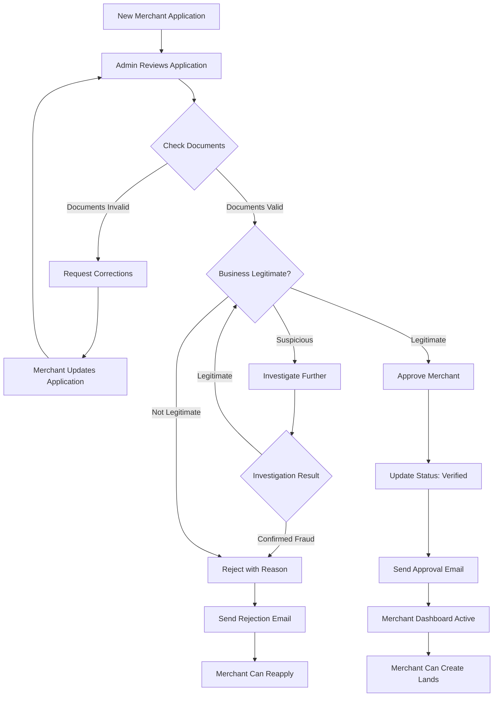
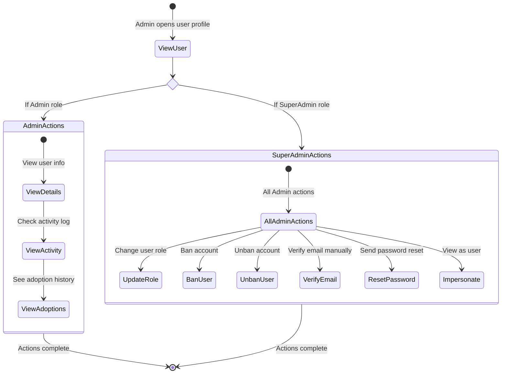
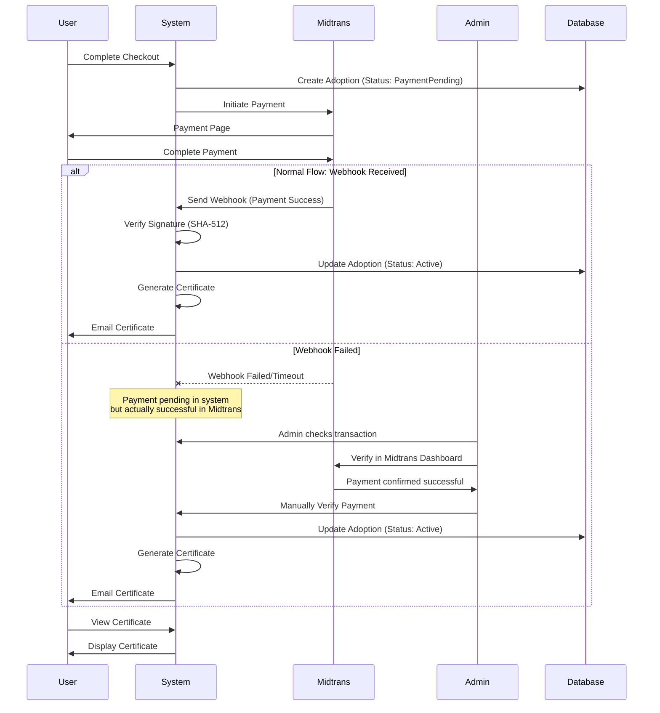

# Admin Guide - AdopTree World

## Overview

This guide covers platform administration for AdopTree World. Admins are responsible for merchant verification, user management, transaction monitoring, and overall platform health.

**Admin Roles:**

1. **Admin**
   - Merchant approval/rejection
   - View platform statistics
   - Monitor transactions
   - Basic user management

2. **SuperAdmin** (Full Access)
   - All Admin capabilities
   - User role management
   - Ban/unban users
   - System configuration
   - Content moderation

**Testing Credentials (Staging):**
- Email: `admin@adoptreeworld.com`
- Password: `Admin123!`
- Role: SuperAdmin
- Environment: https://staging.adoptreeworld.com/

---

## Table of Contents

1. [Admin Dashboard](#admin-dashboard)
2. [Merchant Management](#merchant-management)
3. [User Management](#user-management)
4. [Transaction Monitoring](#transaction-monitoring)
5. [System Monitoring](#system-monitoring)
6. [Content Moderation](#content-moderation)
7. [Admin Workflows](#admin-workflows)
8. [Troubleshooting](#troubleshooting)

---

## Admin Dashboard

### Accessing Admin Panel

1. Login with admin credentials
2. System detects admin role
3. Redirect to `/admin` dashboard
4. Admin navigation menu appears

**Note**: Regular users (Donor, Merchant) cannot access admin routes. Unauthorized access attempts redirect to user dashboard with error message.

---

### Main Statistics

The admin dashboard displays 8 key metric cards:

#### Primary Statistics (Top Row)

**1. Total Users**
```
Total Users: 1,245
+23 new this week
```
- Total registered users (all roles)
- New user count (last 7 days)
- Click to view user list

**2. Total Donors**
```
Total Donors: 987
Active adoptions
```
- Users with at least one adoption
- Excludes guests and merchants
- Click to view donor list

**3. Merchants**
```
Merchants: 45
3 pending approval
```
- Total verified merchants
- Badge shows pending applications
- Click to view merchant management

**4. Total Revenue**
```
Total Revenue: $12,450.50 USD
This month: $2,340.00
```
- Sum of all successful payments
- Monthly revenue comparison
- Click to view transaction details

#### Secondary Statistics (Bottom Row)

**5. Conservation Lands**
```
Conservation Lands: 18
Total area: 245.7 hectares
```
- Active merchant lands
- Total land area calculation
- Click to view land list

**6. Trees Available**
```
Trees Available: 2,450
Trees Adopted: 1,823
Adoption Rate: 74.4%
```
- Trees available for adoption
- Already adopted trees
- Adoption rate percentage

**7. Total Adoptions**
```
Total Adoptions: 1,823
+12 today
```
- All-time adoption count
- Today's adoption count
- Click to view adoption history

**8. Today's Activity**
```
Today's Activity:
• 8 new signups
• 12 adoptions
• 2 merchant applications
```
- Daily activity summary
- Quick overview of platform activity

---

### Quick Actions Panel

Below statistics, find quick action shortcuts:

**Pending Merchant Approvals (Priority)**
- Shows list of merchants awaiting verification
- Displays business name, application date
- Quick actions: Approve, Reject, View Details
- Badge notification: Number of pending
- **Action**: Click to go to merchant management

**Recent User Activity**
- Last 10 user registrations
- Recent adoptions
- Failed payment attempts
- Suspicious activity alerts

**System Health**
- Database status
- Redis cache status
- Email service status
- Payment gateway status

---

### Revenue Overview Section

**Detailed Revenue Metrics:**

1. **Total Platform Revenue**
   - All successful payments
   - Breakdown by payment method
   - Breakdown by product tier

2. **Commission Earnings**
   - Platform commission (20%)
   - Commission by period

3. **Merchant Payouts**
   - Total paid to merchants
   - Pending payout requests
   - Payout queue

4. **Revenue Charts**
   - Monthly revenue trend
   - Adoption vs revenue correlation
   - Payment method distribution

---

## Merchant Management

Navigate to `/admin/merchants` to manage all merchant applications and accounts.

### Merchant List View

**Table Columns:**

| Column | Description |
|--------|-------------|
| Business Name | Merchant's business name |
| Email | Merchant contact email |
| Status | Pending, Verified, Rejected, Suspended |
| Lands | Number of lands managed |
| Trees | Total trees across all lands |
| Earnings | Total merchant earnings |
| Applied Date | Application submission date |
| Actions | Approve, Reject, View, Suspend |

**Filter Options:**

1. **By Status**
   - Pending (requires action)
   - Verified (active merchants)
   - Rejected (denied applications)
   - Suspended (temporarily disabled)
   - All

2. **By Date Range**
   - Last 7 days
   - Last 30 days
   - Last 90 days
   - Custom range

3. **Search**
   - By business name
   - By email
   - By tax ID

---

### Merchant Approval Workflow

#### Step 1: Review Application

1. Click on pending merchant in list
2. Merchant detail page opens
3. Review information:

**Application Information:**
- Business Name
- Tax ID / Business Registration Number
- Business Contact (phone, email, address)
- Business Description
- Submitted Documents (if any)
- Application Date
- Applicant User Details

**Verification Checklist:**
- ✓ Business name is legitimate
- ✓ Tax ID format is valid
- ✓ Contact information is reachable
- ✓ Business registration verifiable
- ✓ No duplicate applications
- ✓ User email is verified

#### Step 2: Verify Business Documents

**Documents to Check:**

1. **Business Registration**
   - Government-issued registration
   - Valid registration number
   - Not expired

2. **Tax Identification**
   - Valid tax ID format
   - Matches business name
   - Can be verified with tax authority

3. **Identity Verification**
   - Owner/applicant identity
   - Matches business registration

**Verification Methods:**
- Online business registry lookup
- Tax authority database
- Call business phone number
- Email verification

#### Step 3: Check Background

**Red Flags to Watch:**

- ❌ Duplicate business name
- ❌ Invalid/fake tax ID
- ❌ Unreachable contact info
- ❌ Suspicious business description
- ❌ Previous rejected applications
- ❌ Reported fraud or violations

**Good Signs:**

- ✅ Established business (> 1 year)
- ✅ Valid registration documents
- ✅ Professional application
- ✅ Verified email and phone
- ✅ Clear conservation mission

#### Step 4: Make Decision

**Option A: Approve Merchant**

1. Click "Approve Merchant" button
2. Confirm approval
3. **System Actions**:
   - Merchant status → Verified
   - Full dashboard access granted
   - Approval email sent
   - Merchant can create lands and trees
4. **Expected Result**:
   - Success message: "Merchant approved successfully"
   - Merchant removed from pending list
   - Merchant receives email notification

**Approval Email Contains:**
- Congratulations message
- Dashboard access link
- Next steps: Create lands, add trees
- Support contact information

---

**Option B: Reject Merchant**

1. Click "Reject Merchant" button
2. **Rejection Reason Modal** appears
3. Select reason or write custom message:
   - Invalid business documents
   - Unable to verify registration
   - Incomplete information
   - Duplicate application
   - Does not meet eligibility criteria
   - Other (specify)
4. Provide detailed explanation (required)
5. Confirm rejection
6. **System Actions**:
   - Merchant status → Rejected
   - Dashboard access remains restricted
   - Rejection email sent with reason
   - Merchant can reapply after fixing issues

**Rejection Email Contains:**
- Rejection notification
- Specific reason for rejection
- What needs to be fixed
- Reapplication instructions
- Appeal process (if applicable)

---

### Merchant Detail View

Click on any merchant to see detailed information:

**Business Information Tab:**
- Business name, tax ID
- Contact details
- Registration date
- Current status
- Status history (all status changes)

**Lands & Trees Tab:**
- List of all merchant lands
- Total trees per land
- Adoption statistics
- Land photos
- GPS boundaries

**Earnings Tab:**
- Total earnings to date
- Earnings by land
- Earnings by period
- Transaction history
- Payout history
- Pending payout requests

**User Reviews Tab:**
- All reviews for merchant's lands
- Average rating
- Review moderation (hide/show)

**Activity Log Tab:**
- Login history
- Land creation events
- Tree addition events
- Payout requests
- Status changes

---

### Merchant Actions

**Available Actions (SuperAdmin):**

1. **Verify Manually**
   - Bypass normal verification process
   - For trusted organizations
   - Requires reason/note

2. **Suspend Merchant**
   - Temporarily disable account
   - Reasons:
     - Policy violations
     - Fraudulent activity
     - Unresolved disputes
     - Pending investigation
   - Merchant cannot access dashboard
   - Existing adoptions unaffected
   - Can unsuspend later

3. **Unsuspend Merchant**
   - Restore suspended account
   - Full access restored
   - Notification email sent

4. **Change Status**
   - Manually change merchant status
   - Requires admin note

5. **View as Merchant**
   - Impersonate merchant account
   - See dashboard as merchant sees it
   - For support and troubleshooting
   - Action logged for security

---

## User Management

Navigate to `/admin/users` to manage all platform users.

### User List View

**Table Columns:**

| Column | Description |
|--------|-------------|
| Name | User's full name |
| Email | User email address |
| Role | User role (Donor, Merchant, Admin, etc.) |
| Status | Active, Banned, Suspended |
| Adoptions | Number of adoptions (if donor) |
| Joined | Registration date |
| Last Login | Last login timestamp |
| Actions | View, Edit, Ban, Unban |

**Filter Options:**

1. **By Role**
   - All roles
   - Donor
   - Merchant
   - MerchantStaff
   - CorporateAdmin
   - CorporateMember
   - Admin
   - SuperAdmin

2. **By Status**
   - Active (normal users)
   - Banned (cannot login)
   - Suspended (temporary restriction)
   - Email Not Verified

3. **By Activity**
   - Active (logged in last 30 days)
   - Inactive (no login > 90 days)
   - New users (joined last 7 days)

4. **Search**
   - By name
   - By email
   - By user ID

---

### User Detail View

Click on any user to see detailed profile:

**Account Information:**
- User ID
- Full name
- Email address (verification status)
- Phone number
- Role and permissions
- Account status
- Registration date
- Last login date
- Login method (Email, Google OAuth, Wallet)

**Activity Summary:**
- Total adoptions (if donor)
- Total spending
- Active certificates
- Trees adopted
- CO2 impact

**Merchant Information** (if applicable):
- Business name
- Merchant status
- Lands managed
- Total trees
- Earnings

**Corporate Information** (if applicable):
- Company name
- Team role
- Team members managed
- Bulk adoptions

**Authentication Details:**
- Login methods enabled
- OAuth connections
- Wallet address (if connected)
- Password set (yes/no)
- Two-factor enabled (when implemented)

**Activity Timeline:**
- Registration event
- Email verification
- Login history (last 10 logins)
- Adoption events
- Payment events
- Profile updates
- Role changes

---

### User Management Actions

**Available Actions (SuperAdmin Only):**

#### 1. Update User Role

**Use Case**: Promote user to admin, change merchant to donor, etc.

**Steps:**
1. Click "Change Role" button
2. Select new role from dropdown:
   - Guest → Donor
   - Donor → Merchant (if merchant application approved)
   - Donor → Admin
   - Admin → SuperAdmin
   - Any role → Any role
3. Confirm role change
4. **System Actions**:
   - User role updated in database
   - Permissions recalculated
   - User receives email notification
   - Redirect on next login

**Warning**: Changing roles can affect user access and permissions. Use carefully.

---

#### 2. Ban User Account

**Use Case**: Permanently disable account for policy violations, fraud, abuse.

**Reasons to Ban:**
- Fraudulent activity
- Payment disputes
- Abusive behavior
- Terms of service violations
- Spam or bot accounts

**Steps:**
1. Click "Ban User" button
2. **Ban Reason Modal** appears
3. Select reason:
   - Fraudulent activity
   - Payment fraud
   - Abusive behavior
   - Terms of service violation
   - Spam account
   - Other (specify)
4. Write detailed explanation (required)
5. Confirm ban
6. **System Actions**:
   - User status → Banned
   - All sessions terminated
   - Cannot login
   - API access revoked
   - Ban notification email sent (optional)

**Effects of Ban:**
- User cannot login
- Existing adoptions remain valid (donors' adoptions unaffected)
- User data retained (for records)
- Can be unbanned by SuperAdmin

---

#### 3. Unban User Account

**Use Case**: Restore previously banned account after issue resolved.

**Steps:**
1. Filter users by status: "Banned"
2. Click on banned user
3. Click "Unban User" button
4. Provide reason for unbanning (optional)
5. Confirm unban
6. **System Actions**:
   - User status → Active
   - Can login again
   - Permissions restored
   - Unban notification email sent

---

#### 4. Reset User Password

**Use Case**: User lost access, password reset email not working.

**Steps:**
1. Click "Send Password Reset" button
2. Confirm action
3. **System Actions**:
   - Password reset email sent
   - Reset token generated (valid 1 hour)
   - User receives email with reset link

**Note**: Admin cannot see user passwords (encrypted with Argon2). Can only trigger reset email.

---

#### 5. Verify Email Manually

**Use Case**: User didn't receive verification email, email service issue.

**Steps:**
1. Check "Email Verified" status
2. If not verified, click "Verify Email Manually"
3. Confirm action
4. **System Actions**:
   - Email verification status → Verified
   - User can access all features
   - Verification email sent as confirmation

---

#### 6. View as User (Impersonation)

**Use Case**: Troubleshooting user issues, support tickets.

**Steps:**
1. Click "View as User" button
2. Security confirmation required
3. **System Actions**:
   - Admin logged as user
   - See application as user sees it
   - Can perform actions on user's behalf
   - All actions logged
   - Banner shows "Viewing as [User Name]"
   - Click "Exit Impersonation" to return

**Important**: This action is logged for security auditing.

---

## Transaction Monitoring

Navigate to `/admin/transactions` to monitor all payments and adoptions.

### Transaction List View

**Table Columns:**

| Column | Description |
|--------|-------------|
| Order ID | Unique transaction ID |
| User | Buyer name and email |
| Amount | Total payment (USD + IDR) |
| Payment Method | Snap, Bank Transfer, E-Wallet, QRIS, Solana |
| Status | Success, Pending, Failed, Expired |
| Trees | Number of trees in adoption |
| Date | Transaction timestamp |
| Actions | View, Download Invoice, Verify |

**Filter Options:**

1. **By Status**
   - Success (completed payments)
   - Pending (awaiting payment)
   - Failed (payment failed)
   - Expired (payment timeout)
   - All

2. **By Payment Method**
   - Midtrans Snap
   - Bank Transfer (VA)
   - E-Wallet (OVO, GoPay, LinkAja, DANA)
   - QRIS
   - Solana Cryptocurrency
   - All methods

3. **By Date Range**
   - Today
   - Last 7 days
   - Last 30 days
   - Last 90 days
   - Custom range

4. **By Amount Range**
   - Under $10
   - $10 - $50
   - $50 - $100
   - Over $100
   - Custom range

5. **Search**
   - By order ID
   - By user email
   - By adoption ID

---

### Transaction Detail View

Click on any transaction to see full details:

**Payment Information:**
- Order ID
- Adoption ID (linked)
- Transaction date and time
- Payment status
- Payment method
- Amount breakdown:
  - Subtotal (USD)
  - Currency conversion (IDR)
  - Platform commission (20%)
  - Merchant earnings (80%)

**User Information:**
- Buyer name
- Email address
- User role
- Account status
- Previous purchases

**Adoption Details:**
- Number of trees adopted
- Land name and merchant
- Tree species
- Product tier (Donation, Wakaf, GreenSociety, AdoptTree)
- Certificate status

**Midtrans Transaction Details** (if applicable):
- Midtrans Order ID
- Transaction ID
- Payment Type
- VA Number / E-Wallet Number
- Bank / E-Wallet Provider
- Transaction Time
- Settlement Time
- Signature Key (SHA-512 verification)

**Payment Status History:**
- Status changes timeline
- Webhook received timestamps
- Retry attempts (if any)
- Failure reasons (if failed)

---

### Transaction Actions

**Available Actions:**

#### 1. View Full Details
- Opens detailed transaction page
- All payment information
- User and adoption details
- Status history

#### 2. Download Invoice
- Generate PDF invoice
- Contains:
  - Order ID and date
  - User information
  - Itemized adoption list
  - Payment details
  - Platform information

#### 3. Verify Payment Manually
**Use Case**: Webhook failed, payment actually successful

**Steps:**
1. Click "Verify Payment" button
2. Check Midtrans dashboard to confirm payment
3. Enter Midtrans transaction ID
4. Confirm verification
5. **System Actions**:
   - Adoption status → Active
   - Certificate generated
   - User notified via email
   - Merchant earnings updated

**Warning**: Only use when certain payment succeeded. Incorrect verification causes accounting issues.

#### 4. Refund Transaction (SuperAdmin Only)
**Use Case**: User requests refund, policy violation

**Steps:**
1. Click "Process Refund" button
2. Select refund reason
3. Enter refund amount (can be partial)
4. Confirm refund
5. **System Actions**:
   - Refund initiated via Midtrans
   - Adoption status → Refunded
   - Certificate invalidated
   - User and merchant notified

**Note**: Refund processing time: 5-14 business days (depends on payment method)

---

### Payment Issues and Resolution

**Common Issues:**

#### 1. Payment Pending Too Long

**Problem**: Payment shows "Pending" for over 24 hours

**Diagnosis:**
- Check Midtrans dashboard
- Verify webhook received
- Check webhook logs

**Solutions:**
- If payment successful in Midtrans: Manually verify
- If payment failed: Mark as failed, notify user
- If payment expired: Mark as expired

---

#### 2. Webhook Signature Mismatch

**Problem**: Webhook received but signature verification failed

**Diagnosis:**
- Check webhook logs
- Verify server key matches
- Check signature calculation

**Solutions:**
- Retry webhook manually from Midtrans
- Verify payment and update status manually
- Update Midtrans server key if changed

---

#### 3. Duplicate Payments

**Problem**: User charged twice for same adoption

**Diagnosis:**
- Check order IDs
- Verify adoption IDs
- Check transaction timestamps

**Solutions:**
- Identify duplicate transaction
- Process refund for duplicate
- Ensure single adoption active

---

## System Monitoring

Navigate to `/admin/system` to monitor platform health.

### System Health Dashboard

**Service Status Indicators:**

1. **Database (PostgreSQL)**
   - Status: 🟢 Healthy / 🔴 Down
   - Connection pool: Active connections
   - Query performance: Average query time
   - Last backup: Timestamp

2. **Cache (Redis)**
   - Status: 🟢 Healthy / 🔴 Down
   - Memory usage: Used / Total
   - Hit rate: Cache hit percentage
   - Keys stored: Number of cached keys

3. **Email Service (SMTP)**
   - Status: 🟢 Healthy / 🔴 Down
   - Emails sent (last 24h)
   - Failed emails
   - Queue size

4. **Payment Gateway (Midtrans)**
   - Status: 🟢 Healthy / 🔴 Down
   - API response time
   - Success rate (last 24h)
   - Failed webhooks

5. **File Storage (S3 / Local)**
   - Status: 🟢 Healthy / 🔴 Down
   - Storage used: GB
   - Upload success rate
   - Recent upload count

---

### Platform Statistics

**Comprehensive Metrics:**

1. **Users**
   - Total users by role
   - New registrations (daily/weekly/monthly)
   - Active users (logged in last 30 days)
   - Authentication method distribution

2. **Adoptions**
   - Total adoptions
   - Adoptions by product tier
   - Adoption rate trend
   - Average trees per adoption

3. **Trees**
   - Total trees in system
   - Available for adoption
   - Already adopted
   - Trees by species
   - Trees by land

4. **Lands**
   - Total conservation lands
   - Total area (hectares)
   - Average land size
   - Lands by merchant

5. **Revenue**
   - Total platform revenue
   - Revenue by product tier
   - Revenue by payment method
   - Monthly revenue trend
   - Average transaction value

6. **Environmental Impact**
   - Total CO2 absorbed (kg)
   - Total carbon credits generated
   - Trees planted by species
   - Land area protected (hectares)

---

### System Logs

**Log Categories:**

1. **Application Logs**
   - Server errors
   - API errors
   - Authentication failures
   - Authorization failures

2. **Payment Logs**
   - Webhook received
   - Webhook processing
   - Payment status changes
   - Refund events

3. **Email Logs**
   - Emails sent
   - Email failures
   - SMTP errors

4. **Security Logs**
   - Failed login attempts
   - Account lockouts
   - Role changes
   - Admin impersonations

**Log Viewer:**
- Real-time log streaming
- Filter by level (ERROR, WARN, INFO, DEBUG)
- Filter by category
- Search logs
- Export logs (CSV)

---

## Content Moderation

Navigate to `/admin/moderation` to manage user-generated content.

### Review Management

**View All Reviews:**

Navigate to "Reviews" section to see all land reviews.

**Table Columns:**

| Column | Description |
|--------|-------------|
| Land | Land name |
| Merchant | Land owner |
| Reviewer | User who left review |
| Rating | Star rating (1-5) |
| Comment | Review text |
| Helpful Votes | Upvotes/downvotes |
| Status | Visible, Hidden |
| Date | Review date |
| Actions | Hide, Show, Delete |

**Filter Options:**

1. **By Rating**
   - 5 stars
   - 4 stars
   - 3 stars
   - 2 stars
   - 1 star
   - All ratings

2. **By Status**
   - Visible (shown publicly)
   - Hidden (moderated/flagged)
   - All

3. **By Land/Merchant**
   - Search by land name
   - Filter by merchant

4. **By Date**
   - Last 7 days
   - Last 30 days
   - Custom range

---

### Review Moderation Actions

**Available Actions:**

#### 1. Hide Review

**Use Case**: Inappropriate content, spam, violations

**Reasons to Hide:**
- Offensive language
- Personal attacks
- Spam or advertising
- Off-topic content
- False or misleading
- Duplicate review

**Steps:**
1. Click "Hide Review" button
2. Select reason for hiding
3. Confirm action
4. **System Actions**:
   - Review hidden from public
   - Still visible to admin
   - Reviewer notified (optional)
   - Can be shown again later

---

#### 2. Show Hidden Review

**Use Case**: Review was hidden by mistake, issue resolved

**Steps:**
1. Filter by status: "Hidden"
2. Click on hidden review
3. Click "Show Review" button
4. Confirm action
5. **System Actions**:
   - Review visible publicly again
   - Reviewer notified (optional)

---

#### 3. Delete Review (SuperAdmin Only)

**Use Case**: Severe violations, legal requirements

**Warning**: This permanently deletes the review. Cannot be undone.

**Steps:**
1. Click "Delete Review" button
2. Confirm deletion (requires second confirmation)
3. Provide deletion reason (required)
4. **System Actions**:
   - Review permanently deleted
   - Reviewer notified
   - Action logged for audit

---

### Moderation Best Practices

**When to Hide Reviews:**
- ✓ Contains profanity or hate speech
- ✓ Personal attacks on merchant
- ✓ Spam or promotional content
- ✓ Completely off-topic
- ✓ Contains personal information

**When NOT to Hide Reviews:**
- ✗ Negative but constructive feedback
- ✗ Low star ratings (if legitimate)
- ✗ User complaints about issues
- ✗ Critical but respectful opinions

**Communication:**
- Notify reviewers when hiding/deleting
- Provide clear reason
- Offer opportunity to edit and resubmit
- Be consistent with moderation policies

---

## Admin Workflows

### Workflow 1: Merchant Approval Process



---

### Workflow 2: User Management Actions by Role



---

### Workflow 3: Transaction Verification Process



---

## Troubleshooting

### Common Admin Issues

#### 1. Cannot Approve Merchant

**Problem**: Approve button not working or error message

**Solutions:**
- Refresh the page
- Check if merchant already approved
- Verify admin permissions
- Check browser console for errors
- Try different browser

---

#### 2. Transaction Status Not Updating

**Problem**: Payment successful in Midtrans but shows "Pending" in admin panel

**Solutions:**
1. Check webhook logs (System → Logs → Payment)
2. Verify Midtrans webhook URL configured correctly
3. Check webhook signature matches server key
4. Manually verify payment:
   - Go to transaction detail
   - Click "Verify Payment"
   - Enter Midtrans transaction ID
   - Confirm verification

---

#### 3. User Cannot Login After Role Change

**Problem**: User complains cannot access features after role change

**Solutions:**
- User needs to logout and login again
- Clear browser cache and cookies
- Verify role change was saved
- Check user status is "Active"
- Send password reset if needed

---

#### 4. Email Notifications Not Sending

**Problem**: Users not receiving approval emails, password resets, etc.

**Diagnosis:**
1. Check System → Email Service status
2. Check email logs for failures
3. Verify SMTP configuration
4. Check email queue size

**Solutions:**
- Restart email service (if down)
- Check SMTP credentials
- Verify email service not blocked
- Retry sending from user detail page

---

#### 5. Statistics Not Loading

**Problem**: Admin dashboard shows loading or error

**Solutions:**
- Check database status (System → Database)
- Refresh the page
- Clear browser cache
- Check Redis cache status
- Contact technical support if persists

---

### Getting Help

**Support Channels:**

1. **Technical Issues**
   - Check system logs first
   - Document steps to reproduce
   - Take screenshots of errors
   - Contact technical team

2. **Policy Questions**
   - Refer to admin policy documentation
   - Consult with senior admin
   - Escalate to SuperAdmin if needed

3. **Security Concerns**
   - Report immediately to SuperAdmin
   - Document suspicious activity
   - Preserve logs and evidence
   - Follow security incident protocol

---

## Admin Best Practices

### Merchant Verification

1. **Be Thorough**
   - Check all documents carefully
   - Verify business registration
   - Confirm contact information
   - Look for red flags

2. **Be Consistent**
   - Apply same standards to all
   - Document decision reasons
   - Maintain approval/rejection criteria

3. **Communicate Clearly**
   - Provide specific rejection reasons
   - Explain what needs correction
   - Be professional and helpful

### User Management

1. **Act Fairly**
   - Investigate before banning
   - Give users benefit of doubt
   - Document violations clearly

2. **Protect Privacy**
   - Don't share user information
   - Use impersonation only when necessary
   - Follow data protection policies

3. **Be Responsive**
   - Handle reports promptly
   - Respond to user inquiries
   - Keep users informed

### Content Moderation

1. **Be Objective**
   - Don't hide negative reviews just because they're negative
   - Focus on policy violations
   - Allow constructive criticism

2. **Be Consistent**
   - Apply moderation guidelines uniformly
   - Document moderation decisions
   - Review hidden content periodically

3. **Communicate**
   - Notify users of moderation actions
   - Explain reasons clearly
   - Offer path to resolution

---

## Next Steps

After getting familiar with admin panel:

1. **Daily Tasks**
   - Check pending merchant approvals
   - Review new user registrations
   - Monitor transaction status
   - Check system health

2. **Weekly Tasks**
   - Review content moderation queue
   - Analyze platform statistics
   - Check for suspended accounts
   - Review payout requests

3. **Monthly Tasks**
   - Generate platform reports
   - Review admin policies
   - Audit user role assignments
   - System performance review

---

**Need Help?**
- SuperAdmin (Staging): admin@adoptreeworld.com / Admin123!
- Environment: https://staging.adoptreeworld.com/
- Test freely without affecting production

**Related Guides:**
- [Feature Status Report](FEATURE-STATUS.md) - Complete platform features
- [Donor Guide](DONOR-GUIDE.md) - Donor user journey
- [Merchant Guide](MERCHANT-GUIDE.md) - Merchant registration and management
- [Testing Guide](TESTING-GUIDE.md) - End-to-end testing scenarios

---

*This guide is for AdopTree World staging environment. All administrative actions are logged for security and auditing purposes.*
