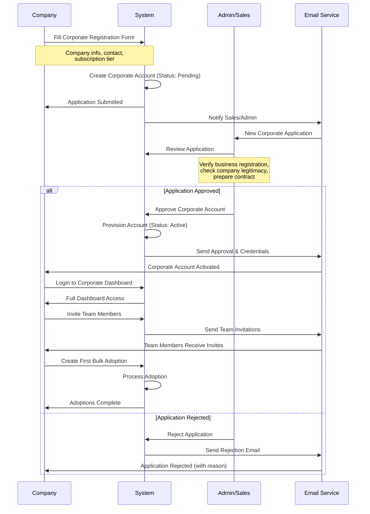
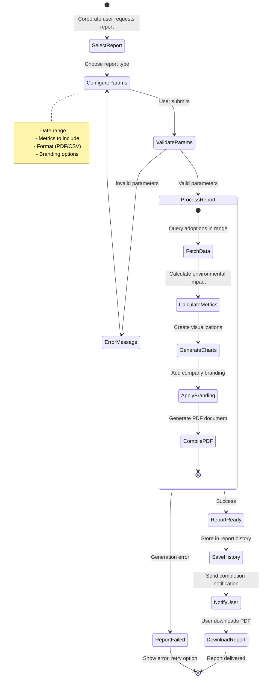

# Corporate Guide - AdopTree World

## Overview

This guide covers Corporate/B2B features for businesses wanting to adopt trees at scale, manage teams, generate ESG reports, and integrate with AdopTree World via API.

**What is a Corporate Account?**

A corporate account provides businesses with:
- Team management capabilities
- Bulk tree adoption operations
- Employee gifting programs
- ESG (Environmental, Social, Governance) reporting
- API access for system integrations
- Custom branding options
- Dedicated support

**Who Should Use Corporate Accounts?**
- Companies with sustainability goals
- Businesses seeking carbon offset
- HR teams running employee engagement programs
- CSR (Corporate Social Responsibility) departments
- Organizations needing ESG compliance reporting
- Enterprises wanting API integration

---

## Table of Contents

1. [Corporate Account Overview](#corporate-account-overview)
2. [Corporate Registration](#corporate-registration)
3. [Corporate Dashboard](#corporate-dashboard)
4. [Team Management](#team-management)
5. [Bulk Adoptions](#bulk-adoptions)
6. [ESG Reporting](#esg-reporting)
7. [API Integration](#api-integration)
8. [Corporate Workflows](#corporate-workflows)
9. [Troubleshooting](#troubleshooting)

---

## Corporate Account Overview

### Subscription Tiers

AdopTree World offers 3 corporate subscription tiers:

#### 1. Starter Tier

**Pricing**: Contact sales

**Features:**
- Up to 5 team members
- 10,000 API calls per month
- Basic bulk adoptions (10-50 trees)
- Standard ESG reports
- Email support
- Monthly billing

**Best For:**
- Small businesses
- Startups
- Testing corporate features
- Limited team size

---

#### 2. Professional Tier

**Pricing**: Contact sales

**Features:**
- Up to 25 team members
- 100,000 API calls per month
- Unlimited bulk adoptions
- Advanced ESG reports with custom metrics
- Custom branding on certificates
- Priority email support
- Dedicated account manager
- Quarterly billing discount

**Best For:**
- Medium-sized companies
- Growing sustainability programs
- Multi-department teams
- Regular bulk adoptions

---

#### 3. Enterprise Tier

**Pricing**: Custom pricing

**Features:**
- Up to 100 team members (more upon request)
- 1,000,000 API calls per month
- Unlimited bulk adoptions
- Custom ESG reports with white-labeling
- Full custom branding
- Dedicated support hotline
- Technical integration assistance
- Custom API features
- SLA guarantees
- Annual contract with discounts

**Best For:**
- Large corporations
- Enterprise sustainability programs
- Complex integrations
- High-volume adoptions
- Custom requirements

---

### Feature Comparison

| Feature | Starter | Professional | Enterprise |
|---------|---------|--------------|------------|
| Team Members | 5 | 25 | 100+ |
| API Calls/Month | 10K | 100K | 1M+ |
| Bulk Adoptions | Limited | Unlimited | Unlimited |
| ESG Reports | Standard | Advanced | Custom |
| Custom Branding | ❌ | ✅ | ✅ |
| Dedicated Support | ❌ | Email | Phone + Email |
| Account Manager | ❌ | ✅ | ✅ |
| SLA | ❌ | ❌ | ✅ |
| White-labeling | ❌ | ❌ | ✅ |

---

## Corporate Registration

### Registration Process

#### Step 1: Navigate to Corporate Registration

1. Go to https://staging.adoptreeworld.com/
2. Click "For Businesses" or navigate to `/corporate/register`
3. Corporate registration form loads

#### Step 2: Fill Corporate Information

**Company Details:**

1. **Company Name** (Required)
   - Legal business name
   - Example: "EcoTech Solutions Inc."

2. **Industry** (Required)
   - Select from dropdown:
     - Technology
     - Finance
     - Manufacturing
     - Retail
     - Healthcare
     - Education
     - Energy
     - Transportation
     - Other

3. **Company Size** (Required)
   - Select employee count:
     - 1-10 employees
     - 11-50 employees
     - 51-200 employees
     - 201-500 employees
     - 501-1000 employees
     - 1000+ employees

4. **Business Registration Number** (Required)
   - Company registration or tax ID
   - Example: "12-3456789"

5. **Company Address** (Required)
   - Street address
   - City, State/Province
   - Country
   - Postal code

**Contact Person:**

1. **Full Name** (Required)
   - Primary contact for account
   - Will become account Owner

2. **Job Title** (Required)
   - Example: "Sustainability Manager", "CSR Director"

3. **Email** (Required)
   - Corporate email address
   - Will be used for login

4. **Phone Number** (Required)
   - Business contact number

**Subscription Selection:**

1. **Select Tier**
   - Starter, Professional, or Enterprise
   - See feature comparison

2. **Expected Monthly Adoptions** (Optional)
   - Estimate number of trees per month
   - Helps us recommend tier

3. **Special Requirements** (Optional)
   - API integration needs
   - Custom feature requests
   - Compliance requirements

#### Step 3: Submit Application

1. Review all information
2. Accept corporate terms and conditions
3. Accept privacy policy
4. Click "Submit Application"
5. **Expected Result**:
   - Success message
   - Application confirmation email
   - Redirect to verification pending page

#### Step 4: Verification Process

**Timeline**: 3-5 business days

**Verification Steps:**
1. **Business Verification**
   - Admin verifies company registration
   - Checks business legitimacy
   - Validates contact information

2. **Subscription Setup**
   - Sales team reviews tier selection
   - Prepares custom pricing (if Enterprise)
   - Generates contract

3. **Account Activation**
   - Payment details collected
   - Account provisioned
   - Team invitations enabled

**Email Notifications:**
- Application received
- Under review
- Additional information needed (if required)
- Approved and activated
- Login credentials

---

## Corporate Dashboard

### Dashboard Overview

After approval, login to access corporate dashboard at `/corporate/dashboard`.

**Main Sections:**

1. **Overview Tab**
   - Key metrics at a glance
   - Quick actions
   - Team activity feed

2. **Team Tab**
   - Team member management
   - Roles and permissions
   - Invitation system

3. **Bulk Adoptions Tab**
   - Create bulk adoptions
   - Employee gifting
   - Adoption history

4. **ESG Reports Tab**
   - Generate reports
   - View past reports
   - Download compliance documents

5. **API Credentials Tab**
   - Manage API keys
   - Monitor API usage
   - Webhook configuration

6. **Settings Tab**
   - Company profile
   - Subscription details
   - Billing information

---

### Overview Tab Statistics

**Key Metrics:**

1. **Total Employees in Team**
   - Number of team members
   - Active vs inactive
   - Click to view team list

2. **Total Trees Adopted**
   - All-time adoption count
   - This month's adoptions
   - Adoption rate trend

3. **Environmental Impact**
   - Total CO2 offset (kg)
   - Land area supported (hectares)
   - Equivalent metrics (e.g., "Equal to X cars off road")

4. **Team Activity**
   - Recent adoptions by team
   - ESG reports generated
   - API calls this month

**Quick Actions:**
- Create Bulk Adoption
- Invite Team Member
- Generate ESG Report
- Download Certificates

**Activity Feed:**
- Team member adoptions
- Bulk adoption completions
- ESG report generations
- API credential changes
- Team member additions

---

## Team Management

### Corporate Team Roles

**4 Role Types:**

#### 1. Owner

**Full Account Control:**
- All Admin capabilities
- Manage subscription and billing
- Delete corporate account
- Transfer ownership
- Access financial data
- Cannot be removed (only ownership transfer)

**Use Case**: CEO, CFO, Sustainability Director

---

#### 2. Admin

**Team and Adoption Management:**
- Invite and remove team members
- Assign roles (except Owner)
- Create bulk adoptions
- Generate ESG reports
- Manage API credentials
- View all team activity
- Cannot manage billing

**Use Case**: Sustainability Manager, CSR Manager

---

#### 3. Member

**Create Adoptions and Reports:**
- Create bulk adoptions
- Create individual adoptions
- Generate ESG reports
- View team adoptions
- Download certificates
- Cannot manage team
- Cannot manage API

**Use Case**: Sustainability Team Members, Department Coordinators

---

#### 4. Viewer

**Read-Only Access:**
- View team adoptions
- View ESG reports
- Download certificates
- View environmental impact
- Cannot create adoptions
- Cannot modify anything

**Use Case**: Executives, Board Members, External Auditors

---

### Role Permissions Matrix

| Permission | Owner | Admin | Member | Viewer |
|------------|-------|-------|--------|--------|
| View Dashboard | ✅ | ✅ | ✅ | ✅ |
| Create Adoptions | ✅ | ✅ | ✅ | ❌ |
| Create Bulk Adoptions | ✅ | ✅ | ✅ | ❌ |
| Generate ESG Reports | ✅ | ✅ | ✅ | ❌ |
| Download Certificates | ✅ | ✅ | ✅ | ✅ |
| Invite Team Members | ✅ | ✅ | ❌ | ❌ |
| Remove Team Members | ✅ | ✅ | ❌ | ❌ |
| Assign Roles | ✅ | ✅ | ❌ | ❌ |
| Manage API Credentials | ✅ | ✅ | ❌ | ❌ |
| Manage Billing | ✅ | ❌ | ❌ | ❌ |
| Transfer Ownership | ✅ | ❌ | ❌ | ❌ |
| Delete Account | ✅ | ❌ | ❌ | ❌ |

---

### Inviting Team Members

#### Step 1: Navigate to Team Management

1. Login as Owner or Admin
2. Go to "Team" tab in corporate dashboard
3. Click "Invite Team Member" button

#### Step 2: Fill Invitation Form

**Member Details:**

1. **Email Address** (Required)
   - Corporate email of person to invite
   - Must be unique (not already in team)
   - Example: john.doe@ecotech.com

2. **Assign Role** (Required)
   - Select from dropdown: Admin, Member, or Viewer
   - Cannot assign Owner role (only transfer)

3. **Personal Message** (Optional)
   - Custom message in invitation email
   - Example: "Welcome to our sustainability team!"

#### Step 3: Send Invitation

1. Review invitation details
2. Click "Send Invitation"
3. **System Actions**:
   - Invitation created (status: Pending)
   - Invitation email sent
   - Invitation appears in "Pending Invitations" list

**Invitation Email Contains:**
- Company name
- Inviter name and role
- Assigned role
- Link to accept invitation
- Personal message (if provided)
- Expiration date (7 days)

#### Step 4: Member Accepts Invitation

**Member's Experience:**

1. **Receives Email**
   - Clicks invitation link
   - Redirected to acceptance page

2. **Account Check**
   - **If has AdopTree account**: Link to corporate account
   - **If no account**: Register first, then link

3. **Accept Invitation**
   - Reviews company details
   - Reviews assigned role
   - Clicks "Accept Invitation"

4. **Linked to Corporate**
   - Role assigned
   - Can access corporate dashboard
   - Welcome email sent

---

### Managing Team Members

#### View Team Members

Navigate to "Team" tab to see all members:

**Team List Table:**

| Column | Description |
|--------|-------------|
| Name | Team member name |
| Email | Contact email |
| Role | Owner, Admin, Member, Viewer |
| Status | Active, Invited (pending) |
| Joined Date | When accepted invitation |
| Last Active | Last login timestamp |
| Actions | Change Role, Remove |

**Filter Options:**
- By role
- By status (Active / Pending)
- Search by name or email

---

#### Change Team Member Role

**Available to**: Owner and Admin

**Steps:**
1. Find team member in list
2. Click "Change Role" in actions column
3. **Role Change Modal** appears
4. Select new role:
   - Admin
   - Member
   - Viewer
5. Confirm role change
6. **System Actions**:
   - Role updated immediately
   - Permissions recalculated
   - Member notified via email
   - Member sees new permissions on next login

**Restrictions:**
- Cannot change Owner role (must transfer ownership)
- Admin cannot demote another Admin (only Owner can)

---

#### Remove Team Member

**Available to**: Owner and Admin

**Steps:**
1. Find team member in list
2. Click "Remove" in actions column
3. **Confirm Removal Modal** appears
4. Provide removal reason (optional)
5. Confirm removal
6. **System Actions**:
   - Member removed from team
   - Loses access to corporate dashboard
   - Personal adoptions unaffected (if any)
   - Removal notification email sent

**Restrictions:**
- Cannot remove Owner
- Admin cannot remove another Admin (only Owner can)

---

#### Transfer Ownership

**Available to**: Owner only

**Use Case**: Changing primary account owner (e.g., CSR Director changes)

**Steps:**
1. Navigate to Team tab
2. Click "Transfer Ownership" button
3. **Transfer Modal** appears
4. Select new owner from team members (must be Admin)
5. Confirm transfer (requires password)
6. **System Actions**:
   - Selected member becomes Owner
   - Previous Owner becomes Admin
   - Billing access transfers
   - Both parties notified

**Important**: This cannot be undone. Only Owner has billing access.

---

### Pending Invitations

View and manage sent invitations:

**Invitation List:**

| Column | Description |
|--------|-------------|
| Email | Invited person's email |
| Role | Assigned role |
| Sent By | Who sent invitation |
| Sent Date | When invitation sent |
| Expires | Expiration date (7 days) |
| Actions | Resend, Cancel |

**Actions:**

1. **Resend Invitation**
   - Sends new invitation email
   - Extends expiration date

2. **Cancel Invitation**
   - Deletes pending invitation
   - Invitation link becomes invalid
   - Can re-invite later

---

## Bulk Adoptions

### Creating Bulk Adoption

Bulk adoptions allow companies to adopt multiple trees at once, optionally gifting them to employees.

#### Step 1: Navigate to Bulk Adoptions

1. Login as Owner, Admin, or Member
2. Go to "Bulk Adoptions" tab
3. Click "Create Bulk Adoption" button

#### Step 2: Select Trees

**Browse and Select:**

1. **Choose Land**
   - View available conservation lands
   - See land details, location, merchant
   - Select land for adoption

2. **Select Species** (if applicable)
   - Filter by tree species
   - See available quantity per species

3. **Choose Product Tier**
   - Donation ($8, 1 year)
   - Wakaf ($10, perpetual)
   - GreenSociety ($12, 1 year)
   - AdoptTree ($75, 5 years)

4. **Enter Quantity**
   - Minimum: 10 trees
   - Maximum: 1000 trees per order (contact for larger)
   - See total cost calculation

**Example:**
```
Land: Sumatra Rainforest Reserve
Species: Mahogany
Tier: AdoptTree ($75)
Quantity: 50 trees
Total: $3,750
```

#### Step 3: Employee Gifting (Optional)

**Option A: Company Adoption (No Gifting)**
- Trees adopted under company name
- All certificates to company account
- Simple bulk purchase

**Option B: Employee Gifting**
- Each tree gifted to individual employee
- Each employee receives personal certificate
- Employee engagement program

**For Employee Gifting:**

1. **Enable Employee Gifting**
   - Toggle "Gift to Employees" option
   - Upload employee CSV form appears

2. **Download CSV Template**
   - Click "Download Template"
   - Template columns: `name,email`

3. **Prepare Employee CSV**
   ```csv
   name,email
   John Doe,john.doe@company.com
   Jane Smith,jane.smith@company.com
   Bob Johnson,bob.j@company.com
   Alice Williams,alice.w@company.com
   ```

   **Requirements:**
   - Column 1: Employee full name
   - Column 2: Employee email address
   - Number of rows must match tree quantity
   - Each email should be unique
   - Emails don't need AdopTree accounts (created as guests)

4. **Upload Employee CSV**
   - Click "Upload CSV"
   - Select prepared file
   - System validates format and count

5. **Validation Results**
   - ✅ "50 employees ready for gifting"
   - ❌ If errors: Download error report, fix, re-upload

#### Step 4: Review and Checkout

**Bulk Adoption Summary:**

- Land details
- Tree species and tier
- Quantity and total cost
- Employee gifting status
- Employee preview (first 5)

**Company Information:**

- Billing company name
- Payment method on file
- Purchase order number (optional)

**Click "Proceed to Payment"**

#### Step 5: Payment

**Corporate Payment Methods:**

1. **Invoice Payment**
   - For Enterprise tier
   - Net 30 or Net 60 terms
   - Invoice sent to billing email
   - Payment via bank transfer

2. **Corporate Credit Card**
   - Saved card on file
   - Instant processing
   - Receipt emailed

3. **Bank Transfer**
   - Virtual account provided
   - Payment within 24 hours
   - Auto-confirmation

**Complete Payment**

#### Step 6: Bulk Adoption Processing

**After Payment Success:**

1. **System Creates Adoptions**
   - Parent bulk adoption record created
   - Individual adoptions for each tree
   - If employee gifting: One adoption per employee

2. **Certificate Generation**
   - Certificates generated for each adoption
   - Company branding applied (if applicable)
   - QR codes for verification

3. **Email Distribution**
   - **If Company Adoption**: All certificates to company
   - **If Employee Gifting**:
     - Each employee receives personal email
     - Gift message from company
     - Certificate attached
     - Unique adoption details

4. **Completion Notification**
   - Company admins notified
   - Bulk adoption marked complete
   - Certificates available for download

---

### Viewing Bulk Adoption History

Navigate to "Bulk Adoptions" tab to see history:

**Bulk Adoption List:**

| Column | Description |
|--------|-------------|
| Batch ID | Unique bulk adoption ID |
| Date | Creation date |
| Trees | Number of trees |
| Land | Conservation land name |
| Total Cost | Total amount paid |
| Employee Gifting | Yes/No |
| Status | Completed, Processing, Failed |
| Actions | View, Download Certificates |

**Filter Options:**
- By date range
- By status
- By employee gifting (Yes/No)
- Search by batch ID

**Bulk Adoption Details:**

Click on bulk adoption to see:
- Full adoption details
- Land and tree information
- Employee list (if gifting)
- Individual adoption IDs
- Certificate download (ZIP file)
- ESG impact metrics

---

### Employee Adoption Experience

**When employee receives gift adoption:**

1. **Email Notification**
   ```
   Subject: You've Received a Tree Adoption Gift from EcoTech Solutions!

   Hi John Doe,

   Great news! EcoTech Solutions has adopted a tree on your behalf as part
   of our sustainability initiative.

   Your Tree: Mahogany
   Location: Sumatra Rainforest Reserve
   Adoption Tier: AdoptTree (5 years)

   [View Certificate] button
   [Download PDF] button

   Your adoption helps combat climate change and supports reforestation efforts.

   Thank you for being part of our green team!
   ```

2. **Certificate Access**
   - Click link in email
   - View certificate online
   - Download PDF
   - No login required (guest access)

3. **Optional Account Creation**
   - Employee can create account
   - Link adoption to account
   - Track adoption progress
   - Receive tree updates

---

## ESG Reporting

### What is ESG Reporting?

ESG (Environmental, Social, Governance) reporting helps companies:
- Track sustainability metrics
- Meet compliance requirements
- Communicate impact to stakeholders
- Support carbon offset claims
- Demonstrate CSR commitments

---

### Generating ESG Report

#### Step 1: Navigate to ESG Reports

1. Login as Owner, Admin, or Member
2. Go to "ESG Reports" tab
3. Click "Generate New Report" button

#### Step 2: Configure Report

**Report Parameters:**

1. **Report Type**
   - Quarterly Report
   - Annual Report
   - Custom Date Range

2. **Date Range**
   - Select start date
   - Select end date
   - Maximum: 1 year range

3. **Metrics to Include**

   **Environmental Metrics:**
   - ✅ Total trees adopted
   - ✅ Tree species breakdown
   - ✅ CO2 absorbed (kg)
   - ✅ Carbon credits generated
   - ✅ Land area supported (hectares)
   - ✅ Water conservation impact
   - ✅ Biodiversity support

   **Social Metrics:**
   - ✅ Employee participation rate
   - ✅ Employees engaged in program
   - ✅ Community impact (merchant support)
   - ✅ Educational reach

   **Governance Metrics:**
   - ✅ Adoption transparency (QR verification)
   - ✅ Third-party verification
   - ✅ Reporting frequency
   - ✅ Policy compliance

4. **Report Format**
   - PDF (printable)
   - CSV (data export)
   - Both

5. **Include Company Branding** (Professional/Enterprise)
   - Company logo
   - Brand colors
   - Custom header/footer

#### Step 3: Generate Report

1. Review report configuration
2. Click "Generate Report"
3. **Processing**:
   - System calculates all metrics
   - Generates charts and visualizations
   - Compiles data
   - Applies branding
   - Creates PDF

4. **Generation Time**: 30 seconds - 2 minutes

#### Step 4: Download Report

**Report Ready:**
- Success notification
- Download button appears
- Report saved to history

**ESG Report Contents:**

1. **Executive Summary**
   - Report period
   - Company overview
   - Key achievements
   - Environmental impact highlights

2. **Environmental Impact Section**
   - **Trees Adopted**: Total count, species breakdown
   - **CO2 Absorption**:
     - Total kg absorbed
     - Equivalent metrics (cars off road, flights offset)
     - Projected 10-year impact
   - **Carbon Credits**: Generated and projected
   - **Land Conservation**: Hectares supported, locations
   - **Biodiversity**: Species protected, habitat supported

3. **Social Impact Section**
   - **Employee Engagement**:
     - Participation rate
     - Number of employees involved
     - Trees per employee average
   - **Community Support**:
     - Merchants supported
     - Local jobs created
     - Community projects funded

4. **Governance & Transparency Section**
   - **Verification**:
     - QR code verification system
     - Third-party validation
     - Certificate authenticity
   - **Reporting Standards**:
     - Alignment with GRI, CDP, TCFD
     - Data accuracy methodology
   - **Compliance**:
     - Environmental regulations
     - Carbon offset standards

5. **Data Visualizations**
   - Trees adopted over time (line chart)
   - CO2 absorption trend (area chart)
   - Species distribution (pie chart)
   - Employee participation (bar chart)
   - Geographic distribution (map)

6. **Appendix**
   - Detailed adoption list
   - Certificate IDs
   - Verification QR codes
   - Methodology notes
   - Contact information

---

### ESG Report History

**View Past Reports:**

Navigate to "ESG Reports" tab to see all generated reports.

**Report List:**

| Column | Description |
|--------|-------------|
| Report Name | Auto-generated or custom |
| Period | Date range covered |
| Generated Date | When report created |
| Generated By | Team member who created it |
| Trees | Number of adoptions in report |
| CO2 (kg) | Total CO2 absorbed |
| Format | PDF, CSV, Both |
| Actions | Download, Regenerate, Share |

**Actions:**

1. **Download**
   - Download PDF
   - Download CSV data
   - Download both as ZIP

2. **Regenerate**
   - Create updated version with latest data
   - Useful if data was corrected

3. **Share**
   - Generate public link (optional)
   - Set expiration date
   - Password protect (optional)

---

### Using ESG Reports

**Common Use Cases:**

1. **Sustainability Reporting**
   - Annual sustainability reports
   - CSR documentation
   - Impact statements

2. **Compliance and Audits**
   - Environmental compliance
   - Carbon offset verification
   - Third-party audits

3. **Stakeholder Communication**
   - Investor relations
   - Board presentations
   - Public relations

4. **Marketing and Branding**
   - Website sustainability page
   - Social media campaigns
   - Customer communications

5. **Internal Tracking**
   - Goal progress monitoring
   - Department comparisons
   - ROI analysis

---

## API Integration

### API Overview

AdopTree World provides RESTful API for:
- Creating adoptions programmatically
- Retrieving adoption data
- Generating reports
- Managing team members
- Webhook notifications

**API Documentation**: https://api.adoptreeworld.com/docs

---

### Managing API Credentials

#### Creating API Key

1. Navigate to "API Credentials" tab
2. Click "Create New API Key" button
3. **API Key Creation Form**:

   **Key Details:**
   - **Key Name**: Descriptive name (e.g., "HR System Integration")
   - **Environment**: Production / Staging
   - **Permissions**: Select allowed operations
     - Read adoptions
     - Create adoptions
     - Bulk adoptions
     - Generate reports
     - Read team data
     - Manage team (caution)

4. Click "Create API Key"

5. **API Key Generated**:
   ```
   API Key ID: ak_live_abc123def456
   API Secret: sk_live_xyz789uvw012
   ```

   **⚠️ IMPORTANT**:
   - API Secret shown only once
   - Copy and store securely
   - Cannot be retrieved later
   - If lost, must regenerate

6. Save API credentials securely

---

#### API Key Management

**View All API Keys:**

| Column | Description |
|--------|-------------|
| Key Name | Descriptive name |
| Key ID | Public key ID (safe to share) |
| Environment | Production / Staging |
| Created | Creation date |
| Last Used | Last API call timestamp |
| Status | Active / Revoked |
| Actions | Regenerate Secret, Deactivate, Delete |

**Actions:**

1. **Regenerate Secret**
   - Creates new secret for same key ID
   - Old secret immediately invalidated
   - Update all integrations with new secret

2. **Deactivate Key**
   - Temporarily disable API key
   - API calls return 401 Unauthorized
   - Can reactivate later

3. **Delete Key**
   - Permanently remove API key
   - Cannot be undone
   - All API calls fail immediately

---

### API Usage Monitoring

**API Dashboard:**

1. **Current Month Usage**
   - Total API calls
   - Remaining quota
   - Usage percentage
   - Reset date

2. **Usage by Endpoint**
   - Most called endpoints
   - Success vs error rate
   - Average response time

3. **Error Tracking**
   - Recent errors
   - Error types
   - Troubleshooting suggestions

4. **Rate Limiting**
   - Rate limit: Per key and per IP
   - Current rate
   - Throttling events

---

### API Integration Examples

#### Example 1: Create Individual Adoption

```bash
curl -X POST https://api.adoptreeworld.com/v1/adoptions \
  -H "Authorization: Bearer ak_live_abc123:sk_live_xyz789" \
  -H "Content-Type: application/json" \
  -d '{
    "tree_id": "tree_123456",
    "product_tier": "AdoptTree",
    "dedication_message": "For our amazing team!",
    "payment_method": "invoice"
  }'
```

**Response:**
```json
{
  "success": true,
  "adoption": {
    "id": "adop_abc123",
    "tree_id": "tree_123456",
    "status": "active",
    "certificate_url": "https://...",
    "qr_code_url": "https://..."
  }
}
```

---

#### Example 2: Bulk Adoption with Employee Gifting

```bash
curl -X POST https://api.adoptreeworld.com/v1/adoptions/bulk \
  -H "Authorization: Bearer ak_live_abc123:sk_live_xyz789" \
  -H "Content-Type: application/json" \
  -d '{
    "land_id": "land_789",
    "product_tier": "GreenSociety",
    "quantity": 50,
    "employee_gifting": true,
    "employees": [
      {"name": "John Doe", "email": "john@company.com"},
      {"name": "Jane Smith", "email": "jane@company.com"}
    ]
  }'
```

**Response:**
```json
{
  "success": true,
  "bulk_adoption": {
    "id": "bulk_xyz789",
    "trees": 50,
    "status": "processing",
    "estimated_completion": "2024-01-15T10:30:00Z"
  }
}
```

---

#### Example 3: Retrieve Adoption Data

```bash
curl -X GET https://api.adoptreeworld.com/v1/adoptions?limit=10 \
  -H "Authorization: Bearer ak_live_abc123:sk_live_xyz789"
```

**Response:**
```json
{
  "success": true,
  "adoptions": [
    {
      "id": "adop_abc123",
      "tree": {
        "species": "Mahogany",
        "location": {
          "lat": -2.5489,
          "lng": 140.7184
        }
      },
      "adopted_at": "2024-01-10T14:23:00Z",
      "co2_absorbed_kg": 125.5
    }
  ],
  "pagination": {
    "page": 1,
    "total": 150
  }
}
```

---

### Webhook Configuration

**Webhooks notify your system of events:**

#### Setting Up Webhook

1. Navigate to "API Credentials" → "Webhooks"
2. Click "Add Webhook Endpoint"
3. **Webhook Configuration**:

   **Endpoint URL:**
   - Your server URL to receive webhooks
   - Must be HTTPS
   - Example: `https://yourcompany.com/webhooks/adoptree`

   **Events to Subscribe:**
   - ✅ Adoption Created
   - ✅ Adoption Completed
   - ✅ Certificate Generated
   - ✅ Bulk Adoption Completed
   - ✅ ESG Report Ready

   **Webhook Secret:**
   - Auto-generated signature secret
   - Used to verify webhook authenticity
   - Copy and store securely

4. Click "Create Webhook"

#### Webhook Payload Example

**Event: Adoption Created**

```json
{
  "event": "adoption.created",
  "timestamp": "2024-01-15T10:30:00Z",
  "data": {
    "adoption_id": "adop_abc123",
    "tree_id": "tree_456",
    "status": "active",
    "created_by": {
      "type": "api",
      "key_id": "ak_live_abc123"
    }
  },
  "signature": "sha256=abc123..."
}
```

**Verifying Webhook Signature:**

```python
import hmac
import hashlib

def verify_webhook(payload, signature, secret):
    computed = hmac.new(
        secret.encode(),
        payload.encode(),
        hashlib.sha256
    ).hexdigest()
    return hmac.compare_digest(f"sha256={computed}", signature)
```

---

## Corporate Workflows

### Workflow 1: Corporate Registration and Verification



---

### Workflow 2: Bulk Adoption with Employee Gifting

```mermaid
graph TD
    A[Corporate Admin Login] --> B[Navigate to Bulk Adoptions]
    B --> C[Click Create Bulk Adoption]

    C --> D[Select Land & Trees]
    D --> E[Choose Product Tier]
    E --> F[Enter Quantity min 10]

    F --> G{Employee Gifting?}

    G -->|No| H[Company Adoption]
    H --> M[Review & Checkout]

    G -->|Yes| I[Enable Employee Gifting]
    I --> J[Download CSV Template]
    J --> K[Prepare Employee List]
    Note over K: name,email<br/>50 employees

    K --> L[Upload CSV]
    L --> N{CSV Valid?}
    N -->|No| O[Show Errors]
    O --> P[Download Error Report]
    P --> K

    N -->|Yes| M

    M --> Q[Complete Payment]
    Q --> R[System Creates Adoptions]

    R --> S{Employee Gifting?}
    S -->|No| T[Company Certificate Bundle]
    S -->|Yes| U[Individual Processing]

    U --> V[For Each Employee]
    V --> W[Create Individual Adoption]
    V --> X[Generate Certificate]
    V --> Y[Send Gift Email]

    T --> Z[All Certificates Ready]
    Y --> Z

    Z --> AA[Bulk Adoption Complete]
    AA --> AB[Admin Notification]
    AA --> AC[Download All Certificates]
```

---

### Workflow 3: ESG Report Generation



---

## Troubleshooting

### Common Issues

#### 1. Cannot Invite Team Member

**Problem**: Invitation fails or email not sent

**Solutions:**
- Verify email address is valid
- Check member not already in team
- Ensure team size within subscription limit
- Check email service status
- Try resending invitation

---

#### 2. Employee CSV Import Fails

**Problem**: CSV validation errors during bulk adoption

**Common Errors and Fixes:**

| Error | Cause | Solution |
|-------|-------|----------|
| "Invalid format" | Wrong CSV structure | Use template, check columns |
| "Count mismatch" | Employees ≠ tree quantity | Match rows to tree count |
| "Invalid email" | Malformed email address | Check email format |
| "Duplicate email" | Same email twice | Ensure unique emails |

**CSV Tips:**
- Use provided template
- Save as CSV UTF-8
- No extra columns
- No empty rows
- Test with small batch first

---

#### 3. API Key Not Working

**Problem**: API calls return 401 Unauthorized

**Solutions:**
- Verify API key format: `ak_live_xxx:sk_live_xxx`
- Check key is Active (not revoked)
- Ensure secret is correct (regenerate if lost)
- Verify permissions granted for operation
- Check API quota not exceeded
- Try with curl first to isolate issue

---

#### 4. ESG Report Missing Data

**Problem**: Report shows zero or incomplete metrics

**Solutions:**
- Verify date range includes adoptions
- Check adoptions completed (not pending)
- Ensure certificates generated
- Try regenerating report
- Contact support if data clearly missing

---

#### 5. Team Member Cannot Access Dashboard

**Problem**: Team member says cannot login or see corporate features

**Solutions:**
- Verify member accepted invitation
- Check member's role and permissions
- Ensure member logged in (not using guest)
- Check account status (active)
- Try removing and re-inviting

---

### Getting Help

**Support Channels:**

1. **Email Support**
   - Standard: support@adoptreeworld.com
   - Professional/Enterprise: Your account manager

2. **API Technical Support**
   - Email: api-support@adoptreeworld.com
   - Include: API key ID, endpoint, error message

3. **Billing Questions**
   - Email: billing@adoptreeworld.com
   - Phone: [Enterprise only]

4. **Response Times**
   - Starter: 48 hours
   - Professional: 24 hours
   - Enterprise: 4 hours (with SLA)

---

## Best Practices

### Team Management

1. **Role Assignment**
   - Use least privilege principle
   - Most team members should be Members or Viewers
   - Limit Admin role to those who need it
   - Only Owner handles billing

2. **Onboarding**
   - Send personalized invitation messages
   - Provide training on dashboard
   - Share internal guidelines
   - Set adoption goals

3. **Security**
   - Regularly review team member list
   - Remove inactive members
   - Audit role assignments quarterly
   - Don't share Owner account

### Bulk Adoptions

1. **Employee Gifting**
   - Test with small batch first
   - Verify employee emails accurate
   - Send announcement before gifts arrive
   - Include adoption context in message
   - Follow up with impact updates

2. **Timing**
   - Plan bulk adoptions for events (Earth Day, company anniversary)
   - Allow processing time (24-48 hours)
   - Coordinate with HR for employee communications

### ESG Reporting

1. **Regular Reporting**
   - Generate quarterly reports
   - Track progress toward goals
   - Compare periods for trends
   - Archive all reports

2. **Data Accuracy**
   - Verify adoption data before report
   - Double-check date ranges
   - Review metrics for errors
   - Save raw data (CSV)

3. **Stakeholder Communication**
   - Customize reports for audience
   - Highlight key achievements
   - Provide context for metrics
   - Include next steps

### API Integration

1. **Security**
   - Store API secrets securely (environment variables, vault)
   - Never commit secrets to version control
   - Rotate secrets periodically
   - Monitor API usage for anomalies

2. **Error Handling**
   - Implement retry logic with exponential backoff
   - Log all API responses
   - Handle rate limits gracefully
   - Validate data before sending

3. **Testing**
   - Use staging environment first
   - Test error scenarios
   - Validate webhook signatures
   - Monitor production carefully

---

## Next Steps

After corporate account setup:

1. **Week 1: Team Setup**
   - Invite all team members
   - Assign appropriate roles
   - Provide dashboard training
   - Set adoption goals

2. **Week 2: First Bulk Adoption**
   - Start with small batch (10-20 trees)
   - Test employee gifting if planned
   - Verify all certificates received
   - Gather team feedback

3. **Month 1: Scale Up**
   - Increase adoption volume
   - Roll out employee gifting program
   - Generate first ESG report
   - Review environmental impact

4. **Ongoing: Optimization**
   - Monitor team activity
   - Track toward goals
   - Generate regular reports
   - Communicate impact internally
   - Explore API integration if needed

---

**Need Help?**
- Email: support@adoptreeworld.com
- Staging Environment: https://staging.adoptreeworld.com/
- Production: https://adoptreeworld.com/
- API Docs: https://api.adoptreeworld.com/docs

**Related Guides:**
- [Feature Status Report](FEATURE-STATUS.md) - Complete platform features
- [Donor Guide](DONOR-GUIDE.md) - Individual adoption journey
- [Merchant Guide](MERCHANT-GUIDE.md) - Land provider management
- [Admin Guide](ADMIN-GUIDE.md) - Platform administration
- [Testing Guide](TESTING-GUIDE.md) - End-to-end testing scenarios

---

*This guide is for AdopTree World Corporate/B2B features. Test freely on staging environment without affecting production data.*
