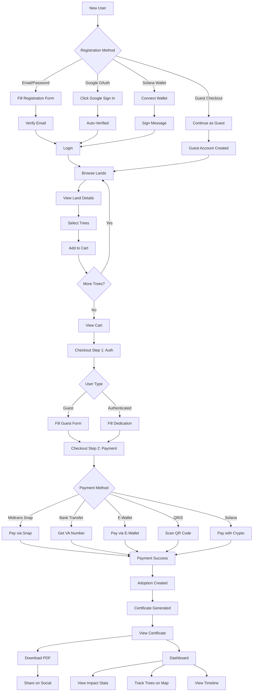
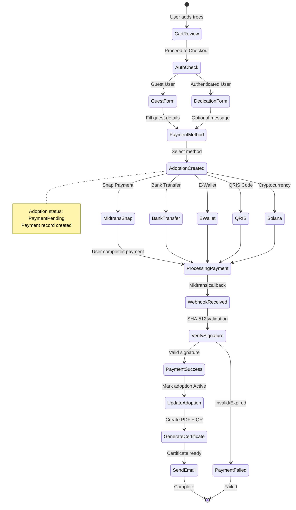
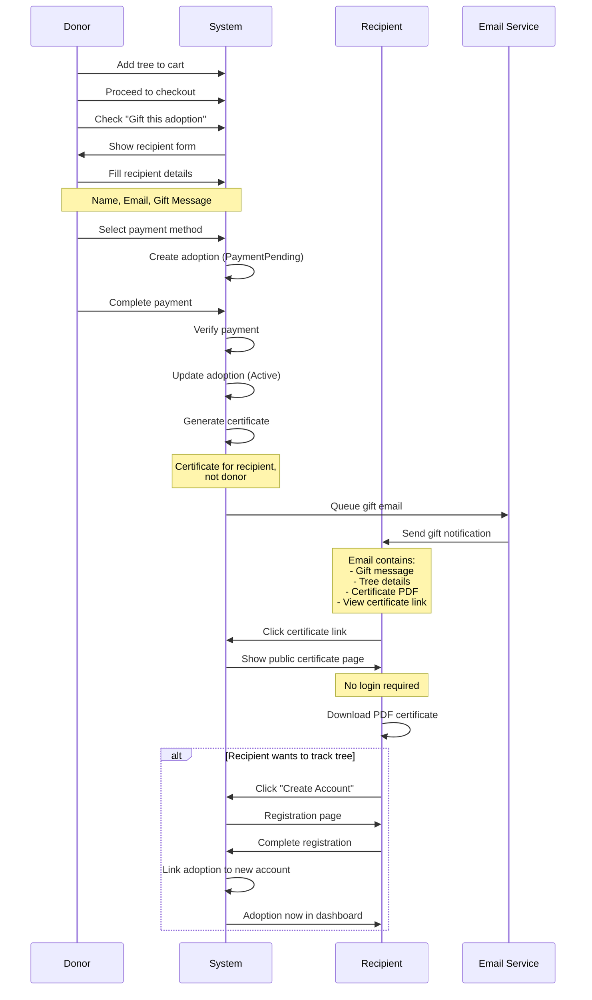

# AdopTree World - Donor User Guide
## Complete Tree Adoption Journey

**For**: Tree Adopters, Individual Donors
**Environment**: Staging (`https://staging.adoptreeworld.com/`) & Production (`https://adoptreeworld.com/`)
**Last Updated**: January 18, 2026

---

## Table of Contents

1. [Overview](#overview)
2. [Getting Started](#getting-started)
3. [Browsing & Discovery](#browsing--discovery)
4. [Shopping Cart](#shopping-cart)
5. [Checkout Process](#checkout-process)
6. [Payment Methods](#payment-methods)
7. [Dashboard Features](#dashboard-features)
8. [Profile Management](#profile-management)
9. [Carbon Credits & Impact](#carbon-credits--impact)
10. [Troubleshooting](#troubleshooting)

---

## Overview

Welcome to **AdopTree World**! This guide will walk you through adopting trees, making payments, downloading certificates, and tracking your environmental impact.

### What You Can Do

- **Adopt Trees**: Choose from 4 adoption tiers ($8 to $75)
- **Browse Lands**: Explore conservation projects across regions
- **Track Impact**: Monitor CO2 absorption and carbon credits
- **Download Certificates**: PDF certificates with QR code verification
- **Gift Adoptions**: Send tree adoptions as gifts to friends/family
- **View Progress**: See your adopted trees on a map with timeline updates

### Product Tiers

| Tier | Price | Duration | Benefits |
|------|-------|----------|----------|
| **Donation** | $8 | 1 year | Basic tree support, certificate |
| **Wakaf** | $10 | Perpetual | Permanent adoption (Islamic endowment) |
| **GreenSociety** | $12 | 1 year | Community tier with recognition |
| **AdoptTree** | $75 | 5 years | Premium long-term, priority updates |

---

## Getting Started

### Registration Options

You have **4 ways** to create an account:

#### Option 1: Email/Password Registration

1. **Navigate** to [https://staging.adoptreeworld.com/auth/register](https://staging.adoptreeworld.com/auth/register)
2. **Choose** account type:
   - **Donor** - For individual tree adopters (select this)
   - **Merchant** - For land providers (different flow)
3. **Fill the form**:
   - Full Name: Your name
   - Email: Valid email address
   - Password: Min 8 characters (must include uppercase, lowercase, number)
   - Confirm Password: Re-enter password
4. **Submit** registration
5. **Expected Result**: Redirect to `/auth/verify-pending`

**Next Step**: Check your email inbox for verification link

#### Option 2: Google OAuth (Recommended)

1. **Navigate** to [https://staging.adoptreeworld.com/auth/login](https://staging.adoptreeworld.com/auth/login)
2. **Click** "Sign in with Google" button
3. **Select** your Google account
4. **Grant** permissions to AdopTree World
5. **Expected Result**: Automatically logged in, email verified, redirected to `/dashboard`

**Benefits**:
- ✅ No password to remember
- ✅ Email automatically verified
- ✅ Profile photo imported from Google
- ✅ Faster login process

#### Option 3: Solana Wallet Authentication

1. **Ensure** you have a Solana wallet (Phantom, Solflare, etc.)
2. **Navigate** to login page
3. **Click** "Connect Wallet" button
4. **Approve** connection in your wallet
5. **Sign** the verification message
6. **Expected Result**: Logged in via blockchain authentication

**Use Case**: For crypto enthusiasts who want blockchain-verified identity

#### Option 4: Guest Checkout

1. **Browse** lands without logging in
2. **Add** trees to cart
3. **Proceed** to checkout
4. **Select** "Continue as Guest"
5. **Fill** guest form (name, email, phone)
6. **Complete** payment
7. **Expected Result**: Guest account created, certificate emailed

**Note**: You can upgrade to full account later via email link

---

### Email Verification

After email/password registration:

1. **Check** your email inbox (check spam folder too)
2. **Email From**: adoptreeworld@gmail.com
3. **Subject**: "Verify your AdopTreeWorld email"
4. **Click** the "Verify Email" button in the email
5. **Expected Result**:
   - Redirected to success page
   - "Email verified successfully" message
   - Can now login

**Verification Link Expires**: 24 hours

**If Link Expired**:
1. Login to your account
2. You'll see "Email not verified" banner
3. Click "Resend Verification Email"
4. Check inbox for new link

---

### Login Process

#### Email/Password Login

1. **Navigate** to [https://staging.adoptreeworld.com/auth/login](https://staging.adoptreeworld.com/auth/login)
2. **Enter** email and password
3. **Click** "Sign In"
4. **Expected Result**: Redirect to `/dashboard`

#### Google OAuth Login

1. **Navigate** to login page
2. **Click** "Sign in with Google"
3. **Select** Google account
4. **Expected Result**: Instant login to dashboard

#### Wallet Login

1. **Click** "Connect Wallet"
2. **Approve** in wallet extension
3. **Sign** message
4. **Expected Result**: Logged in

**Forgot Password?**
1. Click "Forgot Password?" link
2. Enter your email
3. Check inbox for reset link
4. Click link and set new password

---

## Browsing & Discovery

### Explore Page

**URL**: [https://staging.adoptreeworld.com/explore](https://staging.adoptreeworld.com/explore)

#### Features

- **Featured Lands**: Curated conservation projects
- **Regional Browsing**: Filter by location (Papua, Kalimantan, Java, etc.)
- **Map View**: Interactive map showing land locations
- **Search Bar**: Search by land name or location
- **Filter Options**:
  - Official Projects (verified merchants)
  - Campaign Projects (community-led)

#### How to Browse

1. **Navigate** to `/explore`
2. **Scroll** through featured lands
3. **Click** a land card to view details
4. **Use** filters to narrow down options
5. **View** regional sections (Papua, Kalimantan, etc.)

---

### Land Detail Page

**URL**: `/explore/[slug]` (e.g., `/explore/papua-reforestation`)

#### Tabs

1. **Description Tab**
   - Land overview
   - Conservation mission
   - Location information
   - Merchant details

2. **Trees Tab**
   - List of available trees
   - Species information
   - Tree locations on map
   - Click markers to see individual trees

3. **Reviews Tab**
   - User reviews and ratings
   - Star ratings (1-5)
   - Review text and dates
   - Average rating display

4. **Info Tab**
   - Land statistics
   - Total trees planted
   - Trees available for adoption
   - Land area (hectares)
   - Species diversity

#### Adoption Widget (Right Sidebar)

- **Quick Stats**: Available trees, species count, area
- **Product Tier Selection**: Choose tier (Donation, Wakaf, etc.)
- **Price Display**: Current tier pricing
- **Add to Cart Button**: Add selected tree to cart
- **Cart Summary**: Current cart items and total

---

### Tree Species Information

Common species you'll find:

| Species | Growth Rate | CO2 Absorption | Regions |
|---------|-------------|----------------|---------|
| **Mahogany** | Medium | High | Papua, Kalimantan |
| **Teak** | Slow | Very High | Java, Bali |
| **Bamboo** | Fast | Medium | All regions |
| **Mangrove** | Medium | High | Coastal areas |
| **Pine** | Fast | Medium | Highland areas |

**CO2 Calculation**: Each species has different carbon absorption rates based on age and growth

---

## Shopping Cart

**URL**: [https://staging.adoptreeworld.com/cart](https://staging.adoptreeworld.com/cart)

### Cart Features

#### View Cart

1. **Click** cart icon in navbar (top-right)
2. **See** all items added
3. **View** cart summary with total price

#### Cart Items Display

Each item shows:
- Land name and location
- Tree species
- Product tier selected
- Price per item
- Quantity selector
- Remove button

#### Managing Cart

**Adjust Quantities**:
- Click +/- buttons
- Updates automatically
- Price recalculates

**Remove Items**:
- Click "Remove" button
- Item deleted from cart
- Total price updates

**Clear Cart**:
- Click "Clear Cart" button
- Confirms before clearing
- All items removed

**Continue Shopping**:
- Click "Continue Shopping"
- Returns to `/explore`

---

### Cart Summary

Shows:
- **Subtotal**: Sum of all items
- **Tax**: If applicable
- **Total**: Final amount
- **Checkout Button**: Proceed to payment

**Empty Cart State**:
- Shows "Your cart is empty" message
- "Explore Lands" button
- Redirects to `/explore`

---

## Checkout Process

**URL**: [https://staging.adoptreeworld.com/checkout](https://staging.adoptreeworld.com/checkout)

### 3-Step Checkout Flow

```
Step 1: Authentication → Step 2: Payment Method → Step 3: Confirmation
```

---

### Step 1: Customer Details

#### If Not Logged In

**Option A: Login**
1. Enter email and password
2. Click "Sign In"
3. Proceeds to payment step

**Option B: Guest Checkout**
1. Click "Continue as Guest"
2. Fill guest form:
   - Full Name
   - Email (for certificate)
   - Phone Number
3. Click "Continue"

#### If Logged In

Automatically skips to dedication form

#### Dedication Message (Optional)

- Enter custom message
- Appears on certificate
- Max 200 characters
- Example: "In memory of [name]" or "For my family"

#### Gift Option

**To Gift This Adoption**:
1. Check "Gift this adoption" checkbox
2. Fill recipient details:
   - Recipient Name
   - Recipient Email
   - Gift Message
3. Recipient receives:
   - Email notification
   - Certificate with gift message
   - Link to view adoption

---

### Step 2: Payment Method Selection

Choose from **6 payment methods**:

#### 1. Midtrans Snap (All-in-One)

**Supports**: Credit cards, debit cards, bank transfers, e-wallets, QRIS
- **Click** "Pay with Midtrans Snap"
- **Modal Opens**: Midtrans payment page
- **Select** preferred method within Snap
- **Complete** payment
- **Return** to AdopTree World

**Benefits**: One interface for all payment types

#### 2. Bank Transfer (Virtual Account)

**Supported Banks**: BCA, Mandiri, BNI, BRI, Permata
- **Select** "Bank Transfer"
- **Choose** bank
- **Get** Virtual Account number
- **Copy** VA number
- **Transfer** from your bank app
- **Wait** for webhook confirmation (automatic)

**Payment Window**: 24 hours

#### 3. E-Wallet

**Supported**: OVO, GoPay, LinkAja, DANA
- **Select** "E-Wallet"
- **Choose** e-wallet provider
- **Enter** phone number (if required)
- **Approve** payment in e-wallet app
- **Confirmation** automatic

**Benefits**: Instant payment, mobile-first

#### 4. QRIS (Universal QR Code)

**Works With**: Any Indonesian bank app with QRIS support
- **Select** "QRIS"
- **QR Code** displayed on screen
- **Open** your bank app
- **Scan** QR code
- **Approve** payment
- **Confirmation** automatic

**Benefits**: Universal, works with all banks

#### 5. Solana Cryptocurrency

**Requires**: Solana wallet (Phantom, Solflare)
- **Select** "Pay with Crypto"
- **Connect** wallet
- **Review** amount in SOL
- **Approve** transaction
- **Blockchain** confirms payment

**Benefits**: Blockchain-verified, international

#### 6. Credit Card (Coming Soon)

Direct credit card input coming soon.

---

### Step 3: Payment Processing

#### What Happens After Payment

1. **Payment Submitted**: Your payment is processing
2. **Webhook Received**: Midtrans confirms payment (2-30 seconds)
3. **Adoption Created**: Status changes from "PaymentPending" to "Active"
4. **Certificate Generated**: PDF with QR code created
5. **Email Sent**: Certificate link sent to your email
6. **Redirect**: Success page with order details

#### Success Screen

Shows:
- ✅ Payment successful message
- Order ID
- Adoption ID
- "View Certificate" button
- "View Dashboard" button

**Expected Email**:
- **From**: adoptreeworld@gmail.com
- **Subject**: "Your AdopTree World Certificate is Ready!"
- **Contains**: Certificate PDF attachment or download link

---

### Payment Status

**Payment Statuses Explained**:

| Status | Meaning | Action |
|--------|---------|--------|
| **Pending** | Payment not initiated | Complete payment |
| **Processing** | Payment submitted, awaiting confirmation | Wait 2-30 seconds |
| **Success** | Payment confirmed, adoption active | Download certificate |
| **Failed** | Payment declined or error | Try again or use different method |
| **Expired** | Payment window expired (24h for VA) | Create new order |

---

## Payment Methods

### Test Payment (Staging Only)

**Staging Environment Uses Test Mode** - No real charges!

#### Test Credentials

**GoPay Test**:
- Phone: `0812345678`
- OTP: `111111`

**Credit Card Test** (when available):
- Card: `4811 1111 1111 1114`
- Expiry: Any future date
- CVV: `123`

**Bank Transfer Test**:
- Use any amount
- Auto-confirms in test mode

---

## Dashboard Features

**URL**: [https://staging.adoptreeworld.com/dashboard](https://staging.adoptreeworld.com/dashboard)

### Dashboard Overview

#### Top Section: Profile Card

- Your avatar (uploaded or initials)
- Full name
- Email address
- "Become a Merchant" banner (if donor)

#### Impact Summary (4 Cards)

1. **Trees Adopted**: Total trees you've adopted
2. **Land Area**: Hectares supported
3. **CO2 Absorbed**: Kilograms of CO2
4. **Certificates**: Total certificates earned

---

### My Journey Tab

**View Your Adopted Trees**:

#### Adoption Cards

Each card shows:
- Land name and location
- Tree species
- Adoption date
- Status (Active, Pending, Expired)
- Product tier
- "View Certificate" button
- "View Details" button

#### Interactive Map

- **Map Display**: Shows all your tree locations
- **Markers**: Pin for each adopted tree
- **Click Marker**: See tree details popup
- **Zoom**: Navigate to specific regions
- **Legend**: Color-coded by land

#### Empty State

If no adoptions:
- "Start your journey" message
- "Explore Lands" button
- Inspirational quote about forests

---

### Certificates Tab

**Download and Share Your Certificates**:

#### Certificate List

Each certificate shows:
- Certificate code (e.g., CERT-XXXX-YYYY)
- Adoption details (land, tree, species)
- Issued date
- Status (Active/Expired)
- Download PDF button
- Share buttons (Facebook, Twitter, LinkedIn, WhatsApp)

#### Certificate Features

**PDF Certificate Includes**:
- Your full name
- Land name and location
- Tree species
- Adoption tier and duration
- CO2 absorption estimate
- Unique QR code for verification
- Certificate code
- Issue date

**QR Code Verification**:
1. Open certificate PDF
2. Scan QR code with phone
3. Opens public verification page
4. Shows adoption details

**Sharing Certificates**:
- Click social media icon
- Pre-filled text: "I adopted a tree with @AdopTreeWorld"
- Image attachment (certificate preview)
- Link to your adoption

---

### Activity Tab

**Timeline of Your Environmental Impact**:

#### Activity Feed

Shows chronological list:
- **Adoption Created**: When you adopted
- **Payment Confirmed**: When payment succeeded
- **Certificate Issued**: When certificate generated
- **Tree Updates**: Growth milestones from merchant
- **Health Reports**: Tree health status updates
- **Renewal Reminders**: When adoption nearing expiry

#### Activity Item Format

- **Icon**: Type of activity (tree, certificate, payment)
- **Title**: Activity description
- **Date**: When it happened
- **Details**: Additional information
- **Action Button**: View details or download

#### Notifications

- Bell icon in navbar
- Red badge for unread count
- Click to see all notifications
- Mark as read functionality

---

## Profile Management

**URL**: [https://staging.adoptreeworld.com/dashboard/settings](https://staging.adoptreeworld.com/dashboard/settings)

### Profile Tab

#### Personal Information

**Editable Fields**:
- **Full Name**: Your display name
- **Email**: Read-only (cannot change)
- **Phone**: Read-only (if provided during registration)

**Email Verification Status**:
- ✅ Green badge: "Verified"
- ⚠️ Yellow badge: "Not Verified" with "Resend Email" button

#### Avatar Upload

1. **Click** avatar or "Change Avatar" button
2. **Select** image file (JPG, PNG)
3. **File Requirements**:
   - Max size: 5MB
   - Recommended: 400x400px or larger
   - Square format preferred
4. **Upload** automatically
5. **Preview** updates immediately
6. **Appears** in navbar, dashboard, certificates

**Default Avatar**: Initials with colored background

#### Saving Changes

1. **Edit** profile fields
2. **Click** "Save Changes" button
3. **Success Toast**: "Profile updated successfully"
4. **Changes**: Reflect immediately

---

### Security Tab

#### For Email/Password Users

##### Change Password

1. **Enter** current password
2. **Enter** new password:
   - Min 8 characters
   - Must contain uppercase letter
   - Must contain lowercase letter
   - Must contain number
3. **Confirm** new password
4. **Click** "Change Password"
5. **Success**: "Password changed successfully"

**Password Requirements Displayed**:
- ✅ At least 8 characters
- ✅ Uppercase letter (A-Z)
- ✅ Lowercase letter (a-z)
- ✅ Number (0-9)

##### Show/Hide Password

- Click eye icon to toggle visibility
- Helps verify password entry

---

#### For OAuth Users (Google Login)

##### Add Password

**Why Add Password?**
- Enable email/password login alongside Google
- Backup if Google account unavailable
- Security redundancy

**How to Add**:
1. **Navigate** to Security tab
2. **See** "Add Password" section
3. **Enter** new password (8+ chars, uppercase, lowercase, number)
4. **Confirm** password
5. **Click** "Add Password"
6. **Success**: Can now login with email/password too

---

#### Wallet Connection

**For Solana Wallet Users**:

##### Connect Wallet

1. **Click** "Connect Wallet"
2. **Select** wallet provider (Phantom, Solflare)
3. **Approve** connection
4. **Sign** verification message
5. **Wallet Address** displayed
6. **Status**: Connected ✅

##### Disconnect Wallet

1. **Click** "Disconnect Wallet"
2. **Confirm** disconnection
3. **Wallet Removed**: Can still login via email/Google

**Benefits of Wallet**:
- Blockchain-verified identity
- Future NFT features
- Crypto payment enabled

---

#### Two-Factor Authentication (Coming Soon)

**Future Feature**:
- Add extra security layer
- SMS or app-based 2FA
- Required for high-value accounts

**Current Status**: UI ready, feature in development

---

#### Account Information

**Read-Only Information**:
- **User ID**: Your unique identifier (UUID)
- **Account Role**: Donor
- **Member Since**: Registration date
- **Last Login**: Most recent login timestamp
- **Wallet Address**: If connected

---

## Carbon Credits & Impact

### Understanding Carbon Credits

**What Are Carbon Credits?**
- Measurement of CO2 absorbed by your adopted trees
- Calculated based on tree species and age
- Tracked in kilograms (kg) and tons
- Contributes to global carbon offsetting

**How It's Calculated**:
```
Carbon Credits = Tree Species Factor × Age × Health Status
```

**Example**:
- Mahogany tree, 3 years old, healthy
- Absorbs ~50kg CO2 per year
- Total after 3 years: ~150kg CO2

---

### Carbon Dashboard

**URL**: Part of main dashboard

#### Impact Metrics

**Displays**:
1. **Total CO2 Absorbed**: All your trees combined (kg)
2. **Equivalent Impact**:
   - Car miles offset
   - Trees equivalent
   - Household days powered
3. **Breakdown by Land**: CO2 per conservation project
4. **Breakdown by Species**: CO2 per tree type

#### 5-Year Projections

**Future Impact Calculator**:
- Monthly projections (12-60 months)
- Growth curve visualization
- Estimated CO2 absorption over time
- Based on species growth rates

**Example Projection** (AdoptTree $75, 5-year tier):
- Year 1: 50kg CO2
- Year 2: 75kg CO2
- Year 3: 100kg CO2
- Year 4: 120kg CO2
- Year 5: 150kg CO2
- **Total 5-Year**: 495kg CO2

---

### Platform Impact

**Global Statistics** (visible to all users):
- Total trees adopted platform-wide
- Total land area protected (hectares)
- Total CO2 absorbed by community
- Total donors contributing

**Your Contribution**:
- Percentage of platform total
- Ranking (if enabled)
- Community recognition

---

## Troubleshooting

### Common Issues

#### 1. Email Not Received

**Problem**: Verification or certificate email not in inbox

**Solutions**:
- ✅ Check spam/junk folder
- ✅ Check promotions tab (Gmail)
- ✅ Wait 5-10 minutes (email delay)
- ✅ Add adoptreeworld@gmail.com to contacts
- ✅ Click "Resend Email" on dashboard

**Still No Email?**
- Contact support: adoptreeworld@gmail.com
- Provide your registered email

---

#### 2. Payment Not Confirmed

**Problem**: Paid but adoption still shows "Pending"

**Solutions**:
- ✅ Wait 2-5 minutes for webhook
- ✅ Refresh page
- ✅ Check payment status in bank app
- ✅ Check email for payment confirmation

**If Still Pending After 30 Minutes**:
1. Take screenshot of payment confirmation
2. Note Order ID
3. Contact support with details

---

#### 3. Cannot Download Certificate

**Problem**: Certificate download fails or errors

**Solutions**:
- ✅ Try different browser
- ✅ Disable popup blocker
- ✅ Check internet connection
- ✅ Clear browser cache
- ✅ Try "View Certificate" instead of "Download"

---

#### 4. Password Reset Link Expired

**Problem**: Reset link doesn't work

**Solutions**:
- ✅ Links expire after 1 hour
- ✅ Go to forgot password page again
- ✅ Request new reset link
- ✅ Use link immediately

---

#### 5. Google OAuth Not Working

**Problem**: "Sign in with Google" fails

**Solutions**:
- ✅ Check popup blocker (allow popups)
- ✅ Enable third-party cookies
- ✅ Try incognito/private mode
- ✅ Use different browser
- ✅ Clear browser cache

---

#### 6. Cart Items Disappear

**Problem**: Cart empties unexpectedly

**Solutions**:
- ✅ Cart stored in browser (localStorage)
- ✅ Clearing browser data clears cart
- ✅ Different browser = different cart
- ✅ Login to persist cart across devices

**Note**: Cart doesn't sync across browsers/devices unless logged in

---

#### 7. Avatar Not Updating

**Problem**: Uploaded avatar doesn't show

**Solutions**:
- ✅ Wait 30 seconds for upload
- ✅ Hard refresh page (Ctrl+F5 or Cmd+Shift+R)
- ✅ Clear browser cache
- ✅ Check file size (<5MB)
- ✅ Use JPG or PNG format

---

### Getting Help

**Support Channels**:
- **Email**: adoptreeworld@gmail.com
- **Response Time**: 24-48 hours

**When Contacting Support, Include**:
- Your registered email
- Order ID (if payment issue)
- Adoption ID (if adoption issue)
- Screenshot of error
- Browser and device info

---

## Donor Journey Flows

Visual flowcharts showing key donor workflows using Mermaid diagrams.

### Flow 1: Complete Donor Journey (Registration to Certificate)



---

### Flow 2: Payment Processing Flow



---

### Flow 3: Gift Adoption Flow



---

## Next Steps

After completing adoption:

1. **✅ Download Certificate**: Save PDF for records
2. **✅ Share on Social**: Inspire friends to adopt trees
3. **✅ Monitor Dashboard**: Track tree growth and updates
4. **✅ Set Reminders**: For adoption renewals
5. **✅ Explore More**: Adopt trees from different regions
6. **✅ Gift Adoptions**: Share the gift of trees
7. **✅ Join Community**: Follow on social media for updates

---

## Additional Resources

- **Feature Status**: See [FEATURE-STATUS.md](FEATURE-STATUS.md) for complete feature list
- **Merchant Guide**: See [MERCHANT-GUIDE.md](MERCHANT-GUIDE.md) to become a land provider
- **Testing Guide**: See [TESTING-GUIDE.md](TESTING-GUIDE.md) for testing scenarios
- **Admin Guide**: See [ADMIN-GUIDE.md](ADMIN-GUIDE.md) (for admins only)

---

**Thank you for supporting reforestation with AdopTree World!** 🌳🌍

Every tree makes a difference. Your contribution helps restore forests, absorb CO2, and create a sustainable future.

---

*Last Updated: January 18, 2026 | Version 1.0 | For Donors*
