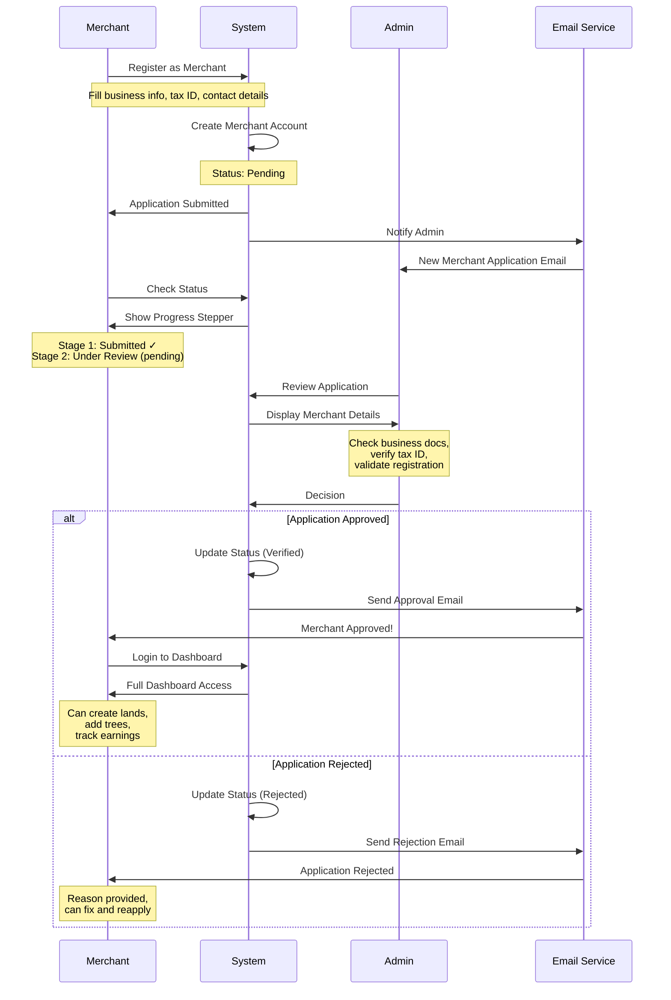
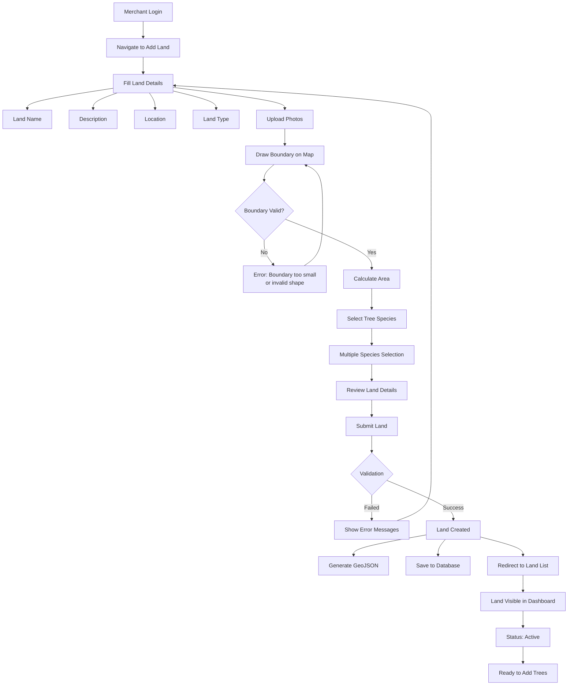
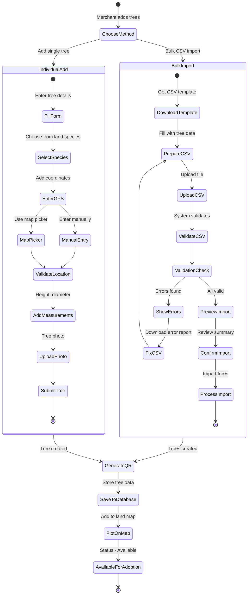
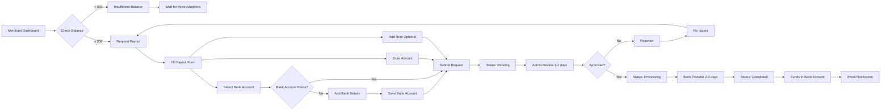

# Merchant Guide - AdopTree World

## Overview

This guide covers the complete merchant journey from registration to land and tree management. Merchants are land providers who register conservation lands, add trees for adoption, and earn revenue from tree adoptions.

**Who is a Merchant?**
- Conservation land owners or managers
- Reforestation organizations
- Forestry cooperatives
- Landowners who want to monetize tree adoptions

**What Merchants Can Do:**
- Register and manage conservation lands
- Add trees individually or via bulk CSV import
- Track earnings and request payouts
- View adoption statistics
- Manage land boundaries with GPS mapping

---

## Table of Contents

1. [Becoming a Merchant](#becoming-a-merchant)
2. [Verification Status Tracking](#verification-status-tracking)
3. [Merchant Dashboard](#merchant-dashboard)
4. [Land Management](#land-management)
5. [Tree Management](#tree-management)
6. [Earnings & Payouts](#earnings--payouts)
7. [Best Practices](#best-practices)
8. [Troubleshooting](#troubleshooting)

---

## Becoming a Merchant

### Prerequisites

Before applying to become a merchant, you must:

1. **Have a User Account**
   - Register at https://staging.adoptreeworld.com/auth/register
   - Verify your email address
   - Complete your profile

2. **Business Requirements**
   - Valid business registration or land ownership documents
   - Tax identification number
   - Bank account for payouts
   - Contact information

### Application Process

#### Step 1: Navigate to Merchant Registration

1. Login to your account
2. Navigate to `/merchant/register`
3. You'll see the merchant application form

#### Step 2: Fill Business Information

**Required Fields:**

1. **Business Name**
   - Your organization or business name
   - Example: "Papua Reforestation Initiative"

2. **Tax ID**
   - Your business tax identification number
   - Format: Country-specific tax ID
   - Example: "12.345.678.9-012.345"

3. **Business Contact**
   - Business phone number
   - Business email (can be different from account email)
   - Physical address

4. **Business Registration Number**
   - Your company registration number
   - Required for verification

5. **Business Description** (Optional)
   - Brief description of your organization
   - Your conservation mission
   - Land management experience

#### Step 3: Submit Application

1. Review all information carefully
2. Accept merchant terms and conditions
3. Click "Submit Application"
4. **Expected Result**:
   - Success message appears
   - Redirect to merchant dashboard
   - Application status: "Pending Review"
   - Email notification sent

#### Step 4: Wait for Verification

**Verification Timeline**: 3-5 business days

During this time:
- Admin team reviews your application
- Verifies business documents
- Checks registration authenticity
- May contact you for additional information

**You will receive email notifications at each stage:**
- Application received
- Under review
- Approved or Rejected

---

## Verification Status Tracking

### The 4 Application Stages

Your application goes through 4 stages:

```
Stage 1: Application Submitted ✓
    ↓
Stage 2: Under Review (Admin checking documents)
    ↓
Stage 3: Verification Complete
    ↓
Stage 4: Account Active
```

### Checking Your Status

1. Login to your account
2. Navigate to `/merchant/dashboard`
3. View the progress stepper at the top

**Status Indicators:**

| Status | Description | What You Can Do |
|--------|-------------|-----------------|
| **Pending** | Application submitted, waiting for review | Check status daily |
| **Under Review** | Admin is reviewing your documents | Wait for contact if needed |
| **Verification Complete** | Documents approved, final activation | Account will activate soon |
| **Active/Verified** | Full merchant access granted | Create lands and add trees |
| **Rejected** | Application denied | Read rejection reason, fix issues, reapply |
| **Suspended** | Account temporarily suspended | Contact admin support |

### Possible Outcomes

#### Approved ✅
- Full dashboard access granted
- Can create lands
- Can add trees
- Can track earnings
- Email notification sent
- **Next Steps**: [Create your first land](#land-management)

#### Rejected ❌
- Rejection reason provided in email and dashboard
- Common reasons:
  - Invalid business documents
  - Incomplete information
  - Unable to verify registration
  - Duplicate application
- **Next Steps**:
  - Review rejection reason
  - Fix issues
  - Reapply with correct information

#### Suspended ⚠️
- Account temporarily disabled
- Common reasons:
  - Policy violations
  - Suspicious activity
  - Unresolved disputes
- **Next Steps**: Contact admin at admin@adoptreeworld.com

---

## Merchant Dashboard

### Overview Tab

When you login as a verified merchant, you'll see:

**Main Statistics (4 Cards):**

1. **Total Lands**
   - Number of conservation lands you've registered
   - Click to view land list

2. **Total Trees**
   - Total trees across all your lands
   - Breakdown: Available vs Adopted

3. **Total Earnings**
   - Revenue from tree adoptions (USD)
   - After commission deduction
   - Click to view earnings details

4. **Recent Activity**
   - Latest adoptions
   - Recent tree additions
   - Payout status updates

### Quick Actions Panel

**Shortcuts for common tasks:**

- **Add New Land** → Create a new conservation land
- **Add Trees** → Add trees to existing lands
- **Request Payout** → Withdraw your earnings
- **View Reports** → See detailed statistics

### Navigation Menu

**Main Sections:**

1. **Dashboard** - Overview and statistics
2. **Lands** - Manage your conservation lands
3. **Trees** - View and manage all trees
4. **Earnings & Payouts** - Financial tracking
5. **Profile** - Update merchant information

---

## Land Management

### Creating New Land

#### Step 1: Navigate to Add Land

1. Go to `/merchant/dashboard/lands`
2. Click "Add New Land" button
3. Land creation form opens

#### Step 2: Fill Land Details

**Basic Information:**

1. **Land Name** (Required)
   - Descriptive name for your conservation area
   - Example: "Sumatra Rainforest Reserve"
   - 5-100 characters

2. **Description** (Required)
   - Detailed description of the land
   - Conservation goals
   - Environmental significance
   - Minimum 50 characters
   - Example: "A 50-hectare rainforest reserve in North Sumatra dedicated to preserving endangered species habitat and restoring degraded forest areas through community-based reforestation."

3. **Location** (Required)
   - Country, province/state, district
   - Example: "Indonesia, North Sumatra, Langkat"

4. **Land Type** (Required)
   - Select from dropdown:
     - Reforestation
     - Conservation
     - Agroforestry
     - Mangrove Restoration
     - Urban Forestry

5. **Land Photos** (Required)
   - Upload 1-5 photos
   - Minimum resolution: 1920x1080
   - Formats: JPG, PNG
   - Maximum 5MB per photo
   - **Best Practices**: See [Photo Guidelines](#photo-guidelines)

#### Step 3: Draw Land Boundaries

**Interactive Map Drawing:**

1. **Locate Your Land**
   - Use search box to find general area
   - Zoom to your land location
   - Switch to satellite view for accuracy

2. **Draw Polygon Boundary**
   - Click "Draw Boundary" button
   - Click points around your land perimeter
   - Connect back to first point to close polygon
   - Double-click to finish

3. **Boundary Tools**
   - **Edit**: Adjust boundary points
   - **Delete**: Remove and redraw
   - **Undo**: Remove last point
   - **Clear**: Start over

4. **Area Calculation**
   - System automatically calculates area
   - Displayed in hectares and acres
   - Must be at least 0.1 hectares

**GeoJSON Output:**
- Boundary saved as GeoJSON format
- Used for tree location validation
- Visible on public land detail page

#### Step 4: Select Tree Species

1. **Available Species**
   - Select species that grow on your land
   - Multiple selection allowed
   - Common options:
     - Mahogany (Swietenia macrophylla)
     - Teak (Tectona grandis)
     - Bamboo (Bambusa sp.)
     - Mangrove (Rhizophora sp.)
     - Pine (Pinus merkusii)
     - Eucalyptus (Eucalyptus sp.)
     - Acacia (Acacia mangium)

2. **Species Management**
   - Can add more species later
   - Used for tree dropdown during tree creation

#### Step 5: Submit Land

1. Review all information
2. Click "Create Land"
3. **Expected Result**:
   - Success message
   - Redirect to land list
   - Land appears in your dashboard
   - Land status: Active

### Editing Existing Land

1. Navigate to `/merchant/dashboard/lands`
2. Click on land you want to edit
3. Click "Edit Land" button
4. Modify information (same fields as creation)
5. Can update:
   - Name and description
   - Photos
   - Boundary (redraw on map)
   - Species list
6. Save changes

**Note**: Cannot change land location drastically after trees are added

### Land Statistics

For each land, you can view:

**Metrics:**
- Total trees planted
- Trees available for adoption
- Trees already adopted
- Revenue generated from this land
- Adoption rate (percentage)
- Most popular species

**Visual Data:**
- Trees plotted on map
- Boundary visualization
- Species distribution chart

---

## Tree Management

### Adding Individual Trees

#### Step 1: Navigate to Tree Management

1. Go to `/merchant/dashboard/lands`
2. Click on the land where you want to add trees
3. Click "Manage Trees" button
4. Click "Add New Tree"

#### Step 2: Fill Tree Details

**Required Fields:**

1. **Species** (Dropdown)
   - Select from species you added to land
   - Example: "Mahogany (Swietenia macrophylla)"

2. **GPS Coordinates**

   **Option A: Enter Manually**
   - **Latitude**: Decimal degrees (-90 to 90)
     - Example: `-2.5489`
   - **Longitude**: Decimal degrees (-180 to 180)
     - Example: `140.7184`

   **Option B: Use Map Picker**
   - Click "Pick Location on Map"
   - Map opens showing your land boundary
   - Click exact tree location
   - Coordinates auto-filled
   - **Validation**: Must be within land boundary

3. **Planted Date** (Required)
   - Date when tree was planted
   - Cannot be future date
   - Format: YYYY-MM-DD
   - Example: `2024-01-15`

4. **Tree Measurements** (Optional but Recommended)
   - **Height**: In meters (e.g., `2.5`)
   - **Diameter**: Trunk diameter in meters (e.g., `0.3`)
   - Used for carbon credit calculations

5. **Tree Photo** (Highly Recommended)
   - Upload clear photo of the tree
   - Formats: JPG, PNG
   - Maximum 5MB
   - Shows on adoption page

6. **Additional Notes** (Optional)
   - Any special information
   - Tree health status
   - Unique characteristics

#### Step 3: Submit Tree

1. Review all information
2. Click "Add Tree"
3. **Expected Result**:
   - Tree added to land
   - **QR Code automatically generated**
   - Tree appears in tree list
   - Tree status: Available for adoption
   - Tree plotted on land map

#### Step 4: QR Code

Each tree gets a unique QR code:
- Encoded with tree ID and verification URL
- Can be printed and placed on physical tree marker
- When scanned, shows tree details and adoption status
- Downloadable from tree detail page

---

### Bulk Import Trees via CSV

For adding many trees at once, use CSV bulk import.

#### Step 1: Download CSV Template

1. Navigate to land → "Manage Trees"
2. Click "Bulk Import" button
3. Click "Download CSV Template"
4. Template downloaded: `tree_import_template.csv`

#### Step 2: Prepare CSV File

**CSV Format:**

```csv
species,latitude,longitude,planted_date,height,diameter,notes
Mahogany,-2.5489,140.7184,2024-01-15,2.5,0.3,Healthy young tree
Teak,-2.5490,140.7185,2024-01-16,2.2,0.25,Good growth
Bamboo,-2.5491,140.7186,2024-01-17,3.0,0.15,Fast growing
Mahogany,-2.5492,140.7187,2024-01-18,2.8,0.32,Excellent condition
Pine,-2.5493,140.7188,2024-01-19,1.9,0.20,Needs monitoring
```

**Field Requirements:**

| Field | Required | Format | Example | Notes |
|-------|----------|--------|---------|-------|
| species | Yes | Text (must exist in land) | Mahogany | Exact match to species list |
| latitude | Yes | Decimal (-90 to 90) | -2.5489 | Must be within land boundary |
| longitude | Yes | Decimal (-180 to 180) | 140.7184 | Must be within land boundary |
| planted_date | Yes | YYYY-MM-DD | 2024-01-15 | Cannot be future date |
| height | No | Decimal (meters) | 2.5 | Tree height in meters |
| diameter | No | Decimal (meters) | 0.3 | Trunk diameter in meters |
| notes | No | Text (max 500 chars) | Healthy tree | Additional information |

**Important Rules:**

- ✅ No duplicate coordinates (each tree must have unique location)
- ✅ All coordinates must be within land boundary polygon
- ✅ Species must be in the land's species list
- ✅ Maximum 1000 trees per import
- ✅ Dates must be valid and not in future

#### Step 3: Upload CSV

1. Click "Upload CSV File"
2. Select your prepared CSV file
3. Click "Upload and Validate"

#### Step 4: Validation

System validates your CSV:

**Validation Checks:**

1. **File Format**
   - Must be .csv
   - Must have header row
   - All required columns present

2. **Species Validation**
   - Each species exists in land's species list
   - Exact name match (case-sensitive)

3. **GPS Validation**
   - Coordinates are valid decimal degrees
   - All coordinates within land boundary
   - No duplicate coordinates

4. **Date Validation**
   - All dates in correct format
   - No future dates

5. **Data Types**
   - Height and diameter are numbers
   - Notes within character limit

**Validation Results:**

If errors found:
- ❌ Import blocked
- Error summary shown
- Download error report (CSV with error messages)
- Fix errors and re-upload

If validation passes:
- ✅ Summary shown (e.g., "50 trees ready to import")
- Preview of first 10 trees
- Click "Confirm Import"

#### Step 5: Import Confirmation

1. Review import summary
2. Check preview of trees to be imported
3. Click "Confirm and Import Trees"
4. **Expected Result**:
   - Progress bar shows import status
   - Trees added to database
   - QR codes generated for each tree
   - Success message: "50 trees imported successfully"
   - Redirect to tree list

#### Step 6: Verify Import

After import:
1. Go to tree list
2. Verify tree count increased
3. Check trees appear on map
4. Verify each tree has QR code

---

### Tree Table Management

**Tree List Features:**

1. **View All Trees**
   - Table showing all trees for selected land
   - Columns: ID, Species, Status, Planted Date, Location, Actions

2. **Filter Trees**
   - By status:
     - Available (not yet adopted)
     - Adopted (active adoption)
     - Growing (adoption in progress)
     - Mature (fully grown)
   - By species
   - By date range

3. **Search Trees**
   - Search by tree ID
   - Search by adoption ID (if adopted)

4. **Tree Actions**
   - **View Details**: See full tree information
   - **Edit Tree**: Update measurements, photo, notes
   - **Download QR Code**: Get printable QR code
   - **View on Map**: Zoom to tree location
   - **Delete Tree**: Remove tree (only if not adopted)

5. **Bulk Actions**
   - Select multiple trees
   - Export selected trees to CSV
   - Bulk update status

---

## Earnings & Payouts

### Revenue Tracking

#### Earnings Dashboard

Navigate to `/merchant/dashboard/earnings` to see:

**Summary Cards:**

1. **Total Earnings**
   - Lifetime revenue from all adoptions
   - After platform commission deduction

2. **Available Balance**
   - Amount available for payout
   - Excludes pending payouts

3. **Total Payouts**
   - Sum of all completed payouts

4. **Pending Payouts**
   - Payouts currently being processed

#### Commission Structure

**Platform Commission**: 20% of each adoption

**Example Calculation:**
```
Tree Adoption: $8 (Donation tier)
Platform Commission: $1.60 (20%)
Your Earnings: $6.40 (80%)
```

#### Transaction History

**View All Transactions:**

Table showing:
- Adoption ID
- Buyer name (donor)
- Tree details (species, location)
- Product tier (Donation, Wakaf, etc.)
- Adoption price
- Your earnings (after commission)
- Date
- Status

**Filters:**
- By date range
- By land
- By product tier

**Export:**
- Download transactions as CSV
- For accounting and tax purposes

---

### Requesting Payouts

#### Prerequisites

Before requesting payout:

1. **Minimum Balance**: $50 USD
2. **Bank Account Added**: Must have valid bank details
3. **Verified Merchant**: Account must be active

#### Step 1: Add Bank Account (First Time Only)

1. Navigate to "Earnings & Payouts"
2. Click "Bank Account Settings"
3. Fill bank details:
   - **Bank Name**: Select from dropdown
   - **Account Number**: Your bank account number
   - **Account Holder Name**: Name on account (must match business name)
   - **Branch Code**: Bank branch code (if required)
4. Save bank account
5. **Note**: Bank details encrypted and stored securely

#### Step 2: Create Payout Request

1. Navigate to "Earnings & Payouts"
2. Click "Request Payout" button
3. Fill payout form:

   **Payout Amount**
   - Enter amount to withdraw
   - Must be ≤ Available Balance
   - Must be ≥ Minimum ($50)
   - Example: `$125.50`

   **Bank Account**
   - Select from saved accounts
   - Or add new bank account

   **Payout Note** (Optional)
   - Reference or note for this payout
   - Example: "December 2024 earnings"

4. Review payout summary:
   - Amount requested
   - Bank account (masked)
   - Processing fee (if any)
   - Net amount to receive

5. Click "Submit Payout Request"

#### Step 3: Payout Processing

**Payout Status Flow:**

```
Pending → Admin Review → Processing → Completed
```

**Timeline:**

1. **Pending** (0-1 business day)
   - Request submitted
   - Awaiting admin review

2. **Admin Review** (1-2 business days)
   - Admin verifies request
   - Checks bank details
   - Approves or rejects

3. **Processing** (2-3 business days)
   - Payment initiated
   - Bank transfer in progress

4. **Completed** (3-5 business days total)
   - Funds transferred to your account
   - Email notification sent
   - Payout marked complete

**Email Notifications:**
- Payout request received
- Payout approved
- Payout completed
- Payout rejected (if issues found)

#### Step 4: Track Payout Status

1. Navigate to "Earnings & Payouts" → "Payout History"
2. View list of all payout requests
3. Check status of pending payouts
4. View completed payout details

**Payout Details:**
- Request date
- Amount
- Status
- Expected completion date
- Bank account (masked)
- Reference number
- Admin notes (if any)

---

### Payout Troubleshooting

**Common Issues:**

1. **Payout Rejected**
   - **Reason**: Invalid bank account
   - **Solution**: Update bank details and resubmit

2. **Payout Delayed**
   - **Reason**: Bank processing delays
   - **Solution**: Wait 1-2 additional business days

3. **Cannot Request Payout**
   - **Reason**: Below minimum balance
   - **Solution**: Wait for more adoptions to reach $50

4. **Bank Transfer Failed**
   - **Reason**: Incorrect account number
   - **Solution**: Contact admin to update and retry

---

## Best Practices

### Photo Guidelines

**Land Photos:**

1. **Quality**
   - Minimum 1920x1080 resolution
   - Clear, high-quality images
   - Natural lighting (avoid harsh shadows)

2. **Content**
   - Show land overview
   - Capture landscape features
   - Include diverse angles
   - Show vegetation density
   - Avoid people in photos (privacy)

3. **Composition**
   - Horizontal orientation preferred
   - Rule of thirds
   - Clear focal point
   - Show scale (include reference objects)

**Tree Photos:**

1. **Quality**
   - Close-up of individual tree
   - Full tree visible (trunk to canopy)
   - Clear image, not blurry

2. **Content**
   - Tree as main subject
   - Show tree health
   - Include leaves/foliage
   - Show trunk base

3. **Avoid**
   - Extreme close-ups (can't see whole tree)
   - Dark/underexposed photos
   - Cluttered background

---

### Data Accuracy

**GPS Coordinates:**

1. **Use Accurate Tools**
   - Professional GPS device (preferred)
   - Smartphone GPS (acceptable)
   - Map picker tool (for verification)

2. **Verify Location**
   - Double-check coordinates
   - Ensure within land boundary
   - Test with map preview

3. **Decimal Precision**
   - Use at least 4 decimal places
   - Example: `-2.5489`, not `-2.5`
   - More precision = better accuracy

**Species Identification:**

1. **Correct Scientific Names**
   - Use proper botanical names
   - Check spelling
   - Match land species list exactly

2. **Local Names**
   - Use common names in notes field
   - Helps donors understand

**Tree Measurements:**

1. **Height**
   - Measure from ground to top
   - Use measuring tape or rangefinder
   - Update as tree grows

2. **Diameter**
   - Measure at breast height (1.3m from ground)
   - Use diameter tape or calipers
   - Record in meters

---

### Customer Engagement

**Responding to Donors:**

1. **Reviews**
   - Read all reviews of your lands
   - Respond to questions
   - Thank donors for feedback

2. **Updates**
   - Provide periodic tree updates
   - Share growth photos
   - Report on land activities

**Maintaining Quality:**

1. **Tree Health**
   - Monitor tree condition regularly
   - Update tree status if issues arise
   - Replace dead trees when possible

2. **Transparency**
   - Accurate data at all times
   - Honest about challenges
   - Report issues to platform

---

## Troubleshooting

### Common Issues

#### 1. Merchant Application Rejected

**Problem**: Application status shows "Rejected"

**Possible Reasons:**
- Invalid tax ID format
- Business documents unclear
- Unable to verify registration
- Incomplete information

**Solution:**
1. Check rejection reason in dashboard
2. Review email notification for details
3. Fix the issues mentioned
4. Gather correct documents
5. Reapply through merchant registration

---

#### 2. Cannot Draw Land Boundary

**Problem**: Map drawing tool not working

**Solutions:**
- Clear browser cache
- Try different browser (Chrome recommended)
- Zoom in closer to your land
- Check internet connection
- Refresh page and try again

---

#### 3. CSV Import Fails

**Problem**: Bulk import shows errors

**Common Errors and Fixes:**

| Error Message | Cause | Solution |
|--------------|-------|----------|
| "Species not found" | Species name doesn't match land list | Check spelling, add species to land first |
| "Coordinates outside boundary" | GPS point not within land polygon | Verify coordinates, check land boundary |
| "Duplicate coordinates" | Two trees at same location | Change coordinates for one tree |
| "Invalid date format" | Wrong date format | Use YYYY-MM-DD format |
| "Future date not allowed" | Planted date is in future | Use past or current date |

**General CSV Tips:**
- Open CSV in text editor (not Excel) to check formatting
- Ensure no extra spaces in data
- Check for hidden characters
- Verify decimal separator is period (.) not comma (,)

---

#### 4. Trees Not Showing on Map

**Problem**: Added trees don't appear on land map

**Solutions:**
1. Refresh the page (Ctrl+F5)
2. Check tree status (must be "Available" or "Adopted")
3. Verify coordinates are within land boundary
4. Check if trees are filtered out
5. Clear map filters

---

#### 5. QR Code Not Generating

**Problem**: Tree added but no QR code

**Solutions:**
1. Refresh tree detail page
2. Check tree ID exists
3. Try regenerating QR code from tree actions
4. Contact admin if persists

---

#### 6. Payout Request Rejected

**Problem**: Payout status shows "Rejected"

**Solutions:**
1. Check rejection reason in payout history
2. Verify bank account details
3. Ensure account holder name matches business name
4. Update bank information
5. Resubmit payout request

---

#### 7. Land Photo Upload Fails

**Problem**: Cannot upload land photos

**Solutions:**
- Check file size (must be < 5MB)
- Compress images if too large
- Use JPG or PNG format only
- Check internet connection
- Try uploading one photo at a time

---

### Getting Help

**If issues persist:**

1. **Email Support**
   - Contact: admin@adoptreeworld.com
   - Include: Your merchant ID, issue description, screenshots

2. **Admin Dashboard**
   - Login as merchant
   - Navigate to "Help & Support"
   - Submit support ticket

3. **Response Time**
   - Standard: 1-2 business days
   - Urgent: 24 hours

---

## Merchant Workflow Diagrams

### Diagram 1: Merchant Registration and Verification



---

### Diagram 2: Land Creation Process



---

### Diagram 3: Tree Management Flow



---

### Diagram 4: Payout Request Process



---

## Next Steps

After setting up as a merchant:

1. **Create Your First Land**
   - Follow [Land Management](#land-management) guide
   - Start with one land to learn the process

2. **Add Initial Trees**
   - Try individual tree addition first
   - Then use bulk CSV import for efficiency

3. **Optimize Your Listings**
   - Upload high-quality photos
   - Write compelling land descriptions
   - Ensure accurate GPS data

4. **Monitor Your Dashboard**
   - Check adoption statistics regularly
   - Track earnings
   - Respond to donor feedback

5. **Scale Your Operations**
   - Add more lands
   - Increase tree inventory
   - Request regular payouts

---

**Need Help?**
- Email: admin@adoptreeworld.com
- Super Admin (Testing): admin@adoptreeworld.com / Admin123!
- Environment: Staging at https://staging.adoptreeworld.com/

**Related Guides:**
- [Feature Status Report](FEATURE-STATUS.md) - Complete platform features
- [Donor Guide](DONOR-GUIDE.md) - How donors adopt trees
- [Admin Guide](ADMIN-GUIDE.md) - Platform administration
- [Testing Guide](TESTING-GUIDE.md) - End-to-end testing scenarios

---

*This guide is for AdopTree World staging environment. Test freely without affecting production data.*
