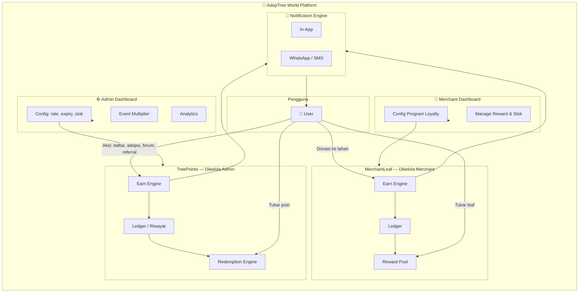
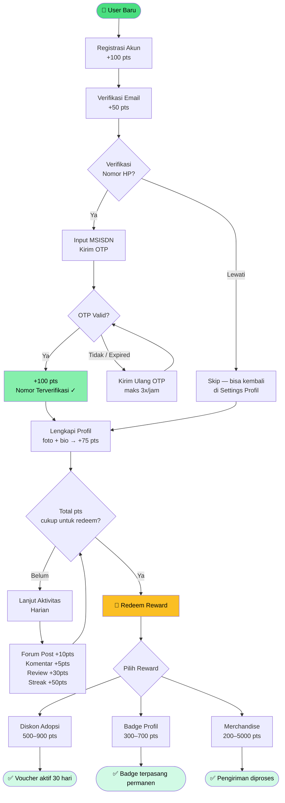
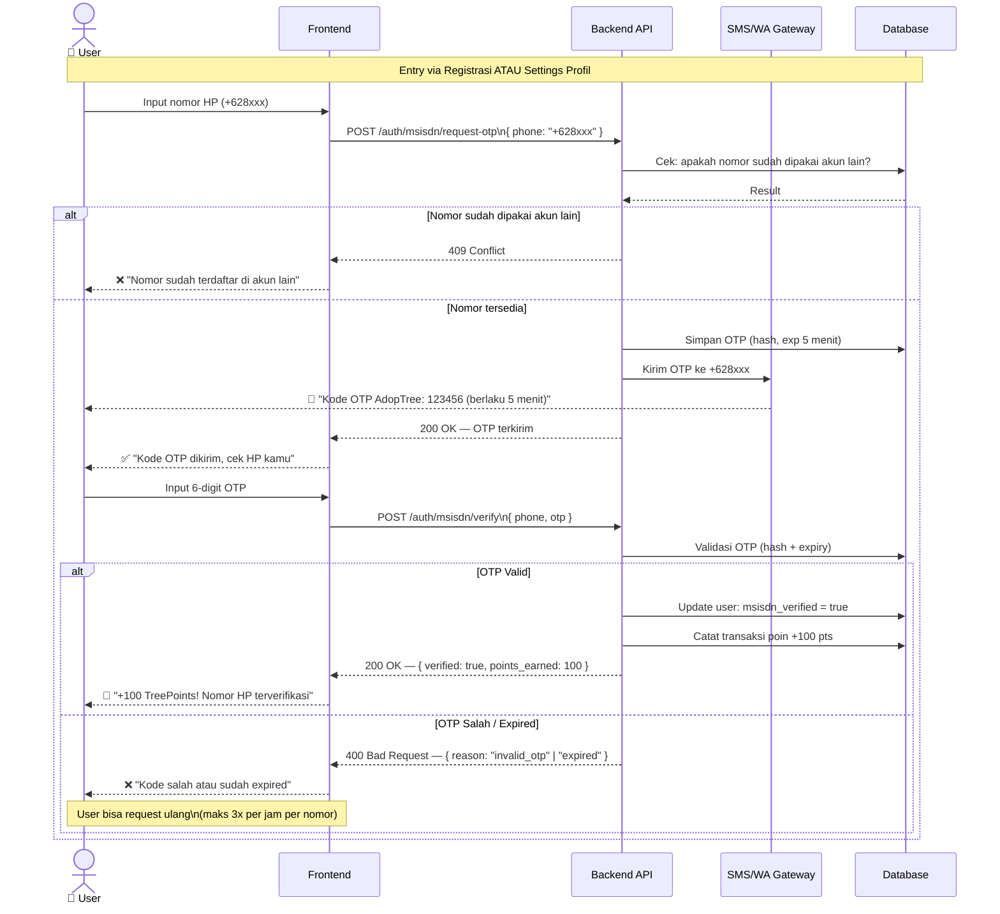
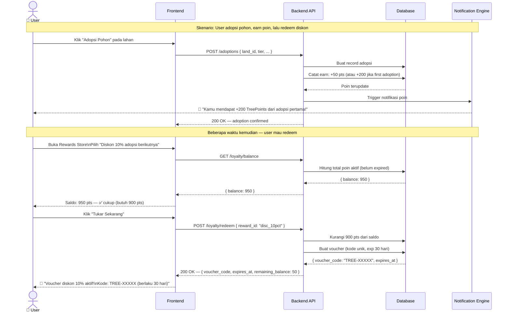
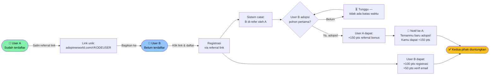
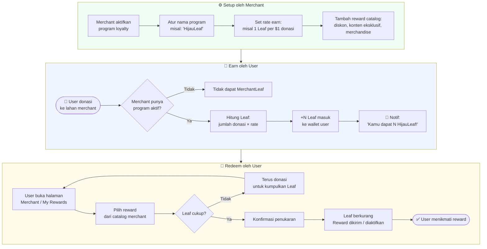

# Konsep Loyalty Points — AdopTree World

> Status: **Draft for Discussion** | Tanggal: 26 Maret 2026
> Belum disetujui — masih tahap konsep internal.

---

## Latar Belakang

AdopTree World saat ini memiliki loop utama yang sederhana: *user browsing → pilih lahan → adopsi pohon → selesai*. Tidak ada mekanisme yang mendorong user untuk kembali, terlibat aktif di komunitas, atau mempromosikan platform ke orang lain.

Loyalty point hadir sebagai **lapisan gamifikasi** yang memberikan nilai nyata bagi setiap interaksi — sehingga platform terasa hidup dan user merasa "dihargai" di luar transaksi murni.

---

## Dua Jenis Loyalty Point

### 1. Platform Points (TreePoints)

*Dikelola oleh Admin. Reward ditanggung platform.*

**Tujuan utama:** Mendorong registrasi, aktivasi akun, dan retensi jangka panjang.

### 2. Merchant Points (MerchantLeaf / nama bebas per merchant)

*Dikelola oleh masing-masing merchant. Reward ditanggung merchant.*

**Tujuan utama:** Mendorong donasi berulang dan loyalitas ke merchant tertentu.

---

## Bagian 1 — Platform Points (TreePoints)

### Mekanisme Pengumpulan

| Aksi                                             | Poin                 | Catatan                                                                      |
| ------------------------------------------------ | -------------------- | ---------------------------------------------------------------------------- |
| Registrasi akun                                  | 100 pts              | One-time                                                                     |
| Verifikasi email                                 | 50 pts               | One-time                                                                     |
| Input & verifikasi nomor HP (MSISDN via OTP SMS) | 100 pts              | One-time — lebih besar dari email karena lebih kuat sebagai identity anchor |
| Lengkapi profil (foto, bio)                      | 75 pts               | One-time                                                                     |
| Adopsi pohon pertama                             | 200 pts              | One-time milestone                                                           |
| Setiap adopsi berikutnya                         | 50 pts per transaksi | Per tier sama                                                                |
| Posting di forum                                 | 10 pts               | Maks 3x/hari                                                                 |
| Komentar di postingan                            | 5 pts                | Maks 5x/hari                                                                 |
| Review adopsi (dengan foto)                      | 30 pts               | Per review                                                                   |
| Ajak teman daftar (referral)                     | 150 pts              | Ketika teman pertama kali adopsi                                             |
| Login streak 7 hari                              | 50 pts bonus         | Reset kalau skip                                                             |
| Berbagi postingan ke luar                        | 5 pts                | Maks 3x/hari (pakai UTM tracking)                                            |

### Mekanisme Penukaran (Redemption)

| Reward                                             | Harga Poin       | Keterangan                               |
| -------------------------------------------------- | ---------------- | ---------------------------------------- |
| Diskon 5% untuk adopsi berikutnya                  | 500 pts          | Berlaku 30 hari                          |
| Diskon 10% untuk adopsi berikutnya                 | 900 pts          | Berlaku 30 hari                          |
| Badge eksklusif di profil                          | 300 pts          | Permanen, kosmetik                       |
| "TreeGuardian" frame avatar                        | 700 pts          | Kosmetik premium                         |
| Donasi poin ke lahan tertentu                      | Bebas            | Platform konversi ke kontribusi simbolis |
| Merchandise digital (wallpaper, sertifikat khusus) | 200–400 pts     | PDF/digital                              |
| Merchandise fisik (stiker, tote bag)               | 2.000–5.000 pts | Ongkir ditanggung platform               |

### MSISDN — Verifikasi Nomor HP

Selain email, user dapat menambahkan dan memverifikasi **nomor HP (MSISDN)** mereka. Ini bersifat opsional tapi di-*incentivize* dengan poin lebih besar dari verifikasi email.

**Entry point verifikasi (dua jalur):**

- **Saat registrasi** — step opsional setelah verifikasi email, dengan prompt "Verifikasi nomor HP dan dapatkan +100 poin!"
- **Di Settings Profil** — user yang sudah terdaftar bisa tambahkan/verifikasi nomor HP kapan saja via menu Settings → Profil → Nomor HP

**Flow verifikasi:**

1. User input nomor HP (di halaman registrasi atau Settings Profil)
2. Klik "Kirim OTP"
3. Platform kirim OTP SMS/WA (6 digit, berlaku 5 menit)
4. User input OTP → nomor terverifikasi → poin diberikan otomatis
5. Nomor tampil di profil dengan badge ✓ "Terverifikasi"

**UI di Settings Profil:**

- Jika belum ada nomor: tampil field input + tombol "Tambah & Verifikasi" dengan banner poin reward
- Jika nomor sudah terverifikasi: tampil nomor (masked sebagian, misal `+62 812 ****-5678`) + badge verified + opsi "Ganti Nomor" (wajib OTP ulang)
- Jika nomor sudah diinput tapi belum OTP: tampil status "Menunggu verifikasi" + tombol "Kirim ulang OTP"

**Mengapa poin MSISDN lebih besar dari email (100 vs 50)?**

- Nomor HP adalah identity yang lebih kuat — susah dibuat massal
- Data MSISDN berguna untuk platform: notifikasi penting, anti-fraud, recovery akun
- Mendorong user memberikan data yang lebih valuable

**Penggunaan MSISDN ke depan (bukan loyalty, tapi sinergi):**

- Login via OTP SMS sebagai alternatif password
- Notifikasi transaksi adopsi via WhatsApp/SMS
- Recovery akun tanpa email
- Anti-abuse: satu nomor HP = satu akun (batasi multi-account farming poin)

**Catatan teknis:**

- Gunakan provider SMS gateway lokal (Twilio, Zenziva, Vonage, atau Wablas untuk WA OTP)
- Simpan nomor dalam format E.164 (`+628xxx`)
- Rate-limit OTP request: maks 3x request per nomor per jam

### Pengaturan Admin

Admin dapat mengatur via dashboard:

- Aktif/nonaktif tiap sumber poin (termasuk MSISDN verification)
- Multiplier event: misalnya "2x poin weekend ini"
- Expiry policy: poin hangus setelah N bulan inaktif
- Rate konversi poin → diskon (rupiah per poin)
- Stok reward fisik
- Provider SMS gateway yang digunakan

---

## Bagian 2 — Merchant Points (MerchantLeaf)

### Konsep Dasar

Setiap merchant yang aktif dapat **mengaktifkan program loyalty mereka sendiri** dengan aturan yang mereka tentukan sendiri (dalam batas yang diatur platform).

Poin merchant bersifat **merchant-scoped** — tidak bisa ditukar antar merchant.

### Mekanisme Pengumpulan (diatur merchant)

| Aksi                                   | Contoh Poin      | Catatan                   |
| -------------------------------------- | ---------------- | ------------------------- |
| Donasi ke lahan merchant               | 1 poin per $1    | Merchant atur rate-nya    |
| Donasi tier tertentu (wakaf, adopTree) | Bonus multiplier | Contoh: wakaf = 1.5x poin |
| Komentar/review di lahan merchant      | Flat bonus       | Merchant atur             |
| Milestone donasi (misal ke-5 kali)     | Bonus besar      | Merchant atur             |

### Mekanisme Penukaran (reward ditanggung merchant)

| Contoh Reward                                              | Keterangan                   |
| ---------------------------------------------------------- | ---------------------------- |
| Diskon khusus untuk adopsi berikutnya di lahan mereka      | Paling umum                  |
| Akses konten eksklusif (laporan pertumbuhan pohon premium) | Digital                      |
| Nama di papan donatur khusus di halaman lahan              | Cosmetic                     |
| Prioritas notifikasi update lahan                          | Feature unlock               |
| Merchandise dari merchant (benih, madu, dll.)              | Fisik — ditanggung merchant |

### Pengaturan Merchant

Merchant atur via dashboard merchant mereka:

- Nama program loyalty mereka
- Rate earn: berapa poin per $1 donasi
- Daftar reward dan harga poin-nya
- Batas stok reward
- Expiry poin

---

## Diagram Alur & Sequence

### 1. Arsitektur Sistem — Gambaran Besar

---

### 2. User Journey — TreePoints dari Nol hingga Redeem

---

### 3. Sequence — Verifikasi MSISDN (OTP Flow)

---

### 4. Sequence — Earn & Redeem TreePoints (Adopsi + Voucher)

---

### 5. Flow — Referral System

---

### 6. Flow — Merchant Loyalty (MerchantLeaf)

---

## Leaderboard (Opsional)

- **Top Adopter Bulan Ini** — berdasarkan total TreePoints earned bulan ini
- **Top Donor per Lahan** — per merchant/lahan
- Ditampilkan di halaman Explore dan halaman lahan
- Bisa jadi motivasi sosial yang kuat

---

## Analisis: Pros & Cons

### Platform Points (TreePoints)

| ✅ Pros                                           | ❌ Cons                                                              |
| ------------------------------------------------- | -------------------------------------------------------------------- |
| Mendorong registrasi aktif (bukan ghost account)  | Biaya reward fisik bisa signifikan kalau tidak dibatasi stok         |
| Retensi: user punya alasan untuk kembali          | Risiko "point farming" — aksi spam demi poin                        |
| Virality via referral — pertumbuhan organik      | Kompleksitas teknis: butuh poin ledger, expiry, anti-abuse           |
| Forum jadi lebih ramai dan hidup                  | Admin perlu effort lebih untuk manage reward & stok                  |
| Diferensiasi dari platform donasi lain            | Jika reward tidak menarik, sistem jadi ghost feature                 |
| Data insight: tahu aksi mana yang paling engaging | Perlu edukasi user — banyak yang tidak paham poin saat pertama kali |

### Merchant Points (MerchantLeaf)

| ✅ Pros                                                | ❌ Cons                                                        |
| ------------------------------------------------------ | -------------------------------------------------------------- |
| Merchant bisa bangun komunitas loyal sendiri           | Merchant harus proaktif — tidak semua mau repot setup         |
| Mendorong repeat donation ke merchant yang sama        | Poin per-merchant bisa bikin user bingung (banyak sistem)      |
| Reward ditanggung merchant → zero cost untuk platform | Kualitas program bervariasi antar merchant                     |
| Bisa jadi USP saat merchant pitching ke donatur        | Merchant kecil mungkin tidak punya resource untuk reward fisik |
| Meningkatkan GMV per merchant secara natural           | Butuh UX yang sangat jelas agar tidak overwhelming             |

---

## Risiko & Mitigasi

| Risiko                                                   | Mitigasi                                                                 |
| -------------------------------------------------------- | ------------------------------------------------------------------------ |
| Spam aksi demi poin (posting/komentar tidak berkualitas) | Rate limit ketat per hari + review manual jika laporan                   |
| Poin tidak pernah ditukar → dead feature                | Notifikasi berkala "Poin kamu hampir expired"                            |
| Biaya reward fisik meledak                               | Stok terbatas, first-come-first-served, ongkir minimum                   |
| Merchant tidak aktifkan program                          | Fitur opsional, tidak wajib — merchant lihat manfaatnya sendiri         |
| User banding poin antar merchant                         | Komunikasi jelas: "Poin ini khusus untuk [nama merchant]"                |
| Multi-account farming poin via nomor HP palsu            | Validasi format E.164 + MSISDN 1:1 dengan akun (unique constraint di DB) |
| Biaya SMS OTP membengkak jika abuse                      | Rate limit ketat + cooldown per nomor, monitor usage di dashboard admin  |

---

## Pertanyaan Terbuka untuk Didiskusikan

1. **Nama branding** — "TreePoints" oke? Atau ada nama yang lebih on-brand dengan AdopTree?
2. **Apakah leaderboard wajib di V1?** Atau bisa menyusul?
3. **Reward fisik di V1?** Bisa mulai dari digital-only dulu untuk simplifikasi.
4. **Apakah poin platform dan merchant bisa pernah digabung?** Atau tetap terpisah selamanya?
5. **Integrasi notifikasi** — push notification atau cukup in-app notification?
6. **Budget platform untuk reward** — perlu ada anggaran bulanan yang disetujui tim.
7. **SMS Gateway provider** — Twilio (global, mahal) vs Zenziva/Wablas (lokal, murah)? Atau WA OTP via Wablas lebih familiar buat user Indonesia?
8. **MSISDN wajib atau opsional selamanya?** — Opsional tapi di-incentivize mungkin cukup untuk Phase 1.

---

## Usulan Phasing Implementasi (jika disetujui)

### Phase 1 — Foundation (MVP)

- Platform points: earn dari registrasi, adopsi, referral
- Redemption: hanya diskon digital
- Dashboard sederhana di profil user

### Phase 2 — Enrichment

- Earn dari forum, review, streak
- Badge & cosmetic reward
- Leaderboard

### Phase 3 — Merchant Loyalty

- Merchant dapat aktifkan program mereka
- Dashboard merchant untuk manage poin
- Notifikasi poin

### Phase 4 — Advanced

- Reward fisik
- Event multiplier
- Analytics mendalam untuk admin & merchant

---

## Kesimpulan

Loyalty point adalah **investasi dalam retensi dan virality**, bukan sekadar gimmick. Kalau dieksekusi dengan baik — reward yang relevan, sistem yang tidak terlalu rumit, dan komunikasi yang jelas — ini bisa menjadi pembeda signifikan AdopTree World dari platform donasi konvensional.

**Rekomendasi:** Mulai dari Phase 1 yang ringan, validasi apakah user engage dengan poin, baru scale ke merchant loyalty.
