# AdopTree World — Product Requirements Document
### Investor Edition · v2.6 · July 2026

> **Status** — Staging platform live · Android Field App live (Build 30) · Public Launch target H2 2026
> **Prepared by** — Sandhy Krisnamurthi (CEO) · Aditira Jamhuri (CTO) · Subekti Febriansyah (C.Media & Design)
>
> **v2.6 highlights** — **Trust Protocol shipped in code, not just claimed.** The two biggest additions turn AdopTree's anti-fraud thesis (§0 problems #3/#4/#7) into working product: (1) **Milestone Escrow Fund Disbursement** — donor money is no longer settled straight to the merchant; it is held in escrow and released in verified stages (default 40/30/30: *planted → verified alive → thriving*), each stage double-gated (field evidence → admin approval), recorded on an append-only financial ledger, and surfaced to all three personas — the donor sees a "Perjalanan Danamu" journey stepper, the merchant sees a cash-pipeline funnel with actionable to-dos, the admin runs a dedicated **Keuangan** console (approval queue with evidence deeplinks, batch payouts with bank-transfer references, configurable percentages). (2) **KTP-verified Land Manager (Pengelola Lahan)** — every new land must register its accountable field PIC with national-ID evidence. Also shipped: **Tira-First Support 24/7** (AI answers with live data first; unresolved cases become structured tickets with AI triage summaries + transcript, feeding an admin inbox that spawns direct user↔admin chat), **Two-Factor Authentication** (TOTP + single-use backup codes, AES-256-GCM-encrypted secrets, admin recovery), a **full-coverage notification system** (every review-queue submission, sale, milestone, and verification outcome now reaches the right inbox — web + mobile), and **live contributor GPS tracking made real** (Field App Build 30 fixes the ping pipeline; movement now renders live on the flat activity map with history replay). See new §6.8 Milestone Escrow & §6.9 Support + Platform Hardening.
>
> **v2.5 highlights** — **Tira AI Co-Pilot** release: the assistant graduated from a donor Q&A chatbot into a multi-surface, multi-audience operator. Merchants now *create lands, campaigns, and their own merchant registration by chatting* — Tira fills the form live (client-side tool-calling → `react-hook-form`), normalizes uploaded geo files (KML/KMZ/GPX/GeoJSON boundaries + CSV/GeoJSON tree points) into the AdopTree geo standard via an AI `normalize-geo` endpoint, proposes species data, and stays bilingual to the platform locale (id/en/ar). A reusable **co-pilot security layer** (fail-closed budget, per-identity caps, strict-identity reload, anti-spoof IP) gates every write-capable AI surface. Plus: **AI Tree Baseline + satellite/imagery tree-count estimation**; a public **Tools Hub** (`/tools`) with the **Carbon Calculator**, **3D Tree Tracker** (cinematic globe→ground), and **Land Analyzer**; **instant-donation smart defaults** (1-tap presets, recommendation algorithm, "Tira pilihkan untukku"); **land profile pictures**, **gallery photo-source labeling**, and **approved field-inspection photos publishable to the public land gallery**; **Instagram→Forum auto cross-post**; and a dedicated **land-owner CTA section** on the landing page. See updated §6.2 Feature Matrix, §6.6 Tira AI Co-Pilot, §6.7 Public Tools Hub, §10.3 Differentiators.
>
> **v2.4 highlights** — Founder revision pass from CKsan (Pak Cookie). New §0 **Background & Problems** establishing the 7 root-cause gaps AdopTree exists to solve. §1 Executive Summary expanded with the **"trusted multiverse Green field ecosystem"** framing, expanded Mission statement (devotion + counterbalance + amplifying global Green Eco movement), broader stakeholder map (caretakers · investors · legal authority · supplementary merchants), and 8 explicit use-case categories (Crowdfunding · Carbon Recycling Center · Land Aggregator · Carbon Investment · Marketplace [Next Phase] · CSR Delivery · Green Eco Social Media · Web3 NFT Solana [Next Phase]). CKsan founder bio enriched with his personal Motto.
>
> **v2.3 highlights** — Blockchain & NFT claims honesty pass: every Solana/NFT mention re-scoped to match shipped reality. New §10.5 Blockchain Status Disclosure section. Advisors enriched with verified profiles (Akhmad Junaidi — BRIN · Udhoro Kasih Anggoro — IPB / Indonesia-Japan Business Network).
>
> **v2.2 highlights** — Full visual refresh with inline web, mobile, and market visuals across every section · Solution and financial diagrams upgraded to professional charts · Founder bios expanded.
>
> **v2.1 highlights** — Mobile Field App and Contributor Tier System sections added · Pre-revenue status clarified throughout (no paying merchants yet — this raise is designed to change that).

---

## Table of Contents

0. [Background & Problems](#0-background--problems) *(new in v2.4)*
1. [Executive Summary](#1-executive-summary)
2. [Team](#2-team)
3. [Problem Statement](#3-problem-statement)
4. [Solution](#4-solution)
5. [Market Opportunity](#5-market-opportunity)
6. [Product Overview](#6-product-overview)
   - 6.1 Platform Architecture · 6.2 Feature Matrix · 6.3 Service Class Structure
   - 6.4 Mobile Field App *(new in v2.1)* · 6.5 Contributor Tier System *(new in v2.1)* · 6.6 Tira AI Co-Pilot *(new in v2.5)* · 6.7 Public Tools Hub *(new in v2.5)*
   - 6.8 Milestone Escrow — Trust-Engineered Fund Disbursement *(new in v2.6)* · 6.9 Tira-First Support & Platform Hardening *(new in v2.6)*
7. [Business Model & Revenue Streams](#7-business-model--revenue-streams)
8. [User Personas](#8-user-personas)
9. [User Flows](#9-user-flows)
10. [Technology Architecture](#10-technology-architecture)
    - 10.1 Stack · 10.2 Why Rust · 10.3 Differentiators · 10.4 Mobile Architecture *(new in v2.1)* · 10.5 Blockchain Status Disclosure *(new in v2.3)*
11. [Competitive Landscape](#11-competitive-landscape)
12. [Go-to-Market Strategy](#12-go-to-market-strategy)
13. [Roadmap & Milestones](#13-roadmap--milestones)
14. [Financial Projections](#14-financial-projections)
15. [Risks & Mitigations](#15-risks--mitigations)
16. [Investment Ask](#16-investment-ask)
- Appendix: A. Tech Stack · B. Visualization Assets · C. Glossary · D. Delivered Phases

---

## 0. Background & Problems

AdopTree World exists to address a set of **structural failures** in the global Green Eco landscape — gaps that conventional reforestation, CSR, and impact-funding programs have been unable to close on their own.

| # | Root-cause Problem | Why It Matters |
|---|---|---|
| 1 | **Rapid environmental damage and deforestation** with unbalanced revitalization and restoration | The destruction rate exceeds the response rate; isolated programs do not aggregate into measurable impact |
| 2 | **Air quality degradation, pollution, natural disasters, and climate change** lead to discomfort, unhealthy, and unsafe life situations | Every stakeholder — citizen, corporate, government — already bears the cost; the question is who organizes the response |
| 3 | **Fraud in delivery / implementation** of restoration funds | Without verifiable evidence, "we planted X trees" claims cannot be audited — eroding donor trust and creating space for misappropriation |
| 4 | **Weak supervision** in restoration-fund distribution and implementation | Funders lack tooling to verify each stage; oversight is typically post-hoc, paper-based, and easy to game |
| 5 | **Lack of land-preservation tools and media surveillance** | Land-stewarding NGOs and cooperatives manage forest plots with spreadsheets and WhatsApp; surveillance is expensive and ad-hoc |
| 6 | **Lack of a media aggregator** for the Green Eco movement and coordination | Donors, merchants, regulators, and field contributors operate in silos; no shared data layer means duplicated effort and no compounding network effect |
| 7 | **Low trust in funds delivery and implementation** | The cumulative effect of the above gaps — donors disengage, corporate CSR programs default to photo-ops, and capital that wants to flow into environmental restoration does not |

AdopTree World is the **integrated response to all seven** — a single trusted platform that aggregates land, funders, verification tooling, and a Green Eco community in one transparent ecosystem.

---

## 1. Executive Summary

**AdopTree World** is a trusted multiverse **"Green field" ecosystem platform** (crowdfunding, marketplace, social community forum) where all the "Green Eco" stakeholders gather to support the earth's revitalization across re-forestation, agriculture, soil revitalization, land preservation, and conservation.

### Mission

As a form of **devotion and worship** to God, fellow human beings, the earth, and the universe — to create a better, healthier, and more comfortable life (**Universal Mission**). As a **counterbalance** to environmental damage and deforestation. As an **air-quality restoration and revitalization center**. **Amplifying the world's Green Eco movement**.

### Vision

To be the world's most trusted **carbon recycling center** — a multiverse platform where donors meet eco-caretakers through Social Media, Marketplace, and Green Forum in a legally-compliant, fully transparent ecosystem. To be the world's **"Green Lung" center**. To be the most reliable and leading **"Green Eco" platform** in the world.

### AdopTree World Stakeholders

| Stakeholder | Who | Role on the Platform |
|---|---|---|
| **Land Owners / Caretakers** | Individuals, corporates, NGOs, governments | Register and steward verified reforestation land plots |
| **"Green Eco" Investors / Donors** | Individuals, corporates, NGOs, governments | Adopt trees, fund campaigns, sponsor CSR packages, allocate ESG budget |
| **Legal Certification Authority** | Notary, MUI (Shariah), VCS / Gold Standard, KLHK, BWI | Issue certificates, validate Wakaf compliance, attest carbon credits |
| **Supplementary Merchants** | Fertilizer suppliers, equipment / tooling vendors, agritech partners | Operate the marketplace layer that supports land stewardship at scale |

All stakeholders are **trusted and verified** — making tree adoption transparent, trackable, and financially meaningful.

### Features & Use Cases

1. **Main use case** — A trusted re-forestation / agriculture / preservation / conservation **crowdfunding platform** where all stakeholders & every community element can participate to **monitor, contribute, and verify** the implementation of the fund.
2. **Carbon recycling center** — Aggregated CO₂ sequestration accounting, per-tree and per-hectare, ready for carbon-credit certification.
3. **Land aggregator** — Multiple plots, multiple merchants, one unified discovery and ownership layer.
4. **Carbon investment ecosystem** — Long-horizon environmental capital allocation with verifiable impact metrics for institutional-grade ESG reporting.
5. **Re-forestation / agriculture / preservation / conservation marketplace** *(Next Phase)* — A trading layer connecting merchants and buyers around supplementary goods (fertilizer, tools, seedlings, carbon credits).
6. **Trusted "Green Eco" CSR delivery platform** with periodic surveillance and reporting system.
7. **"Green Eco" social media & community platform** — Green Forum where stakeholders coordinate, share, and amplify the movement.
8. **"The Green Assets" implementation tracker** — Together, the **GIS layer** (tree-level GPS polygons, satellite-aligned land plots) and the **mobile field application** (Field App with watermarked anti-tamper camera and dual-gate inspection) form a powerful end-to-end system for tracking the real-world implementation of every adopted "Green Asset" — from initial registration through periodic surveillance.
9. **Web3 NFT Solana-based ecosystem** *(Next Phase)* — Transferable on-chain certificates for the AdopTree tier (see §10.5 Blockchain Status for shipped vs. roadmap detail).

### Why it's defensible today

Unlike conventional CSR programs where environmental impact is opaque and unverifiable, AdopTree delivers **GPS-pinned tree ownership**, **real-time GIS satellite tracking**, **field-evidence anti-tamper inspection (mobile app with watermarked camera)**, and **per-tree carbon credit allocation** — all in one integrated platform, built and live on staging today. On the supply side, the **Tira AI Co-Pilot** lets a merchant onboard a land *by chatting* — filling the form, importing geo files (KML/GPX/CSV → AdopTree standard), and proposing species — which directly attacks the biggest growth bottleneck (supply onboarding friction). **Blockchain infrastructure (Solana SIWS wallet authentication + NFT metadata schema)** is in place; on-chain NFT minting for the AdopTree tier is the next major engineering milestone (see §10.5 Blockchain Status).

### The opportunity is significant

- Indonesia's forests cover 91 million hectares — one of the largest carbon sinks on Earth — yet deforestation continues at ~600,000 ha/year
- Global voluntary carbon market is projected to reach **$50 billion by 2030**
- Indonesian corporate CSR spending exceeds **$1 billion/year**, with ~20% directed to environmental programs

### Current traction

- Web platform fully operational at `staging.adoptreeworld.com`
- **Android Field App live** — APK Build 30 distributed via R2 (`/download`), with GPS-tagged inspection, offline-first sync, watermarked anti-tamper camera, crowdsourced contributor tier system, live GPS session tracking, and 2FA-aware login
- **Milestone Escrow live (v2.6)** — donor funds held in escrow and released to merchants only per field-verified + admin-approved milestone (40/30/30), on an append-only financial ledger — the anti-fraud thesis (§0 #3/#4/#7) is now enforced by the payment rail itself, not by policy documents
- **Merchant base today:** 0 paying merchants. Staging is populated with a demonstration merchant (**"Akademi Buah Nusantara"**) that exercises every end-to-end flow — land registration → tree management → campaign → adoption checkout → earnings → withdrawal — so the platform is proven against a realistic merchant profile. Onboarding real merchant partners is one of the explicit objectives of this raise (see §16.2 — 35% of funds allocated to Sales & BD).
- **Payment infrastructure**: Midtrans live for production (bank transfer, QRIS, e-wallet, credit card). Solana (SOL) payment UI built — backend wire-up scheduled Q3 2026 alongside on-chain NFT minting
- 30+ product phases delivered between v2.0 and v2.6 (Apr → Jul 2026): review queue, public contributor system, QR tree verification, multi-stage inspection evidence, realtime chat, dark mode dashboards, refreshed brand identity, **AI tree-count estimation**, the **Tira AI Co-Pilot** (create-land/campaign/registration by chat + AI geo-import + bilingual), **Milestone Escrow disbursement**, **Tira-First Support**, **2FA**, and **KTP-verified land managers**
- **3-year commercial target: 100,000 Ha land under management → 500 million trees reserved**

**AdopTree is positioned at the intersection of greentech, ESG infrastructure, Web3, and Islamic finance** — serving every segment from an individual $1/tree annual fee to multi-year corporate CSR packages.

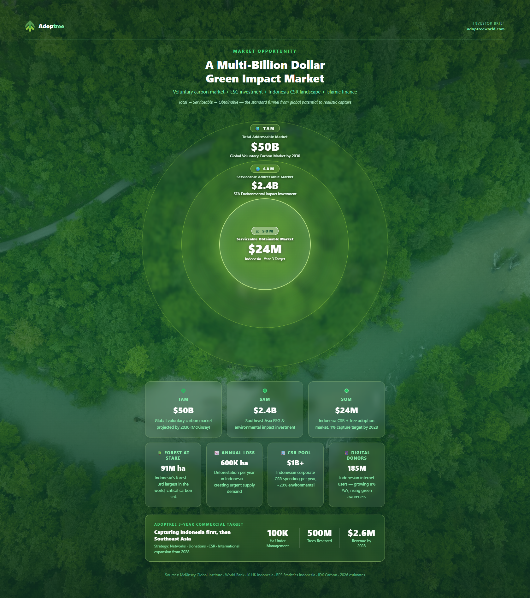
*Figure 1 — Multi-billion dollar green impact market. TAM ($50B global voluntary carbon market) → SAM ($2.4B SEA environmental impact investment) → SOM ($24M Indonesia Year 3 target, 1% capture).*

---

## 2. Team

### 2.1 Founding Team

#### 🌳 Sandhy Krisnamurthi — Chief Executive Officer ("CKsan")

**Role:** Founder, system designer, business strategy, investor relations, strategic partnerships (corporate CSR, government / MUI, land owners).

**Background:** Telecommunications Design & Engineering background — formerly with **Ericsson** and **TeleChoice International**. Engineering-trained operator who pivoted to building a verifiable-impact greentech platform after seeing firsthand the lack of accountability in traditional reforestation programs.

**Motto:** *Every step is devotion to God and must have positive impact for The people and The Universe.. and fortune shall follow..*

**Why he founded AdopTree:** The 91M ha of Indonesian forest is too important to leave to "trust me, we planted them" PDF reports. CKsan's engineering rigor shaped AdopTree's core thesis: *every tree must be measurable, verifiable, and tradeable*.

**Connect:** [linkedin.com/in/sandhy-krisnamurthi-083a6336](https://www.linkedin.com/in/sandhy-krisnamurthi-083a6336/)

---

#### 💻 Aditira Jamhuri — Chief Technology Officer

**Role:** Co-founder, platform architect, full-stack engineering lead, infrastructure & CI/CD ownership, product delivery, technical hiring.

**Background:** Senior software engineer with deep full-stack expertise. Master Instructor at **Ruangguru CAMP** — Indonesia's largest edtech company — where he engineered automation tooling that graded assignments for hundreds of students per cohort. Earlier, 3+ years at **BrainCode** (Indonesia's specialist in mobile services) mentoring mid-level engineers and modernizing legacy systems at production scale.

**Motto:** *Build systems, not features. Plant forests, not trees. Think in decades, deploy daily.*

**What he has shipped at AdopTree:** Architected and built the production stack end-to-end — Rust/Axum backend, Next.js/TypeScript web platform, Flutter Android Field App with offline-first sync and GPS-watermarked anti-tamper camera, plus a complete CI/CD pipeline (Jenkins → Docker → VPS). Concrete execution evidence:
- **17 product phases delivered** between v2.0 → v2.1 (Apr → May 2026)
- **9 production APK builds** shipped across the Field App in **5 weeks** (Build 6 → Build 14)
- Platform live on staging 24/7 at `staging.adoptreeworld.com` — not a prototype, not a slide
- Designed Solana SIWS wallet authentication + NFT metadata schema; minting pipeline scoped for Q3 2026 (see §10.5)

**Why this matters for investors:** AdopTree is **CTO-led from day one**, not founder-promised. The "Will they actually build it?" risk — the single most common reason pre-seed greentech investments stall — is already retired. Aditira built the platform lean and solo to prove the architecture; with seed capital his immediate next move is scaling a small, senior team around the proven foundation rather than rewriting it.

**Connect:** [linkedin.com/in/aditira-jamhuri-82698311b](https://www.linkedin.com/in/aditira-jamhuri-82698311b/)

---

#### 🎨 Subekti Febriansyah — Chief Media & Design ("BEKs")

**Role:** Brand identity, UI/UX design system, content strategy, visual storytelling, marketing collateral.

**Background:** Senior Graphic Designer at **PT Kios Cipta Kreasi**. Prior roles at **PT Waskita Karya Realty**, **OB Golf & Lifestyle Magazine**, **TOTEM.Inc**, and **Dapur Otak** design agency. Educated at **Indonesian Polytechnic of Creative Media** (Polimedia). Core skills: logo design, branding & identity systems, UI/UX, promotions, illustration.

**What he ships at AdopTree:** The complete AdopTree brand system — logomark, logo lockup (light + mono variants), official color palette (Forest #006838 · Lime #8bc53f · Mid #3b9f47), Manrope typography hierarchy, brand guidelines document, web hero compositions, in-app illustrations, social media templates. Brand v2.1 rebrand (May 2026) integrated across mobile launcher icon, splash screen, in-app surfaces, and web platform.

**Why this matters:** Trust in greentech is visual-first. Investors evaluating "is this a serious company or a side project?" make that judgment in the first 5 seconds — from the landing page hero, the app icon on the launcher, the certificate template, the merchant dashboard polish. BEKs makes that 5-second judgment land in our favor.

**Connect:** [linkedin.com/in/subekti-febriansyah-32012b76](https://www.linkedin.com/in/subekti-febriansyah-32012b76/)

---

### 2.2 Dewan Pembina / Advisors

#### 🏛️ Akhmad Junaidi, S.E., M.E. — Pembina / Government Domain

**Role:** Strategic advisor for government relations, policy navigation, and access to Indonesia's research and cooperative ecosystems.

**Affiliation:** Researcher at **Badan Riset dan Inovasi Nasional (BRIN)** — specifically the **Pusat Riset Koperasi, Korporasi, dan Ekonomi Kerakyatan (PRKKEK)** under the Research Organization for Governance, Government, Economy, and Public Welfare (ORTKPEKM).

**Research focus:** Cooperative Management · Micro Finance · Digitalization of Accounting for Cooperatives and SMEs · MSME Resilience. Notable publication: *"Ketahanan UMKM di Indonesia menghadapi Resesi Ekonomi"* (Jurnal Ekonomi dan Pembangunan BRIN, co-authored with Eugenia Mardanugraha).

**Education:** Master of Economics (M.E.) / MBA.

**Why this matters for AdopTree:** PRKKEK's research mandate covers **koperasi, BUMN, BUMD, BUMDes, and rural MSMEs** — precisely the institutional layer AdopTree partners with on the supply side (NGOs, land-managing organizations, village cooperatives). Pak Akhmad's BRIN affiliation gives AdopTree:
- Direct credibility in government and academic stakeholder conversations
- Access to cooperative and rural enterprise networks for Land Owner partnerships
- Policy guidance on emerging carbon, ESG, and sustainability regulations
- Research collaboration potential for evidence-based impact reporting

**Connect:** [linkedin.com/in/akhmad-junaidi-37855a341](https://www.linkedin.com/in/akhmad-junaidi-37855a341) · [BRIN profile page](https://brin.go.id/ortkpekm/pusat-riset-koperasi-korporasi-dan-ekonomi-kerakyatan/page/profil-akhmad-junaidi-seme)

---

#### 🌾 Ir. Udhoro Kasih Anggoro, M.S. — Advisor / Agriculture & Strategic Networks

**Role:** Strategic advisor for institutional partnerships, agricultural value chains, and international (Japan) corporate networks.

**Current affiliation:** Executive Advisor at **Indonesia-Japan Business Network**.

**Background:** Career civil servant and agricultural policy executive. Former **Direktur Jenderal Tanaman Pangan** at the **Kementerian Pertanian Republik Indonesia** (Director General of Food Crops, Ministry of Agriculture). Held the rank of Pembina Utama (IV/e). Earlier role at **PT Pupuk Kujang** and participation in the restructuring team for Indonesia's state-owned fertilizer companies (PT Pusri, PT PIM, PT Pupuk Kujang, PT Pupuk Kaltim, PT Petrokimia Gresik) — a joint program with **PricewaterhouseCoopers (PwC)** and financing from the **Asian Development Bank**.

**Education:** **Institut Pertanian Bogor (IPB)** — Indonesia's leading agricultural university.

**Why this matters for AdopTree:** Pak Udhoro's three decades in agricultural policy and BUMN restructuring give AdopTree:
- Deep familiarity with Indonesia's agricultural land governance — directly applicable to Land Owner partnerships and reforestation site selection
- BUMN restructuring experience translates to credibility when AdopTree engages corporate CSR programs at scale (the same BUMN ecosystem he reformed are now CSR-budget sources)
- Indonesia-Japan corridor access for future international expansion (Japan is a leading buyer of voluntary carbon credits and ESG-verified impact projects)
- IPB network — Indonesia's top agricultural research talent pipeline

**Connect:** [linkedin.com/in/udhoro-kasih-anggoro-6b392067](https://www.linkedin.com/in/udhoro-kasih-anggoro-6b392067/)

---

### 2.3 Why This Team

- **CTO-led, not founder-promised**: Aditira built the entire platform — backend, web, mobile, infrastructure — *before* raising capital. Staging is live, APK ships weekly. The single biggest pre-seed greentech risk ("can they build?") is already resolved.
- **Triangulated coverage from day one**: Business & partnerships (CKsan, CEO) · Technology & product (Aditira, CTO) · Brand & visual identity (BEKs, CMD) — every critical function has a dedicated owner, no role gaps.
- **Operator backgrounds**: CKsan brings telecom-engineering rigor (Ericsson, TeleChoice); Aditira brings edtech-scale shipping discipline (Ruangguru, BrainCode); BEKs brings 10+ years of brand systems for established Indonesian companies (Waskita Karya, OB Magazine, PT Kios).
- **Advised by senior practitioners**: Pak Akhmad Junaidi (BRIN — Government & cooperative research) and Pak Udhoro Kasih Anggoro (former Dirjen Tanaman Pangan · Indonesia-Japan Business Network) bring the institutional, policy, and partnership networks a tech-first founding team most needs to scale beyond initial product-market fit.

---

## 3. Problem Statement

### 3.1 The Donor Problem

| Pain Point | Reality Today |
|---|---|
| **No proof of impact** | Most tree-planting programs send a PDF and nothing else |
| **No transparency** | Donors can't verify if their tree was actually planted |
| **No connection** | No ongoing relationship between donor and "their" tree |
| **No financial utility** | Donation is a sunk cost with no future value |

### 3.2 The Merchant / NGO Problem

| Pain Point | Reality Today |
|---|---|
| **No distribution channel** | NGOs rely on one-off events and manual outreach |
| **No recurring revenue** | Donations are sporadic, not structured |
| **No tech infrastructure** | Managing tree data, donors, and reports manually |
| **No credibility signal** | Hard to prove impact to corporate partners |

### 3.3 The Corporate CSR Problem

| Pain Point | Reality Today |
|---|---|
| **Hard to quantify** | "We planted 5,000 trees" — but where? Which trees? |
| **No ESG-grade data** | Can't tie tree programs to standardized carbon metrics |
| **Greenwashing risk** | No verifiable audit trail for sustainability reports |
| **No scalable process** | Each CSR program is a one-off project |

---

## 4. Solution

AdopTree World solves all three sides of this problem through a **multi-sided marketplace with verifiable impact infrastructure.**

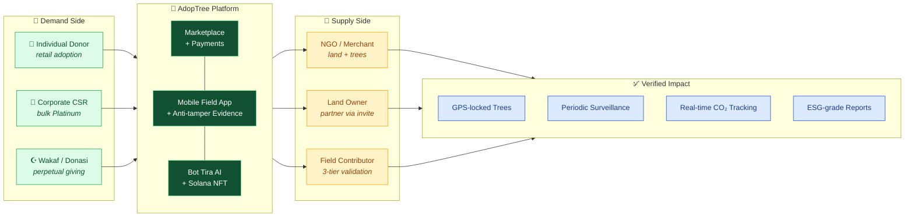
```mermaid
flowchart LR
    subgraph Demand["💚 Demand Side"]
        D1[🙋 Individual Donor<br/><i>retail adoption</i>]
        D2[🏢 Corporate CSR<br/><i>bulk Platinum</i>]
        D3[☪️ Wakaf / Donasi<br/><i>perpetual giving</i>]
    end

    subgraph Platform["🌳 AdopTree Platform"]
        direction TB
        P1[Marketplace<br/>+ Payments]
        P2[Mobile Field App<br/>+ Anti-tamper Evidence]
        P3[Bot Tira AI<br/>+ Solana NFT]
        P1 --- P2 --- P3
    end

    subgraph Supply["🌱 Supply Side"]
        M1[NGO / Merchant<br/><i>land + trees</i>]
        L1[Land Owner<br/><i>partner via invite</i>]
        C1[Field Contributor<br/><i>3-tier validation</i>]
    end

    subgraph Impact["✅ Verified Impact"]
        I1[GPS-locked Trees]
        I2[Periodic Surveillance]
        I3[Real-time CO₂ Tracking]
        I4[ESG-grade Reports]
    end

    D1 --> Platform
    D2 --> Platform
    D3 --> Platform
    Platform --> M1
    Platform --> L1
    Platform --> C1
    M1 --> Impact
    L1 --> Impact
    C1 --> Impact

    classDef demand fill:#dcfce7,stroke:#16a34a,color:#115031
    classDef platform fill:#115031,stroke:#86efac,color:#fff
    classDef supply fill:#fef3c7,stroke:#f59e0b,color:#92400e
    classDef impact fill:#dbeafe,stroke:#1d4ed8,color:#1e3a8a
    class D1,D2,D3 demand
    class P1,P2,P3 platform
    class M1,L1,C1 supply
    class I1,I2,I3,I4 impact
```

### Core Value Propositions

**For Donors (B2C):**
- 🌱 Adopt a specific tree with GPS coordinates — *it's yours*
- 📍 Track it live on an interactive GIS map
- 📜 Receive a legally-meaningful digital certificate (PDF + QR verification)
- 📊 Receive carbon credit allocation for Green Society & AdopTree tiers
- 🔮 **AdopTree tier roadmap:** transferable Solana NFT certificate scheduled Q3 2026 — wallet authentication (SIWS) and NFT metadata schema already live; on-chain minting is the Q3 2026 milestone

**For Merchants / NGOs (Supply Side):**
- 🏗️ Full land & tree management dashboard
- 🤖 **Tira AI Co-Pilot** — onboard a land *by chatting*: Tira fills the form, imports geo files (KML/GPX/CSV→AdopTree standard), and proposes species — collapsing the hardest part of supply onboarding (see §6.6)
- 🛰️ **AI asset quantification** — estimate tree count from satellite/imagery before transacting
- 📢 Campaign fundraising tools with custom pricing
- 💰 Recurring revenue from tree adoptions (not one-off donations)
- 📈 Analytics and earnings reporting

**For Corporates (B2B):**
- 📦 Bulk tree adoption packages
- 📊 ESG-grade reporting with GIS-verified data
- 🌍 Public impact page for brand visibility
- 📋 Certificate bundles for annual sustainability reports

---

## 5. Market Opportunity

### 5.1 Total Addressable Market (TAM) — $50 Billion

The global voluntary carbon market is expected to grow from $2B (2021) to **$50B by 2030** (McKinsey Global Institute). Indonesia is one of the key supply-side players given its massive rainforest and mangrove coverage.

### 5.2 Serviceable Addressable Market (SAM) — $2.4 Billion

Southeast Asia's ESG and environmental impact investment market. Includes:
- Corporate CSR environmental programs ($1B+ in Indonesia alone)
- Impact investment funds targeting nature-based solutions
- Individual environmental philanthropy via digital channels

### 5.3 Serviceable Obtainable Market (SOM) — $24 Million

Year 3 realistic capture target:
- 1% of Indonesia's corporate environmental CSR ($200M total addressable)
- Organic growth through merchant network (400+ partners by 2028)
- Bot Tira SaaS subscriptions

### 5.4 Indonesia-Specific Tailwinds

| Factor | Detail |
|---|---|
| **Regulatory** | Indonesia's NDC: 29% emission reduction by 2030 — companies under pressure |
| **Population** | 270M people, 185M internet users — growing digital donation culture |
| **Islamic Finance** | Wakaf tier (perpetual, Shariah-compliant) opens Gulf & local Islamic investor market |
| **Biodiversity** | 3rd largest forest globally — world's largest carbon sink opportunity |
| **Government Push** | Carbon trading exchange (IDX Carbon) launched 2023 — formal market forming |

---

## 6. Product Overview

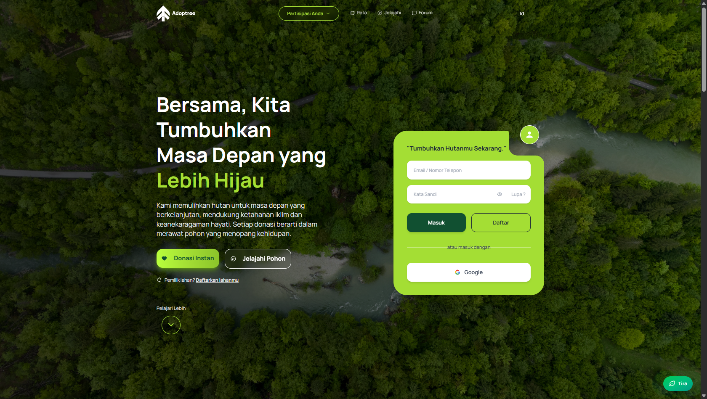
*Figure 2 — Live at `staging.adoptreeworld.com`. Brand hero: "Bersama, Kita Tumbuhkan Masa Depan yang Lebih Hijau" with primary CTAs (Donasi Instan · Jelajahi Pohon) and inline login modal. Aerial mangrove backdrop reinforces the impact-first narrative.*

### 6.1 Platform Architecture (Multi-sided)

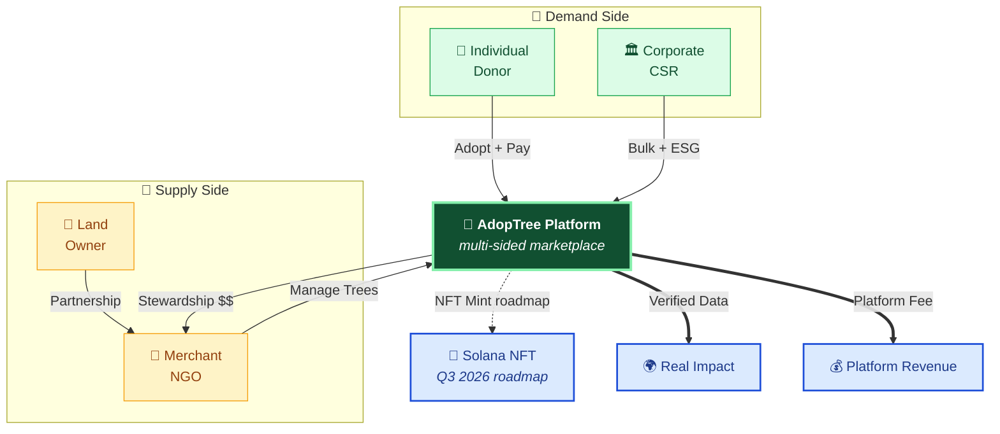
```mermaid
flowchart TB
    subgraph Demand["💚 Demand Side"]
        direction LR
        Donor["🙋 Individual<br/>Donor"]
        Corp["🏛️ Corporate<br/>CSR"]
    end

    Platform["🌳 <b>AdopTree Platform</b><br/><i>multi-sided marketplace</i>"]

    subgraph Supply["🌱 Supply Side"]
        direction LR
        LandOwner["🌾 Land<br/>Owner"]
        Merchant["🏢 Merchant<br/>NGO"]
    end

    Solana["🔮 Solana NFT<br/><i>Q3 2026 roadmap</i>"]
    Impact["🌍 Real Impact"]
    Revenue["💰 Platform Revenue"]

    Donor -->|Adopt + Pay| Platform
    Corp -->|Bulk + ESG| Platform
    Platform -->|Stewardship $$| Merchant
    Merchant -->|Manage Trees| Platform
    LandOwner -->|Partnership| Merchant
    Platform -.->|NFT Mint roadmap| Solana
    Platform ==>|Verified Data| Impact
    Platform ==>|Platform Fee| Revenue

    classDef demand fill:#dcfce7,stroke:#16a34a,color:#115031
    classDef platform fill:#115031,stroke:#86efac,color:#fff,stroke-width:3px
    classDef supply fill:#fef3c7,stroke:#f59e0b,color:#92400e
    classDef outputs fill:#dbeafe,stroke:#1d4ed8,color:#1e3a8a,stroke-width:2px
    class Donor,Corp demand
    class Platform platform
    class LandOwner,Merchant supply
    class Solana,Impact,Revenue outputs
```

### 6.2 Feature Matrix

#### Donor-Facing Features

| Feature | Description | Status |
|---|---|---|
| **Browse & Search** | Explore lands by region, type, availability, campaign | ✅ Built |
| **GIS Map** | Interactive map with polygon boundaries + tree dot tracking | ✅ Built |
| **Multi-tier Adoption** | 4 tiers from $8 donation to $75 AdopTree | ✅ Built |
| **Cart & Checkout** | Multi-item cart with batch checkout, race-condition safe, Midtrans (IDR) live in production | ✅ Built |
| **Solana SOL Checkout** | Wallet connect UI, Phantom adapter, payment flow scaffolding | 🟡 UI built · backend wire-up Q3 2026 |
| **Digital Certificate** | Auto-generated PDF certificate with QR verification | ✅ Built |
| **My Forest Dashboard** | Personal adoption tracker, carbon credits, certificates | ✅ Built |
| **Solana Wallet Authentication (SIWS)** | Production-ready ed25519 signature verification + nonce + JWT issuance | ✅ Built |
| **NFT Metadata Schema & API** | Database tables + REST endpoints (`GET /nfts/{mint}`, `GET /nfts/{mint}/history`, `POST /nfts/refresh`) | ✅ Built |
| **On-chain NFT Minting (AdopTree tier)** | Metaplex mint pipeline triggered on AdopTree-tier payment success | 📋 Q3 2026 milestone — see §10.5 |
| **360° Tree View** | Photo sphere viewer for immersive tree experience | ✅ Built |
| **Public Tools Hub** *(new)* | `/tools` — a public interactive-tools page (no login) hosting the three tools below; an acquisition + SEO surface. See §6.7 | ✅ Built |
| **Carbon Calculator** *(new)* | `/tools/carbon-calculator` — estimate annual CO₂ absorbed by plant type (forest tree vs. agriculture) × tree count | ✅ Built |
| **3D Tree Tracker** *(new)* | `/track` — cinematic 3D journey from globe to ground to find an adopted tree by code (or a sample tree); the "digital twin" experience made tangible | ✅ Built |
| **Land Analyzer** *(new)* | `/tools/land-analyzer` — draw a land polygon or upload an image; AI estimates tree count + canopy cover from Sentinel-2 satellite imagery (the public-facing front of the AI tree-baseline engine) | ✅ Built |
| **Carbon Credits** | Allocated at adoption, tracked in dashboard | ✅ Built |
| **Wishlist** | Save lands and trees for future adoption — with adoption slot progress | ✅ Built |
| **Forum / Community** | Posts (rich text + image editor + markdown), comments, follows, likes | ✅ Built |
| **Tira AI Assistant** | Multi-provider AI (OpenAI/Gemini/Claude, runtime-switchable) with function-calling against live data; bilingual to the platform locale (id/en/ar); abuse-protected (rate limits + budget). See §6.6 | ✅ Built |
| **Instant Donation** *(new)* | One-tap donation modal with smart defaults — quick-amount chips (1/5/10), a trust-weighted land recommendation algorithm, a logged-in "1-click" path, and a "Tira pick for me" deterministic auto-fill | ✅ Built |
| **Multi-language** | English, Indonesian, Arabic (RTL) — UI + AI replies both follow the platform locale | ✅ Built |
| **Notifications** | In-app, email, and Firebase Cloud Messaging push (Phase 2.9) with deeplink routing | ✅ Built |
| **Realtime Chat** *(new)* | WebSocket-based 1:1 chat — voice notes, WhatsApp-style optimistic send, conversation actions (Phase 2.26) | ✅ Built |
| **APK Download Center** *(new)* | `/download/releases` — versioned APK distribution with changelog (Build 30 latest) | ✅ Built |
| **"Perjalanan Danamu" Fund Journey** *(new v2.6)* | Per-adoption escrow journey stepper in My Forest: Paid → Planted (✓40%) → Verified Alive (✓30%) → Thriving — % disbursed shown, milestone dates linked to field evidence. See §6.8 | ✅ Built |
| **Support Center (Tira-first)** *(new v2.6)* | `/support` — ask Tira 24/7 first (answers from live data); unresolved → structured ticket with status tracking + direct chat with the support team. See §6.9 | ✅ Built |
| **Two-Factor Authentication** *(new v2.6)* | TOTP (Google Authenticator) + one-time backup codes; encrypted secrets; challenge-based login on web & mobile. See §6.9 | ✅ Built |

<table>
  <tr>
    <td width="50%">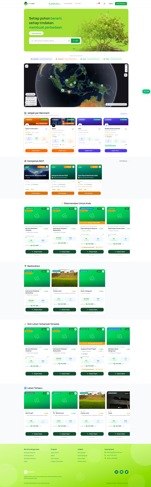 <b>1. Explore</b> — interactive map with land markers + horizontal scrollers for Jelajahi per Merchant, Kampanye Aktif, and Rekomendasi Untuk Anda.</td>
    <td width="50%">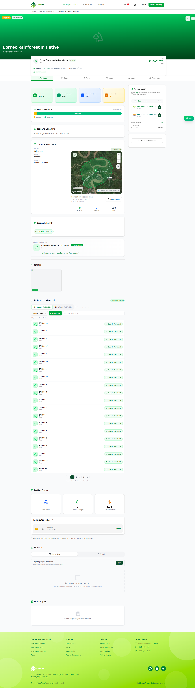 <b>2. Land Detail</b> — hero header with land name + merchant, adoption KPIs (Lahan/Pohon/Adopsi), Mapbox polygon with tree markers, species list, gallery, and adoption tier picker.</td>
  </tr>
  <tr>
    <td width="50%">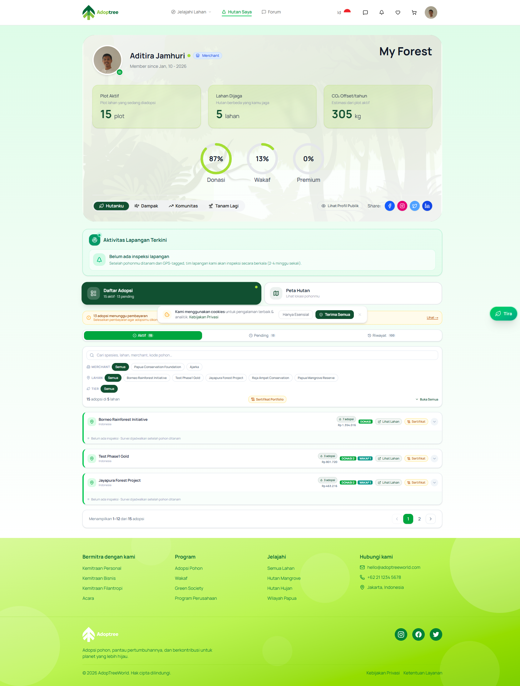 <b>3. My Forest</b> — donor's personal forest dashboard: 15 trees adopted across 5 lands, 305g CO₂ sequestered live, tier distribution chart (Silver/Gold/Donasi), tabs for Pohon/Lahan/Adopsi/Sertifikat.</td>
    <td width="50%">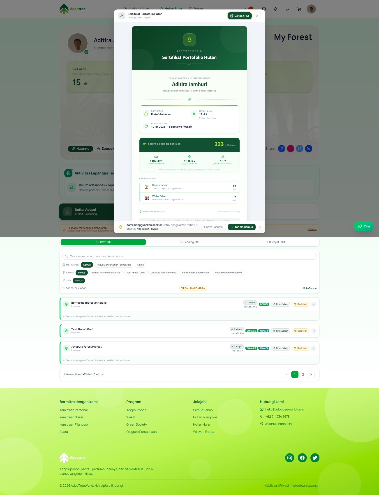 <b>4. Sertifikat Portfolio Hutan</b> — branded certificate modal with donor name (Aditira Jamhuri), aggregate impact statistics, and downloadable PDF rendering. Acts as the legally-meaningful proof for tax filings and ESG reports.</td>
  </tr>
</table>

*Figure 3a — Donor experience flow: discovery → land deep-dive → personal forest → certificate. Same flow works across all four adoption tiers (Donation $8 · Wakaf $10 · Green Society $12 · AdopTree $75 — NFT certificate activates Q3 2026, see §10.5).*

#### Merchant-Facing Features

| Feature | Description | Status |
|---|---|---|
| **Tira Co-Pilot — Create Land** *(new)* | Register a land *by chatting*: Tira fills the form live, imports boundary files (KML/KMZ/GPX/GeoJSON), proposes species, and guides the wizard. See §6.6 | ✅ Built |
| **Tira Co-Pilot — Campaign & Registration** *(new)* | The same co-pilot drives the create-campaign wizard and the "become a merchant" registration form (a logged-in user can apply by chatting) | ✅ Built |
| **AI Geo-Import** *(new)* | Upload boundaries (KML/KMZ/GPX/GeoJSON) and tree points (CSV/GeoJSON); an AI `normalize-geo` endpoint maps arbitrary columns to the AdopTree standard, fuzzy-matches species, validates inside/outside boundary, and bulk-imports with chunking | ✅ Built |
| **AI Tree Baseline & Estimation** *(new)* | Quantify a forest asset before transacting — tree-count estimation from Sentinel-2 canopy + DeepForest on uploaded imagery, plus a public Land-Analyzer mini-tool | ✅ Built |
| **Land Management** | CRUD for land plots with GIS polygon upload + wilayah dropdown; overlap detection; photo-based polygon field verification; land-profile picture | ✅ Built |
| **Tree Management** | Per-tree CRUD, CSV bulk import, inline management in the land "Pohon" tab, media management | ✅ Built |
| **Campaign System** | Fundraising campaigns with custom pricing & tree allocation, 4-step create wizard | ✅ Built |
| **Land Partnerships & Ownership Claim** | Two-tier invite system for land-owner collaboration + land ownership claim flow | ✅ Built |
| **Earnings Dashboard** | Revenue tracking (real service-tier fee math), withdrawal management | ✅ Built |
| **Tira AI Subscription** | Merchant-configurable donor-facing AI chat; multi-provider; abuse-protected | ✅ Built |
| **Analytics** | Bot interactions, adoption stats, campaign performance | ✅ Built |
| **Posts & Updates** | Merchant feed for sharing land progress; Instagram auto cross-post to the forum | ✅ Built |
| **Review Queue** *(new)* | Approve/reject contributor submissions: Tag Lahan, Plant Tree, surveillance; on approval, publish field-inspection photos to the public land gallery (opt-in) | ✅ Built |
| **Planting Jobs Marketplace** *(new)* | Job listings for field contributors (Phase 2.17–2.19) | ✅ Built |
| **Contributor Map** *(new)* | Live GPS radar of active field contributors on merchant lands (Phase 2.17) | ✅ Built |
| **Contributor Management** *(new)* | Manage field team, invites, capability flags | ✅ Built |
| **QR Code Management** *(new)* | Tree QR identity verification — anti-misidentification (Phase 2.23) | ✅ Built |
| **Species Request Workflow** *(new)* | Request new species → admin approval, with AI "fill for me" data autofill | ✅ Built |
| **Dark Mode Dashboard** *(new)* | Scoped dark mode for merchant/admin/land-owner dashboards (public stays light) | ✅ Built |
| **Escrow & Pencairan** *(new v2.6)* | Cash-pipeline funnel (Held → Awaiting Admin → Ready → Paid) + actionable "what unlocks your money" insights + per-adoption milestone table + payout history with bank references. Passive by design — no withdrawal requests. See §6.8 | ✅ Built |
| **Pengelola Lahan (KTP-verified Land Manager)** *(new v2.6)* | Every new land registers its accountable field PIC — full name, 16-digit national ID + ID-card photo, contact — required at creation, editable on a dedicated tab; Tira co-pilot fills it conversationally (ID number privacy-masked in chat) | ✅ Built |
| **Full-coverage Notifications** *(new v2.6)* | Every inspection/observation/planting submission, new sale, milestone event, and verification outcome lands in the merchant's inbox — no more polling the dashboard to discover work | ✅ Built |

<table>
  <tr>
    <td width="50%">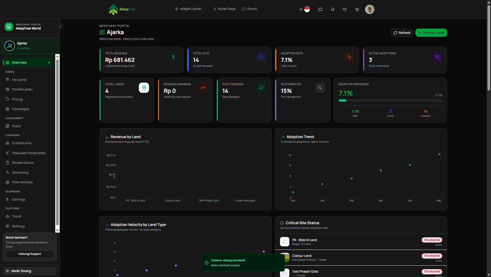 <b>Overview</b> — KPI cards (lands · trees · earnings · adoptions) + revenue chart. <b>Dark mode</b> is a v2.1 ship.</td>
    <td width="50%">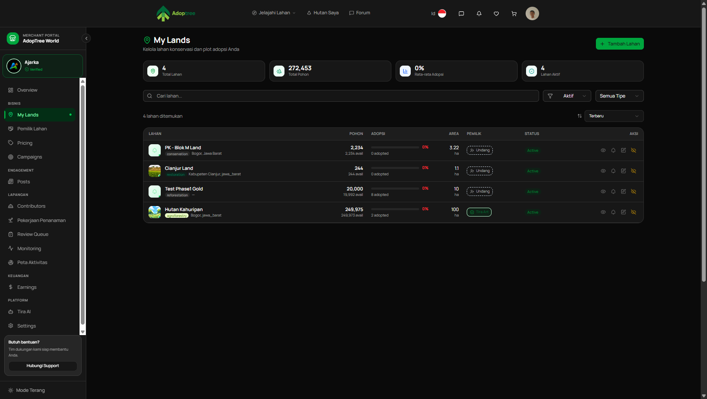 <b>Land Management</b> — list view with polygon previews, tree count, assignment algorithm (random/sequential/nearest_center/cluster) per land.</td>
  </tr>
  <tr>
    <td width="50%">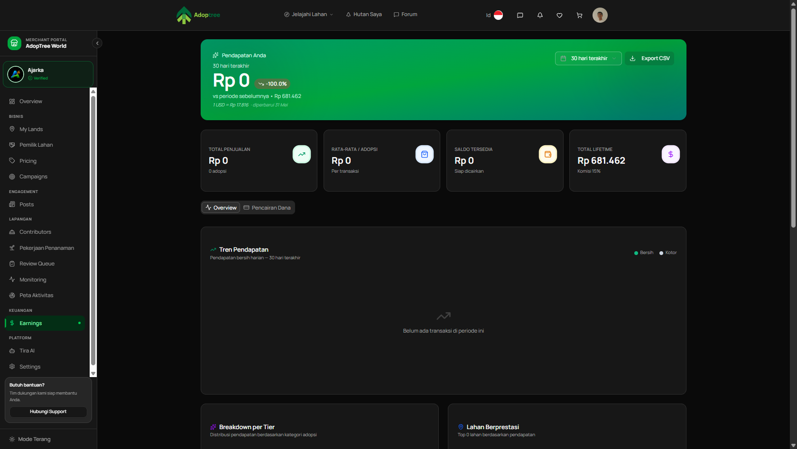 <b>Earnings</b> — payout history, fee breakdown per tier, monthly trends. Direct payout in IDR (Midtrans) live; SOL (Solana) payout activating alongside Q3 2026 NFT mint.</td>
    <td width="50%">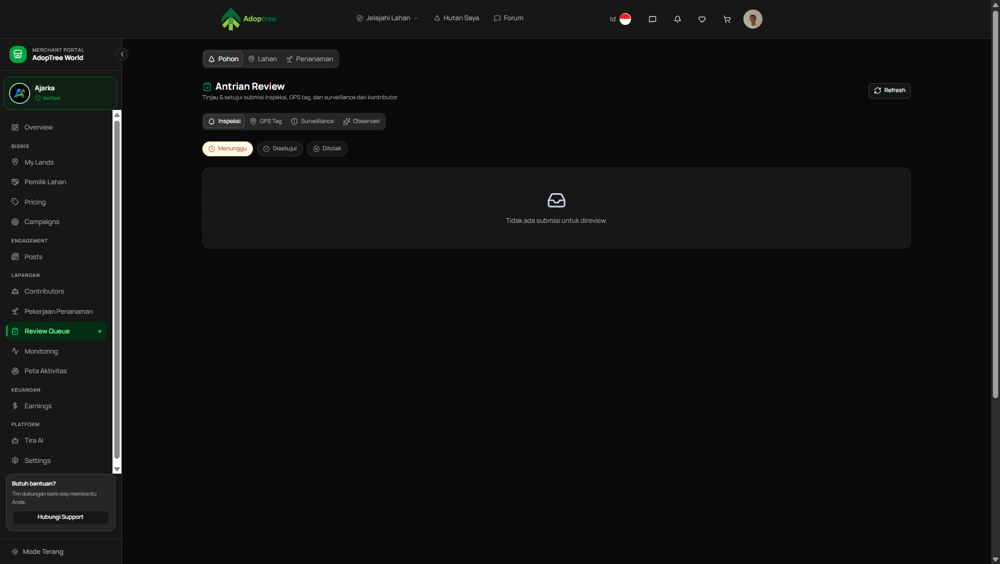 <b>Review Queue</b> — moderation interface for contributor-submitted tree observations & inspections (v2.1 contributor system).</td>
  </tr>
</table>

*Figure 3b — Merchant dashboard ecosystem (dark mode). Built for NGOs and land-managing organizations to run full operations: land registration → tree inventory → campaign creation → earnings reconciliation → contributor moderation.*

#### Admin & Platform Features

| Feature | Description | Status |
|---|---|---|
| **Admin Dashboard** | Revenue, adoptions, users, fees overview | ✅ Built |
| **Merchant Verification** | Review, approve, verify merchant accounts | ✅ Built |
| **Pricing Configuration** | Set platform fees, tier pricing globally | ✅ Built |
| **Site Configuration** | Dynamic homepage images (Cloudflare R2) | ✅ Built |
| **Transaction Management** | Full transaction audit trail | ✅ Built |
| **Analytics** | Platform-wide analytics, revenue breakdown | ✅ Built |
| **Review Queue (Admin)** *(new)* | Global review of high-trust submissions, species approvals, contributor verification | ✅ Built |
| **Land Owners Management** *(new)* | Dedicated dashboard for land owner accounts + invitation flow | ✅ Built |
| **Contributor Management** *(new)* | Manage public/verified contributors, tier promotions, leaderboard | ✅ Built |
| **Session Resilience** *(new)* | 4-hour access + 30-day refresh token, axios interceptor mutex queue — eliminates spurious logouts | ✅ Built |
| **Keuangan Console (Milestone Escrow)** *(new v2.6)* | 5-KPI money picture (held / awaiting / eligible / paid / clawback exposure) + milestone approval queue with field-evidence deeplinks & bulk approve + payout batching with live IDR preview & bank-transfer references + configurable stage percentages (Σ=100 enforced) + one-click historical backfill. See §6.8 | ✅ Built |
| **Support Inbox** *(new v2.6)* | Ticket queue with status/priority filters, AI triage summary + full Tira transcript per ticket, claim → spawns direct user↔admin chat, mandatory resolution notes. See §6.9 | ✅ Built |
| **2FA Recovery** *(new v2.6)* | Admin reset path for users locked out of two-factor (lost device + exhausted backup codes) | ✅ Built |

<table>
  <tr>
    <td width="50%">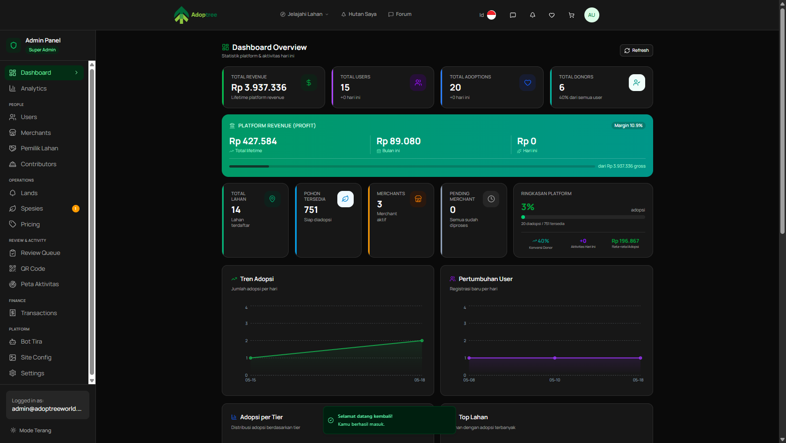 <b>Admin Dashboard</b> (<code>/admin</code>) — revenue + adoption totals, active merchants count, recent transactions feed.</td>
    <td width="50%">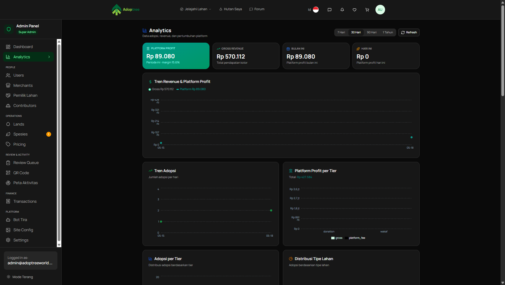 <b>Analytics</b> — time-series breakdowns: adoption velocity, merchant performance, tier mix, geographic distribution.</td>
  </tr>
  <tr>
    <td width="50%">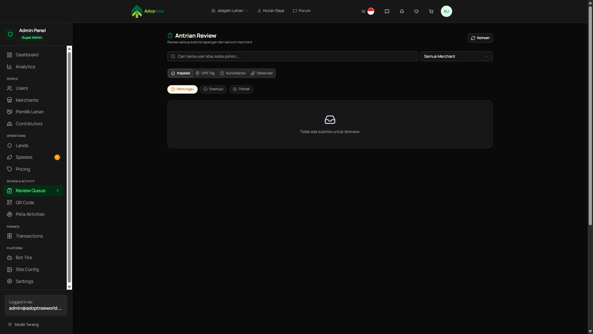 <b>Review Queue</b> — platform-level moderation for contributor observations + inspections (tier-gated trust system).</td>
    <td width="50%">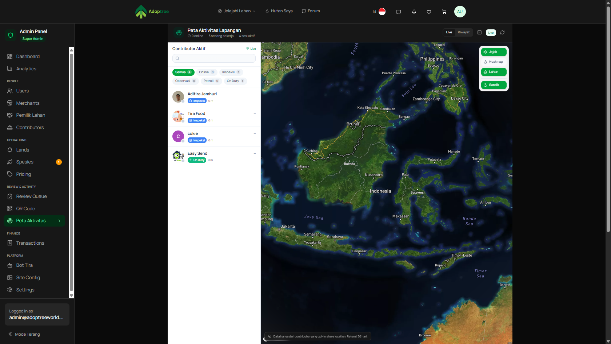 <b>Contributor Map</b> — geographic heatmap of field contributor activity (Public/Verified/Inspector tiers).</td>
  </tr>
</table>

*Figure 3c — Admin console (dark mode). Platform-wide operational visibility: revenue, contributor activity, moderation backlog, merchant performance — all live on staging.*

### 6.3 Service Class Structure

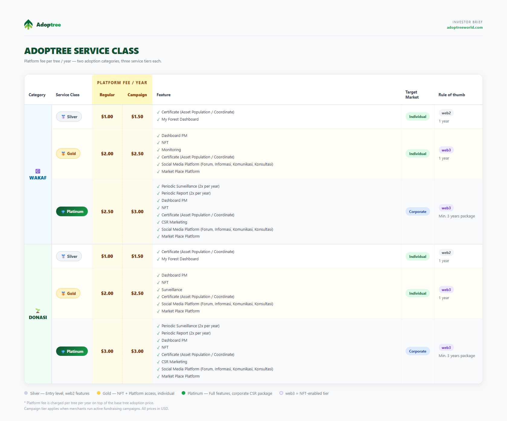
*Figure 4 — Platform fee per tree per year. Two adoption categories (Wakaf · Donasi) × three service tiers (Silver · Gold · Platinum). Regular vs. Campaign pricing distinguishes evergreen adoption from time-bound fundraising campaigns.*

AdopTree uses a **6-class service tier model**: two adoption categories (Donasi & Wakaf), each with three service levels (Silver, Gold, Platinum). Platform fee is charged per tree per year on top of the base adoption price.

#### Donasi Category

| Class | Platform Fee / yr | Campaign Fee | Features | Target | Duration |
|-------|-------------------|--------------|----------|--------|----------|
| 🥈 **Silver** | $1.00/tree | $1.50/tree | Certificate, My Forest Dashboard | Individual | 1 year · web2 |
| 🥇 **Gold** | $2.00/tree | $2.50/tree | + Dashboard PM, NFT *(Q3 2026)*, Surveillance, Social & Marketplace | Individual | 1 year · web2 → web3 |
| 💎 **Platinum** | $3.00/tree | $3.00/tree | + Periodic Surveillance (2x/yr), CSR Marketing, Full Platform | Corporate | Min. 3 years · web2 → web3 |

#### Wakaf Category *(Shariah-compliant perpetual endowment)*

| Class | Platform Fee / yr | Campaign Fee | Features | Target | Duration |
|-------|-------------------|--------------|----------|--------|----------|
| 🥈 **Silver** | $1.00/tree | $1.50/tree | Certificate, My Forest Dashboard | Individual | 1 year · web2 |
| 🥇 **Gold** | $2.00/tree | $2.50/tree | + Dashboard PM, NFT *(Q3 2026)*, Monitoring, Social & Marketplace | Individual | 1 year · web2 → web3 |
| 💎 **Platinum** | $2.50/tree | $3.00/tree | + Periodic Surveillance (2x/yr), CSR Marketing, Full Platform | Corporate | Min. 3 years · web2 → web3 |

> **Key distinctions:**
> - **Silver** = entry-level, web2 experience (certificate + dashboard) — fully live today
> - **Gold** = full platform access (forum, marketplace) today, NFT-backed asset added Q3 2026 when on-chain minting activates
> - **Platinum** = corporate-grade, includes periodic physical surveillance & reports, minimum 3-year commitment
> - **Wakaf** tiers are Shariah-compliant — opens Islamic philanthropic market (Indonesia + Gulf)

**Carbon credit tracking:** All adoptions generate CO₂ absorption data in real-time based on species-level absorption rate (kg CO₂/year). Redemption & trading roadmap: 2027 (targeting VCS certification).

---

### 6.4 Mobile Field App — Android (Live)

> The web platform handles **online** adoption & monitoring. The mobile app handles **on-the-ground fulfillment** — without it, "GPS-verified tree ownership" is a promise; with it, it's evidence.

**Status:** Live · APK Build 30 distributed via `/download/releases` · Phase 1 (MVP) feature-complete · Phase 2 (Public Contributor) in production · Phase 1 delivered **5 weeks ahead of original 8-week schedule**.

<table>
  <tr>
    <td width="33%">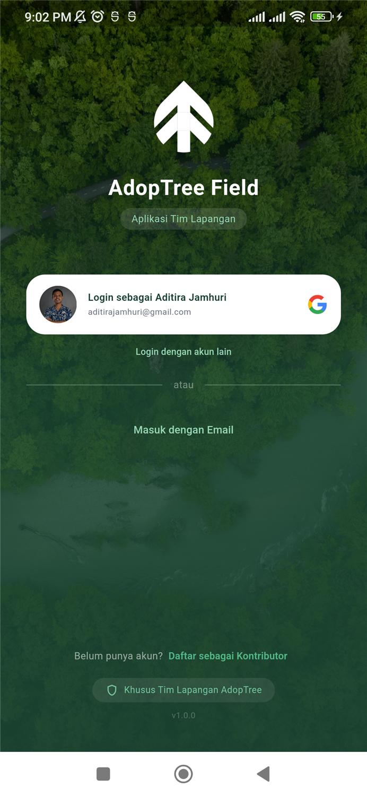 <b>1. Login</b> — fresh brand logo (Build 14, May 2026). Single-tap auth for field contributors.</td>
    <td width="33%">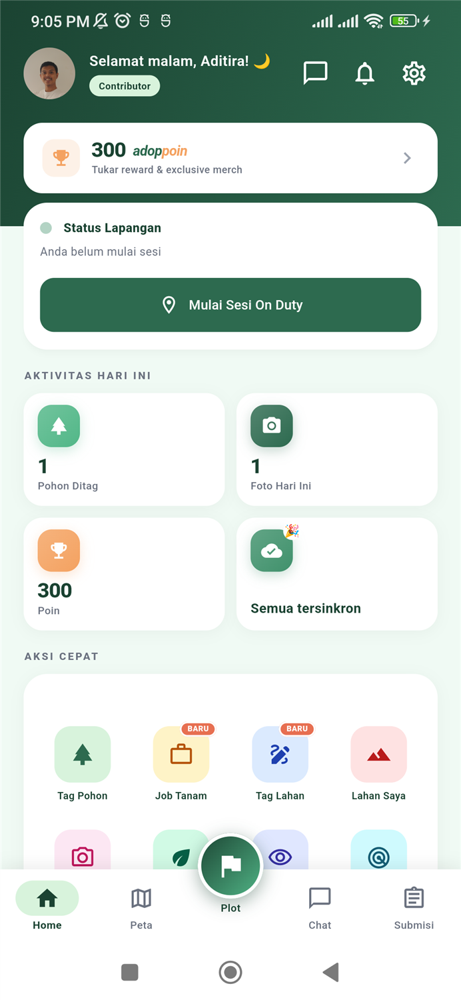 <b>2. Home</b> — adopoin balance (300 pts), Contributor tier badge, bottom nav (Home · Peta · Plot · Chat · Submisi).</td>
    <td width="33%">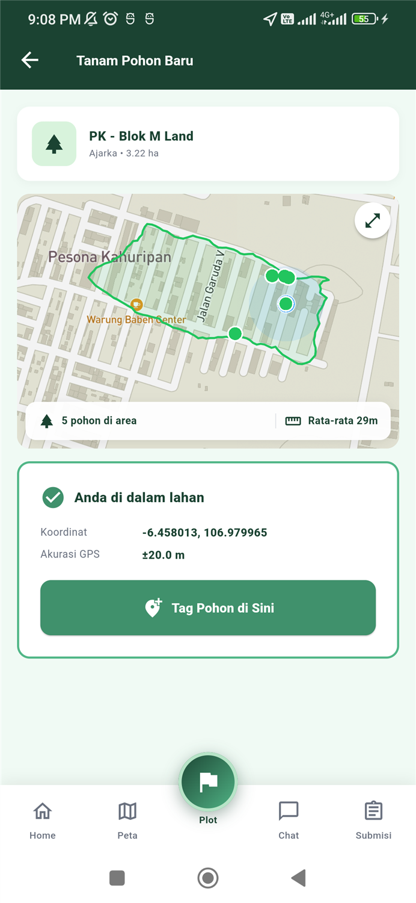 <b>3. Plant Tree</b> — interactive land polygon with 5 existing trees rendered as dots. Contributor adds new tree position.</td>
  </tr>
  <tr>
    <td width="33%">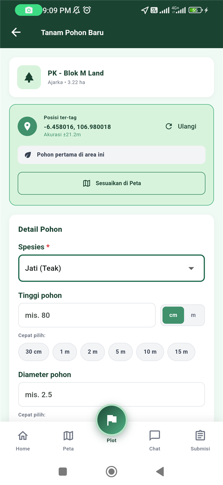 <b>4. Tag Tree</b> — species dropdown, height chip selector, mandatory photo capture before submit.</td>
    <td width="33%">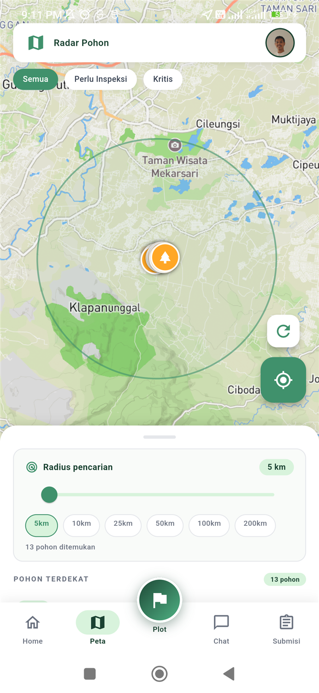 <b>5. Tree Radar</b> — proximity-based tree discovery within user's GPS radius. Slider sets radius (5m → 500m).</td>
    <td width="33%">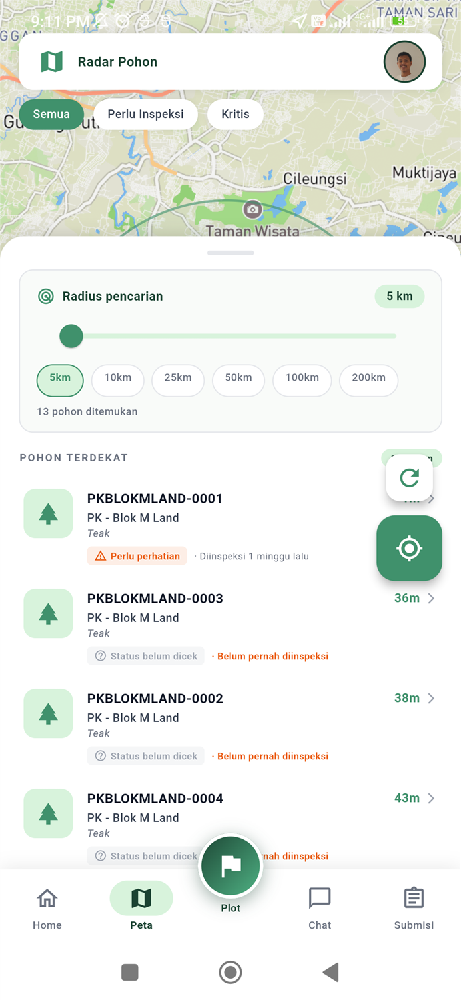 <b>6. Tree List</b> — "Pohon Terdekat" sorted by distance, each with status pill (verified / pending / disputed).</td>
  </tr>
</table>

*Figure 5a — Mobile Field App workflow on a real Android device. 9 production builds shipped in 5 weeks. Brand logo rebrand fully integrated across launcher icon, splash, and in-app surfaces.*

**Why mobile is non-negotiable:**

| Without Mobile App | With Mobile App |
|---|---|
| Field photos can be faked, GPS manipulated | In-app camera burns GPS + timestamp + mini-map into pixels at capture — anti-tamper |
| Field teams offline = no data | Offline-first (Drift SQLite) — sync when online |
| Surveillance requires expensive professional teams | Crowdsourced contributors with tier-based trust system |
| Tag-after-planting workflow is manual & ad-hoc | Standardized Plant Tree wizard with spacing awareness + QR identity verification |

**Key workflows (all shipped):**

| Workflow | Description | Phase |
|---|---|---|
| **Plant Tree (multi-photo camera-first)** | Wizard for tagging new tree with GPS + watermarked photos + species selector | 2.12 |
| **Tree Inspection** | Dual-gate verification (must be within 10 m of tree + heading ±45°) + multi-stage camera (close-up + wide + landscape) with burned watermark | 2.20 |
| **Tagging Spacing Awareness** | Live status pill (✓ Optimal / ⚠ Too close / 🚫 Outside boundary) + bottom sheet warning | 2.24 |
| **QR Tree Identity Verification** | Auto-generated QR at tagging, scan before inspection to verify tree identity — eliminates misidentification | 2.23 |
| **Contributor Tracking** | GPS session + offline buffer + auto-start hooks for active jobs | 2.17 |
| **Tag Lahan Baru (Land Submission)** | Public users can submit new land plots → admin/merchant review queue | 2.10–2.11 |
| **Realtime Chat** | WebSocket-backed chat with merchants — voice notes, read receipts, conversation actions | 2.26 |
| **In-app Notifications** | Bell icon, deeplink routing (web routes auto-open browser) | Build 8 + |
| **Tree Density & Distance Tools** | Custom radius radar (1–200 km), distance measurement, density preview | 2.21 |

<table>
  <tr>
    <td width="50%">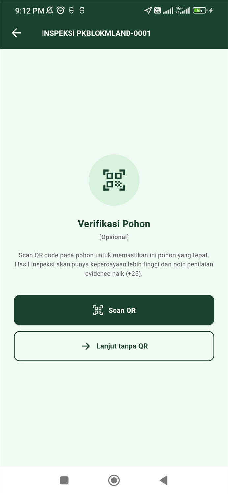 <b>Inspection Dual-Gate</b> — Scan QR for max trust (+25 evidence points) <i>or</i> "Lanjut tanpa QR" for visual-only inspection. Tier system uses this to score evidence quality.</td>
    <td width="50%">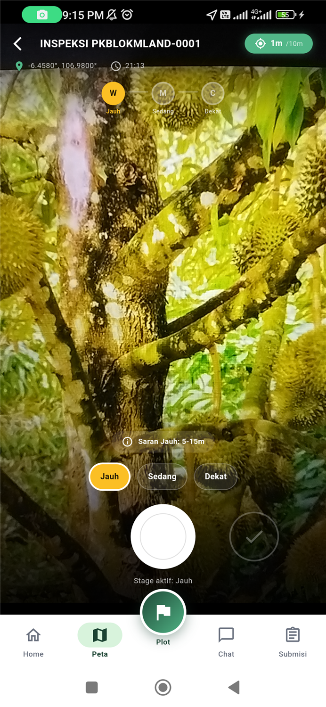 <b>Anti-Tamper Capture</b> — live camera with burned-in watermark: GPS coordinates (-6.4180°, 106.9800°), timestamp (21:33), distance from target tree (1m / 15m threshold), and Jauh/Sedang/Dekat range pills. Photo is unusable without these badges.</td>
  </tr>
</table>

*Figure 5b — The single most-differentiating mobile workflow: dual-gate inspection + anti-tamper evidence capture. Without these badges burned into the pixel data, the photo is not accepted as inspection evidence. This is the visual proof of the "GPS-verified, not GPS-promised" thesis that separates AdopTree from every other tree-planting platform.*

**Stack:**
- **Flutter 3.24** + Dart · **Riverpod** state management
- **Drift SQLite** for offline-first storage + `mobile_sync_queue` table for idempotent batch sync
- **Dio** HTTP client with JWT auto-refresh interceptor
- **Geolocator** + `flutter_compass` for GPS + heading dual-gate
- **Camera + `image` (pure-Dart)** to burn watermark (timestamp + coord + mini-map from Mapbox Static API) directly into JPEG pixels
- **Firebase Cloud Messaging (FCM v1)** for push notifications
- **Google Sign-In** OAuth (frictionless onboarding)
- `go_router` navigation · `workmanager` background sync · `flutter_secure_storage` for credentials

**Distribution:** Android APK via Cloudflare R2 (versioned releases + `latest` alias for auto-update). iOS distribution via TestFlight.

**Build cadence:** 30 builds released since Phase 1 kickoff (3 May 2026). Latest = Build 30 (July 2026 — live GPS tracking pipeline fix + Two-Factor Authentication login).

---

### 6.5 Contributor Tier System — Crowdsourced Field Operations (Live)

> **The competitive moat that makes 500M trees achievable.** Instead of hiring expensive field teams to validate every tree, we crowdsource validation from the public — with a trust system inspired by Wikipedia (anyone edits) + Waze (community validates) + iNaturalist (experts verify) + Strava (gamified contribution).

**Status:** Tier 1 (Public Contributor) live in production · Tier 2 (Verified) auto-promotion live · Tier 3 (Field Inspector) manual upgrade live.

**Tier architecture:**

| Tier | How to Reach | Permissions | Submission Flow |
|------|--------------|-------------|----------------|
| 🌱 **Public Contributor** | Auto-assigned on first Google Sign-In from mobile | Public lands only (`is_public = true`) — inspect, plant-tree, tag-lahan-baru | Submissions go to review queue; points awarded only after merchant/admin approval |
| 🌿 **Verified Contributor** | Auto-promoted after **5 approved submissions** | Public lands + lands explicitly assigned by merchant; eligible to redeem points | Submissions auto-approved (skip review queue); surveillance still pending review |
| 🌳 **Field Inspector** | Manual upgrade by merchant or admin | Internal team / staff — tied to specific lands via assignment | All submissions auto-approved (including surveillance) |

**Points & gamification:**
- +200 points for GPS-tagging a plot (status → `planted`)
- +100 points for completing an inspection
- Leaderboard (monthly + alltime) with PostgreSQL `RANK()` window
- Levels calculated from cumulative points (Pemula → Aktivis → Penjaga Hutan → Inspektur Hijau)
- Redemption live — points redeemable for Pulsa/Kuota (Tukar Poin v1); rewards marketplace expansion 2027

**Why this works for investors:**
1. **Lower operational cost** — surveillance crowdsourced, not staffed. Margin expansion as adoption scales.
2. **Higher data density** — more eyes on every tree = better evidence for ESG/CSR claims.
3. **Network effect** — gamification + leaderboard drives organic growth on supply side without paid acquisition.
4. **Anti-fraud** — tier-gated trust + review queue + watermarked camera + GPS dual-gate makes fake submissions economically irrational.

<table>
  <tr>
    <td width="50%">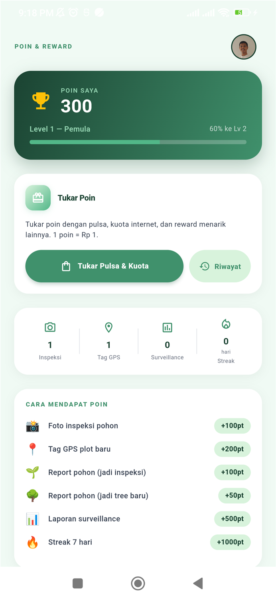 <b>Mobile — Poin & Reward</b> — Adopoin balance (300 pts), Level 1 Pemula, 60% to Level 2. KPI tiles (Inspeksi · Tag GPS · Surveillance · hari Streak). Reward catalog: foto pohon +100pt, tag GPS +200pt, surveillance +500pt, 7-day streak +1000pt. Redeemable for Pulsa/Kuota.</td>
    <td width="50%"> <b>Web Admin — Contributor Map</b> — geographic heatmap of all contributor field activity across Indonesia. Filterable by tier (Public / Verified / Inspector) and time window. Proves on-ground engagement at scale, not synthetic.</td>
  </tr>
</table>

*Figure 5c — Contributor tier system in action: mobile gamification drives field contribution (left), admin visibility proves the scale of crowdsourced validation (right).*

---

### 6.6 Tira AI Co-Pilot — From Chatbot to Operator (Live)

Tira began as a donor-facing Q&A chatbot. It is now an **AI co-pilot that does work on the supply side** — the operationally hardest, most defensible place to deploy AI in this market. Onboarding a conservation land (boundaries, species, tree points, legal docs) is the single biggest friction in growing supply; Tira collapses it into a conversation.

**What Tira does today (live on staging):**

| Surface | What Tira does | How |
|---|---|---|
| **Create Land** | A merchant describes their land in chat; Tira fills the multi-step form field-by-field, the merchant watching every change live | Client-side tool-calling → `react-hook-form` `setValue`. The form stays the source of truth; nothing is silently submitted |
| **Geo Import** | Merchant uploads a boundary file (KML/KMZ/GPX/GeoJSON) or a tree-point file (CSV/GeoJSON); Tira reads it, normalizes arbitrary columns to the AdopTree geo standard, fuzzy-matches species, flags points outside the boundary, and bulk-imports (chunked) | Client-side parsers + a server `POST /bot/normalize-geo` LLM endpoint that maps a *sample* (not the whole file) — cheap and fast even for thousands of points |
| **Create Campaign** | The same co-pilot drives the campaign wizard (name, status, period) | Dedicated `merchant_campaign` audience + tool-set |
| **Merchant Registration** | A logged-in user applies to become a merchant *by chatting*; Tira fills business info but never touches sensitive fields (bank/tax) — those are structurally excluded from the tool schema | `merchant_register` audience; defense-in-depth allow-list |
| **Species Autofill** | When a merchant needs a new species, Tira drafts accurate data (scientific name, CO₂ absorption, classification) for the approval queue | `suggest_species` endpoint |
| **Field Officer (Mobile)** | In the Android field app, Tira answers operational questions and runs officer tools (nearest-trees, app help) | `field_officer` audience, offline-aware |

**Why it's defensible, not a wrapper:**
- **Multi-provider, runtime-switchable** — OpenAI / Gemini / Claude selectable from settings without a redeploy; no lock-in, and the cheapest capable model wins.
- **Bilingual to the platform** — Tira always replies in the platform's selected language (id / en / ar), even if the user types another language — consistent brand voice across markets, including the Gulf.
- **A reusable co-pilot security layer** — every write-capable AI surface clears the same gate: **fail-closed** budget (if the cache is down, the expensive flow is refused, not run uncapped), **per-identity daily caps**, **strict-identity reload** (a deactivated account can't keep using a stale token), and an **anti-spoof client-IP** derivation. AI that writes to the product is treated as a first-class abuse surface — important for an investor assessing AI-cost risk.
- **Transparent + reversible** — Tira announces every field it fills ("✓ Nama lahan diisi: …"); the merchant can override anything; validation still lives in the form + backend. Tira can be wrong without breaking data integrity.

**Trajectory:** the tool/endpoint architecture is deliberately reusable for mobile — the same `/bot/chat` + `/bot/normalize-geo` contract serves web today and the Flutter field app next, with only the client-side executor differing.

---

### 6.7 Public Tools Hub (Live)

A no-login **Interactive Tools** page (`/tools`) doubles as a top-of-funnel acquisition + SEO surface: visitors get value before signing up, and each tool seeds intent for adoption or land registration. Three tools are live.

<table>
  <tr>
    <td width="50%">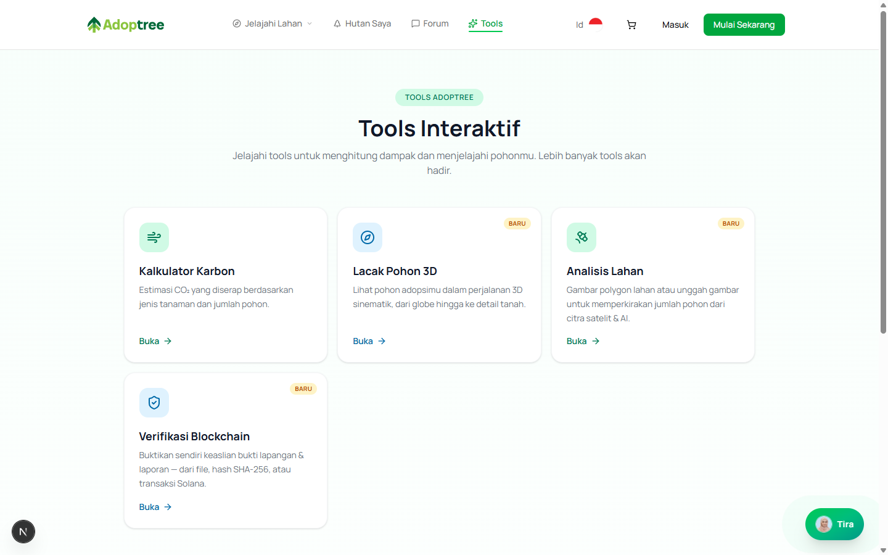 <b>1. Tools Hub</b> (<code>/tools</code>) — public landing for the interactive tools: Kalkulator Karbon, Lacak Pohon 3D, Analisis Lahan. No login required — value-first acquisition surface.</td>
    <td width="50%">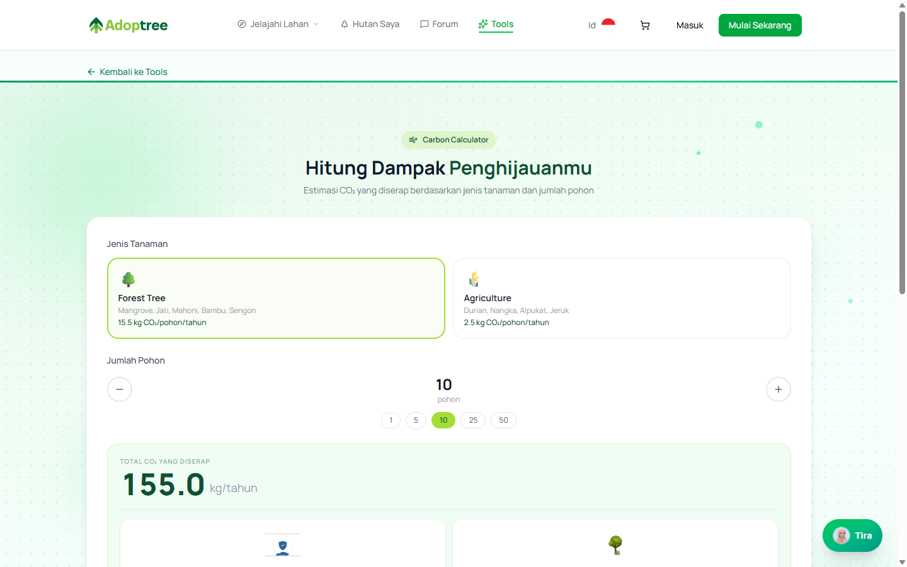 <b>2. Carbon Calculator</b> (<code>/tools/carbon-calculator</code>) — pick plant type (Forest Tree 15.5 vs. Agriculture 2.5 kg CO₂/tree/yr) × tree count → live annual CO₂ estimate. Turns "impact" into a concrete number before adoption.</td>
  </tr>
  <tr>
    <td width="50%">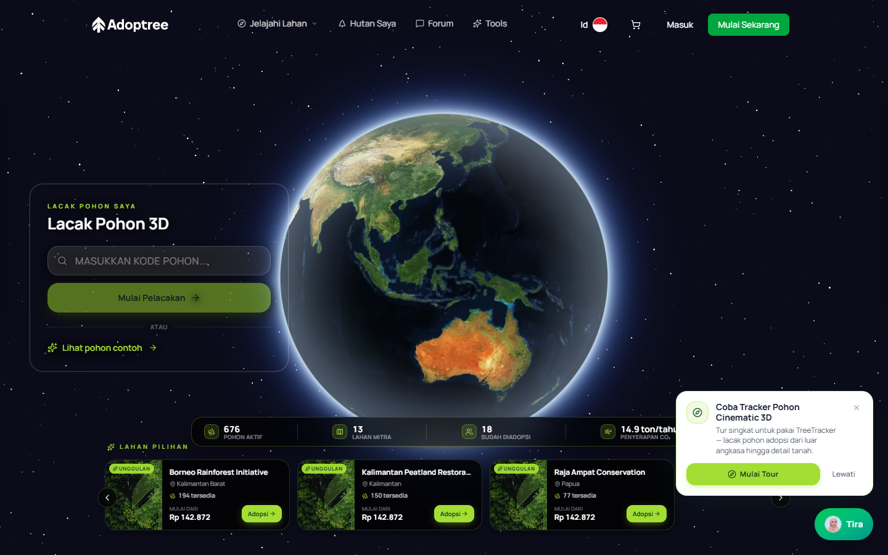 <b>3. 3D Tree Tracker</b> (<code>/track</code>) — the "digital twin" made tangible: a cinematic 3D journey from an Earth globe down to a specific adopted tree by code (or a sample tree). The wow-factor surface that differentiates AdopTree from spreadsheet-style competitors.</td>
    <td width="50%">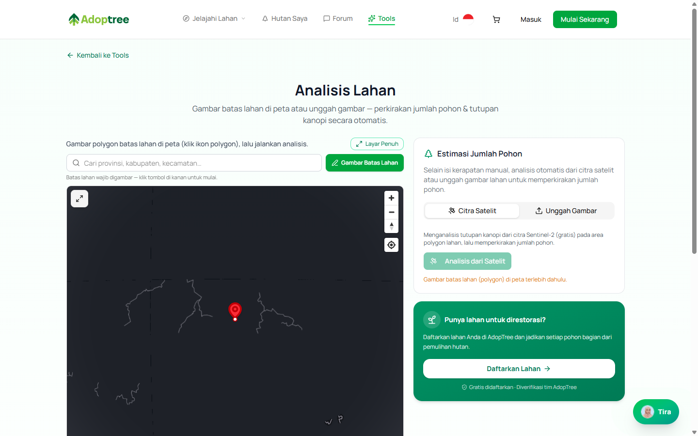 <b>4. Land Analyzer</b> (<code>/tools/land-analyzer</code>) — the public face of the AI tree-baseline engine: draw a land polygon (or upload imagery) and get an estimated tree count + canopy cover from Sentinel-2. Doubles as a land-owner lead magnet — note the "Daftarkan Lahan" CTA.</td>
  </tr>
</table>

*Figure 5d — Public Tools Hub. Each tool is a value-first acquisition surface: the Carbon Calculator quantifies impact for prospective donors, the 3D Tree Tracker showcases the digital-twin experience, and the Land Analyzer converts curious land owners into supply-side leads.*

---

### 6.8 Milestone Escrow — Trust-Engineered Fund Disbursement (Live, v2.6)

> **The thesis, enforced by the payment rail.** §0 names fraud in fund delivery (#3), weak supervision (#4), and low trust (#7) as the root causes AdopTree exists to solve. Until v2.6, the platform *documented* impact after money had already settled to the merchant. Now the money itself follows the tree: **donor funds are held in escrow and released to the merchant only as each real-world milestone is field-verified and admin-approved.** No competitor in §11 does this.

**How a dollar flows now:**

| Stage | Default share | Achieved by | Released by |
|---|---|---|---|
| 🌱 **M1 — Planted** | 40% | Planting job approved (or tree pre-planted at settlement) | Admin approval → payout batch |
| 🌿 **M2 — Verified Alive** | 30% | First approved field inspection after planting | Admin approval → payout batch |
| 🌳 **M3 — Thriving** | 30% | Follow-up approved inspection ≥ 180 days after M2 (or adoption period completed) | Admin approval → payout batch |

**Design properties that survive due diligence:**

- **Double-gate** — field evidence marks a milestone *achieved*; only an **admin** can approve release. Merchants approve their own planting/inspection submissions operationally, but can never self-release money.
- **Append-only ledger** — every fund/achieve/approve/payout/refund/clawback event is a permanent `escrow_ledger` row; the money picture is auditable by construction.
- **Deterministic math** — percentages are configurable platform-wide (Σ=100 enforced) and snapshotted per adoption; rounding is remainder-based so the three stages always sum exactly to the merchant's net.
- **Refund-aware** — payment refunds cancel unreleased milestones automatically and flag already-paid ones as clawback exposure on the admin console.
- **Dead-tree handling** — a dead tree freezes its remaining milestone for admin decision instead of silently paying out.
- **Historical backfill** — all pre-escrow successful payments were migrated through the same engine (flagged for admin review), so the ledger covers 100% of platform history.

<table>
  <tr>
    <td width="50%">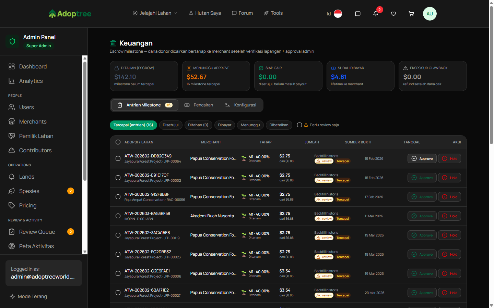 <b>1. Admin Keuangan Console</b> — the money picture in one screen: Held / Awaiting Approval / Ready / Paid / Clawback Exposure, plus the milestone approval queue — each row shows the adoption, stage, amount, and a deeplink to the field evidence behind it. Bulk-approve for backfill review.</td>
    <td width="50%">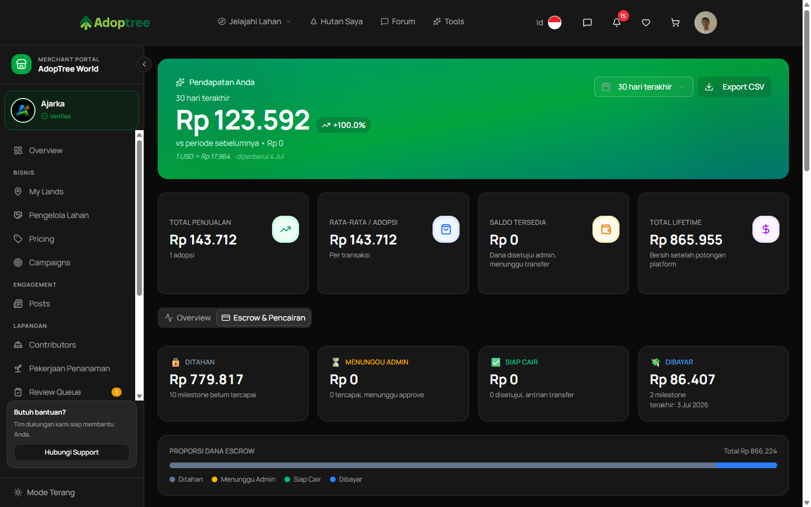 <b>2. Merchant "Escrow & Pencairan"</b> — the cash pipeline as a funnel (🔒 Held → ⏳ Awaiting Admin → ✅ Ready → 💸 Paid) plus <i>actionable insights</i>: "N trees awaiting first inspection ≈ $X" turns held funds into a motivating field to-do list. Payout history shows bank references. Passive by design — merchants never file withdrawal requests.</td>
  </tr>
  <tr>
    <td width="50%">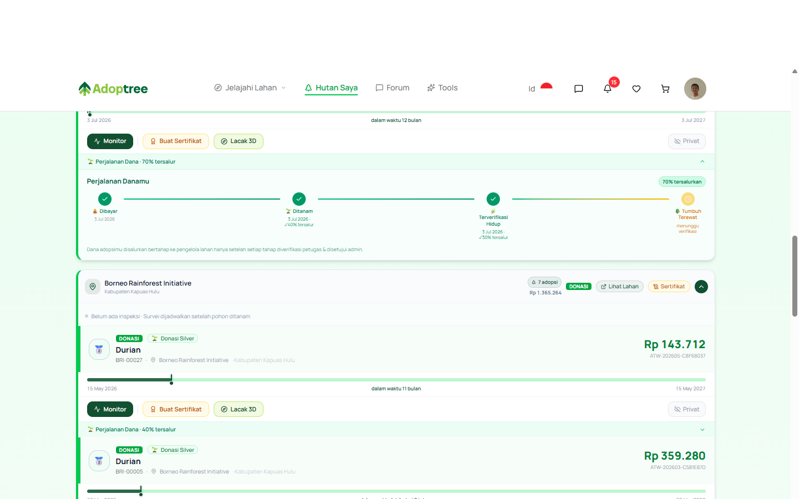 <b>3. Donor "Perjalanan Danamu"</b> — inside My Forest, each adoption shows its fund journey: Paid ✓ → Planted ✓40% → Verified Alive ✓30% → Thriving (pending), with "% disbursed" and milestone dates. Crowdfunding-grade transparency — donors see percentages, never the merchant's private fee economics.</td>
    <td width="50%">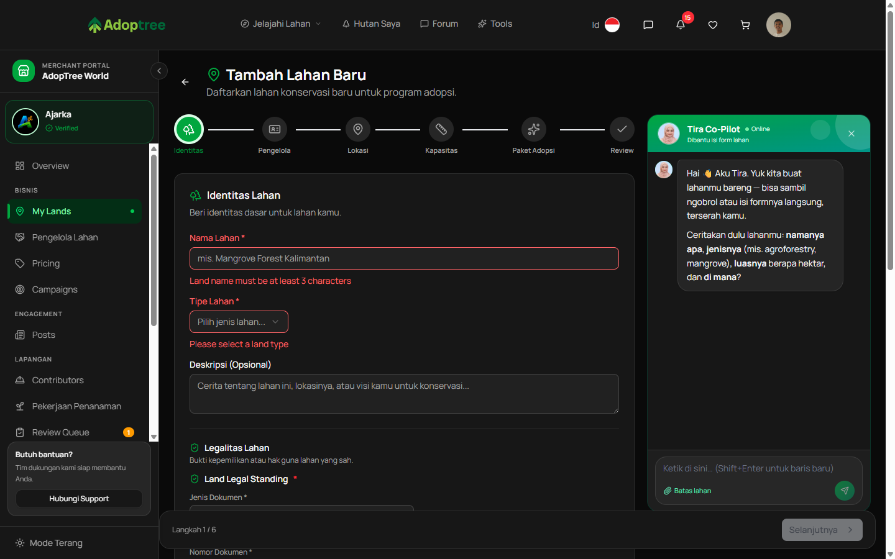 <b>4. KTP-Verified Land Manager</b> — the create-land wizard now requires a <i>Pengelola</i> (field PIC): full name, 16-digit national ID + ID-card photo, email, phone. Every land on the platform has an accountable, identity-verified human attached — the supply-side half of the trust protocol.</td>
  </tr>
</table>

*Figure 5e — Milestone Escrow across all three personas. The same ledger drives the admin console, the merchant funnel, and the donor journey stepper — one source of truth, three lenses. For an investor, this section is the answer to "how is this different from a donation button": AdopTree is becoming **impact-conditional payment infrastructure**.*

---

### 6.9 Tira-First Support 24/7 & Platform Hardening (Live, v2.6)

**Support that deflects before it escalates.** Tira is the first line of support on every surface: it answers "where is my money?" with live escrow data, "what's my tree's status?" with live inspection data — and only when a case genuinely needs a human does it create a **structured ticket** (category, priority, AI triage summary, full conversation transcript attached). Admins work from an inbox where every ticket arrives pre-triaged; claiming a ticket spawns a direct user↔admin chat on the existing realtime-chat infrastructure. The result: human support time is spent on the residue AI cannot solve — the operating-cost profile of a much larger support team.

<table>
  <tr>
    <td width="50%">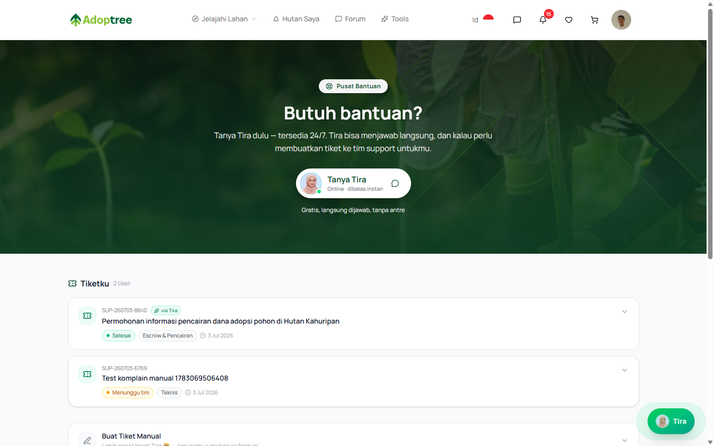 <b>User Support Center</b> (<code>/support</code>) — "Ask Tira first, available 24/7" hero, personal ticket list with live status (Waiting · In Progress · Resolved), direct chat with the support team once claimed, and a manual fallback form.</td>
    <td width="50%">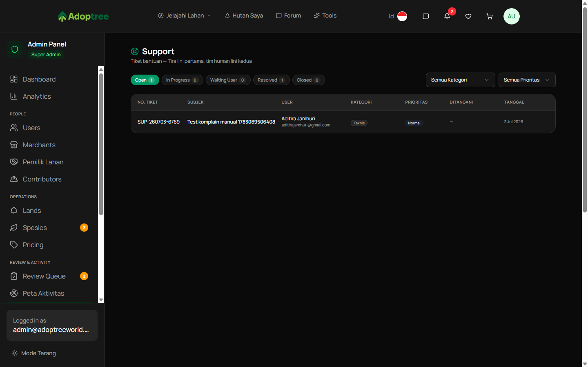 <b>Admin Support Inbox</b> — status tabs with counts, urgency-first ordering, and per-ticket AI triage summary + collapsible Tira transcript, so a human picks up every case already knowing what was tried.</td>
  </tr>
  <tr>
    <td width="50%">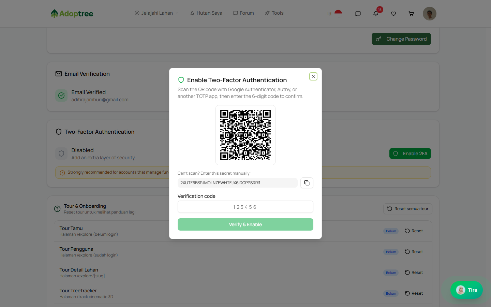 <b>Two-Factor Authentication</b> — TOTP enrolment with QR + manual secret, one-time backup codes (download-gated), password+code required to disable, admin recovery path. Secrets stored AES-256-GCM-encrypted. A platform that holds escrowed funds treats account security as financial infrastructure.</td>
    <td width="50%">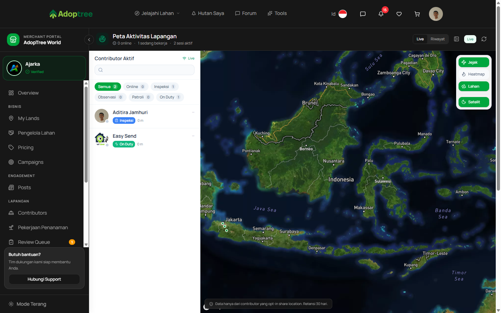 <b>Live Field Activity Map</b> — flat Indonesia-wide view of contributor sessions with live GPS trails, heatmap, land overlays scoped to the merchant, and 30-day history replay. Field App Build 30 fixed the GPS ping pipeline end-to-end — movement on this map is real telemetry, not decoration.</td>
  </tr>
</table>

*Figure 5f — v2.6 hardening set: AI-deflected support, financial-grade account security, and real field telemetry. Together with §6.8 these close the loop between "money in", "work done on the ground", and "who to call when something's off".*

---

## 7. Business Model & Revenue Streams

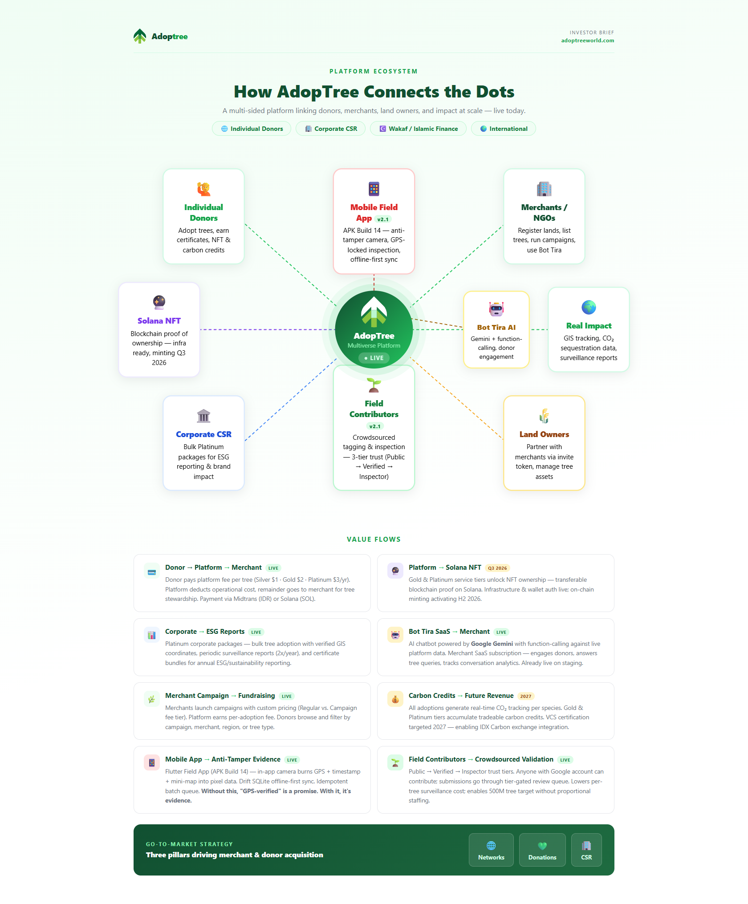
*Figure 6 — Multi-sided platform ecosystem map. 8 actors interconnected through AdopTree as the verification layer; Mobile Field App + Field Contributors (v2.1) close the on-ground evidence loop.*

### 7.1 Revenue Streams

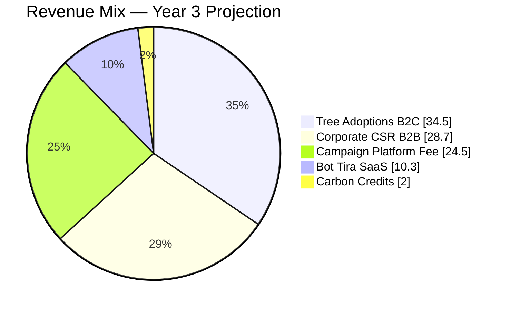
```mermaid
pie showData
    title Revenue Mix — Year 3 Projection
    "Tree Adoptions B2C" : 34.5
    "Corporate CSR B2B" : 28.7
    "Campaign Platform Fee" : 24.5
    "Bot Tira SaaS" : 10.3
    "Carbon Credits" : 2.0
```

#### Stream 1: Tree Adoption Fees (B2C)
- Platform takes **5–15%** of each adoption transaction
- Remainder goes to merchant for tree stewardship
- Payment via Midtrans (IDR) live in production; Solana (SOL) payment activating Q3 2026
- **Year 3 projection: $900K**

#### Stream 2: Corporate CSR Packages (B2B)
- Bundled adoption packages for companies (min. 100 trees)
- ESG data dashboard + certificate bundles
- Dedicated account management
- **Year 3 projection: $750K**

#### Stream 3: Campaign Platform Fee
- Merchants launch donation campaigns with custom tree pricing
- Platform charges lower fee on campaign adoptions (incentivizes volume)
- **Year 3 projection: $640K**

#### Stream 4: Bot Tira SaaS
- AI chatbot subscription for merchant accounts
- Tiered pricing: Basic, Pro, Enterprise
- Estimated avg: $75/merchant/month
- **Year 3 projection: $270K**

#### Stream 5: Carbon Credit Trading (Future)
- Green Society & AdopTree tiers generate tradeable carbon credits
- Future integration with IDX Carbon exchange (Indonesia)
- **Year 3 projection: $50K** (nascent)

### 7.2 Unit Economics

| Metric | Value |
|---|---|
| Avg. Adoption Revenue (gross) | $26/tree |
| Platform Take Rate | 10% avg |
| Avg. Platform Revenue/tree | $2.60 |
| Bot Tira ARPU | $75/month |
| Corporate Package Avg. | $10,000/deal |
| Customer Acquisition Cost (est.) | $8–$15/user |
| Retention Driver | Renewal reminders, carbon credit growth, future NFT utility (Q3 2026) |

---

## 8. User Personas

### Persona 1 — Rina, The Conscious Consumer (Donasi Silver → Gold)
> *"I want to do something real for the environment, not just share a hashtag."*

- **Age:** 28 | **Location:** Jakarta | **Income:** Rp 8M/month
- **Behavior:** Active on Instagram, shops online, donates to charity 1–2x/year
- **Pain:** Doesn't trust generic "plant a tree" programs — no proof of impact
- **Goal:** Adopt a tree she can literally point to on a map and show friends
- **Entry:** Social media ad → landing page → Donasi Silver ($1/tree/yr) → upgrades to Gold on renewal
- **LTV:** $2–$5/tree/year, renewals + referrals (Gold tier unlocks NFT-backed certificate after Q3 2026 mint activation)

### Persona 2 — Pak Budi, The CSR Manager (Donasi/Wakaf Platinum)
> *"My CEO wants our annual report to show measurable environmental impact."*

- **Age:** 42 | **Location:** Surabaya | **Company:** Mid-size manufacturer
- **Budget:** Rp 500M/year CSR budget, 20% environmental
- **Pain:** Last year's tree event was a photo op — no data for the auditors
- **Goal:** 500 trees with GIS coordinates, periodic surveillance reports, ESG certificates for auditors
- **Entry:** Google search "program CSR pohon terverifikasi" → Demo call → Platinum Corporate Package (min. 3 yr)
- **LTV:** $1,500–$15,000/year (recurring, scales with tree volume)

### Persona 3 — Kang Ucup, The NGO Field Partner (Supply Side)
> *"We have 200 hectares ready but no platform to reach donors at scale."*

- **Age:** 35 | **Location:** West Kalimantan
- **Organization:** Community forest NGO, 12 land plots, 50,000+ trees
- **Pain:** Manually tracks donations on Excel, donors never come back after first donation
- **Goal:** Steady revenue stream for tree maintenance and ranger salaries
- **Entry:** AdopTree merchant onboarding → Lists lands → Runs campaigns → Uses Bot Tira
- **Revenue:** Receives 85–95% of each adoption fee

### Persona 4 — Hasan, The Gulf Donor (Wakaf Silver → Gold)
> *"I want a Shariah-compliant perpetual endowment that also helps the environment."*

- **Age:** 55 | **Location:** Riyadh (or diaspora in Jakarta)
- **Behavior:** Active in Islamic philanthropy, familiar with Wakaf (Islamic endowment)
- **Pain:** Most green investment options are not Shariah-compliant
- **Goal:** Perpetual tree adoption as waqf — leaves a lasting legacy, halal, with verifiable digital proof (PDF certificate today, transferable NFT certificate post-Q3 2026)
- **Entry:** Arabic language interface → Wakaf Silver ($1/tree/yr) → upgrades to Wakaf Gold for family legacy and forthcoming NFT-backed certificate
- **LTV:** $500–$5,000+ depending on tree volume and tier

---

## 9. User Flows

### 9.1 Individual Donor Journey (B2C)

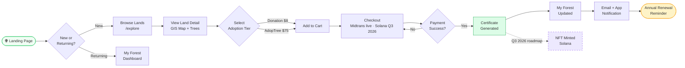
```mermaid
flowchart LR
    A([🌐 Landing Page]) --> B{New or<br/>Returning?}
    B -->|New| C[Browse Lands<br/>/explore]
    B -->|Returning| D[My Forest<br/>Dashboard]
    C --> E[View Land Detail<br/>GIS Map + Trees]
    E --> F{Select<br/>Adoption Tier}
    F -->|Donation $8| G[Add to Cart]
    F -->|AdopTree $75| G
    G --> H[Checkout<br/>Midtrans live · Solana Q3 2026]
    H --> I{Payment<br/>Success?}
    I -->|Yes| J[Certificate<br/>Generated]
    I -->|No| H
    J --> L[My Forest<br/>Updated]
    L --> M[Email + App<br/>Notification]
    M --> N([Annual Renewal<br/>Reminder])
    J -.->|Q3 2026 roadmap| K[NFT Minted<br/>Solana]

    style A fill:#f0fdf4,stroke:#22c55e
    style J fill:#dcfce7,stroke:#16a34a
    style K fill:#ede9fe,stroke:#7c3aed,stroke-dasharray: 5 5
    style N fill:#fef3c7,stroke:#f59e0b
```

### 9.2 Corporate CSR Flow (B2B)

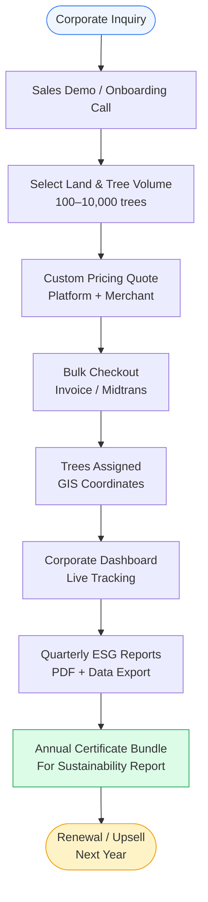
```mermaid
flowchart TD
    A([Corporate Inquiry]) --> B[Sales Demo / Onboarding Call]
    B --> C[Select Land & Tree Volume<br/>100–10,000 trees]
    C --> D[Custom Pricing Quote<br/>Platform + Merchant]
    D --> E[Bulk Checkout<br/>Invoice / Midtrans]
    E --> F[Trees Assigned<br/>GIS Coordinates]
    F --> G[Corporate Dashboard<br/>Live Tracking]
    G --> H[Quarterly ESG Reports<br/>PDF + Data Export]
    H --> I[Annual Certificate Bundle<br/>For Sustainability Report]
    I --> J([Renewal / Upsell<br/>Next Year])

    style A fill:#eff6ff,stroke:#3b82f6
    style I fill:#dcfce7,stroke:#16a34a
    style J fill:#fef3c7,stroke:#f59e0b
```

### 9.3 Merchant Onboarding & Revenue Flow

```mermaid
flowchart LR
    A([NGO / Merchant<br/>Registration]) --> B[Identity Verification<br/>Admin Review]
    B --> C[Land Registration<br/>Upload GIS Polygon]
    C --> D[Tree Data Entry<br/>CSV Import or Manual]
    D --> E{Activate<br/>Campaign?}
    E -->|Yes| F[Create Campaign<br/>Set Custom Pricing]
    E -->|No| G[List Available<br/>Trees on Platform]
    F --> G
    G --> H[Donors Browse<br/>& Adopt]
    H --> I[Platform Fee Deducted<br/>Net held in Milestone Escrow]
    I --> J[M1 Planted 40% → M2 Alive 30% → M3 Thriving 30%<br/>each field-verified + admin-approved]
    J --> K[Payout Batch<br/>Bank Transfer + Reference]

    style A fill:#f0fdf4,stroke:#22c55e
    style J fill:#dcfce7,stroke:#16a34a
```

### 9.4 Platform Revenue Flow

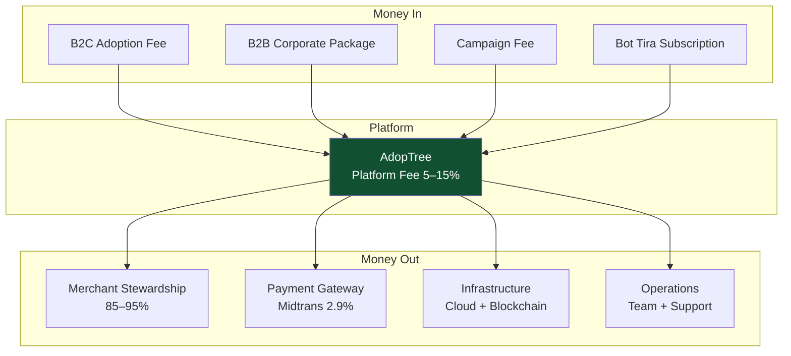
```mermaid
flowchart TD
    subgraph "Money In"
        A1[B2C Adoption Fee]
        A2[B2B Corporate Package]
        A3[Campaign Fee]
        A4[Bot Tira Subscription]
    end
    subgraph "Platform"
        B[AdopTree<br/>Platform Fee 5–15%]
    end
    subgraph "Money Out"
        C1[Merchant Stewardship<br/>85–95%]
        C2[Payment Gateway<br/>Midtrans 2.9%]
        C3[Infrastructure<br/>Cloud + Blockchain]
        C4[Operations<br/>Team + Support]
    end
    A1 & A2 & A3 & A4 --> B
    B --> C1 & C2 & C3 & C4

    style B fill:#115031,color:#fff
```

---

## 10. Technology Architecture

### 10.1 Stack Overview

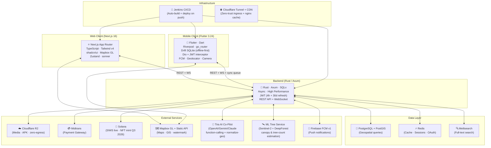
```mermaid
graph TB
    subgraph "Web Client (Next.js 16)"
        FE["⚛️ Next.js App Router<br/>TypeScript · Tailwind v4<br/>shadcn/ui · Mapbox GL<br/>Zustand · sonner"]
    end
    subgraph "Mobile Client (Flutter 3.24)"
        MO["📱 Flutter · Dart<br/>Riverpod · go_router<br/>Drift SQLite (offline-first)<br/>Dio + JWT interceptor<br/>FCM · Geolocator · Camera"]
    end
    subgraph "Backend (Rust / Axum)"
        BE["🦀 Rust · Axum · SQLx<br/>Async · High Performance<br/>JWT (4h + 30d refresh)<br/>REST API + WebSocket"]
    end
    subgraph "Data Layer"
        DB["🐘 PostgreSQL + PostGIS<br/>(Geospatial queries)"]
        RD["⚡ Redis<br/>(Cache · Sessions · OAuth)"]
        MS["🔍 Meilisearch<br/>(Full-text search)"]
    end
    subgraph "External Services"
        R2["☁️ Cloudflare R2<br/>(Media · APK · zero-egress)"]
        MT["💳 Midtrans<br/>(Payment Gateway)"]
        SOL["🔮 Solana<br/>(SIWS live · NFT mint Q3 2026)"]
        MB["🗺️ Mapbox GL + Static API<br/>(Maps · GIS · watermark)"]
        BOT["🤖 Tira AI Co-Pilot<br/>(OpenAI/Gemini/Claude<br/>function-calling + normalize-geo)"]
        ML["🛰️ ML Tree Service<br/>(Sentinel-2 + DeepForest<br/>canopy & tree-count estimation)"]
        FCM["🔔 Firebase FCM v1<br/>(Push notifications)"]
    end
    subgraph "Infrastructure"
        CI["🔧 Jenkins CI/CD<br/>(Auto-build + deploy on push)"]
        CF["🌐 Cloudflare Tunnel + CDN<br/>(Zero-trust ingress + nginx cache)"]
    end

    FE <-->|REST + WS| BE
    MO <-->|REST + WS + sync queue| BE
    BE <--> DB & RD & MS
    BE <--> R2 & MT & SOL & FCM
    FE <--> MB
    MO <--> MB
    BE <--> BOT & ML
    CI --> FE & BE & MO
```

### 10.2 Why Rust for Backend?

| Metric | Rust/Axum | Node.js | Java Spring |
|---|---|---|---|
| **Memory usage** | ~15 MB | ~150 MB | ~300 MB |
| **Request throughput** | ~180K req/s | ~40K req/s | ~50K req/s |
| **Startup time** | < 50ms | ~500ms | ~3–10s |
| **Type safety** | Compile-time guarantee | Runtime only | Partial |
| **Cost efficiency** | 10x cheaper infra vs Node.js at scale | Baseline | 1.5x baseline |

> **Bottom line:** AdopTree is built to scale without proportional cost increase — a key advantage at high adoption volume.

### 10.3 Key Technical Differentiators

- **Tira AI Co-Pilot (multi-provider, abuse-hardened)** — AI that *operates the product*, not just answers questions: client-side tool-calling fills forms live, a `normalize-geo` endpoint turns arbitrary geo files into the AdopTree standard, and a reusable security layer (fail-closed budget, per-identity caps, strict-identity reload, anti-spoof IP) treats every write-capable AI surface as a first-class abuse surface. Provider is runtime-switchable (OpenAI/Gemini/Claude) — no lock-in, cheapest capable model wins. See §6.6
- **Milestone Escrow ledger (v2.6)** — donor funds disbursed per verified milestone on an append-only financial ledger with double-gate release (field evidence → admin approval), refund/clawback awareness, and deterministic remainder-based splits. Payment infrastructure competitors would need quarters to replicate — the trust thesis made executable. See §6.8
- **Financial-grade account security (v2.6)** — TOTP two-factor authentication with AES-256-GCM-encrypted secrets, single-use hashed backup codes, rate-limited challenges, and an admin recovery path — a platform holding escrowed funds is financial infrastructure
- **PostGIS** — Geospatial polygon storage and tree-level GPS tracking at sub-meter precision
- **Cloudflare R2** — Zero-egress-fee media storage for tree photos, 360° content, certificates, **and APK distribution** (versioned + `latest.apk` alias)
- **Mapbox (generous free tier)** — Maps GL JS (web), Static API (mobile watermark), and Mobile SDK run **inside Mapbox's free tier** at AdopTree's current scale: 50,000 web map loads/month, 50,000 Static API requests/month, 25,000 mobile MAU/month, and 100,000 Geocoding calls/month are all complimentary. AdopTree only crosses into paid usage **after** ~25K monthly active app users or ~50K daily web page-views — beyond Year 1 projections (see §14). Strategic cost advantage: zero infrastructure spend on mapping until product-market fit is proven; usage-based pricing thereafter scales linearly with revenue, not ahead of it.
- **Solana foundation** — Wallet authentication (SIWS — Sign-In With Solana) live in production with ed25519 signature verification; NFT metadata schema + REST API live; on-chain Metaplex minting scheduled Q3 2026 (see §10.5 for honest scope and gap)
- **Meilisearch** — Sub-millisecond full-text search across 100K+ trees and lands
- **Multi-language** — English, Indonesian, Arabic (RTL support) — opens Gulf market
- **Offline-first mobile** — Drift SQLite + idempotent sync queue (`mobile_sync_queue` with `client_ref UNIQUE`); field teams work in zero-signal forest areas, data syncs on reconnect
- **Anti-tamper field evidence** — In-app camera burns GPS + timestamp + mini-map *into pixel data* at capture (`image` pure-Dart package); EXIF + watermark are independent attestations
- **Session resilience** — JWT (4h access + 30d refresh) with axios interceptor mutex queue; eliminates spurious logouts during long field sessions

### 10.4 Mobile Architecture Highlights

- **Sync queue with idempotency** — Every mobile submission carries a `client_ref` (UUID v7); BE dedups via `UNIQUE` constraint. Retry-safe; partial-success batches don't corrupt state.
- **Dual-gate inspection** — Inspection upload requires both proximity (≤10 m from tree GPS) AND heading alignment (±45° from tree-to-observer bearing). Combined with watermarked camera, this makes desk-spoofing field reports computationally hostile.
- **Tier-aware UI** — Mobile UI dynamically gates actions by contributor tier (capability flags fetched at login). Public users see "submit for review"; Verified users see direct submit; Field Inspectors see surveillance options.
- **Brand-aligned distribution** — APK launcher icon + splash + in-app logos all generated from canonical brand SVG (`flutter_launcher_icons` + `flutter_native_splash`) — single source of truth across web + mobile.

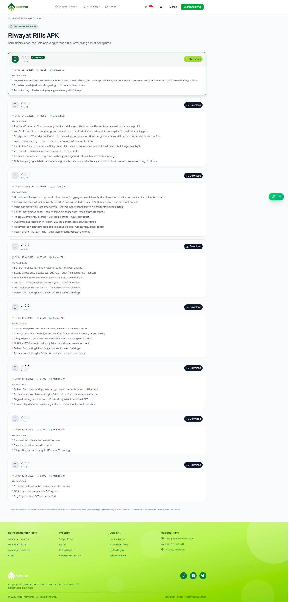
*Figure 7 — Live release page. 9 production builds shipped in 5 weeks (Build 6 → 14, late April through end of May 2026) — concrete engineering velocity. Each card shows version, build number, release date, file size, and changelog. Latest build is auto-promoted as the default download.*

### 10.5 Blockchain & NFT — Honest Status Disclosure

> **Why this section exists.** Blockchain claims are easy to overstate and easy to verify. This section gives investors the unvarnished status so technical due diligence finds no surprises.

#### What is shipped today (~15% of the long-term blockchain scope)

| Component | Status | Evidence |
|---|---|---|
| **Solana Wallet Authentication (SIWS)** | ✅ Production-ready | Full ed25519 signature verification, nonce generation, JWT issuance, expiry handling. Phantom wallet supported. |
| **NFT Metadata Database Schema** | ✅ Production-ready | Three tables (`nft_metadata`, `nft_transactions`, `tree_health_records`) with proper indexes on mint address, owner wallet, and transaction signature |
| **NFT Metadata REST API** | ✅ Production-ready | Endpoints `GET /nfts/{mint}`, `GET /nfts/{mint}/history`, `POST /nfts/refresh` |
| **Frontend Solana UI Components** | ✅ Production-ready | Wallet connection UI, Phantom detection, SOL balance display, payment flow scaffolding |

#### What is stubbed / mock today (~35% of the long-term scope)

| Component | Reality | Why it ships post-Q3 2026 |
|---|---|---|
| **Solana SOL Payment Processing** | UI complete; backend handler returns a mock wallet address and a 2-second simulated transaction | Backend wire-up requires adding `solana-client` + transaction verification — bundled with the NFT mint sprint |
| **NFT Metadata Refresh** | API endpoint live; on-chain refresh logic only increments a counter (no Solana RPC call) | Activated alongside the mint pipeline (shares RPC client) |
| **NFT Mint Trigger on AdopTree Adoption** | Database columns (`nft_mint_tx`, `nft_minted_at`) reserved; all code paths currently set them to `None` | Awaits the Metaplex mint service |

#### What is planned but not yet started (~50%)

- **Solana SDK integration** — `Cargo.toml` does not yet include `solana-client`, `solana-sdk`, `mpl-token-metadata`, or `spl-token`. Only signature-verification crates (`ed25519-dalek`, `bs58`, `base64`) are in use today.
- **On-chain NFT minting pipeline** — Metaplex Token Metadata program integration, mint authority key management, treasury wallet hardening
- **Secondary NFT marketplace** (peer-to-peer tree ownership trading) — roadmap Q1–Q3 2028
- **Blockchain volatility handling** — Stablecoin fallback / SOL price circuit-breaker for AdopTree tier pricing

#### What this means for the raise

- **No claim in this PRD assumes NFT minting is live today.** Every NFT-related phrase is qualified with "(Q3 2026)" or scoped to the SIWS/metadata layer that is genuinely shipped.
- **Core product works without Web3.** The Silver and Platinum tiers — and all merchant/admin/mobile flows — are entirely web2 today and remain functional regardless of NFT mint timing.
- **NFT minting is a Q3 2026 engineering milestone**, included in the **Product & Technology** allocation of the seed round (§16.2 — 25% / $125K covers Solana mint + surveillance system + mobile app). Estimated 6–8 engineering weeks for mint pipeline + treasury hardening.
- **Roadmap honesty is itself a moat.** Greentech buyers and Indonesian regulators (BAPPENAS, KLHK, BWI) consistently penalize over-claimed blockchain narratives. A platform that ships SIWS today and discloses the mint gap is more durable to due diligence than one that paints over the gap.

---

## 11. Competitive Landscape

### 11.1 Competitor Matrix

| Platform | Geography | Transparency | NFT | GIS Tracking | Indonesia Focus | Price Point |
|---|---|---|---|---|---|---|
| **AdopTree** 🌳 | Indonesia / Global | ✅ GIS + Field Evidence | 🟡 Foundation live · mint Q3 2026 | ✅ Tree-level | ✅ Native | $8–$75 |
| Offset.earth | Global | Partial | ❌ | ❌ | ❌ | $5–$30/mo |
| Gold Standard | Global | ✅ | ❌ | Partial | ❌ | Institutional |
| Terrapass | USA | Partial | ❌ | ❌ | ❌ | $8–$200 |
| One Tree Planted | Global | ❌ | ❌ | ❌ | ❌ | $1/tree |
| Local CSR Programs | Indonesia | ❌ Manual | ❌ | ❌ | ✅ | Varies |

### 11.2 AdopTree's Moats

1. **Transparent & Trusted** — GPS tracking + watermarked anti-tamper field evidence (mobile in-app camera burns coordinates/timestamp/mini-map into pixel data) eliminates greenwashing doubt — and since v2.6, **the payment rail itself enforces it**: donor funds sit in milestone escrow and release only against field-verified, admin-approved stages on an append-only ledger (§6.8). *"A monitoring platform for your donation that ensures it goes to a proper place"* is now a mechanism, not a slogan. Blockchain audit trail layered in as Q3 2026 reinforcement.
2. **Multiverse Platform** — Not just a donation button; a full ecosystem with Social Media, Marketplace, and Green Forum connecting every stakeholder (donor, NGO, corporate, government, cooperative)
3. **Legal-First** — Crowd funding umbrella for all **legal entities** (GO/NGO/individual/corporate/coop) with **legal standing soil** — rare in this space
4. **Wakaf Tier** — Only tree adoption platform with Shariah-compliant perpetual endowment; opens Gulf + Indonesian Islamic market
5. **Rust Backend** — 10x infrastructure cost advantage at scale vs. typical Node.js platforms
6. **Bot Tira** — Proprietary AI engagement layer (powered by Gemini, function-calling against live platform data) that increases merchant retention and donor re-engagement
7. **International by Design** — Multi-language (ID/EN/AR), multi-currency (IDR + SOL), multi-religion (general + Wakaf) from day one

---

## 12. Go-to-Market Strategy

### 12.1 Three-Pillar GTM Strategy

AdopTree's go-to-market is built on three mutually reinforcing pillars confirmed by the founding team:

| Pillar | Mechanic | Primary Segment |
|--------|----------|-----------------|
| **Networks** | Leverage existing NGO, community, and Islamic philanthropic networks for organic supply & demand | Merchant partners, Wakaf donors |
| **Donations** | B2C digital campaigns — social media, influencer, and community-driven donor acquisition | Individual donors (Donasi Silver/Gold) |
| **CSR** | Direct outreach to corporate CSR departments; proven ROI via GIS data + ESG certificates | Corporate Platinum packages |

### 12.2 Phase 1 — Foundation (H2 2026)

**Focus:** Prove supply-demand fit with real merchants and real transactions

- Move from demonstration merchant (**"Akademi Buah Nusantara"** — staging-only seed data used to validate end-to-end flows) → first paying merchant cohort → 30 active merchant/NGO partners (Java, Kalimantan, Papua)
- Activate B2C campaigns via Instagram/TikTok targeting eco-conscious millennials 25–35
- Close 2–3 pilot corporate CSR packages (Donasi/Wakaf Platinum)
- Activate Bot Tira subscription for early merchants
- PR positioning: *"Indonesia's first GIS-verified tree adoption platform with anti-tamper field evidence and Solana blockchain foundation"* — leads with what is verifiably shipped (GIS + field evidence + SIWS) rather than over-claiming mint

### 12.3 Phase 2 — Scale (2027)

**Focus:** B2B acceleration + carbon credit infrastructure

- Dedicated corporate sales team (2 AE focused on CSR market)
- Pursue formal engagement with KLHK (Indonesia Ministry of Forestry) for regulatory credibility
- Integration with IDX Carbon exchange (Indonesia regulated carbon market)
- Expand to 150 merchant partners across 12+ provinces
- Arabic interface + Gulf diaspora targeting (Wakaf segment)
- Bot Tira v2: multilingual, deeper data integrations

### 12.4 Phase 3 — Expansion (2028)

**Focus:** International rollout + carbon monetization

- Expand to Malaysia, Philippines — first international markets
- Secondary NFT marketplace (peer-to-peer tree ownership trading)
- Carbon credit trading desk (institutional buyers, VCS-certified)
- White-label platform licensing for large NGOs and banks
- **Target: 100,000 Ha land under management → 500,000,000 trees reserved**

### 12.5 Acquisition Channels

| Channel | Target | Cost | Estimated CAC |
|---|---|---|---|
| Instagram/TikTok Ads | B2C (Rina persona) | Paid | $8–$12 |
| Google Ads (CSR keywords) | B2B (Pak Budi persona) | Paid | $30–$60 |
| NGO/Merchant Referrals | Supply side | Organic | $0 |
| Corporate Sales Outreach | Enterprise | Outbound | $80–$150 |
| Islamic Community Partnerships | Wakaf segment | Partnership | $5–$10 |
| PR / Media | Brand awareness | Low | Blended |

---

## 13. Roadmap & Milestones

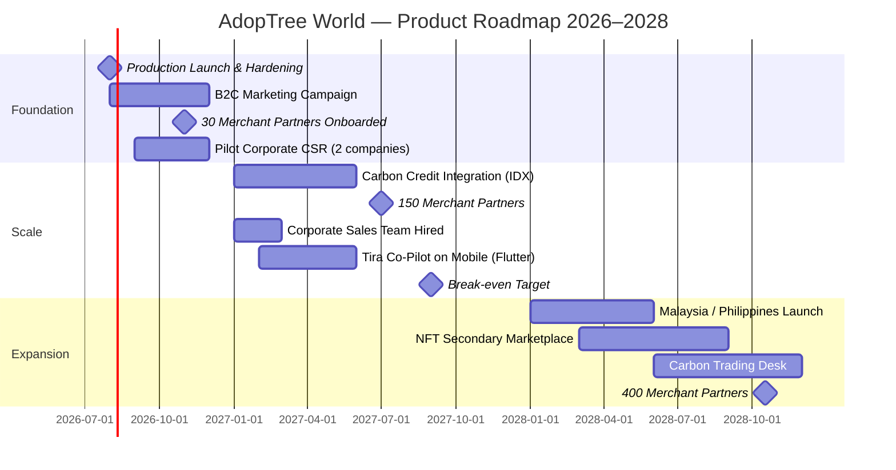
```mermaid
gantt
    title AdopTree World — Product Roadmap 2026–2028
    dateFormat  YYYY-MM
    section Foundation
    Production Launch & Hardening    :milestone, 2026-07, 2026-09
    B2C Marketing Campaign           :2026-08, 2026-12
    30 Merchant Partners Onboarded   :milestone, 2026-10, 2026-12
    Pilot Corporate CSR (2 companies):2026-09, 2026-12

    section Scale
    Carbon Credit Integration (IDX)  :2027-01, 2027-06
    150 Merchant Partners             :milestone, 2027-06, 2027-08
    Corporate Sales Team Hired        :2027-01, 2027-03
    Tira Co-Pilot on Mobile (Flutter) :2027-02, 2027-06
    Break-even Target                 :milestone, 2027-09, 2027-09

    section Expansion
    Malaysia / Philippines Launch     :2028-01, 2028-06
    NFT Secondary Marketplace         :2028-03, 2028-09
    Carbon Trading Desk               :2028-06, 2028-12
    400 Merchant Partners             :milestone, 2028-09, 2028-12
```

### Key Milestones

| Milestone | Target Date | Success Metric |
|---|---|---|
| **Staging Live** | ✅ April 2026 | Full platform accessible at staging domain |
| **End-to-end Flow Validated** | ✅ April 2026 | Demo merchant ("Akademi Buah Nusantara") exercises every flow — land → tree → campaign → checkout → earnings → withdrawal |
| **First Paying Merchant** | Target Q3 2026 | Move from demo data to first real merchant transacting with real donors — primary objective of this raise |
| **Mobile Field App MVP** | ✅ May 2026 (5wk ahead) | APK Build 14 live, GPS-tagging + offline sync operational (now Build 30) |
| **Public Contributor System** | ✅ May 2026 | Tier 1 + Tier 2 auto-promotion live, leaderboard operational |
| **Review Queue (Quality Gate)** | ✅ May 2026 | Admin/merchant approval workflow for all field submissions |
| **QR Tree Identity Verification** | ✅ May 2026 (Phase 2.23) | Anti-misidentification QR system live |
| **Realtime Chat** | ✅ May 2026 (Phase 2.26) | WebSocket 1:1 chat with voice notes |
| **AI Tree Baseline & Tree-Count Estimation** | ✅ June 2026 | Sentinel-2 + DeepForest estimation + public Land-Analyzer tool live (asset quantification before transacting) |
| **Tira AI Co-Pilot (multi-surface)** | ✅ June 2026 | Create-land / campaign / registration by chat + AI geo-import (KML/GPX/CSV→standard) + reusable co-pilot security layer + bilingual (id/en/ar), live on staging |
| **Milestone Escrow Disbursement** | ✅ July 2026 | Donor funds held + released per verified milestone (40/30/30) on an append-only ledger; admin Keuangan console, merchant funnel, donor journey stepper — all live incl. historical backfill |
| **Tira-First Support 24/7** | ✅ July 2026 | AI deflection with live data → structured tickets w/ AI triage + transcript → admin inbox spawning direct chat |
| **Two-Factor Authentication** | ✅ July 2026 | TOTP + backup codes, encrypted secrets, web + mobile login challenge, admin recovery |
| **KTP-Verified Land Manager** | ✅ July 2026 | Every new land requires an identity-verified field PIC (Pengelola Lahan) — supply-side trust layer |
| **Live Contributor GPS Tracking** | ✅ July 2026 | Field App Build 30 ping pipeline fix — real telemetry on the flat activity map with history replay |
| **Public Production Launch** | H2 2026 | Platform live, real payments processing |
| **Solana On-chain NFT Minting Live** | Q3 2026 | Metaplex mint pipeline + Solana SOL payment activation. Foundation already shipped: SIWS wallet auth, metadata schema, REST API (see §10.5) |
| **First 100 Paid Adoptions** | Q4 2026 | Revenue from real transactions |
| **First Corporate CSR Deal** | Q4 2026 | Donasi/Wakaf Platinum package signed |
| **30 Active Merchants** | Q4 2026 | Supply-side diversity established |
| **VCS Carbon Certification** | 2027 | Enables carbon credit trading layer |
| **$498K Annual Revenue** | EOY 2027 | Unit economics proven |
| **Break-even** | Q3 2027 | Operational profitability |
| **International Expansion** | 2028 | Malaysia / Philippines live |
| **100K Ha Under Management** | 2028 | 500M trees reserved — 3yr commercial target |
| **$2.6M Annual Revenue** | EOY 2028 | Series A readiness |

> **Note on v2.1 update:** Six milestones marked ✅ above were originally scheduled for Q3 2026 in v2.0 but were delivered 4–8 weeks ahead of schedule. This execution velocity is the primary signal we ask investors to weigh — *"raising to grow, not to build"* is now demonstrably true.

---

## 14. Financial Projections

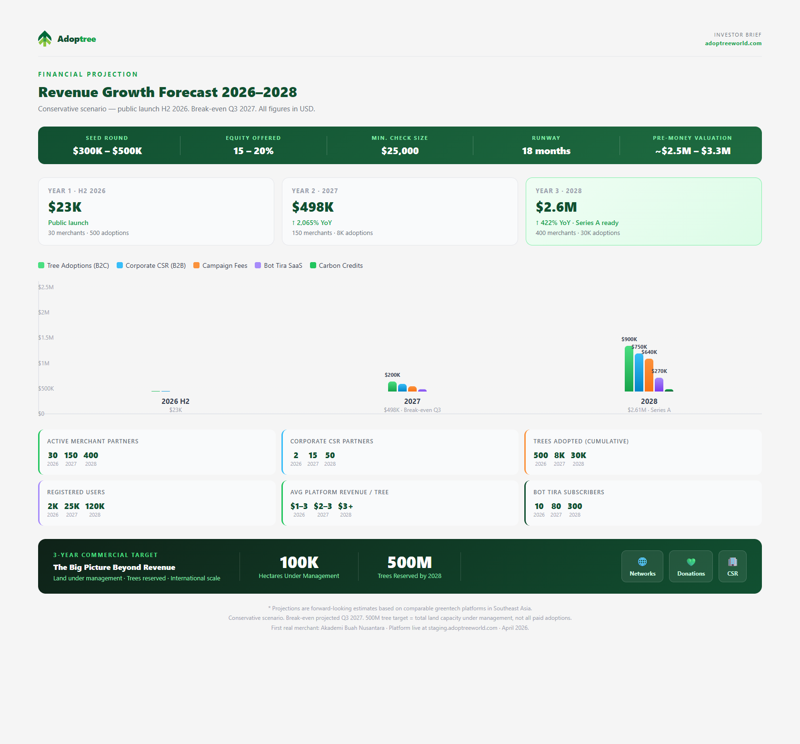
*Figure 8 — Conservative scenario. Public launch H2 2026 ($23K) → 2027 ($498K, 2,065% YoY) → 2028 ($2.6M, 422% YoY, Series A ready). Break-even Q3 2027. Seed round $300K–$500K for 15–20% equity.*

### 14.1 Revenue Summary

| | H2 2026 (Launch) | 2027 | 2028 |
|---|---|---|---|
| **Tree Adoptions (B2C)** | $10,000 | $200,000 | $900,000 |
| **Corporate CSR (B2B)** | $10,000 | $150,000 | $750,000 |
| **Campaign Platform Fee** | — | $100,000 | $640,000 |
| **Bot Tira SaaS** | $3,000 | $48,000 | $270,000 |
| **Carbon Credits** | — | — | $50,000 |
| **Total Revenue** | **$23,000** | **$498,000** | **$2,610,000** |
| YoY Growth | — | +2,065% | +424% |

### 14.2 Key Operating Metrics

| Metric | H2 2026 | 2027 | 2028 |
|---|---|---|---|
| Active Merchants | 30 | 150 | 400 |
| Corporate Partners | 2 | 15 | 50 |
| Trees Adopted (cumulative) | 500 | 8,000 | 30,000 |
| Registered Users | 2,000 | 25,000 | 120,000 |
| Bot Tira Subscribers | 10 | 80 | 300 |
| Avg. Revenue/Tree | $20 | $25 | $30 |

### 14.3 Long-term Scale Target

| Metric | 3-Year Commercial Target (2028) |
|--------|--------------------------------|
| Land under management | **100,000 Ha** |
| Trees reserved | **500,000,000** (~5,000 trees/Ha) |
| Strategy | Networks + Donations + CSR |

> *"Our 3-year target of 100K Ha positions AdopTree as the largest verified tree adoption network in Southeast Asia — turning Indonesia's deforestation crisis into a fundable, trackable asset class."*

### 14.4 Cost Structure (Estimates)

| Cost Category | 2026 | 2027 | 2028 |
|---|---|---|---|
| Infrastructure (VPS, CDN, Cloudflare) | $3,600 | $12,000 | $36,000 |
| Payment Gateway Fees (2.9%) | $667 | $14,442 | $75,690 |
| Team (salaries + contractors) | $36,000 | $120,000 | $360,000 |
| Marketing & Sales | $10,000 | $60,000 | $180,000 |
| Legal & Compliance | $5,000 | $15,000 | $30,000 |
| **Total OPEX** | **$55,267** | **$221,442** | **$681,690** |
| **Net Revenue** | **($32,267)** | **$276,558** | **$1,928,310** |

> ⚡ *Infrastructure cost advantage: Rust backend keeps infra costs ~10x lower than typical Node.js platforms at equivalent load.*

---

## 15. Risks & Mitigations

| Risk | Probability | Impact | Mitigation |
|---|---|---|---|
| **Pre-revenue, no paying merchants yet** | High (current state) | High | This is the explicit problem this raise solves — 35% of funds go to Sales & BD specifically to convert the staging demo into a real merchant cohort. Platform is built, demo flow validated end-to-end; the gap is distribution, not product |
| **Slow merchant onboarding velocity** | Medium | High | Three parallel acquisition channels — existing NGO/Islamic networks (CEO-led), B2C donor pull (creating bottom-up demand for supply), and outbound corporate-CSR sales |
| **Carbon credit regulation uncertainty** | Medium | Medium | Build feature but don't depend on it for core revenue |
| **Payment gateway friction (IDR)** | Low | Medium | Midtrans + QRIS covers 95% of Indonesian payment methods |
| **NFT mint delivery risk (Q3 2026)** | Medium | Medium | Foundation already shipped (SIWS auth + metadata schema + REST API live). Remaining work is well-scoped Metaplex integration. Core product (Silver, Platinum, all merchant/admin/mobile flows) is fully web2 and works independent of mint timing — see §10.5 |
| **Blockchain (Solana) price volatility** | Low | Low | SOL payment is an optional tier; IDR (Midtrans) is the primary production payment path; AdopTree-tier USD pricing buffered via stablecoin fallback (architecture pending mint sprint) |
| **Greenwashing accusations** | Low | High | GIS tracking + watermarked anti-tamper field evidence (mobile in-app camera burns GPS + timestamp + mini-map into pixel data) + dual-gate proximity inspection provides today's audit trail. Blockchain audit layer activates Q3 2026 |
| **Competition from large platforms** | Low | Medium | Indonesia-native + Wakaf + supply-side moat (contributor tier system) hard to replicate quickly |
| **Merchant churn (once acquired)** | Medium | Medium | Bot Tira subscription creates stickiness; earnings dashboard value; Field App reduces operational cost per merchant |
| **Regulatory (Forestry law)** | Low | High | Working within existing Perhutanan Sosial framework; legal review ongoing |

---

## 16. Investment Ask

### 16.1 Round Summary

| Item | Detail |
|------|--------|
| **Round Type** | Seed Round |
| **Funding Target** | USD $300,000 – $500,000 |
| **Soft Close** | $300,000 |
| **Hard Cap** | $750,000 (if over-subscribed) |
| **Equity Offered** | 15–20% |
| **Pre-money Valuation** | ~$2.5M – $3.3M |
| **Minimum Check Size** | $25,000 per investor |
| **Target Runway** | 18 months → Break-even Q3 2027 |

> *Note: Equity % and exact raise amount are confirmed by the founding team and subject to final term sheet. Figures above represent the recommended structure.*

### 16.2 Use of Funds

*Allocation for $500,000 raise:*

| Category | % | Est. USD | Purpose |
|----------|---|----------|---------|
| **Sales & Business Development** | 35% | $175,000 | Merchant acquisition, corporate CSR outreach, partnership BD |
| **Product & Technology** | 25% | $125,000 | Solana on-chain NFT minting activation (Metaplex + treasury), Solana SOL payment backend wire-up, surveillance system enhancements, continued mobile app build velocity |
| **Operations & Team** | 25% | $125,000 | Team salaries, VPS infrastructure, tooling |
| **Legal & Compliance** | 10% | $50,000 | PT establishment, Wakaf endorsement (MUI/BWI), VCS carbon standard |
| **Marketing & Community** | 5% | $25,000 | Brand campaigns, social media, Green Forum community building |

> **Priority:** Sales & BD is the top allocation because AdopTree's revenue is directly proportional to merchant count. Every merchant that joins brings their own tree inventory and donor base to the platform.

### 16.3 Financial Path to Break-even

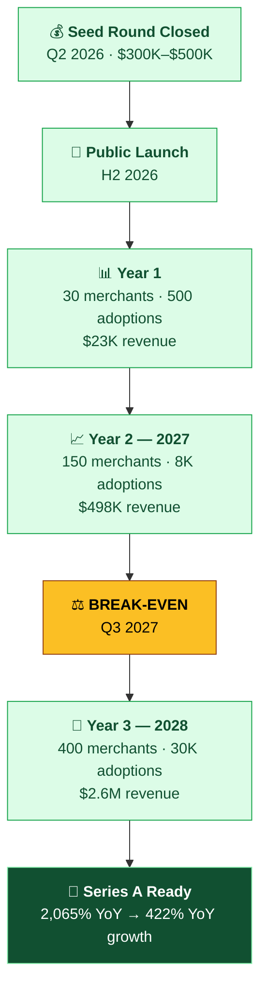
```mermaid
flowchart TD
    Raise["💰 <b>Seed Round Closed</b><br/>Q2 2026 · $300K–$500K"]
    Launch["🚀 <b>Public Launch</b><br/>H2 2026"]
    Y1["📊 <b>Year 1</b><br/>30 merchants · 500 adoptions<br/>$23K revenue"]
    Y2["📈 <b>Year 2 — 2027</b><br/>150 merchants · 8K adoptions<br/>$498K revenue"]
    BE["⚖️ <b>BREAK-EVEN</b><br/>Q3 2027"]
    Y3["🌟 <b>Year 3 — 2028</b><br/>400 merchants · 30K adoptions<br/>$2.6M revenue"]
    SA["🦄 <b>Series A Ready</b><br/>2,065% YoY → 422% YoY growth"]

    Raise --> Launch
    Launch --> Y1
    Y1 --> Y2
    Y2 --> BE
    BE --> Y3
    Y3 --> SA

    classDef milestone fill:#dcfce7,stroke:#16a34a,color:#115031
    classDef breakeven fill:#fbbf24,stroke:#92400e,color:#000
    classDef ready fill:#115031,stroke:#86efac,color:#fff
    class Raise,Launch,Y1,Y2,Y3 milestone
    class BE breakeven
    class SA ready
```

### 16.4 What We're Looking For in an Investor

Beyond capital, the ideal investor brings:
- **Network** in Indonesian corporate CSR, government (KLHK, BPDLH), or Islamic finance (BWI)
- **Experience** in greentech, impact investing, or Southeast Asian markets
- **Strategic value** — connections to potential merchant partners or corporate CSR buyers accelerate growth faster than capital alone
- **Patient capital** — 18-month path to profitability, mission-driven, long-term horizon (3-year commercial target is 500M trees)

### 16.5 Why Now?

1. **Platform is built and live** — we're not raising to build; we're raising to grow. Staging is live at `staging.adoptreeworld.com`, the mobile Field App is shipping (Build 30), and the codebase has shipped 30+ phases — including the **Tira AI Co-Pilot** and AI tree-count estimation — in the months before this raise, all on a Jenkins push-to-deploy pipeline
2. **End-to-end flow is proven, not just promised** — a demonstration merchant ("Akademi Buah Nusantara") on staging exercises every step from land registration through donor adoption, payment processing, and merchant payout. The product is ready to onboard a real merchant the day Sales & BD funding is deployed; we are not pre-product or pre-flow, we are pre-revenue
3. **IDX Carbon launched 2023** — Indonesia's regulated carbon market is forming; early platform players will capture the registry advantage
4. **Indonesia's NDC commitments** (29% emission reduction by 2030) create immediate regulatory pressure on corporations to invest in verifiable green programs
5. **No dominant player** in Indonesia tree-adoption tech with GIS + anti-tamper field evidence + Wakaf + AI (with Solana NFT activating Q3 2026) — first-mover window is closing
6. **International from day one** — multi-language, multi-currency, Wakaf tier for Gulf market — rare for an Indonesia-based greentech startup at seed stage

---

## Appendix

### A. Technology Stack Summary

| Layer | Technology |
|---|---|
| Web Frontend | Next.js 16 (App Router), TypeScript, Tailwind CSS v4, shadcn/ui, Zustand, sonner |
| Mobile App | Flutter 3.24 (Dart), Riverpod, go_router, Drift SQLite (offline-first), Dio + JWT interceptor |
| Backend | Rust, Axum, SQLx (compile-time SQL verification) |
| Database | PostgreSQL + PostGIS |
| Cache & Sessions | Redis |
| Search | Meilisearch |
| Maps | Mapbox GL JS (web) + Mapbox Static API (mobile watermark) + flutter_map |
| Storage | Cloudflare R2 (media + APK distribution, zero-egress) |
| Payment | Midtrans Snap (IDR) live in production · Solana (SOL) UI built, backend wire-up Q3 2026 |
| Fund Disbursement | **Milestone Escrow** — per-adoption 3-stage release (40/30/30), append-only ledger, admin-gated payout batches |
| Blockchain | Solana (SPL NFT) — minting Q3 2026 |
| AI | Bot Tira — Gemini + function-calling against live platform data |
| Auth | JWT (4h access + 30d refresh, mutex queue), Google OAuth, Solana SIWS, **2FA TOTP (AES-256-GCM-encrypted secrets + backup codes)** |
| Push Notifications | Firebase Cloud Messaging (FCM v1) — web + mobile, deeplink routing |
| Realtime | WebSocket (chat, presence) |
| Field Evidence | In-app camera with pixel-burned watermark (GPS + timestamp + mini-map), dual-gate inspection (proximity + heading) |
| CI/CD | Jenkins + Docker (auto-build + deploy on push to `development` → staging) |
| CDN & Edge | Cloudflare Tunnel (zero-trust), Cloudflare CDN with per-path Cache Rules, nginx VPS reverse proxy |
| Languages | Indonesian, English, Arabic (RTL) |

### B. Visualization Index

All visuals are embedded inline at the sections referenced below.

| Visual | Section | Purpose |
|---|---|---|
| Market Opportunity (TAM / SAM / SOM rings) | §1 Executive Summary · §5 Market Opportunity | Multi-billion dollar green impact market funnel — global potential → regional reach → realistic Year-3 capture |
| Service Class Pricing Matrix | §6.3 Service Class Structure | Platform fee per tree per year across Silver/Gold/Platinum tiers × Wakaf/Donasi categories |
| Revenue Growth Forecast 2026–2028 | §13 Roadmap & Milestones | Conservative scenario bar chart + KPI cards, break-even Q3 2027 |
| Platform Ecosystem Map | §7 Business Model | 8-actor multi-sided platform: donors · merchants · land owners · contributors · mobile · NFT · bot · impact |
| Web Donor Experience (4-grid) | §6 Product Overview | Explore → Land detail → My Forest → Sertifikat Portfolio Hutan |
| Web Merchant Dashboard (4-grid, dark mode) | §6.2 Merchant Features | Overview · Lands · Earnings · Review Queue |
| Web Admin Console (4-grid, dark mode) | §6.2 Admin Features | Dashboard · Analytics · Review Queue · Contributor Map |
| Mobile Field App (6-grid) | §6.4 Mobile Field App | Login · Home · Plant Tree · Tag Tree · Tree Radar · Tree List |
| Mobile Anti-Tamper Evidence | §6.4 Mobile Field App | Dual-gate inspection · GPS-watermarked capture |
| Mobile Contributor Rewards + Admin Map | §6.5 Contributor Tier System | Adopoin balance + reward catalog · platform-wide contributor heatmap |
| APK Release History | §10 Technology Architecture | Live release page proving 9-build/5-week shipping cadence |
| Milestone Escrow (4-grid) | §6.8 Milestone Escrow | Admin Keuangan console · Merchant Escrow & Pencairan funnel · Donor Perjalanan Danamu stepper · KTP-verified land manager wizard |
| Support & Hardening (4-grid) | §6.9 Support & Hardening | User support center · Admin support inbox w/ AI triage · 2FA enrolment dialog · Live field-activity map |

### C. Glossary

| Term | Definition |
|---|---|
| **GIS** | Geographic Information System — GPS-based land & tree mapping |
| **NFT** | Non-Fungible Token — unique blockchain-based digital asset |
| **Wakaf** | Islamic perpetual endowment — Shariah-compliant donation structure |
| **CSR** | Corporate Social Responsibility |
| **ESG** | Environmental, Social, Governance — sustainability reporting framework |
| **NDC** | Nationally Determined Contribution — Indonesia's climate commitments |
| **KLHK** | Kementerian Lingkungan Hidup dan Kehutanan (Ministry of Forestry) |
| **IDX Carbon** | Indonesia Stock Exchange's carbon trading platform |
| **PostGIS** | PostgreSQL extension for geospatial data |
| **Solana** | High-speed, low-cost blockchain network for NFT minting |
| **FCM** | Firebase Cloud Messaging — push notification service |
| **Drift** | Flutter SQLite ORM used for offline-first mobile storage |
| **APK** | Android Package — Field App distribution format |
| **Contributor Tier** | Trust-tier system gating field submissions (Public → Verified → Field Inspector) |

### D. Delivered Phases (v2.0 → v2.5, April → June 2026)

Concrete execution log between PRD revisions. Each phase ships through development branch → Jenkins auto-build → auto-deploy to staging.

| Phase | Title | Surface |
|---|---|---|
| 2.9 | Push notifications (FCM v1) | Backend + Web + Mobile |
| 2.10 | Public Contributor modal pre-check | Web + Mobile |
| 2.11 | Review Queue (Lahan submissions) | Web (admin/merchant) |
| 2.11.1 | Capability flag — Tag Lahan Baru | Backend |
| 2.12 | Plant Tree mobile workflow + wizard refactor + species request | Mobile + Web + BE |
| 2.16 | Contributor tracking architecture | BE + Roadmap |
| 2.17 | Contributor tracking — GPS session + offline buffer + auto-start | Mobile + Web + BE |
| 2.18 | Land Owner dashboard redesign | Web |
| 2.19 | Planting Jobs flow + tracking consent default-ON | Mobile + Web + BE |
| 2.20 | Inspection Evidence Strengthening — watermark + multi-stage camera | Mobile + BE |
| 2.21 | Tree Density & Distance Measurement Tools | Mobile + Web |
| 2.23 | QR Tree Identity Verification | Mobile + Web + BE |
| 2.24 | Tagging Spacing Awareness — live status pill + warnings | Mobile |
| 2.25 | Livin'-style redesign + Tree List per Land + Submission detail | Mobile |
| 2.26 | Realtime Chat — WebSocket + voice notes + conversation actions | Mobile + BE |
| — | Brand Identity Refresh — new logo, Manrope, scoped dark mode | Web + Mobile (APK Build 14) |
| — | Session Resilience — JWT 4h/30d + interceptor mutex queue | BE + Web |
| — | **AI Tree Baseline + satellite/imagery tree-count estimation + public Land-Analyzer** | BE + Web + ML service |
| — | Multi-angle inspection v4 (compass axis) + offline-sync integrity | Mobile + BE |
| — | Instagram → Forum auto cross-post (#adoptreeforum) | BE + Web |
| — | Land overlap detection · land ownership claim · photo-based polygon verification | BE + Web |
| — | **Tira AI Co-Pilot** — create-land/campaign/registration by chat + AI geo-import (`normalize-geo`) + species autofill | BE + Web |
| — | **Co-pilot security layer** — fail-closed budget · per-identity caps · strict-identity reload · anti-spoof IP | BE |
| — | **Tira bilingual** — AI replies follow the platform locale (id/en/ar) | BE |
| — | Instant-donation smart defaults — quick chips · recommendation algorithm · "Tira pick for me" | Web |
| — | Land profile picture · gallery photo-source labeling · approved-inspection photos → public gallery | BE + Web |
| — | Wizard nav standardization (gated Next + clickable stepper) across create-land/campaign/tree/registration/donate | Web |
| — | Dedicated land-owner CTA section on the landing page | Web |

| — | **Milestone Escrow Fund Disbursement** — escrow + 3-stage release + append-only ledger + admin Keuangan console + merchant funnel + donor journey stepper + historical backfill | BE + Web |
| — | **Tira-First Support 24/7** — AI deflection tools + structured tickets (AI triage + transcript) + admin inbox → direct chat | BE + Web |
| — | **Two-Factor Authentication** — TOTP + backup codes, encrypted secrets, login challenge web + mobile, admin recovery | BE + Web + Mobile |
| — | **Pengelola Lahan** — KTP-verified land manager required at land creation; 6-step wizard (Legal merged into Identity); merchant-side rename | BE + Web |
| — | **Notification overhaul** — enum sync fix (list-vs-badge bug), snake_case serialization, bridge-trigger repair + backfill, merchant review-queue/sale/verification hooks | BE + Web |
| — | **Contributor tracking fixed end-to-end** — mobile session-id parse bug (0 pings ever → live telemetry), flat mercator map, merchant-scoped lands, 30-day history | BE + Web + Mobile |

**APK releases shipped:** Build 6 (initial beta) → … → Build 14 (brand rebrand, 29 May 2026) → Build 29 (photo-based land verification, June 2026) → **Build 30 (latest — live GPS tracking pipeline fix + 2FA login, July 2026)**.

---

*© 2026 AdopTree World. All projections are forward-looking estimates based on comparable greentech platforms in Southeast Asia. Actual results may differ.*

*Document version 2.6 · July 2026 · Prepared by the AdopTree World founding team — Sandhy Krisnamurthi, Aditira Jamhuri, Subekti Febriansyah. For investor discussion purposes only.*
