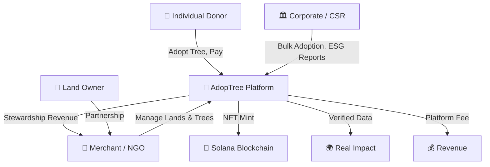
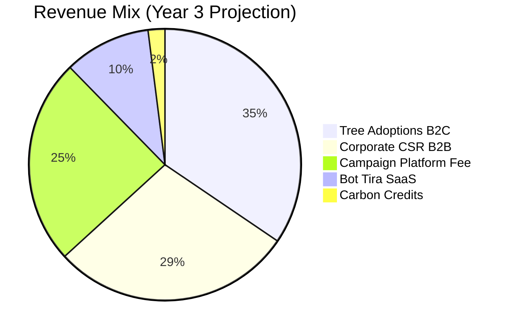
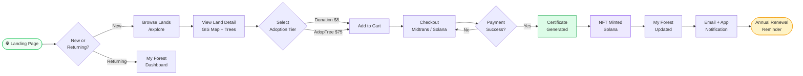
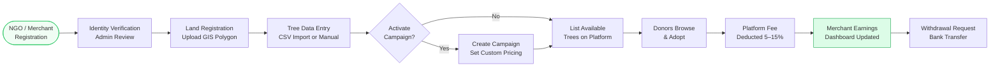
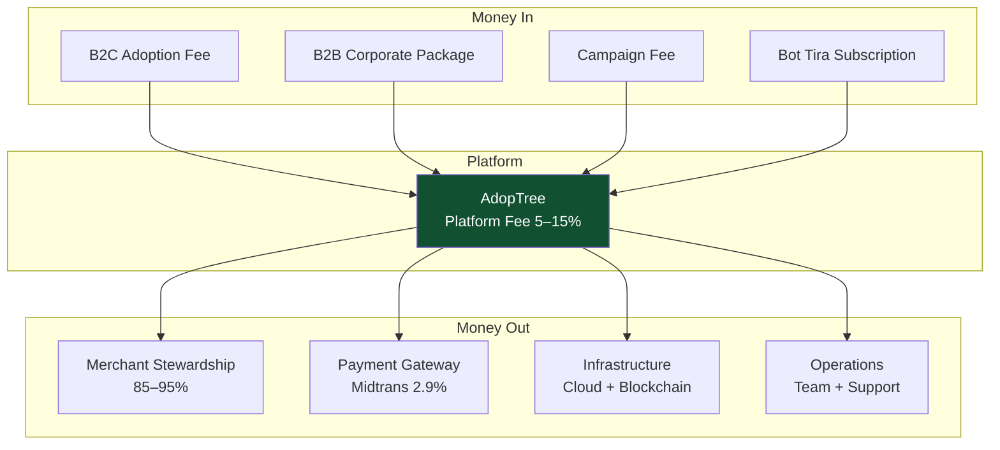
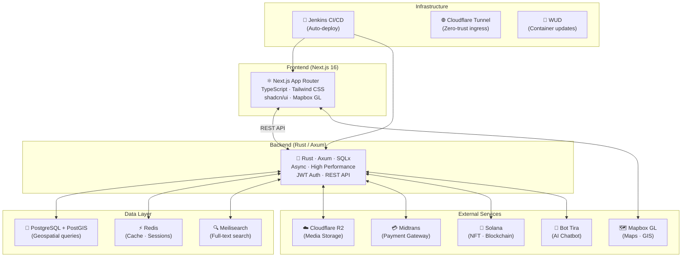
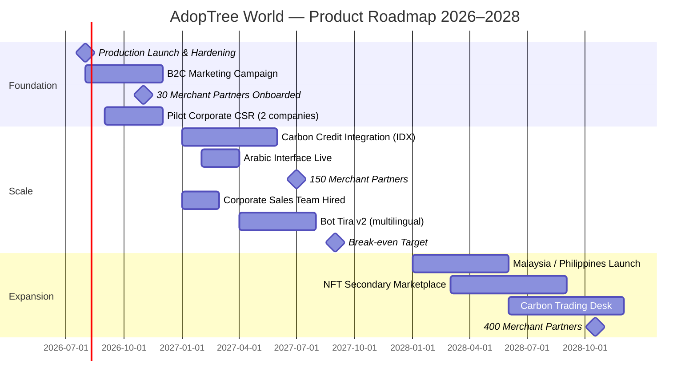

# AdopTree World — Product Requirements Document
### Investor Edition · v2.0 · April 2026

> **Status:** Staging Live (`staging.adoptreeworld.com`) · Public Launch Target: H2 2026
> **Prepared for:** Investor Presentation
> **Prepared by:** AdopTree World Team — CKsan (CEO) · Aditira (CTO) · BEKs (C.Media & Design)

---

## Table of Contents

1. [Executive Summary](#1-executive-summary)
2. [Team](#2-team)
3. [Problem Statement](#3-problem-statement)
4. [Solution](#4-solution)
5. [Market Opportunity](#5-market-opportunity)
6. [Product Overview](#6-product-overview)
7. [Business Model & Revenue Streams](#7-business-model--revenue-streams)
8. [User Personas](#8-user-personas)
9. [User Flows](#9-user-flows)
10. [Technology Architecture](#10-technology-architecture)
11. [Competitive Landscape](#11-competitive-landscape)
12. [Go-to-Market Strategy](#12-go-to-market-strategy)
13. [Roadmap & Milestones](#13-roadmap--milestones)
14. [Financial Projections](#14-financial-projections)
15. [Risks & Mitigations](#15-risks--mitigations)
16. [Investment Ask](#16-investment-ask)

---

## 1. Executive Summary

**AdopTree World** is a multi-sided technology platform connecting donors (individuals, corporates, NGOs, governments) with verified reforestation land owners — making tree adoption transparent, trackable, and financially meaningful.

Unlike conventional CSR programs where environmental impact is opaque and unverifiable, AdopTree delivers **GPS-pinned tree ownership**, **real-time GIS satellite tracking**, **blockchain-backed NFT certificates (Solana)**, and **per-tree carbon credit allocation** — all in one integrated platform, built and live on staging today.

**Vision:** To be the world's most trusted carbon recycling center — a multiverse platform where donors meet eco caretakers through Social Media, Marketplace, and Green Forum in a legally-compliant, fully transparent ecosystem.

**The opportunity is significant:**
- Indonesia's forests cover 91 million hectares — one of the largest carbon sinks on Earth — yet deforestation continues at ~600,000 ha/year
- Global voluntary carbon market is projected to reach **$50 billion by 2030**
- Indonesian corporate CSR spending exceeds **$1 billion/year**, with ~20% directed to environmental programs

**Current traction:**
- Platform fully operational at `staging.adoptreeworld.com`
- First real merchant partner on-boarded: **Akademi Buah Nusantara**
- Full payment infrastructure live: Midtrans (bank transfer, QRIS, e-wallet, credit card) + Solana (SOL)
- **3-year commercial target: 100,000 Ha land under management → 500 million trees reserved**

**AdopTree is positioned at the intersection of greentech, ESG infrastructure, Web3, and Islamic finance** — serving every segment from an individual $1/tree annual fee to multi-year corporate CSR packages.

> 📊 *See: [`market-opportunity.html`](https://ajarka.github.io/public-documentation/AdopTreeWorld/prd/html/market-opportunity.html) — TAM/SAM/SOM visualization*

---

## 2. Team

### 2.1 Founding Team

| Name | Role | Responsibility |
|------|------|----------------|
| **CKsan** | CEO | Business development, investor relations, strategic partnerships |
| **Aditira** | CTO | Platform architecture, engineering, product delivery |
| **BEKs** | C.Media & Design | Brand identity, UI/UX design, content & media strategy |

### 2.2 Dewan Pembina / Advisors

| Name | Role |
|------|------|
| **Ahmad Junaedi** | Pembina / Mentor |
| **Udoro KA** | Advisor |

### 2.3 Why This Team

- **CTO-led product**: The platform is built, tested, and staging-live — demonstrating execution capability before raising capital
- **Balanced triad**: Business (CEO), technology (CTO), and brand (CMO) roles covered from day one
- **Advised by practitioners**: Advisors bring domain expertise in the environmental and governance space

---

## 3. Problem Statement

### 3.1 The Donor Problem

| Pain Point | Reality Today |
|---|---|
| **No proof of impact** | Most tree-planting programs send a PDF and nothing else |
| **No transparency** | Donors can't verify if their tree was actually planted |
| **No connection** | No ongoing relationship between donor and "their" tree |
| **No financial utility** | Donation is a sunk cost with no future value |

### 3.2 The Merchant / NGO Problem

| Pain Point | Reality Today |
|---|---|
| **No distribution channel** | NGOs rely on one-off events and manual outreach |
| **No recurring revenue** | Donations are sporadic, not structured |
| **No tech infrastructure** | Managing tree data, donors, and reports manually |
| **No credibility signal** | Hard to prove impact to corporate partners |

### 3.3 The Corporate CSR Problem

| Pain Point | Reality Today |
|---|---|
| **Hard to quantify** | "We planted 5,000 trees" — but where? Which trees? |
| **No ESG-grade data** | Can't tie tree programs to standardized carbon metrics |
| **Greenwashing risk** | No verifiable audit trail for sustainability reports |
| **No scalable process** | Each CSR program is a one-off project |

---

## 4. Solution

AdopTree World solves all three sides of this problem through a **multi-sided marketplace with verifiable impact infrastructure.**

```
Individual Donor ──┐
                   ├──► AdopTree Platform ──► Real Forest Land ──► Verified Impact
Corporate CSR ─────┘         │
                         NGO / Merchant
```

### Core Value Propositions

**For Donors (B2C):**
- 🌱 Adopt a specific tree with GPS coordinates — *it's yours*
- 📍 Track it live on an interactive GIS map
- 📜 Receive a legally-meaningful digital certificate
- 🔮 Mint an NFT (AdopTree tier) — a transferable, tradeable digital asset
- 📊 Receive carbon credit allocation for Green Society & AdopTree tiers

**For Merchants / NGOs (Supply Side):**
- 🏗️ Full land & tree management dashboard
- 📢 Campaign fundraising tools with custom pricing
- 🤖 Bot Tira — AI assistant for donor engagement
- 💰 Recurring revenue from tree adoptions (not one-off donations)
- 📈 Analytics and earnings reporting

**For Corporates (B2B):**
- 📦 Bulk tree adoption packages
- 📊 ESG-grade reporting with GIS-verified data
- 🌍 Public impact page for brand visibility
- 📋 Certificate bundles for annual sustainability reports

---

## 5. Market Opportunity

> 📊 *Screenshot from: [`market-opportunity.html`](https://ajarka.github.io/public-documentation/AdopTreeWorld/prd/html/market-opportunity.html)*

### 5.1 Total Addressable Market (TAM) — $50 Billion

The global voluntary carbon market is expected to grow from $2B (2021) to **$50B by 2030** (McKinsey Global Institute). Indonesia is one of the key supply-side players given its massive rainforest and mangrove coverage.

### 5.2 Serviceable Addressable Market (SAM) — $2.4 Billion

Southeast Asia's ESG and environmental impact investment market. Includes:
- Corporate CSR environmental programs ($1B+ in Indonesia alone)
- Impact investment funds targeting nature-based solutions
- Individual environmental philanthropy via digital channels

### 5.3 Serviceable Obtainable Market (SOM) — $24 Million

Year 3 realistic capture target:
- 1% of Indonesia's corporate environmental CSR ($200M total addressable)
- Organic growth through merchant network (400+ partners by 2028)
- Bot Tira SaaS subscriptions

### 5.4 Indonesia-Specific Tailwinds

| Factor | Detail |
|---|---|
| **Regulatory** | Indonesia's NDC: 29% emission reduction by 2030 — companies under pressure |
| **Population** | 270M people, 185M internet users — growing digital donation culture |
| **Islamic Finance** | Wakaf tier (perpetual, Shariah-compliant) opens Gulf & local Islamic investor market |
| **Biodiversity** | 3rd largest forest globally — world's largest carbon sink opportunity |
| **Government Push** | Carbon trading exchange (IDX Carbon) launched 2023 — formal market forming |

---

## 6. Product Overview

### 6.1 Platform Architecture (Multi-sided)



### 6.2 Feature Matrix

#### Donor-Facing Features

| Feature | Description | Status |
|---|---|---|
| **Browse & Search** | Explore lands by region, type, availability, campaign | ✅ Built |
| **GIS Map** | Interactive map with polygon boundaries + tree dot tracking | ✅ Built |
| **Multi-tier Adoption** | 4 tiers from $8 donation to $75 NFT | ✅ Built |
| **Cart & Checkout** | Multi-item cart, Midtrans payment (Rupiah), Solana (SOL) | ✅ Built |
| **Digital Certificate** | Auto-generated PDF certificate with QR verification | ✅ Built |
| **My Forest Dashboard** | Personal adoption tracker, carbon credits, certificates | ✅ Built |
| **NFT Ownership** | Solana-minted NFT for AdopTree tier — transferable asset | ✅ Built |
| **360° Tree View** | Photo sphere viewer for immersive tree experience | ✅ Built |
| **Carbon Credits** | Allocated at adoption, tracked in dashboard | ✅ Built |
| **Wishlist** | Save lands and trees for future adoption | ✅ Built |
| **Forum / Community** | Posts, comments, follows, likes — social layer | ✅ Built |
| **Bot Tira** | AI chatbot for tree & adoption queries | ✅ Built |
| **Multi-language** | English, Indonesian, Arabic | ✅ Built |
| **Notifications** | In-app and email notification system | ✅ Built |

#### Merchant-Facing Features

| Feature | Description | Status |
|---|---|---|
| **Land Management** | CRUD for land plots with GIS polygon upload | ✅ Built |
| **Tree Management** | Per-tree CRUD, CSV bulk import, media management | ✅ Built |
| **Campaign System** | Fundraising campaigns with custom pricing & tree allocation | ✅ Built |
| **Land Partnerships** | Two-tier invite system for land owner collaboration | ✅ Built |
| **Earnings Dashboard** | Revenue tracking, withdrawal management | ✅ Built |
| **Bot Tira Subscription** | AI bot for merchant's donor-facing chat | ✅ Built |
| **Analytics** | Bot interactions, adoption stats, campaign performance | ✅ Built |
| **Posts & Updates** | Merchant feed for sharing land progress | ✅ Built |

#### Admin & Platform Features

| Feature | Description | Status |
|---|---|---|
| **Admin Dashboard** | Revenue, adoptions, users, fees overview | ✅ Built |
| **Merchant Verification** | Review, approve, verify merchant accounts | ✅ Built |
| **Pricing Configuration** | Set platform fees, tier pricing globally | ✅ Built |
| **Site Configuration** | Dynamic homepage images (Cloudflare R2) | ✅ Built |
| **Transaction Management** | Full transaction audit trail | ✅ Built |
| **Analytics** | Platform-wide analytics, revenue breakdown | ✅ Built |

### 6.3 Service Class Structure

> 📊 *Screenshot from: [`tier-pricing.html`](https://ajarka.github.io/public-documentation/AdopTreeWorld/prd/html/tier-pricing.html)*

AdopTree uses a **6-class service tier model**: two adoption categories (Donasi & Wakaf), each with three service levels (Silver, Gold, Platinum). Platform fee is charged per tree per year on top of the base adoption price.

#### Donasi Category

| Class | Platform Fee / yr | Campaign Fee | Features | Target | Duration |
|-------|-------------------|--------------|----------|--------|----------|
| 🥈 **Silver** | $1.00/tree | $1.50/tree | Certificate, My Forest Dashboard | Individual | 1 year · web2 |
| 🥇 **Gold** | $2.00/tree | $2.50/tree | + Dashboard PM, NFT, Surveillance, Social & Marketplace | Individual | 1 year · web3 |
| 💎 **Platinum** | $3.00/tree | $3.00/tree | + Periodic Surveillance (2x/yr), CSR Marketing, Full Platform | Corporate | Min. 3 years · web3 |

#### Wakaf Category *(Shariah-compliant perpetual endowment)*

| Class | Platform Fee / yr | Campaign Fee | Features | Target | Duration |
|-------|-------------------|--------------|----------|--------|----------|
| 🥈 **Silver** | $1.00/tree | $1.50/tree | Certificate, My Forest Dashboard | Individual | 1 year · web2 |
| 🥇 **Gold** | $2.00/tree | $2.50/tree | + Dashboard PM, NFT, Monitoring, Social & Marketplace | Individual | 1 year · web3 |
| 💎 **Platinum** | $2.50/tree | $3.00/tree | + Periodic Surveillance (2x/yr), CSR Marketing, Full Platform | Corporate | Min. 3 years · web3 |

> **Key distinctions:**
> - **Silver** = entry-level, web2 experience (certificate + dashboard)
> - **Gold** = NFT-backed, web3, full platform access (forum, marketplace)
> - **Platinum** = corporate-grade, includes periodic physical surveillance & reports, minimum 3-year commitment
> - **Wakaf** tiers are Shariah-compliant — opens Islamic philanthropic market (Indonesia + Gulf)

**Carbon credit tracking:** All adoptions generate CO₂ absorption data in real-time based on species-level absorption rate (kg CO₂/year). Redemption & trading roadmap: 2027 (targeting VCS certification).

---

## 7. Business Model & Revenue Streams

> 📊 *Screenshot from: [`platform-ecosystem.html`](https://ajarka.github.io/public-documentation/AdopTreeWorld/prd/html/platform-ecosystem.html)*

### 7.1 Revenue Streams



#### Stream 1: Tree Adoption Fees (B2C)
- Platform takes **5–15%** of each adoption transaction
- Remainder goes to merchant for tree stewardship
- Payment via Midtrans (IDR) or Solana (SOL)
- **Year 3 projection: $900K**

#### Stream 2: Corporate CSR Packages (B2B)
- Bundled adoption packages for companies (min. 100 trees)
- ESG data dashboard + certificate bundles
- Dedicated account management
- **Year 3 projection: $750K**

#### Stream 3: Campaign Platform Fee
- Merchants launch donation campaigns with custom tree pricing
- Platform charges lower fee on campaign adoptions (incentivizes volume)
- **Year 3 projection: $640K**

#### Stream 4: Bot Tira SaaS
- AI chatbot subscription for merchant accounts
- Tiered pricing: Basic, Pro, Enterprise
- Estimated avg: $75/merchant/month
- **Year 3 projection: $270K**

#### Stream 5: Carbon Credit Trading (Future)
- Green Society & AdopTree tiers generate tradeable carbon credits
- Future integration with IDX Carbon exchange (Indonesia)
- **Year 3 projection: $50K** (nascent)

### 7.2 Unit Economics

| Metric | Value |
|---|---|
| Avg. Adoption Revenue (gross) | $26/tree |
| Platform Take Rate | 10% avg |
| Avg. Platform Revenue/tree | $2.60 |
| Bot Tira ARPU | $75/month |
| Corporate Package Avg. | $10,000/deal |
| Customer Acquisition Cost (est.) | $8–$15/user |
| Retention Driver | Renewal reminders, carbon credit growth, NFT utility |

---

## 8. User Personas

### Persona 1 — Rina, The Conscious Consumer (Donasi Silver → Gold)
> *"I want to do something real for the environment, not just share a hashtag."*

- **Age:** 28 | **Location:** Jakarta | **Income:** Rp 8M/month
- **Behavior:** Active on Instagram, shops online, donates to charity 1–2x/year
- **Pain:** Doesn't trust generic "plant a tree" programs — no proof of impact
- **Goal:** Adopt a tree she can literally point to on a map and show friends
- **Entry:** Social media ad → landing page → Donasi Silver ($1/tree/yr) → upgrades to Gold on renewal
- **LTV:** $2–$5/tree/year, renewals + referrals + NFT unlock at Gold

### Persona 2 — Pak Budi, The CSR Manager (Donasi/Wakaf Platinum)
> *"My CEO wants our annual report to show measurable environmental impact."*

- **Age:** 42 | **Location:** Surabaya | **Company:** Mid-size manufacturer
- **Budget:** Rp 500M/year CSR budget, 20% environmental
- **Pain:** Last year's tree event was a photo op — no data for the auditors
- **Goal:** 500 trees with GIS coordinates, periodic surveillance reports, ESG certificates for auditors
- **Entry:** Google search "program CSR pohon terverifikasi" → Demo call → Platinum Corporate Package (min. 3 yr)
- **LTV:** $1,500–$15,000/year (recurring, scales with tree volume)

### Persona 3 — Kang Ucup, The NGO Field Partner (Supply Side)
> *"We have 200 hectares ready but no platform to reach donors at scale."*

- **Age:** 35 | **Location:** West Kalimantan
- **Organization:** Community forest NGO, 12 land plots, 50,000+ trees
- **Pain:** Manually tracks donations on Excel, donors never come back after first donation
- **Goal:** Steady revenue stream for tree maintenance and ranger salaries
- **Entry:** AdopTree merchant onboarding → Lists lands → Runs campaigns → Uses Bot Tira
- **Revenue:** Receives 85–95% of each adoption fee

### Persona 4 — Hasan, The Gulf Donor (Wakaf Silver → Gold)
> *"I want a Shariah-compliant perpetual endowment that also helps the environment."*

- **Age:** 55 | **Location:** Riyadh (or diaspora in Jakarta)
- **Behavior:** Active in Islamic philanthropy, familiar with Wakaf (Islamic endowment)
- **Pain:** Most green investment options are not Shariah-compliant
- **Goal:** Perpetual tree adoption as waqf — leaves a lasting legacy, halal, with NFT proof
- **Entry:** Arabic language interface → Wakaf Silver ($1/tree/yr) → bulk Wakaf Gold with NFT for family legacy
- **LTV:** $500–$5,000+ depending on tree volume and tier

---

## 9. User Flows

### 9.1 Individual Donor Journey (B2C)



### 9.2 Corporate CSR Flow (B2B)


### 9.3 Merchant Onboarding & Revenue Flow



### 9.4 Platform Revenue Flow



---

## 10. Technology Architecture

### 10.1 Stack Overview



### 10.2 Why Rust for Backend?

| Metric | Rust/Axum | Node.js | Java Spring |
|---|---|---|---|
| **Memory usage** | ~15 MB | ~150 MB | ~300 MB |
| **Request throughput** | ~180K req/s | ~40K req/s | ~50K req/s |
| **Startup time** | < 50ms | ~500ms | ~3–10s |
| **Type safety** | Compile-time guarantee | Runtime only | Partial |
| **Cost efficiency** | 10x cheaper infra vs Node.js at scale | Baseline | 1.5x baseline |

> **Bottom line:** AdopTree is built to scale without proportional cost increase — a key advantage at high adoption volume.

### 10.3 Key Technical Differentiators

- **PostGIS** — Geospatial polygon storage and tree-level GPS tracking at sub-meter precision
- **Cloudflare R2** — Zero-egress-fee media storage for tree photos, 360° content, certificates
- **Solana NFT** — Low-fee (~$0.01/tx), high-speed blockchain for tree ownership certificates *(infrastructure live; on-chain minting activating Q3 2026)*
- **Meilisearch** — Sub-millisecond full-text search across 100K+ trees and lands
- **Multi-language** — English, Indonesian, Arabic (RTL support) — opens Gulf market

---

## 11. Competitive Landscape

### 11.1 Competitor Matrix

| Platform | Geography | Transparency | NFT | GIS Tracking | Indonesia Focus | Price Point |
|---|---|---|---|---|---|---|
| **AdopTree** 🌳 | Indonesia / Global | ✅ GIS + Blockchain | ✅ Solana | ✅ Tree-level | ✅ Native | $8–$75 |
| Offset.earth | Global | Partial | ❌ | ❌ | ❌ | $5–$30/mo |
| Gold Standard | Global | ✅ | ❌ | Partial | ❌ | Institutional |
| Terrapass | USA | Partial | ❌ | ❌ | ❌ | $8–$200 |
| One Tree Planted | Global | ❌ | ❌ | ❌ | ❌ | $1/tree |
| Local CSR Programs | Indonesia | ❌ Manual | ❌ | ❌ | ✅ | Varies |

### 11.2 AdopTree's Moats

1. **Transparent & Trusted** — GPS tracking + blockchain audit trail eliminates greenwashing doubt; *"A monitoring platform for your donation that ensures it goes to a proper place"*
2. **Multiverse Platform** — Not just a donation button; a full ecosystem with Social Media, Marketplace, and Green Forum connecting every stakeholder (donor, NGO, corporate, government, cooperative)
3. **Legal-First** — Crowd funding umbrella for all **legal entities** (GO/NGO/individual/corporate/coop) with **legal standing soil** — rare in this space
4. **Wakaf Tier** — Only tree adoption platform with Shariah-compliant perpetual endowment; opens Gulf + Indonesian Islamic market
5. **Rust Backend** — 10x infrastructure cost advantage at scale vs. typical Node.js platforms
6. **Bot Tira** — Proprietary AI engagement layer (powered by Gemini, function-calling against live platform data) that increases merchant retention and donor re-engagement
7. **International by Design** — Multi-language (ID/EN/AR), multi-currency (IDR + SOL), multi-religion (general + Wakaf) from day one

---

## 12. Go-to-Market Strategy

### 12.1 Three-Pillar GTM Strategy

AdopTree's go-to-market is built on three mutually reinforcing pillars confirmed by the founding team:

| Pillar | Mechanic | Primary Segment |
|--------|----------|-----------------|
| **Networks** | Leverage existing NGO, community, and Islamic philanthropic networks for organic supply & demand | Merchant partners, Wakaf donors |
| **Donations** | B2C digital campaigns — social media, influencer, and community-driven donor acquisition | Individual donors (Donasi Silver/Gold) |
| **CSR** | Direct outreach to corporate CSR departments; proven ROI via GIS data + ESG certificates | Corporate Platinum packages |

### 12.2 Phase 1 — Foundation (H2 2026)

**Focus:** Prove supply-demand fit with real merchants and real transactions

- Expand from first real merchant (**Akademi Buah Nusantara**) → 30 merchant/NGO partners (Java, Kalimantan, Papua)
- Activate B2C campaigns via Instagram/TikTok targeting eco-conscious millennials 25–35
- Close 2–3 pilot corporate CSR packages (Donasi/Wakaf Platinum)
- Activate Bot Tira subscription for early merchants
- PR: *"Indonesia's first GIS-verified, blockchain-backed tree adoption platform"*

### 12.3 Phase 2 — Scale (2027)

**Focus:** B2B acceleration + carbon credit infrastructure

- Dedicated corporate sales team (2 AE focused on CSR market)
- Pursue formal engagement with KLHK (Indonesia Ministry of Forestry) for regulatory credibility
- Integration with IDX Carbon exchange (Indonesia regulated carbon market)
- Expand to 150 merchant partners across 12+ provinces
- Arabic interface + Gulf diaspora targeting (Wakaf segment)
- Bot Tira v2: multilingual, deeper data integrations

### 12.4 Phase 3 — Expansion (2028)

**Focus:** International rollout + carbon monetization

- Expand to Malaysia, Philippines — first international markets
- Secondary NFT marketplace (peer-to-peer tree ownership trading)
- Carbon credit trading desk (institutional buyers, VCS-certified)
- White-label platform licensing for large NGOs and banks
- **Target: 100,000 Ha land under management → 500,000,000 trees reserved**

### 12.5 Acquisition Channels

| Channel | Target | Cost | Estimated CAC |
|---|---|---|---|
| Instagram/TikTok Ads | B2C (Rina persona) | Paid | $8–$12 |
| Google Ads (CSR keywords) | B2B (Pak Budi persona) | Paid | $30–$60 |
| NGO/Merchant Referrals | Supply side | Organic | $0 |
| Corporate Sales Outreach | Enterprise | Outbound | $80–$150 |
| Islamic Community Partnerships | Wakaf segment | Partnership | $5–$10 |
| PR / Media | Brand awareness | Low | Blended |

---

## 13. Roadmap & Milestones



### Key Milestones

| Milestone | Target Date | Success Metric |
|---|---|---|
| **First Real Merchant** | ✅ April 2026 | Akademi Buah Nusantara on-boarded |
| **Staging Live** | ✅ April 2026 | Full platform accessible at staging domain |
| **Public Production Launch** | H2 2026 | Platform live, real payments processing |
| **Solana NFT Minting Live** | Q3 2026 | On-chain minting activated (infrastructure ready) |
| **First 100 Paid Adoptions** | Q4 2026 | Revenue from real transactions |
| **First Corporate CSR Deal** | Q4 2026 | Donasi/Wakaf Platinum package signed |
| **30 Active Merchants** | Q4 2026 | Supply-side diversity established |
| **VCS Carbon Certification** | 2027 | Enables carbon credit trading layer |
| **$498K Annual Revenue** | EOY 2027 | Unit economics proven |
| **Break-even** | Q3 2027 | Operational profitability |
| **International Expansion** | 2028 | Malaysia / Philippines live |
| **100K Ha Under Management** | 2028 | 500M trees reserved — 3yr commercial target |
| **$2.6M Annual Revenue** | EOY 2028 | Series A readiness |

---

## 14. Financial Projections

> 📊 *Screenshot from: [`revenue-projection.html`](https://ajarka.github.io/public-documentation/AdopTreeWorld/prd/html/revenue-projection.html)*

### 14.1 Revenue Summary

| | H2 2026 (Launch) | 2027 | 2028 |
|---|---|---|---|
| **Tree Adoptions (B2C)** | $10,000 | $200,000 | $900,000 |
| **Corporate CSR (B2B)** | $10,000 | $150,000 | $750,000 |
| **Campaign Platform Fee** | — | $100,000 | $640,000 |
| **Bot Tira SaaS** | $3,000 | $48,000 | $270,000 |
| **Carbon Credits** | — | — | $50,000 |
| **Total Revenue** | **$23,000** | **$498,000** | **$2,610,000** |
| YoY Growth | — | +2,065% | +424% |

### 14.2 Key Operating Metrics

| Metric | H2 2026 | 2027 | 2028 |
|---|---|---|---|
| Active Merchants | 30 | 150 | 400 |
| Corporate Partners | 2 | 15 | 50 |
| Trees Adopted (cumulative) | 500 | 8,000 | 30,000 |
| Registered Users | 2,000 | 25,000 | 120,000 |
| Bot Tira Subscribers | 10 | 80 | 300 |
| Avg. Revenue/Tree | $20 | $25 | $30 |

### 14.3 Long-term Scale Target

| Metric | 3-Year Commercial Target (2028) |
|--------|--------------------------------|
| Land under management | **100,000 Ha** |
| Trees reserved | **500,000,000** (~5,000 trees/Ha) |
| Strategy | Networks + Donations + CSR |

> *"Our 3-year target of 100K Ha positions AdopTree as the largest verified tree adoption network in Southeast Asia — turning Indonesia's deforestation crisis into a fundable, trackable asset class."*

### 14.4 Cost Structure (Estimates)

| Cost Category | 2026 | 2027 | 2028 |
|---|---|---|---|
| Infrastructure (VPS, CDN, Cloudflare) | $3,600 | $12,000 | $36,000 |
| Payment Gateway Fees (2.9%) | $667 | $14,442 | $75,690 |
| Team (salaries + contractors) | $36,000 | $120,000 | $360,000 |
| Marketing & Sales | $10,000 | $60,000 | $180,000 |
| Legal & Compliance | $5,000 | $15,000 | $30,000 |
| **Total OPEX** | **$55,267** | **$221,442** | **$681,690** |
| **Net Revenue** | **($32,267)** | **$276,558** | **$1,928,310** |

> ⚡ *Infrastructure cost advantage: Rust backend keeps infra costs ~10x lower than typical Node.js platforms at equivalent load.*

---

## 15. Risks & Mitigations

| Risk | Probability | Impact | Mitigation |
|---|---|---|---|
| **Slow merchant onboarding** | Medium | High | Pre-identified NGO partners, simplified onboarding flow |
| **Carbon credit regulation uncertainty** | Medium | Medium | Build feature but don't depend on it for core revenue |
| **Payment gateway friction (IDR)** | Low | Medium | Midtrans + QRIS covers 95% of Indonesian payment methods |
| **Blockchain (Solana) volatility** | Low | Low | NFT is optional tier; core product works without Web3 |
| **Greenwashing accusations** | Low | High | GIS tracking + blockchain provides audit trail — industry-leading transparency |
| **Competition from large platforms** | Low | Medium | Indonesia-native + Wakaf + supply-side moat hard to replicate quickly |
| **Merchant churn** | Medium | Medium | Bot Tira subscription creates stickiness; earnings dashboard value |
| **Regulatory (Forestry law)** | Low | High | Working within existing Perhutanan Sosial framework; legal review ongoing |

---

## 16. Investment Ask

### 16.1 Round Summary

| Item | Detail |
|------|--------|
| **Round Type** | Seed Round |
| **Funding Target** | USD $300,000 – $500,000 |
| **Soft Close** | $300,000 |
| **Hard Cap** | $750,000 (if over-subscribed) |
| **Equity Offered** | 15–20% |
| **Pre-money Valuation** | ~$2.5M – $3.3M |
| **Minimum Check Size** | $25,000 per investor |
| **Target Runway** | 18 months → Break-even Q3 2027 |

> *Note: Equity % and exact raise amount are confirmed by the founding team and subject to final term sheet. Figures above represent the recommended structure.*

### 16.2 Use of Funds

*Allocation for $500,000 raise:*

| Category | % | Est. USD | Purpose |
|----------|---|----------|---------|
| **Sales & Business Development** | 35% | $175,000 | Merchant acquisition, corporate CSR outreach, partnership BD |
| **Product & Technology** | 25% | $125,000 | Solana NFT minting live, surveillance system, mobile app |
| **Operations & Team** | 25% | $125,000 | Team salaries, VPS infrastructure, tooling |
| **Legal & Compliance** | 10% | $50,000 | PT establishment, Wakaf endorsement (MUI/BWI), VCS carbon standard |
| **Marketing & Community** | 5% | $25,000 | Brand campaigns, social media, Green Forum community building |

> **Priority:** Sales & BD is the top allocation because AdopTree's revenue is directly proportional to merchant count. Every merchant that joins brings their own tree inventory and donor base to the platform.

### 16.3 Financial Path to Break-even

```
Raise (Apr 2026) ──► Public Launch (H2 2026) ──► $23K revenue
                                 │
                                 ▼
                    Scale to 150 merchants (2027) ──► $498K revenue
                                 │
                                 ▼
                         Break-even: Q3 2027
                                 │
                                 ▼
                    400 merchants · 30K trees (2028) ──► $2.6M revenue
                                 │
                                 ▼
                            Series A ready
```

### 16.4 What We're Looking For in an Investor

Beyond capital, the ideal investor brings:
- **Network** in Indonesian corporate CSR, government (KLHK, BPDLH), or Islamic finance (BWI)
- **Experience** in greentech, impact investing, or Southeast Asian markets
- **Strategic value** — connections to potential merchant partners or corporate CSR buyers accelerate growth faster than capital alone
- **Patient capital** — 18-month path to profitability, mission-driven, long-term horizon (3-year commercial target is 500M trees)

### 16.5 Why Now?

1. **Platform is built and live** — we're not raising to build; we're raising to grow. Staging is live at `staging.adoptreeworld.com` today
2. **First merchant is real** — Akademi Buah Nusantara proves end-to-end merchant-to-adoption flow works
3. **IDX Carbon launched 2023** — Indonesia's regulated carbon market is forming; early platform players will capture the registry advantage
4. **Indonesia's NDC commitments** (29% emission reduction by 2030) create immediate regulatory pressure on corporations to invest in verifiable green programs
5. **No dominant player** in Indonesia tree-adoption tech with GIS + NFT + Wakaf + AI — first-mover window is closing
6. **International from day one** — multi-language, multi-currency, Wakaf tier for Gulf market — rare for an Indonesia-based greentech startup at seed stage

---

## Appendix

### A. Technology Stack Summary

| Layer | Technology |
|---|---|
| Frontend | Next.js 16, TypeScript, Tailwind CSS, shadcn/ui |
| Backend | Rust, Axum, SQLx |
| Database | PostgreSQL + PostGIS |
| Cache | Redis |
| Search | Meilisearch |
| Maps | Mapbox GL |
| Storage | Cloudflare R2 |
| Payment | Midtrans Snap |
| Blockchain | Solana (SPL NFT) |
| AI | Bot Tira (proprietary) |
| Auth | JWT, Google OAuth, Solana SIWS |
| CI/CD | Jenkins + Docker + WUD |
| CDN | Cloudflare Tunnel (zero-trust) |
| Languages | Indonesian, English, Arabic |

### B. Visualization Assets

| File | Description |
|---|---|
| [`market-opportunity.html`](https://ajarka.github.io/public-documentation/AdopTreeWorld/prd/html/market-opportunity.html) | TAM/SAM/SOM visualization |
| [`tier-pricing.html`](https://ajarka.github.io/public-documentation/AdopTreeWorld/prd/html/tier-pricing.html) | Adoption tier comparison |
| [`revenue-projection.html`](https://ajarka.github.io/public-documentation/AdopTreeWorld/prd/html/revenue-projection.html) | 3-year revenue forecast |
| [`platform-ecosystem.html`](https://ajarka.github.io/public-documentation/AdopTreeWorld/prd/html/platform-ecosystem.html) | Platform stakeholder map |

### C. Glossary

| Term | Definition |
|---|---|
| **GIS** | Geographic Information System — GPS-based land & tree mapping |
| **NFT** | Non-Fungible Token — unique blockchain-based digital asset |
| **Wakaf** | Islamic perpetual endowment — Shariah-compliant donation structure |
| **CSR** | Corporate Social Responsibility |
| **ESG** | Environmental, Social, Governance — sustainability reporting framework |
| **NDC** | Nationally Determined Contribution — Indonesia's climate commitments |
| **KLHK** | Kementerian Lingkungan Hidup dan Kehutanan (Ministry of Forestry) |
| **IDX Carbon** | Indonesia Stock Exchange's carbon trading platform |
| **PostGIS** | PostgreSQL extension for geospatial data |
| **Solana** | High-speed, low-cost blockchain network for NFT minting |

---

*© 2026 AdopTree World. All projections are forward-looking estimates based on comparable greentech platforms in Southeast Asia. Actual results may differ.*
*Document version 2.0 — Compiled from: founding team input (CKsan/Aditira/BEKs), codebase analysis, and staging platform exploration (`staging.adoptreeworld.com`). For investor discussion purposes only.*
