# AdopTree — Strategi Resilience Payment Gateway

> **Dokumen Resmi · Bahasa Non-Teknis**
> Versi: 1.0
> Tanggal: 9 Juni 2026
> Penyusun: Tim Engineering AdopTree
> Status: Draft Strategi — untuk review tim bisnis & operasional

---

## 1. Ringkasan Eksekutif

Saat ini transaksi pembayaran AdopTree (adopsi pohon, donasi, wakaf, langganan) ditangani sepenuhnya oleh **Midtrans** sebagai *single payment gateway*. Ini berfungsi dengan baik dalam kondisi normal, **namun menempatkan kelangsungan revenue platform sepenuhnya pada satu pihak eksternal**.

Dokumen ini menjelaskan strategi untuk **mengubah arsitektur pembayaran menjadi sistem berlapis (multi-gateway dengan fallback otomatis)**, di mana sistem akan terus menerima pembayaran meskipun salah satu penyedia mengalami gangguan.

Rencana awal:
- **Primary**: Amani Bank (rencana — sedang dalam tahap onboarding)
- **Fallback Tier 1**: Midtrans (yang sekarang sudah berjalan)
- **Fallback Tier 2+**: Slot terbuka untuk gateway tambahan (mis. Xendit, Doku, GoPay Direct) sesuai kebutuhan masa depan

> **Manfaat utama bagi bisnis**: Donor tidak pernah melihat halaman *"pembayaran gagal"* karena masalah di sisi gateway. Setiap rupiah transaksi punya **rute cadangan otomatis**.

---

## 2. Latar Belakang & Konteks Bisnis

### 2.1 Situasi Saat Ini

Setiap transaksi di AdopTree (mulai dari **Donasi Instan $8** hingga **AdopTree NFT $75/5 tahun**) saat ini melalui satu jalur:

```
Donor → Web AdopTree → Midtrans Snap → Bank/E-Wallet Donor → Konfirmasi
```

**Risiko yang dihadapi**:
| Skenario | Dampak | Frekuensi historis |
|---|---|---|
| Midtrans maintenance terjadwal | Semua transaksi tertunda (biasanya 1–4 jam) | Sekitar 2–4× per tahun |
| Midtrans outage tak terduga | Semua transaksi gagal sepenuhnya | Industri: 1–3× per tahun |
| Donor's bank issuer offline | Hanya bank tertentu yang gagal — donor lain tetap bisa | Sering, sporadis |
| Rate limit dari Midtrans di puncak kampanye | Donor mendapat error 429, akhirnya batal donasi | Saat trafik tinggi |

**Konsekuensi bisnis**: kehilangan revenue, donor churn (donor batal dan tidak kembali), dan kredibilitas platform turun saat kejadian outage menjadi publik.

### 2.2 Mengapa Strategi Multi-Gateway?

Dalam industri pembayaran digital di Indonesia, pendekatan **multi-gateway dengan fallback otomatis** sudah menjadi standar di platform berskala (e-commerce, ride-hailing, fintech). Tujuannya bukan untuk mengganti Midtrans, tapi untuk membuat sistem **resilient (tahan banting)**:

> *"Satu gateway boleh down. Sistem tidak boleh down."*

---

## 3. Konsep Inti — Cara Kerja Fallback

### 3.1 Analogi Sederhana

Bayangkan strategi ini seperti **GPS yang menghitung rute alternatif**:

- **Rute utama** (Amani Bank) — cepat, biasa dilewati
- **Rute alternatif 1** (Midtrans) — siap dipakai kalau rute utama macet
- **Rute alternatif 2+** — siap dipakai kalau dua rute pertama bermasalah

Donor (pengguna) tidak perlu tahu rute mana yang sedang dipakai. Mereka tetap melihat tombol **"Bayar Sekarang"** yang sama, dan sistem otomatis memilih rute terbaik yang sedang sehat.

### 3.2 Tingkatan Fallback

| Tingkat | Gateway | Status | Catatan |
|---|---|---|---|
| **0 — Primary** | **Amani Bank** | 🔵 Rencana | Dalam tahap onboarding & integrasi |
| **1 — Fallback** | **Midtrans** | 🟢 Aktif | Sudah berjalan di produksi sekarang |
| **2 — Reserve** | (TBD: Xendit / Doku / GoPay) | ⚪ Slot terbuka | Akan ditambah sesuai kebutuhan |

> **Catatan**: Status "Primary" tidak berarti lebih bagus atau lebih murah secara mutlak. Ini hanya berarti **gateway yang dicoba pertama kali**. Logika pemilihan urutan dapat diubah kapan saja melalui konfigurasi (tidak perlu re-deploy aplikasi).

---

## 4. Alur Pembayaran — Versi Detail

### 4.1 Skenario Normal (Semua Gateway Sehat)

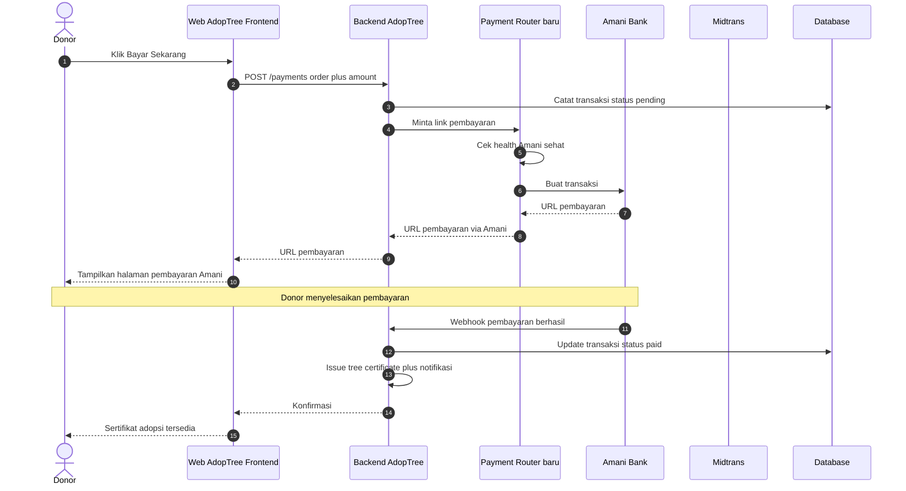

### 4.2 Skenario Fallback (Amani Tidak Tersedia)

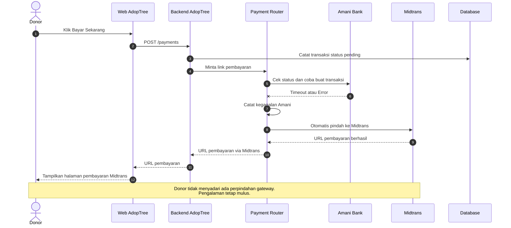

### 4.3 Skenario Kegagalan Total (Semua Gateway Gagal — Sangat Jarang)

Jika semua gateway dalam pool sedang gagal:

1. Sistem **tidak akan menampilkan halaman error generik**.
2. Donor akan mendapat pesan profesional: *"Layanan pembayaran sedang dalam pemeliharaan. Donasi Anda kami simpan, dan kami akan mengirim email saat sudah dapat diproses."*
3. Transaksi tersimpan di database dengan status `pending_retry`.
4. Job otomatis akan **mencoba ulang setiap 5 menit** sampai salah satu gateway pulih.
5. Donor mendapat email konfirmasi otomatis saat pembayaran berhasil dimulai ulang.

---

## 5. Arsitektur Teknis (High-Level)

Berikut gambaran komponen yang akan ditambahkan ke sistem AdopTree:

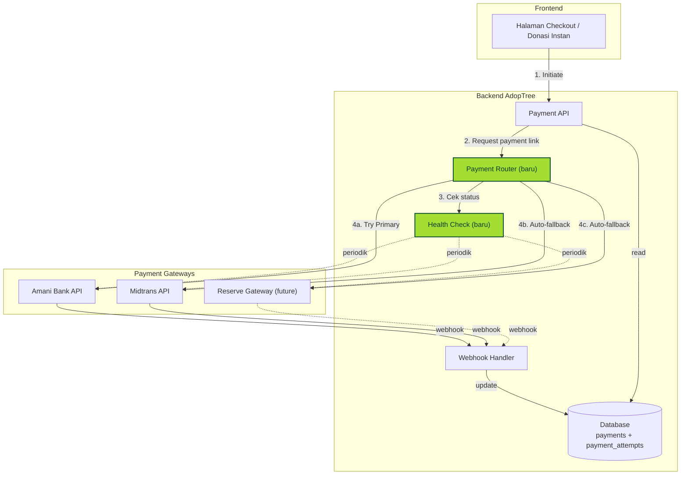

### 5.1 Komponen Baru yang Perlu Dibangun

| Komponen | Fungsi | Estimasi effort |
|---|---|---|
| **Payment Router** | Memilih gateway mana yang dipakai per transaksi | Medium |
| **Health Monitor** | Memeriksa kesehatan tiap gateway setiap menit dan menandai mana yang sehat / sakit | Medium |
| **Gateway Adapter** (Amani) | Modul integrasi spesifik Amani Bank | Medium-High |
| **Gateway Adapter** (Midtrans) | Sudah ada, akan di-refactor jadi adapter | Low |
| **Webhook Unifier** | Menerima notifikasi dari multiple gateway dan menstandarkan formatnya | Medium |
| **Retry Worker** | Mencoba ulang transaksi yang pending saat semua gateway awal gagal | Low-Medium |
| **Admin Dashboard panel** | Tim AdopTree dapat melihat gateway mana yang sedang aktif, rate keberhasilan per gateway | Medium |

---

## 6. Diagram Arsitektur & Flow Lengkap

Bagian ini berisi sekumpulan diagram **Mermaid** profesional yang menggambarkan sistem dari berbagai sudut pandang. Setiap diagram dapat di-*render* langsung di GitHub, Notion, atau editor markdown apa pun yang mendukung Mermaid.

> **Catatan untuk pembaca non-teknis**: Tidak perlu memahami semua diagram sekaligus. Setiap diagram berdiri sendiri dan menjawab satu pertanyaan spesifik. Lewatkan saja yang tidak relevan dengan peran Anda.

---

### 6.1 System Topology — Pemandangan Lengkap (Bird's-Eye View)

> **Pertanyaan yang dijawab**: "Apa saja komponen sistem dan bagaimana mereka terhubung?"

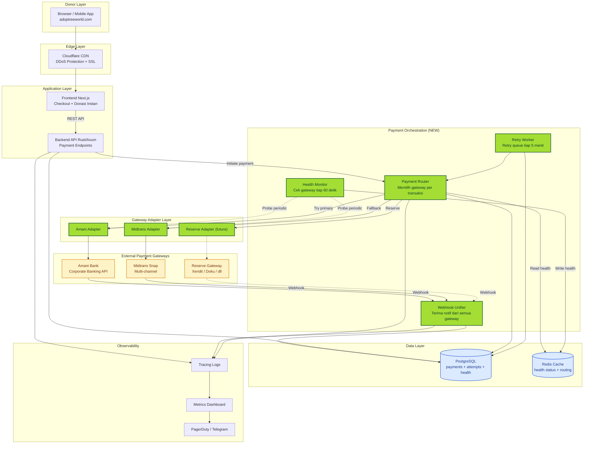

**Cara membaca**:
- Komponen **hijau lime** = baru, akan dibangun
- Komponen **kuning** = pihak eksternal (di luar kendali kami)
- Komponen **biru** = penyimpanan data
- Garis tegas = jalur aktif setiap transaksi
- Garis putus-putus = jalur monitoring/health (latar belakang)

---

### 6.2 Transaction State Machine — Siklus Hidup Satu Transaksi

> **Pertanyaan yang dijawab**: "Sebuah transaksi melewati state apa saja dari klik bayar sampai sertifikat terbit?"

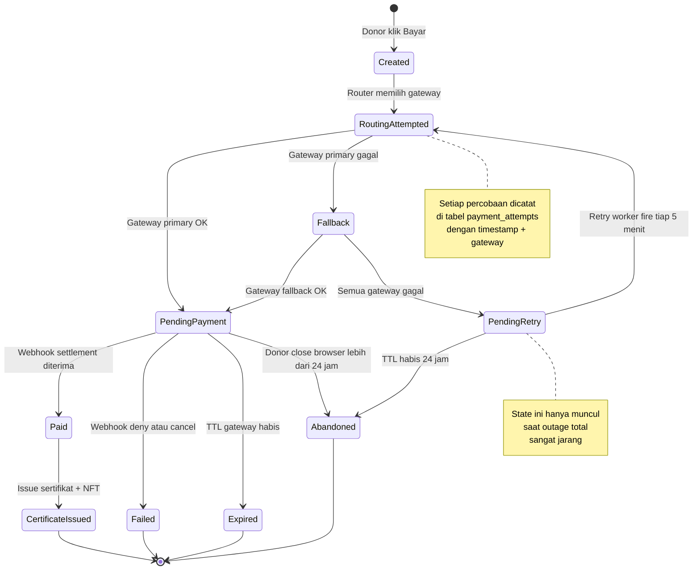

**Penting**:
- Setiap transisi state ter-audit di database (siapa, kapan, gateway mana).
- State `Paid` adalah **final** — tidak bisa kembali ke `PendingPayment` meskipun ada webhook duplikat (idempotency guard).

---

### 6.3 Routing Decision Tree — Logika Pemilihan Gateway

> **Pertanyaan yang dijawab**: "Bagaimana sistem memutuskan gateway mana yang dipakai untuk transaksi ini?"

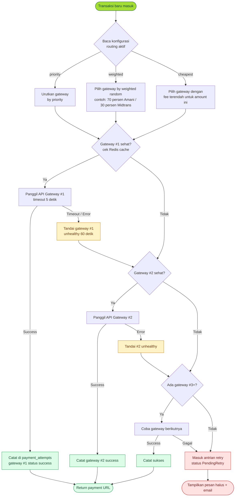

**Konfigurasi routing strategy** dapat diubah kapan saja melalui admin dashboard tanpa re-deploy aplikasi.

---

### 6.4 Webhook Convergence — Multi-Source Notification Handling

> **Pertanyaan yang dijawab**: "Setiap gateway kirim notifikasi dengan format berbeda — bagaimana kita menanganinya?"

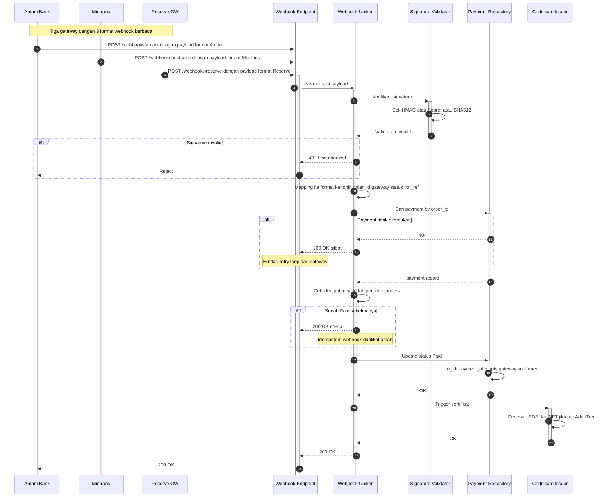

**Kunci desain**:
- Setiap gateway punya **endpoint webhook terpisah** untuk signature verification yang tepat.
- Format yang berbeda di-normalisasi ke **canonical schema** sebelum diproses.
- **Idempotency** dijaga via `order_id` unik — webhook duplikat tidak menyebabkan transaksi ganda.

---

### 6.5 Health Monitor Loop — Operational View

> **Pertanyaan yang dijawab**: "Bagaimana sistem tahu gateway mana yang sedang sehat?"

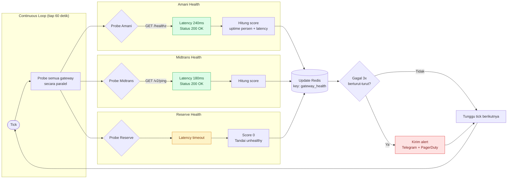

**Kebijakan operasional**:
- **Probe interval**: 60 detik (dapat diubah)
- **Threshold unhealthy**: 3 kali gagal berturut-turut
- **Cooldown**: setelah ditandai unhealthy, gateway tetap di-skip 60 detik sebelum di-probe ulang
- **Alert escalation**: alert otomatis ke tim ops via Telegram + PagerDuty (untuk insiden production)

---

### 6.6 Data Model — Entity Relationship Diagram

> **Pertanyaan yang dijawab**: "Tabel apa saja yang dibutuhkan untuk menyimpan jejak transaksi multi-gateway?"

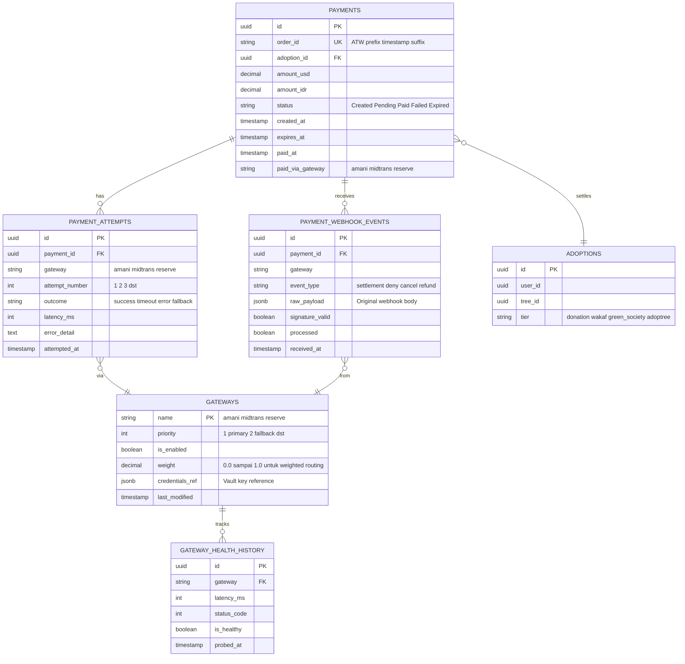

**Catatan untuk tim**:
- `payment_attempts` adalah **audit trail lengkap** — setiap percobaan ke gateway dicatat, sukses maupun gagal. Berguna untuk analitik dan dispute resolution.
- `gateway_health_history` di-prune otomatis (retensi 30 hari) untuk mencegah tabel membesar.
- Konfigurasi `gateways.priority` dan `gateways.weight` adalah **hot-reloadable** — perubahan diterapkan dalam <60 detik tanpa restart.

---

### 6.7 Retry Recovery Flow — Penanganan Failure Total

> **Pertanyaan yang dijawab**: "Apa yang terjadi pada transaksi saat *semua* gateway sedang down (skenario sangat langka)?"

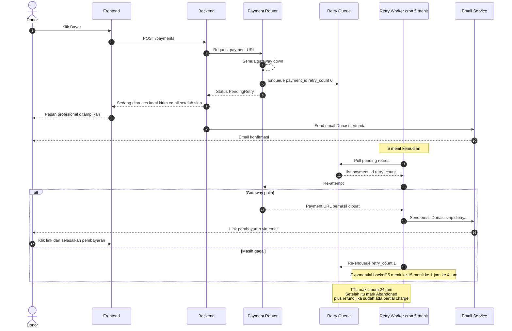

**Kebijakan retry**:
- **Backoff exponential**: 5 menit → 15 menit → 1 jam → 4 jam → mark Abandoned
- **Donor diberitahu** di setiap milestone via email (tidak silent failure)
- **TTL maksimum**: 24 jam — setelah itu transaksi resmi `Abandoned`, donor diminta retry manual

---

### 6.8 Production Deployment Topology — Infrastructure View

> **Pertanyaan yang dijawab**: "Di production, komponen ini berjalan di mana saja secara fisik?"

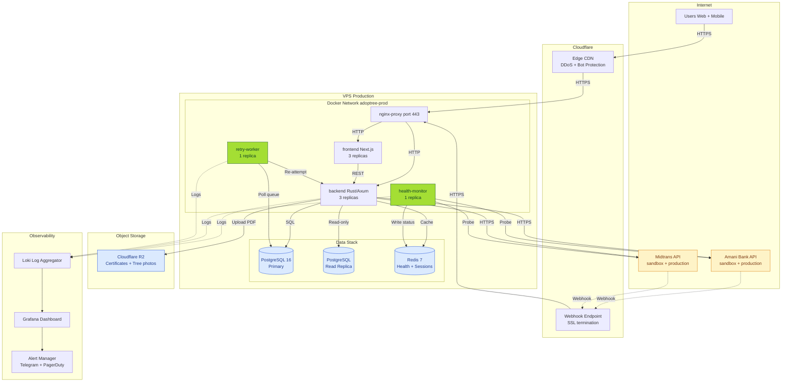

**Highlight infrastruktur**:
- **Stateless containers** (frontend, backend) dapat di-scale horizontal sesuai kebutuhan.
- **Health monitor** dan **retry worker** adalah **single-instance** (1 replica) untuk menghindari double-probe / double-retry.
- Webhook melalui **Cloudflare** untuk SSL termination + DDoS protection.
- Database dipisah **primary** (write) dan **read replica** untuk performance + redundancy.

---

## 7. Manfaat Bisnis (Business Impact)

### 7.1 Manfaat Langsung

| Manfaat | Sebelum | Sesudah |
|---|---|---|
| **Uptime pembayaran** | ~99.5% (mengikuti Midtrans) | ~99.95%+ (kombinasi 2 gateway) |
| **Resiko revenue loss saat outage** | Tinggi — semua transaksi mati | Rendah — auto-fallback transparan |
| **Negosiasi fee gateway** | Lemah — satu vendor | Kuat — vendor tahu ada alternatif |
| **Geografis coverage** | Terbatas pada channel Midtrans | Lebih luas (Amani Bank corporate + Midtrans consumer) |
| **Donor confidence** | Donor sensitif terhadap incident | Donor jarang tahu ada gangguan |

### 7.2 Manfaat Strategis Jangka Panjang

1. **Kemandirian dari satu vendor** — leverage komersial saat negosiasi rate / fitur baru.
2. **Foundation untuk multi-currency** — beberapa gateway native USD/SGD/multi-mata uang, memudahkan rencana ekspansi regional.
3. **Compliance flexibility** — beberapa segmen donor (institusi, foundation, perbankan syariah) mungkin punya preferensi gateway tertentu. Multi-gateway memungkinkan mengarahkan transaksi sesuai segmen.
4. **A/B testing** — bisa membandingkan conversion rate Amani vs Midtrans dan mengarahkan trafik ke yang lebih baik.

---

## 8. Pengalaman Donor (UX Promise)

**Komitmen kami kepada donor**: pengalaman pembayaran **tidak boleh terganggu** oleh kerumitan teknis di belakang layar.

### 8.1 Yang Dilihat Donor

- ✅ Halaman checkout yang sama, tombol yang sama, alur yang sama.
- ✅ Tidak ada pilihan "Pilih gateway pembayaran" — sistem yang memilih, bukan donor.
- ✅ Konfirmasi pembayaran tetap melalui email dan aplikasi seperti biasa.

### 8.2 Yang Tidak Dilihat Donor

- ❌ Notifikasi "Gateway X sedang down".
- ❌ Halaman error teknis.
- ❌ Logika routing internal kami.

> **Filosofi**: Resilience adalah pekerjaan engineering yang baik **bila pengguna tidak merasakannya**.

---

## 9. Roadmap & Tahapan Implementasi

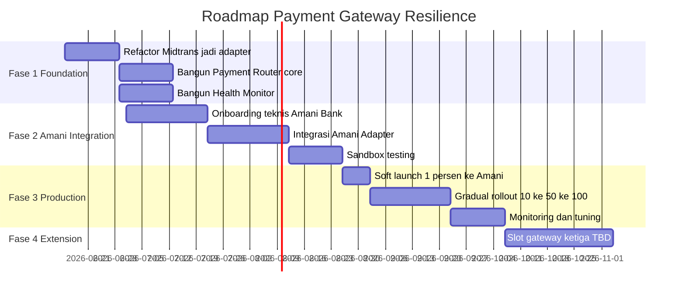

### 9.1 Milestone Utama

| Fase | Output | Target |
|---|---|---|
| **Fase 1 — Foundation** | Payment Router siap, Midtrans tetap berjalan tanpa downtime | Akhir Juli 2026 |
| **Fase 2 — Amani Integration** | Amani Bank ter-integrasi penuh di sandbox | Akhir Agustus 2026 |
| **Fase 3 — Production** | Amani Bank menerima 100% trafik primer, Midtrans sebagai fallback | Akhir September 2026 |
| **Fase 4 — Extension** | Gateway ketiga sebagai reserve, sesuai kebutuhan | Q4 2026 |

> Target dapat disesuaikan setelah review teknis dan finalisasi kontrak Amani Bank.

---

## 10. Risiko & Mitigasi

| Risiko | Probabilitas | Dampak | Mitigasi |
|---|---|---|---|
| Integrasi Amani Bank lebih lama dari estimasi | Sedang | Sedang — geser timeline | Buffer 2 minggu di Fase 2, Midtrans tetap jadi primary sampai Amani siap |
| Donor mengalami transaksi ganda saat fallback | Rendah | Tinggi (refund manual) | Idempotency key dengan order_id unik, audit log setiap percobaan gateway |
| Webhook dari dua gateway konflik untuk order yang sama | Rendah | Sedang | First-confirmation-wins logic + audit trail di tabel `payment_attempts` |
| Fee gateway baru (Amani) lebih tinggi dari Midtrans | Sedang | Rendah-Sedang | Routing logic dapat dikonfigurasi: bisa "Amani primary" atau "biaya termurah primary" |
| Compliance issue saat migrasi data transaksi | Rendah | Tinggi | Data Midtrans existing tidak dimigrasi — tetap di Midtrans. Sistem baru hanya untuk transaksi baru sejak go-live |

---

## 11. Pertanyaan Yang Sering Ditanya

**Q: Apakah donor perlu melakukan apa-apa saat rollout?**
A: Tidak. Pengalaman donor tidak berubah sama sekali — tombol bayar, alur checkout, email konfirmasi tetap sama.

**Q: Apakah donor yang sudah pakai Midtrans akan dipaksa pindah ke Amani?**
A: Tidak. Sistem yang memilih gateway secara dinamis per transaksi. Donor tidak pernah "terikat" dengan gateway tertentu.

**Q: Kalau Amani lebih mahal dari Midtrans, kenapa dijadikan primary?**
A: Pemilihan "primary" tidak hanya tentang fee — juga tentang strategic partnership, reliability profile, dan support level. Selain itu, **logic routing dapat dikonfigurasi** untuk mengarahkan trafik ke gateway termurah atau dengan success rate terbaik secara real-time.

**Q: Berapa lama untuk implementasi penuh?**
A: Sekitar 3–4 bulan dari kickoff teknis, dengan asumsi Amani Bank sudah memberikan akses sandbox. Detail di [Roadmap](#9-roadmap--tahapan-implementasi).

**Q: Apakah ini akan mempengaruhi sertifikat NFT (AdopTree tier)?**
A: Tidak. Layer NFT issuance tetap independen dari payment gateway — yang berubah hanya cara duit masuk, bukan cara sertifikat diterbitkan.

**Q: Apakah aman menambahkan gateway baru di masa depan?**
A: Ya. Arsitektur dirancang dengan **adapter pattern** — gateway baru tinggal dibuatkan adapter sesuai interface standar, dan otomatis bisa masuk ke pool routing tanpa mengubah business logic.

---

## 12. Glosarium

| Istilah | Penjelasan |
|---|---|
| **Payment Gateway** | Pihak ketiga yang memproses pembayaran (Midtrans, Amani Bank, dll.) |
| **Primary Gateway** | Gateway yang dicoba pertama kali oleh sistem |
| **Fallback Gateway** | Gateway cadangan yang otomatis dipakai jika primary gagal |
| **Adapter Pattern** | Pola desain software di mana setiap gateway diberi "pembungkus" agar terlihat sama dari sisi business logic |
| **Health Check** | Pemeriksaan otomatis berkala untuk memastikan gateway sedang sehat dan bisa menerima transaksi |
| **Webhook** | Notifikasi otomatis dari gateway ke server AdopTree saat status pembayaran berubah |
| **Idempotency** | Properti yang memastikan bahwa percobaan ulang tidak menyebabkan transaksi ganda |
| **Routing Logic** | Aturan internal yang menentukan gateway mana yang dipakai per transaksi |
| **Sandbox** | Lingkungan testing yang menyerupai produksi tapi tanpa transaksi uang sungguhan |

---

## 13. Persetujuan & Kontak

Dokumen ini disusun untuk:
- 🟢 **Disetujui oleh**: CEO / CTO / Head of Product
- 🟡 **Direview oleh**: Tim Engineering, Tim Finance, Tim Legal & Compliance
- 🔵 **Diketahui oleh**: Tim Operations, Tim Customer Support

**Pertanyaan & feedback**: hello@adoptreeworld.com

---

*Dokumen ini akan diperbarui seiring dengan progres implementasi. Versi terbaru selalu tersedia di repository internal.*
