# AdopTree World — Platform Dimensioning & Infrastructure Plan

> **Versi:** 1.4
> **Tanggal:** April 2026
> **Penulis:** Aditira Jamhuri
> **Status:** In Progress — Pre-Production

---

## Ringkasan

Dokumen ini menjelaskan seluruh kebutuhan infrastruktur dan layanan pendukung untuk menjalankan platform **AdopTree World** di production dengan pengguna nyata — mulai dari server, penyimpanan file, pembayaran, hingga notifikasi.

Setiap item dilengkapi dengan pilihan layanan yang direkomendasikan, estimasi biaya bulanan, status implementasi, dan **langkah subscribe yang perlu dilakukan**.

---

## 1. Server (VPS)

### Spesifikasi Server Saat Ini

| Parameter | Detail |
|-----------|--------|
| CPU | 2 core (AMD EPYC 9354P) |
| RAM | 7.5 GB |
| Storage | 99 GB SSD (41 GB terpakai, 58 GB tersisa) |
| Swap Memory | 2 GB ✅ *(ditambahkan April 2026)* |
| Sistem Operasi | Enterprise Linux 10 |
| Jaringan | Via Cloudflare Tunnel (aman, tidak expose IP server) |
| Provider | Hostinger |

**Subscribe:** Sudah aktif via Hostinger.

### Kapasitas untuk Production

| Komponen | Estimasi RAM |
|----------|-------------|
| Frontend (production) | ~768 MB |
| Backend/API (production) | ~512 MB |
| Database PostgreSQL | ~600 MB – 1 GB |
| Search engine | ~512 MB |
| Cache | ~256 MB |
| CI/CD Jenkins | ~800 MB |
| **Total Proyeksi** | **~3.5 – 4.5 GB** |
| **RAM + Swap tersedia** | **9.5 GB** |
| **Buffer aman** | **~5 GB** |

**Kesimpulan: Server saat ini cukup untuk fase launch awal.**

### Arsitektur Infrastructure per Fase

---

#### Fase 1 — Launch (0 – 500 pengguna aktif/bulan)

**1 VPS tunggal, semua layanan digabung. Cukup untuk awal.**

```mermaid
graph TB
    subgraph Internet
        USER(["👤 Pengguna"])
        CF["☁️ Cloudflare\nCDN + WAF + Tunnel"]
    end

    subgraph VPS_Tunggal["🖥️ VPS Tunggal — Hostinger (2 vCPU, 7.5 GB RAM + 2 GB Swap)"]
        direction TB

        subgraph Staging["Staging Environment"]
            FE_STG["Next.js\nFrontend (Staging)\n:3001"]
            BE_STG["Rust/Axum\nBackend (Staging)\n:8081"]
        end

        subgraph Production["Production Environment"]
            FE_PROD["Next.js\nFrontend (Production)\n:3000"]
            BE_PROD["Rust/Axum\nBackend (Production)\n:8080"]
        end

        subgraph SharedServices["Shared Services"]
            PG[("🐘 PostgreSQL\n:5432")]
            REDIS[("⚡ Redis Cache\n:6379")]
            MEILI["🔍 Meilisearch\n:7700"]
            NGINX["🔀 Nginx\nReverse Proxy"]
            JENKINS["🔧 Jenkins\nCI/CD"]
        end
    end

    subgraph Cloud["☁️ Cloud Services"]
        R2["Cloudflare R2\nObject Storage"]
        RESEND["Resend\nEmail Service"]
        OPENAI["OpenAI\nTira Bot AI"]
        MIDTRANS["Midtrans\nPayment Gateway"]
        MAPBOX["Mapbox\nPeta Interaktif"]
    end

    USER --> CF
    CF --> NGINX
    NGINX --> FE_PROD
    NGINX --> BE_PROD
    NGINX --> FE_STG
    NGINX --> BE_STG
    BE_PROD --> PG
    BE_STG --> PG
    BE_PROD --> REDIS
    BE_STG --> REDIS
    BE_PROD --> MEILI
    BE_PROD --> R2
    BE_PROD --> RESEND
    BE_PROD --> OPENAI
    BE_PROD --> MIDTRANS
    FE_PROD --> MAPBOX
    JENKINS --> FE_PROD
    JENKINS --> BE_PROD

    style VPS_Tunggal fill:#1a1a2e,stroke:#4CAF50,stroke-width:2px
    style Production fill:#0d2137,stroke:#2196F3,stroke-width:1px
    style Staging fill:#1a1a1a,stroke:#666,stroke-width:1px,stroke-dasharray: 5 5
    style SharedServices fill:#1a0d2e,stroke:#9C27B0,stroke-width:1px
    style Cloud fill:#0d1a0d,stroke:#4CAF50,stroke-width:1px
```



**Estimasi biaya Fase 1:**

| Komponen | Biaya/Bulan |
|----------|------------|
| VPS Hostinger | Sudah berbayar |
| Semua cloud services | ~$5–10 |
| **Total** | **~$5–10/bulan** (di luar VPS) |

**Risiko yang ada:** Staging dan Production berbagi 1 VPS & 1 database instance. Jenkins build bisa spike CPU saat ada traffic production.

---

#### Fase 2 — Growth (500 – 5.000 pengguna aktif/bulan)

**Pisah App dari Database & Services. Production dan Staging di VPS berbeda.**

```mermaid
graph TB
    subgraph Internet
        USER(["👤 Pengguna"])
        DEV(["👨‍💻 Developer"])
        CF["☁️ Cloudflare\nCDN + WAF + Tunnel"]
    end

    subgraph VPS_PROD["🖥️ VPS Production (4 vCPU, 8 GB RAM)"]
        NGINX_P["🔀 Nginx"]
        FE_P["Next.js Frontend\n:3000"]
        BE_P["Rust/Axum Backend\n:8080"]
        REDIS_P[("⚡ Redis\n:6379")]
    end

    subgraph VPS_STG["🖥️ VPS Staging + Jenkins (2 vCPU, 4 GB RAM)"]
        NGINX_S["🔀 Nginx"]
        FE_S["Next.js Frontend\n:3000"]
        BE_S["Rust/Axum Backend\n:8080"]
        JENKINS["🔧 Jenkins CI/CD"]
    end

    subgraph VPS_DB["🖥️ VPS Database (2 vCPU, 8 GB RAM)"]
        PG_PRIMARY[("🐘 PostgreSQL Primary\n:5432")]
        PG_REPLICA[("🐘 PostgreSQL Replica\n:5433\n(read-only)")]
        MEILI["🔍 Meilisearch"]
        BACKUP["💾 Backup Cron → R2"]
        PG_PRIMARY -->|"WAL Streaming"| PG_REPLICA
    end

    subgraph Cloud["☁️ Cloud Services"]
        R2["Cloudflare R2"]
        RESEND["Resend Email"]
        OPENAI["OpenAI AI"]
        MIDTRANS["Midtrans"]
        MAPBOX["Mapbox"]
    end

    USER --> CF
    DEV --> VPS_STG
    CF --> NGINX_P
    NGINX_P --> FE_P & BE_P
    BE_P --> PG_PRIMARY & REDIS_P
    BE_P --> R2 & RESEND & OPENAI & MIDTRANS
    FE_P --> MAPBOX

    NGINX_S --> FE_S & BE_S
    BE_S --> PG_PRIMARY
    JENKINS -->|"Deploy"| VPS_PROD

    BACKUP --> R2

    style VPS_PROD fill:#0d2137,stroke:#2196F3,stroke-width:2px
    style VPS_STG fill:#1a1a1a,stroke:#666,stroke-width:2px,stroke-dasharray: 5 5
    style VPS_DB fill:#1a0d0d,stroke:#F44336,stroke-width:2px
    style Cloud fill:#0d1a0d,stroke:#4CAF50,stroke-width:1px
```



**Estimasi biaya Fase 2:**

| Komponen | Biaya/Bulan |
|----------|------------|
| VPS Production (4 vCPU, 8 GB) | ~$20–30 |
| VPS Staging + Jenkins (2 vCPU, 4 GB) | ~$10–15 |
| VPS Database (2 vCPU, 8 GB) | ~$20–30 |
| Cloud services | ~$30–60 |
| **Total** | **~$80–135/bulan** |

---

#### Fase 3 — Scale (5.000 – 50.000 pengguna aktif/bulan)

**Multi-node production dengan load balancer. Database managed + read replica.**

```mermaid
graph TB
    subgraph Internet
        USER(["👤 Pengguna"])
        CF["☁️ Cloudflare\nCDN + WAF + DDoS Protection\n+ Load Balancing"]
    end

    subgraph Prod["Production Cluster"]
        subgraph AppNodes["App Nodes (Auto-scaled)"]
            APP1["🖥️ App Node 1\nFE + BE"]
            APP2["🖥️ App Node 2\nFE + BE"]
            APP3["🖥️ App Node N\nFE + BE"]
        end

        subgraph CacheLayer["Cache Layer"]
            REDIS_C[("⚡ Redis Cluster\nSession + Cache")]
        end
    end

    subgraph DBCluster["Database Cluster"]
        PG_PRI[("🐘 PostgreSQL Primary\nWrite operations")]
        PG_R1[("🐘 Read Replica 1\nRead operations")]
        PG_R2[("🐘 Read Replica 2\nRead operations")]
        PGBOUNCER["PgBouncer\nConnection Pool"]
        PG_PRI -->|"WAL"| PG_R1
        PG_PRI -->|"WAL"| PG_R2
        PGBOUNCER --> PG_PRI & PG_R1 & PG_R2
    end

    subgraph ServicesNode["Services Node"]
        MEILI["🔍 Meilisearch\nFull-text Search"]
        JENKINS["🔧 Jenkins\nCI/CD"]
        BACKUP["💾 Backup Service"]
    end

    subgraph StagingNode["Staging VPS"]
        STG["Staging Environment\n(isolated)"]
    end

    subgraph Cloud["☁️ Cloud Services"]
        R2["Cloudflare R2\nObject Storage"]
        RESEND["Resend Email"]
        OPENAI["OpenAI AI"]
        MIDTRANS["Midtrans"]
        MAPBOX["Mapbox"]
    end

    USER --> CF
    CF --> APP1 & APP2 & APP3
    APP1 & APP2 & APP3 --> REDIS_C
    APP1 & APP2 & APP3 --> PGBOUNCER
    APP1 & APP2 & APP3 --> R2 & RESEND & OPENAI & MIDTRANS
    APP1 --> MAPBOX
    BACKUP --> R2
    JENKINS -->|"Deploy"| AppNodes

    style Prod fill:#0d2137,stroke:#2196F3,stroke-width:2px
    style DBCluster fill:#1a0d0d,stroke:#F44336,stroke-width:2px
    style ServicesNode fill:#1a1a0d,stroke:#FF9800,stroke-width:2px
    style StagingNode fill:#1a1a1a,stroke:#666,stroke-width:1px,stroke-dasharray: 5 5
    style Cloud fill:#0d1a0d,stroke:#4CAF50,stroke-width:1px
```



**Estimasi biaya Fase 3:**

| Komponen | Biaya/Bulan |
|----------|------------|
| App Nodes × 3 (4 vCPU, 8 GB masing-masing) | ~$60–90 |
| Database Cluster (Primary + 2 Replica) | ~$60–90 |
| Cache Node (Redis Cluster) | ~$20–30 |
| Services Node (Meili + Jenkins) | ~$15–20 |
| Staging VPS | ~$10–15 |
| Cloud services (R2, Resend, OpenAI, dll) | ~$50–100 |
| **Total** | **~$215–345/bulan** |

---

#### Fase 4 — Enterprise (50.000+ pengguna aktif/bulan)

**Fully managed cloud infrastructure. Tim DevOps dedicated.**

```mermaid
graph TB
    subgraph Internet
        USER(["👤 Pengguna Global"])
        CF["☁️ Cloudflare Enterprise\nGlobal CDN + WAF + Bot Protection"]
    end

    subgraph Cloud_Infra["☁️ Managed Cloud (AWS / GCP)"]
        subgraph K8S["Kubernetes Cluster"]
            POD1["Pod: Frontend"]
            POD2["Pod: Backend API"]
            POD3["Pod: Background Workers"]
            HPA["Horizontal Pod\nAutoscaler"]
        end

        subgraph ManagedDB["Managed Database"]
            RDS["AWS RDS / Cloud SQL\nPostgreSQL (Multi-AZ)"]
            ELASTICACHE["AWS ElastiCache\nRedis Cluster"]
        end

        subgraph ManagedSearch["Managed Search"]
            OPENSEARCH["AWS OpenSearch\n/ Algolia"]
        end

        subgraph CI_CD["CI/CD Pipeline"]
            GITHUB_ACTIONS["GitHub Actions\n+ ArgoCD"]
        end
    end

    subgraph ExternalServices["External Services"]
        R2["Cloudflare R2\nMedia Storage"]
        RESEND["Resend Email"]
        OPENAI["OpenAI API"]
        MIDTRANS["Midtrans"]
        SENTRY["Sentry\nError Monitoring"]
        DATADOG["Datadog\nObservability"]
    end

    USER --> CF --> K8S
    K8S --> RDS & ELASTICACHE & OPENSEARCH
    K8S --> R2 & RESEND & OPENAI & MIDTRANS
    K8S --> SENTRY & DATADOG
    HPA --> POD1 & POD2 & POD3
    GITHUB_ACTIONS -->|"GitOps Deploy"| K8S

    style Cloud_Infra fill:#0d2137,stroke:#2196F3,stroke-width:2px
    style ExternalServices fill:#0d1a0d,stroke:#4CAF50,stroke-width:1px
```



**Estimasi biaya Fase 4:** Negosiasi kontrak enterprise (AWS/GCP committed use discount). Estimasi kasar **$500–2.000+/bulan** tergantung traffic.

---

### Ringkasan Rencana Scale-Up

| Fase | Pengguna Aktif | Arsitektur | Estimasi Biaya/Bulan |
|------|----------------|------------|----------------------|
| **Launch** | 0 – 500 | 1 VPS tunggal | ~$5–10 (di luar VPS) |
| **Growth** | 500 – 5.000 | 3 VPS terpisah (App, DB, Staging) | ~$80–135 |
| **Scale** | 5.000 – 50.000 | Multi-node + load balancer + DB cluster | ~$215–345 |
| **Enterprise** | 50.000+ | Kubernetes + managed cloud | ~$500–2.000+ |

---

## 2. Layanan yang Dibutuhkan

### 2.1 Penyimpanan File (Foto & Video)

Semua foto pohon, galeri lahan, foto profil, dan video lapangan disimpan di cloud storage — aman, cepat, dan tidak hilang jika server di-restart.

**Rekomendasi: Cloudflare R2**

| | Detail |
|-|--------|
| Mengapa R2? | Nol biaya bandwidth, terintegrasi dengan Cloudflare yang sudah dipakai |
| Kapasitas gratis | 10 GB + 1 juta operasi/bulan |
| Estimasi kebutuhan awal | ~5 GB |
| **Biaya** | **$0/bulan** (dalam batas gratis) |
| Biaya jika melebihi | $0.015/GB/bulan |
| **Status** | ⏳ Menunggu aktivasi billing |

**Cara Subscribe:**
1. Login ke [dash.cloudflare.com](https://dash.cloudflare.com) dengan akun Cloudflare AdopTree
2. Klik **R2 Object Storage** di sidebar kiri
3. Klik **Purchase R2 Plan** → masukkan data billing (kartu/PayPal) — tagihan $0 selama dalam batas gratis
4. Setelah aktif, buat bucket baru dengan nama `adoptree-media`
5. Buat API Token: **Manage R2 API Tokens → Create API Token** (centang: Object Read & Write)
6. Catat: **Account ID**, **Access Key ID**, **Secret Access Key** → berikan ke tim developer

| Alternatif | Egress | Kapasitas Gratis | Catatan |
|------------|--------|------------------|---------|
| AWS S3 | $0.09/GB | 5 GB (12 bln saja) | Mahal jangka panjang |

---

### 2.2 Pembayaran

Pengguna membayar adopsi pohon ($8–$75) menggunakan metode pembayaran populer Indonesia.

**Rekomendasi: Midtrans**

| | Detail |
|-|--------|
| Mengapa Midtrans? | Paling populer di Indonesia, support semua metode lokal |
| Metode | GoPay, OVO, DANA, ShopeePay, QRIS, transfer bank (BCA/Mandiri/BNI/BRI), kartu kredit, Indomaret/Alfamart |
| Biaya setup | Gratis |
| Biaya per transaksi | 0.7% (e-wallet/QRIS) · Rp4.500 flat (transfer bank) · 2–3% (kartu kredit) |
| Proses verifikasi | 3–7 hari kerja |
| **Biaya tetap** | **$0/bulan** (potongan per transaksi saja) |
| **Status** | ⏳ Perlu daftar merchant account |

**Cara Subscribe:**
1. Buka [dashboard.midtrans.com](https://dashboard.midtrans.com) → **Create Account**
2. Daftar sebagai **Business** (bukan Personal)
3. Lengkapi verifikasi: KTP pemilik + rekening bank bisnis + dokumen perusahaan (jika ada)
4. Tunggu approval 3–7 hari kerja
5. Setelah approved, masuk ke **Settings → Access Keys** → catat **Server Key** dan **Client Key** → berikan ke tim developer

**Contoh biaya di 100 transaksi rata-rata Rp150.000:**

| Metode | Potongan/Transaksi | Total/Bulan |
|--------|--------------------|-------------|
| QRIS / e-wallet | Rp1.050 | ~Rp105.000 |
| Transfer bank | Rp4.500 | ~Rp450.000 |

| Alternatif | Verifikasi | Catatan |
|------------|------------|---------|
| Xendit | 1–3 hari | Lebih cepat, fitur setara |
| Stripe | Instan | Kartu kredit saja, kurang cocok Indonesia |

---

### 2.3 Email

Untuk konfirmasi registrasi, reset password, bukti pembayaran, dan notifikasi laporan pohon.

**Rekomendasi: Resend**

| | Detail |
|-|--------|
| Kapasitas gratis | 3.000 email/bulan |
| Estimasi kebutuhan awal | ~1.300 email/bulan |
| **Biaya** | **$0/bulan** (dalam batas gratis) |
| Biaya jika melebihi | $20/bulan (hingga 50.000 email) |
| **Status** | ✅ **Selesai** (April 2026) |

**Detail Implementasi:**
- Provider: Resend via SMTP (tidak ada perubahan kode — hanya ganti env vars)
- Domain terverifikasi: `adoptreeworld.com` (Verified via Cloudflare Auto Configure)
- DKIM DNS record: terpasang otomatis via Cloudflare
- Email keluar dari: `noreply@adoptreeworld.com`
- Berlaku di: local `.env` + staging VPS

**Cara Subscribe (sudah selesai — hanya untuk referensi):**
1. Buka [resend.com](https://resend.com) → **Sign Up**
2. Masuk ke **Domains → Add Domain** → masukkan `adoptreeworld.com` → pilih region Tokyo
3. Klik **Auto configure** (Resend otomatis tambahkan DNS ke Cloudflare)
4. Tunggu status **Verified** (~3 menit)
5. API Key sudah aktif dan terpasang di server

| Alternatif | Kapasitas Gratis | Biaya Berbayar |
|------------|-----------------|----------------|
| Brevo | 9.000/bulan | $25/bulan |
| SendGrid | 100/hari | $19.95/bulan |

---

### 2.4 Notifikasi WhatsApp

WhatsApp jauh lebih efektif dari email untuk notifikasi pembayaran dan laporan pohon di pasar Indonesia.

**Rekomendasi: Fonnte** (fase awal)

| | Detail |
|-|--------|
| Biaya | Rp70.000/bulan per nomor |
| **Status** | ⏳ Belum diimplementasi |
| Catatan | Menggunakan nomor WhatsApp bisnis yang dihubungkan ke sistem |

**Cara Subscribe:**
1. Buka [fonnte.com](https://fonnte.com) → **Daftar**
2. Pilih paket **Basic** (Rp70.000/bulan)
3. Hubungkan nomor WhatsApp bisnis AdopTree dengan scan QR
4. Masuk ke **Device → Token** → catat API Token → berikan ke tim developer

**Rencana jangka panjang:** Migrasi ke **Twilio WhatsApp Business API** (resmi Meta) saat volume pesan meningkat.

| Alternatif | Biaya | Catatan |
|------------|-------|---------|
| Twilio WhatsApp | ~$0.005/pesan | Resmi Meta, lebih stabil |
| Wati | $49/bulan | Cocok untuk tim support |

---

### 2.5 Peta Interaktif

Menampilkan lokasi lahan, batas area lahan, titik pohon, dan peta My Forest pengguna.

**Sudah digunakan: Mapbox**

| | Detail |
|-|--------|
| Kapasitas gratis | 50.000 tampilan peta/bulan |
| Estimasi kebutuhan awal | ~3.000/bulan |
| **Biaya** | **$0/bulan** (dalam batas gratis) |
| **Status** | ⚠️ Perlu batasi token per domain production |

**Aksi yang perlu dilakukan (bukan subscribe baru):**
1. Login ke [account.mapbox.com](https://account.mapbox.com) dengan akun AdopTree
2. Masuk ke **Tokens → Default public token**
3. Tambahkan **URL restrictions**: hanya izinkan `https://adoptree.id` dan `https://staging.adoptree.id`
4. Ini penting agar token tidak bisa dipakai oleh pihak lain

---

### 2.6 AI — Tira Bot

Asisten virtual yang membantu pengguna memilih pohon, memahami laporan, dan menjawab pertanyaan.

**Sudah digunakan: OpenAI API**

| | Detail |
|-|--------|
| Model | GPT-4o-mini |
| Estimasi penggunaan | ~500.000 token/bulan |
| **Estimasi biaya** | **~$1–5/bulan** |
| **Status** | ✅ Sudah aktif |

**Cara top-up / monitor:**
1. Buka [platform.openai.com](https://platform.openai.com)
2. Login: **adoptreeworld@gmail.com**
3. Menu: **Settings → Billing → Overview** untuk cek saldo dan usage
4. Tambah saldo di: **Settings → Billing → Add to credit balance**

---

### 2.7 Pemantauan Error

Memberitahu tim otomatis jika ada crash atau error di production, tanpa menunggu laporan pengguna.

**Rekomendasi: Sentry**

| | Detail |
|-|--------|
| Kapasitas gratis | 5.000 error/bulan |
| **Biaya** | **$0/bulan** |
| Biaya jika perlu lebih | $26/bulan |
| **Status** | ⏳ Belum diimplementasi |

**Cara Subscribe:**
1. Buka [sentry.io](https://sentry.io) → **Sign Up** dengan GitHub atau email adoptreeworld@gmail.com
2. Buat Organization baru: **AdopTree World**
3. Buat 2 project: satu untuk **Next.js** (frontend), satu untuk **Rust** (backend)
4. Catat **DSN** masing-masing project → berikan ke tim developer

---

### 2.8 Analitik Pengguna

Memahami bagaimana pengguna menggunakan platform: halaman terpopuler, titik drop-off sebelum adopsi, fitur paling diminati.

**Rekomendasi: PostHog**

| | Detail |
|-|--------|
| Kapasitas gratis | 1 juta event/bulan |
| **Biaya** | **$0/bulan** |
| **Status** | ⏳ Belum diimplementasi |

**Cara Subscribe:**
1. Buka [posthog.com](https://posthog.com) → **Get started for free**
2. Daftar dengan email adoptreeworld@gmail.com → pilih **Cloud (US)** atau **(EU)** untuk data residency
3. Buat project baru: **AdopTree World**
4. Catat **Project API Key** → berikan ke tim developer

---

### 2.9 Full-text Search (Meilisearch)

Pencarian lahan dan merchant dengan typo-tolerance — ketik "kalimatan" tetap menemukan "Kalimantan".

**Self-hosted di VPS (tidak ada biaya tambahan)**

| | Detail |
|-|--------|
| Deployment | Docker container `adoptree-meilisearch` di VPS |
| Versi | Meilisearch v1.11 |
| Biaya | **$0** — termasuk dalam VPS yang sudah berbayar |
| Fitur | Typo tolerance, autocomplete suggestions, full-text search |
| **Status** | ✅ **Selesai** (April 2026) |

**Yang sudah diimplementasi:**
- Index `lands` dan `merchants` dengan searchable/filterable attributes
- Backend terintegrasi: search via Meilisearch → filter PostgreSQL dengan `ANY($N)`
- Fallback otomatis ke PostgreSQL ILIKE jika Meilisearch tidak tersedia
- Binary `seed_meilisearch` untuk bulk indexing data existing

**Seed data di staging:**
```bash
docker exec adoptree-backend-staging /app/seed_meilisearch
```

---

### 2.10 Backup Database

Backup otomatis harian untuk melindungi data adopsi pengguna.

| | Detail |
|-|--------|
| Metode | Backup harian otomatis ke Cloudflare R2 |
| Frekuensi | Setiap hari pukul 02.00 |
| Retensi | 30 hari terakhir |
| **Biaya** | **$0** (menggunakan kapasitas R2) |
| **Status** | ⏳ Akan diimplementasi setelah R2 aktif |

**Tidak perlu subscribe layanan baru** — menggunakan R2 yang sudah ada. Implementasi dilakukan oleh tim developer setelah R2 aktif.

---

## 3. Ringkasan Biaya Bulanan

### Fase Launch (0 – 500 pengguna aktif/bulan)

| Layanan | Biaya/Bulan |
|---------|------------|
| Server VPS (Hostinger) | Sudah berbayar |
| Penyimpanan file (Cloudflare R2) | $0 |
| Email (Resend) | $0 |
| Peta (Mapbox) | $0 |
| AI Tira Bot (OpenAI) | ~$1–5 |
| Pemantauan error (Sentry) | $0 |
| Analitik (PostHog) | $0 |
| WhatsApp (Fonnte) | ~Rp70.000 (~$4) |
| Pembayaran (Midtrans) | $0 tetap + potongan per transaksi |
| **Total Biaya Tetap** | **~$5–10/bulan** |

### Fase Growth (500 – 5.000 pengguna aktif/bulan)

| Tambahan | Biaya/Bulan |
|----------|------------|
| Upgrade RAM server | +$15–25 |
| Email berbayar (Resend) | +$20 |
| OpenAI (volume lebih) | +$10–30 |
| Sentry berbayar | +$26 |
| **Total Tambahan** | **+$71–101/bulan** |

---

## 4. Status & Prioritas

| # | Layanan | Status | Yang Perlu Dilakukan |
|---|---------|--------|----------------------|
| 1 | Swap memory VPS | ✅ **Selesai** | — |
| 2 | Resend Email | ✅ **Selesai** | — |
| 3 | OpenAI (Tira Bot) | ✅ **Sudah aktif** | Monitor billing di platform.openai.com |
| 4 | Meilisearch Search | ✅ **Selesai** | Jalankan `seed_meilisearch` di staging setelah deploy terbaru |
| 5 | Cloudflare R2 | ⏳ | Aktivasi billing → buat bucket → beri credentials ke developer |
| 6 | Midtrans | ⏳ | Daftar merchant → tunggu verifikasi 3–7 hari |
| 7 | Mapbox token | ⚠️ | Batasi token per domain di account.mapbox.com |
| 8 | Sentry | ⏳ | Daftar → buat project → beri DSN ke developer |
| 9 | Backup database | ⏳ | Otomatis setelah R2 aktif (developer) |
| 10 | PostHog | ⏳ | Daftar → beri API key ke developer |
| 11 | Fonnte WhatsApp | ⏳ | Daftar → hubungkan nomor WA → beri token ke developer |

---

## 5. Timeline Menuju Production

```
April 2026
├── ✅ Swap VPS (selesai)
├── ✅ Resend Email — domain verified, SMTP aktif di local & staging
├── ✅ Meilisearch — full-text search terintegrasi, fallback ILIKE otomatis
├── Aktivasi Cloudflare R2 + implementasi storage
└── Daftar Midtrans merchant (proses verifikasi 3–7 hari)

Mei 2026
├── Integrasi Midtrans di checkout
├── Sentry + backup database otomatis
├── PostHog analytics
└── Fonnte WhatsApp notifikasi

Juni 2026
└── 🚀 Production launch
```

---

*Dokumen ini diperbarui seiring progres implementasi. Versi terbaru selalu ada di repository AdopTree World.*
