# umrohlovers.id — Product Requirements Document
### Investor Edition · v1.0 · June 2026

> **Status** — Full platform live on staging (`staging.umrohlovers.id`) · Amani Bank integration in MoU stage (mock client shipped, technical spec delivered & accepted) · Pilot target Q3 2026 · Full public launch target November 2026 (Munas Syarikat Islam, Surabaya)
>
> **Branding chain** — **umrohlovers.id** (product) · by **PT ARTASI** (operator) · by **KOPSIMARI** — Koperasi Syarikat Islam Mandiri, the economic wing of **Syarikat Islam Indonesia (SII)**, Indonesia's oldest Islamic mass organization (est. 1905).
>
> **Honesty standard** — This document follows a strict SHIPPED vs MOCK vs PLANNED disclosure discipline. The platform is **pre-revenue with zero real transactions**: every feature marked ✅ is live on staging and verified end-to-end; the bank integration runs against a mock client pending MoU; the pilot has not started. Investors performing technical due diligence should find no surprises here.

---

## Table of Contents

0. [Background & Problems](#0-background--problems)
1. [Executive Summary](#1-executive-summary)
2. [Team](#2-team)
3. [Problem Statement](#3-problem-statement)
4. [Solution](#4-solution)
5. [Market Opportunity](#5-market-opportunity)
6. [Product Overview](#6-product-overview)
   - 6.1 Platform Architecture · 6.2 Feature Matrix · 6.3 Paket Mandiri Wizard
   - 6.4 Escrow & Milestone State Machine · 6.5 Bank Integration — Honest Status Disclosure
7. [Business Model & Revenue Streams](#7-business-model--revenue-streams)
8. [User Personas](#8-user-personas)
9. [User Flows](#9-user-flows)
10. [Technology Architecture](#10-technology-architecture)
11. [Competitive Landscape](#11-competitive-landscape)
12. [Go-to-Market Strategy](#12-go-to-market-strategy)
13. [Roadmap & Milestones](#13-roadmap--milestones)
14. [Financial Projections](#14-financial-projections)
15. [Risks & Mitigations](#15-risks--mitigations)
16. [Investment Ask](#16-investment-ask)
- Appendix: A. Tech Stack · B. Visualization Index · C. Glossary · D. Delivered Phases

---

## 0. Background & Problems

Indonesia sends more umroh pilgrims abroad than any other country on Earth, yet the industry that serves them is structurally broken. umrohlovers.id exists to address **seven root-cause failures** that conventional travel agencies, regulators, and existing booking platforms have not closed:

| # | Root-cause Problem | Why It Matters |
|---|---|---|
| 1 | **Systemic travel fraud** — publicly reported cases such as First Travel (~Rp 905 billion misappropriated, ~63,000 victims) and Abu Tours (~Rp 1.2 trillion, ~86,000 victims) destroyed life savings of ordinary families | Trust in the umroh travel industry is the single biggest barrier to digital adoption; every jamaah knows someone who was burned |
| 2 | **Full upfront payment into the travel agency's own bank account** — no escrow, no milestone protection, no recourse | The fraud pattern in #1 is *enabled* by this money flow: agencies collect deposits years before departure and use them as working capital (or worse) |
| 3 | **No centralized, consumer-visible license verification** — PPIU/PIHK licenses exist (SISKOPATUH registry) but jamaah cannot easily verify who is legitimate | Fraudulent operators advertise side-by-side with licensed ones; price is the only visible signal, and fraudsters always price lowest |
| 4 | **The hajj queue is 15–47 years long** (quota ~221,000/year against millions of registrants) — demand massively overflows into umroh | Umroh demand grows structurally every year, but trustworthy supply does not; the gap is filled by exactly the operators in #1 |
| 5 | **A fragmented, multi-layered vendor chain** — visas, Saudi hotels, catering, muthawwif, flights, vaccines, insurance each pass through brokers and middlemen on two continents | Each layer adds margin and opacity; small agencies cannot access base prices, and jamaah pay for every intermediary |
| 6 | **Community branches (cabang) have no digital tooling** — kabupaten-level religious communities organize manasik (pilgrimage training) and member care with WhatsApp and paper | The most trusted layer of the ecosystem — the local community — is the least equipped, so it captures none of the economic value it creates |
| 7 | **No protected savings vehicle for the journey** — jamaah save informally for years (cash at home, arisan, deposits handed to travel agencies) before they can afford to go | Savings are the on-ramp to every pilgrimage; without a safe, named-account vehicle, the money is exposed for the entire accumulation period |

umrohlovers.id is the **integrated response to all seven** — a member-gated marketplace where funds sit in **individual escrow accounts at a partner Islamic bank** (per PP 38/2021), supply is verified and aggregated down to base prices via the SII Saudi network, and the koperasi branch network finally gets digital rails.

---

## 1. Executive Summary

**umrohlovers.id** is a digital hajj & umroh marketplace — **"Rumah Sinergi"** (House of Synergy) — that connects jamaah, licensed travel agents (PPIU/PIHK), field sales agents, kabupaten-level community branches, Indonesian and Saudi vendors, and an Islamic partner bank into a single trusted ecosystem under the legal umbrella of a cooperative (KOPSIMARI) with 120 years of institutional heritage (Syarikat Islam, est. 1905).

### Mission

To make the pilgrimage journey **safe end-to-end** — *"Berhaji & Berumroh dengan Aman"* — by removing the structural conditions that made fraud possible: pooled funds, unverified operators, and opaque pricing. Every rupiah a jamaah saves or pays sits in **their own named bank account**, released only as real milestones (visa issued, ticket issued, departure) are met.

### Vision

To be Indonesia's **Rumah Sinergi** for hajj & umroh — the place where every stakeholder in the pilgrimage economy (center, field, vendor, financial, customer) collaborates on shared, transparent infrastructure — and, over time, the default financial and logistical rail for Indonesian pilgrims from first savings deposit to safe return home.

### Stakeholders ("Rumah Sinergi" map)

| Stakeholder | Who | Role on the Platform |
|---|---|---|
| **Pusat (Center)** | KOPSIMARI admin + finance | Platform governance, moderation, escrow orchestration, revenue ledger |
| **Brand Cabang** | Kabupaten-level branches of the SII/KOPSIMARI network | Manasik (pilgrimage training) owner, jamaah care & silaturahmi, local coverage area, override commission |
| **Agent Travel** | Licensed PPIU/PIHK travel companies | Assemble & sell group packages; B2B buyers of components from the platform catalog (markup capped) |
| **Agent Sales** | Field marketers (travel_sales) under branch coverage | Sell packages, memberships, savings accounts, and vendor products; tiered commission (bronze 3% / silver 5% / gold 7%) |
| **Mitra Korporasi** | Indonesian vendors — handling, flights, vaccines, insurance | Supply Indonesia-side components via self-service merchant catalog |
| **Mitra Syariah** | Saudi vendors — visa, hotels, catering, muthawwif | Supply Saudi-side components; direct contracts via the SII Saudi channel |
| **Mitra Finance** | Amani Bank (partner Islamic bank) | Hosts **individual escrow accounts per jamaah**; platform is monitor-only via API |
| **Jamaah** | Pilgrims — Member Umrohlovers (free at signup) → Anggota Koperasi (at first booking) | Save, browse, book (group or à la carte), attend manasik, travel safely |

### Features & Use Cases

1. **Dual booking engine** — *Paket Grup* (curated group packages assembled by licensed agents) and *Paket Mandiri* (a date-first à la carte wizard where jamaah assemble flight + hotel + visa + add-ons themselves) — rare in this market, and shipped.
2. **Individual escrow accounts (PP 38/2021)** — each jamaah's funds sit in their own account at the partner bank; the platform never holds money, only orchestrates milestone releases (visa → ticket → departure → return).
3. **Tabungan haji/umroh (pilgrimage savings)** — goal-based saving toward a target package, with the same account doubling as the payment source at checkout.
4. **Vendor marketplace (mitra)** — Indonesian and Saudi vendors self-publish components (flights, hotels, visas, catering, muthawwif, vaccines, insurance) with admin approval, three price tiers (retail / member / B2B), and system-applied markup.
5. **B2B assembly for travel agents** — licensed agents buy components at wholesale prices from the catalog, bundle, mark up (capped), and publish group packages — the Tokopedia "agent = store, package = product" model.
6. **Multi-level commission network** — a commission ledger that splits each transaction across sales agent (tiered), handling branch (override), travel agent (markup), and platform (fee) — the digital backbone for a nationwide field salesforce.
7. **Manasik management** — branches run full scheduling, RSVP, attendance, and calendar tooling for pilgrimage training; jamaah pick their handling branch at booking (geo-suggested).
8. **Compliance-grade data protection** — AES-256-GCM encryption at rest for NIK/passport data, UU PDP audit logs, right-to-be-forgotten with purge worker, HMAC-verified webhooks.

### Why it's defensible today

1. **Heritage** — Syarikat Islam (1905) is Indonesia's oldest Islamic mass organization; KOPSIMARI is its economic wing. Trust is the product in this market, and heritage cannot be cloned by a startup or an OTA.
2. **Member-gated cooperative model** — transactions require koperasi membership (a legal cooperative relationship under UU 25/1992), creating a quality filter and a regulatory moat that pure marketplaces lack.
3. **Individual escrow at an Islamic bank** — the anti-First-Travel architecture. Funds in jamaah-named accounts, milestone release, platform monitor-only. Structurally different from "pay the travel agency and hope."
4. **Base-price access via the SII Saudi channel** — visa, hotel, and accommodation supply at wholesale, bypassing broker layers competitors depend on.
5. **Dual booking flow** — managed group packages *and* a true à la carte mandiri wizard with auto-matched visas — a product surface no Indonesian competitor currently offers in one platform.

### The opportunity is significant

- Indonesia sends an estimated **1–1.2 million umroh pilgrims per year** (industry estimates) — the largest source market outside Saudi domestic pilgrims — at an average spend of **Rp 25–35 million** per pilgrim → an annual umroh market of roughly **Rp 30–40 trillion (~USD 2–2.5 billion)**.
- The hajj queue (15–47 years against a ~221,000 quota) structurally redirects demand into umroh every year.
- Saudi Vision 2030 targets **30 million umrah pilgrims annually by 2030** — supply-side capacity is being built for exactly this growth.
- The SII network reaches an estimated **10 million direct members and up to ~40 million affiliated individuals** (internal stakeholder estimate) — a captive, trust-aligned distribution channel few platforms can match.

### Current traction (honest)

- **Full platform live on staging** at `staging.umrohlovers.id` — premium landing, public catalogs (`/paket`, `/paket-mandiri`, `/brand`, `/mitra`) with 8+ interactive Mapbox maps, the complete mandiri booking wizard, and **9 role dashboards** with full CRUD.
- **Escrow lifecycle works end-to-end against a mock bank** — paid → visa → ticket → departed → returned, driven by HMAC webhooks and an admin state machine, including akad PDF generation. **Swapping mock → real Amani API is a single interface implementation.**
- **Amani Bank**: partnership proposal and technical specification delivered and **accepted at the working level**; MoU and directors' meeting in progress (June 2026). Integration is currently **mock**.
- **Engineering quality**: backend Go usecase test coverage 94–100% across 45 packages (500+ tests), 90 frontend vitest tests, Lighthouse 92+/96/99/100, k6 load-tested at 1,000 VUs, UU PDP compliance audit score 92/100.
- **Zero real transactions, zero revenue, pilot not yet started.** The pilot (50 → 200–500 jamaah) and the November 2026 Munas SI launch are the explicit next milestones — this is a "raising to launch and scale, not to build" situation.

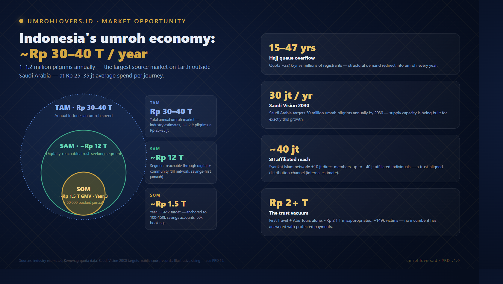
*Figure 1 — Indonesia's umroh market: TAM ~Rp 30–40T annual umroh spend → SAM ~Rp 12T digitally addressable + SI-network reachable → SOM ~Rp 1.5T GMV Year-3 target (≈50,000 bookings, ~4–5% of annual pilgrims).*

---

## 2. Team

### 2.1 Operating Team

#### 💻 Aditira Jamhuri — Tech Lead / CTO

**Role:** Platform architect, full-stack engineering lead, infrastructure & CI/CD ownership, product delivery.

**Background:** Senior software engineer with deep full-stack expertise. Master Instructor at **Ruangguru CAMP** — Indonesia's largest edtech company — where he engineered automation tooling that graded assignments for hundreds of students per cohort. Earlier, 3+ years at **BrainCode** (Indonesia's specialist in mobile services), mentoring mid-level engineers and modernizing legacy systems at production scale. Concurrently CTO of **AdopTree World**, a greentech platform where he built and shipped the entire stack (Rust backend, Next.js web, Flutter field app, CI/CD) solo — a directly transferable track record of building a full multi-sided platform lean.

**What he has shipped at umrohlovers (May–June 2026, ~5 weeks):**
- The complete platform: Go/Echo clean-architecture backend, Next.js 15 frontend, PostgreSQL 16 + Redis, Jenkins CI/CD with gated production deploys
- Dual booking engine (group + date-first mandiri wizard), multi-level commission ledger, milestone escrow state machine, system-applied markup engine, akad PDF generator
- 9 role dashboards, 5 admin Kanban moderation surfaces, 8+ public Mapbox map experiences
- Compliance layer: AES-256-GCM at-rest encryption, UU PDP audit logging, RTBF purge worker, HMAC webhook verification
- 500+ backend tests at 94–100% usecase coverage, k6 load validation at 1,000 VUs

**Why this matters for investors:** umrohlovers is **CTO-led and already built**. The most common pre-seed failure mode — "will they actually ship?" — is retired. The platform on staging is not a prototype; it is the production codebase awaiting its bank integration and pilot cohort.

---

#### 💼 Cokie "CKsan" (Pak Cookie) — Strategic Partner, BD & Marketing

**Role:** Business vision, go-to-market, marketing materials, bridge to the SII/KOPSIMARI institutional network.

**Contribution to date:** Architected the "Rumah Sinergi" multi-stakeholder model in the foundational design meetings; owns the five-angle public presentation program (jamaah, travel agents, Indonesian vendors, Saudi vendors, branches), Salam Radio (SII's media arm) coordination, and the Arabic translation track for Saudi vendor onboarding.

---

#### 🤝 Lukman — Lead Investor / Strategic BD

**Role:** Capital strategy and supply-side relationships: Amani Bank directors' track, direct Saudi hotel contracting (Jeddah onboarding program), and direct airline relationships (Garuda, Lion, Saudia).

**Contribution to date:** Set the revised commercial targets (20,000–50,000 accounts Year 1; 100,000–150,000 by Year 3), the Amani partnership structure, and the November 2026 Munas SI launch strategy. Drives the investor syndicate and bank-side negotiations.

---

### 2.2 Institutional Network — KOPSIMARI / Syarikat Islam

The platform's parent cooperative sits inside an institutional network of unusual depth for a seed-stage venture (per internal strategic-profile research; roles as publicly known):

| Figure | Public Role | Relevance |
|---|---|---|
| **Hamdan Zoelva** | Former Chief Justice of Indonesia's Constitutional Court; senior DPP Syarikat Islam leadership | Legal-constitutional credibility at the highest level |
| **Ferry Juliantono** | Deputy Minister of Cooperatives (Wamenkop); DPP SI leadership | Direct line into national cooperative policy — the platform's legal chassis |
| DPP SI senior leadership (5 figures identified) | National leadership of Indonesia's oldest Islamic organization | Distribution, trust, and regulatory navigation |

The surrounding ecosystem includes **LPDB** (the government's cooperative revolving-fund agency) and the **Koperasi Merah Putih** program — both directly relevant to a cooperative-structured platform. A unique cultural note from the founding meetings: SI is deliberately **mazhab-neutral** ("we are not tied to one school"), widening the addressable community beyond any single Islamic organization's base.

### 2.3 Why This Team

- **Built before raised** — the entire platform exists and is verifiable on staging today; engineering risk is retired.
- **Every layer covered** — technology (Aditira), market & narrative (Cokie), capital & supply-side BD (Lukman), institutional trust (SII/KOPSIMARI network).
- **The moat is the combination** — a tech team alone cannot get Saudi base prices or a cooperative legal structure; an institution alone cannot ship a dual-engine marketplace in five weeks. This team has both halves.

---

## 3. Problem Statement

### 3.1 The Jamaah Problem

| Pain Point | Reality Today |
|---|---|
| **Fear of fraud** | Post-First-Travel, paying Rp 30 million upfront to a travel agency feels like gambling with life savings |
| **No fund protection** | Money goes into the agency's account; if the agency fails, the money is gone — no escrow, no milestone gating |
| **Cannot verify operators** | License registries exist but are not consumer-facing; legitimacy is judged by brochures and word of mouth |
| **Opaque pricing** | No way to know what a flight, hotel, or visa actually costs — bundles hide margins of every middleman |
| **No structured savings path** | Saving Rp 30 million takes years; informal saving (cash, arisan, deposits to agencies) is unprotected the whole time |
| **Mandiri (independent) travel is hostile** | Booking umroh à la carte requires navigating Saudi visas, mahram rules, and hotels with no tooling — practically impossible without an agency |

### 3.2 The Travel Agent (PPIU/PIHK) Problem

| Pain Point | Reality Today |
|---|---|
| **No base-price access** | Small and mid-size agencies buy visas, hotels, and land services through broker chains at retail-ish prices |
| **Collateral damage of fraud** | Honest licensed agents pay the trust tax created by fraudulent operators — longer sales cycles, deeper discounts |
| **Manual everything** | Package assembly, manifest management, and payment tracking live in spreadsheets and WhatsApp |
| **Expensive distribution** | Existing consortium/agent schemes charge joining fees of Rp 5–7 million per agent; customer acquisition is field-labor intensive |

### 3.3 The Vendor (Mitra) Problem

| Pain Point | Reality Today |
|---|---|
| **Fragmented demand** | Saudi hotels, caterers, and muthawwif services reach Indonesian volume only through layers of brokers |
| **No direct channel to Indonesia** | The world's largest umroh source market is effectively inaccessible without an Indonesian intermediary |
| **Payment risk** | Cross-border B2B settlement is slow and trust-poor in both directions |
| **No digital storefront** | Indonesian handling/vaccine/insurance vendors have no marketplace surface aimed at pilgrims |

### 3.4 The Koperasi / Cabang Problem

| Pain Point | Reality Today |
|---|---|
| **Trust without tooling** | Kabupaten branches are the most trusted node in a jamaah's journey (they run manasik) but operate on paper and WhatsApp |
| **Value created, not captured** | Branches train and care for pilgrims yet receive nothing from the bookings their communities generate |
| **No membership infrastructure** | Recruiting koperasi members, tracking savings, and coordinating events has no digital backbone |
| **Idle distribution power** | A national branch network (the "sleeping giant") with no product to carry |

---

## 4. Solution

umrohlovers.id solves all four sides through a **member-gated, escrow-protected, multi-sided marketplace** built on cooperative legal rails.

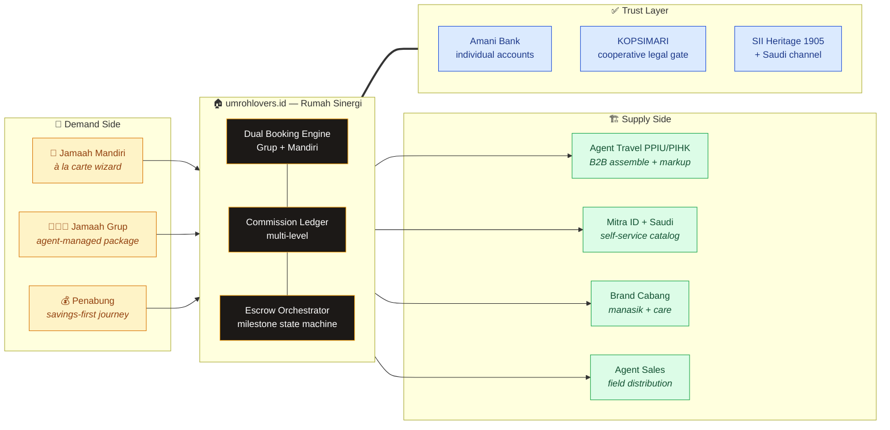

### Core Value Propositions

**For Jamaah:**
- 🏦 **Your money stays yours** — funds sit in *your* named account at an Islamic bank, released only as visa/ticket/departure milestones are actually met
- 🧭 Two ways to go: pick a verified group package, or assemble your own trip in a guided date-first wizard (flight → hotels → add-ons → auto-matched visa)
- 💰 Save toward a target package in the same protected account you'll pay from
- 🕌 Manasik and community care from your nearest cabang, geo-suggested at booking
- 🏷️ Member pricing below retail — the cooperative's economic benefit made tangible

**For Agent Travel (PPIU/PIHK):**
- 📦 Buy components at wholesale (B2B prices) from a verified catalog — including SII-channel Saudi supply — bundle, mark up (capped), publish
- 🛡️ Identity anonymized on public surfaces (rating + tenure shown, name revealed post-booking) — no price war between agents on the platform
- 📊 Dashboard for packages, manifests, and earnings; onboarding fee designed at ~Rp 1 million vs Rp 5–7 million at incumbent consortium schemes

**For Mitra (Indonesian & Saudi vendors):**
- 🏪 Self-service merchant catalog (items, photos, stock, three price tiers) with admin approval
- 🚀 One integration reaching a target of tens of thousands of pilgrims per year
- 💳 Milestone-based settlement through the escrow rail — paid when the service is delivered

**For Brand Cabang & Agent Sales:**
- 🗓️ Full manasik tooling: scheduling, calendar, RSVP, attendance
- 💸 Override commission (1.5% default) on every booking the branch handles; tiered direct commission (3/5/7%) for field sales agents — a turnkey "open an umroh office without big capital" product
- 📍 Coverage-area model per kabupaten with geo-suggestion routing jamaah to the nearest branch

---

## 5. Market Opportunity

### 5.1 Total Addressable Market (TAM) — ~Rp 30–40 trillion / year (~USD 2–2.5B)

Indonesian umroh spend (industry estimates): ~1–1.2 million pilgrims/year × average spend Rp 25–35 million. This is recurring, ritual-driven demand — many pilgrims go multiple times — and structurally growing (see tailwinds below). Hajj khusus (premium hajj) and pilgrimage savings products expand the TAM further.

### 5.2 Serviceable Addressable Market (SAM) — ~Rp 12 trillion / year

The portion realistically addressable by a digital, trust-led platform in the medium term:
- Digitally reachable pilgrims (smartphone-first booking behavior, ~70% mobile traffic observed in our own audits)
- The SII-affiliated community — an estimated 10 million direct members and up to ~40 million connected individuals (internal stakeholder estimate) — reachable through branch and media (Salam Radio) channels at near-zero CAC
- The ~2,000+ registered PPIU agencies, of which the long tail lacks base-price access and digital tooling

### 5.3 Serviceable Obtainable Market (SOM) — ~Rp 1.5 trillion GMV by Year 3

Anchored to the commercial targets set by the business team (June 2026): **100,000–150,000 active savings accounts by Year 3** (~10% of the annual umroh market by headcount) and ~50,000 funded bookings/year → GMV ≈ Rp 1.5 trillion at Rp 30M AOV. Platform net revenue capture on that GMV is modeled in §14.

### 5.4 Indonesia-Specific Tailwinds

| Factor | Detail |
|---|---|
| **Hajj queue overflow** | ~221,000 annual hajj quota vs millions of registrants; 15–47 year waits push demand into umroh every single year |
| **Saudi Vision 2030** | Target of 30 million umrah pilgrims/year by 2030 — visas easier, capacity expanding, digital rails (Nusuk) normalizing online pilgrimage commerce |
| **Regulatory push for fund protection** | PP 38/2021 and Kemenag tightening after the fraud era — escrow-style protection is becoming the expected standard, and we are built for it natively |
| **Cooperative policy momentum** | National programs (Koperasi Merah Putih, LPDB financing) actively favor cooperative-structured digital ventures |
| **Payment infrastructure** | VA + QRIS ubiquity makes per-individual bank accounts operationally cheap to fund |
| **Post-fraud trust vacuum** | The market *wants* a trusted aggregator; nobody has paired heritage + escrow + tech yet |

---

## 6. Product Overview

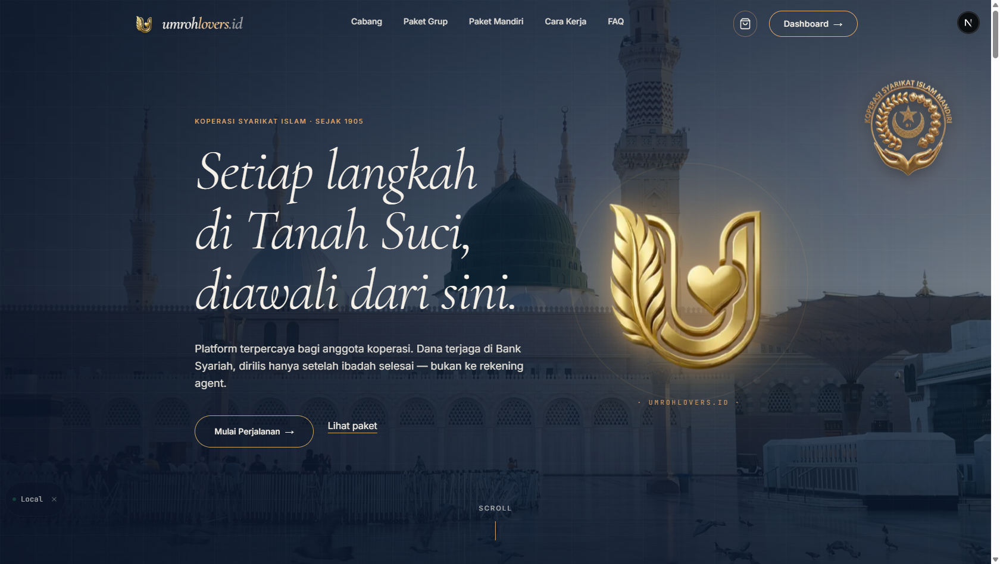
*Figure 2 — Live at `staging.umrohlovers.id`. Premium landing with the "Berhaji & Berumroh dengan Aman" promise, dual entry (Paket Grup · Paket Mandiri), and umrohlovers-dominant branding with ARTASI + KOPSIMARI attribution.*

### 6.1 Platform Architecture (Multi-sided)

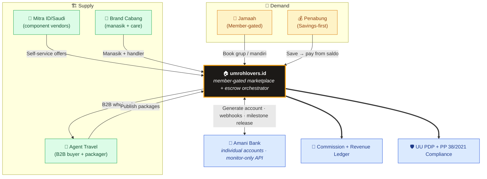

### 6.2 Feature Matrix

> Status legend: ✅ **Shipped** (live on staging, E2E verified) · 🟡 **Mock** (full flow works against a mock external dependency) · 📋 **Planned**

#### Public & Jamaah-Facing

| Feature | Description | Status |
|---|---|---|
| **Premium landing + public catalogs** | `/paket` (group package bursa with grid/list/map views), `/paket-mandiri` (wizard), `/brand` (branch directory), `/mitra` (vendor ecosystem) | ✅ Shipped |
| **8+ interactive Mapbox maps** | Native clustering, two-way card↔marker sync, geolocation "nearest branch", Haram/Nabawi landmark spoke-lines, Indonesia/Saudi toggle, per-card Google Maps CTA | ✅ Shipped |
| **Transparent pricing, gated transaction** | Guests see retail prices (no blur — trust + SEO); booking requires membership. Member prices below retail | ✅ Shipped |
| **Member tier system** | Guest → Registered (Member Umrohlovers, free) → Anggota Koperasi (auto-upgrade at first confirmed booking + bank account) | ✅ Shipped (tier model) / 📋 (full benefit matrix) |
| **Verifikasi Identitas (KYC)** | Document upload (KTP/KK/passport/selfie) → admin Kanban review → approval gates account opening and booking | ✅ Shipped |
| **Tabungan haji/umroh** | Auto-opened account on KYC approval, top-up, savings target picker against real package prices, history | 🟡 Mock bank (full UX shipped) |
| **Booking grup 4-step flow** | Review → Akad → Payment → Done, with akad PDF download | ✅ Shipped / 🟡 mock payment |
| **Paket Mandiri wizard** | Date-first à la carte assembly — see §6.3 | ✅ Shipped |
| **Manasik RSVP** | Browse branch sessions, RSVP, attendance tracked | ✅ Shipped |
| **Agent anonymization** | Travel agent names hidden on public surfaces (rating + tenure shown); revealed post-booking — prevents inter-agent price war | ✅ Shipped |
| **Cart** | Guest cart (localStorage) with login gate at checkout | ✅ Shipped |
| **Privacy & RTBF** | `/privacy`, `/terms`, right-to-be-forgotten with 30-day grace + hard-delete purge worker | ✅ Shipped |

#### Role Dashboards (9 — shared shell, dark mode, full CRUD)

| Dashboard | Role | Highlights | Status |
|---|---|---|---|
| `/dashboard` | Jamaah | KYC, tabungan, bookings + akad PDFs, manasik RSVP | ✅ / 🟡 bank mock |
| `/agent-dashboard` | Agent Travel (PPIU/PIHK) | Package CRUD with cover images, B2B component assembly, KPIs | ✅ Shipped |
| `/brand-dashboard` | Brand Cabang | Manasik full CRUD + Google-Calendar-style month/week views, attendance, jamaah roster | ✅ Shipped |
| `/mitra-dashboard` (merged korporasi + syariah) | Mitra vendors | Item catalog CRUD (4 photos/item), offers (flight/hotel/visa/addon), orders, settlement view | ✅ Shipped |
| `/sales-dashboard` | Agent Sales | Referral link + click tracking, tiered commission history (bronze/silver/gold) | ✅ Shipped |
| `/bank-ops` | Bank partner (monitor-only) | Accounts, transactions, escrow timeline — read-only by design | ✅ / 🟡 mock data |
| `/admin` | Admin koperasi | 5 Kanban moderation pages (KYC, agents, brands, 2× mitra), revenue dashboard, markup config, booking state-machine tool | ✅ Shipped |
| `/admin-finance` | Admin finance | Escrow ledger, releases, reconciliation views | ✅ / 🟡 mock bank |
| `/gabung-mitra` (public) | Prospective partners | Public partnership application → admin review → activation | ✅ Shipped |

#### Platform & Compliance

| Feature | Description | Status |
|---|---|---|
| **Escrow milestone state machine** | paid → visa → ticket → departed → returned; webhook-driven + admin transition tool with escrow timeline | 🟡 Mock bank, logic shipped |
| **Akad PDF generator** | Server-side Shariah contract PDF (gopdf, embedded fonts) per booking | ✅ Shipped |
| **Commission ledger (multi-level)** | One booking → multiple entries: agent sales tier %, cabang override, agent travel markup, platform fee; unit + E2E tested | ✅ Shipped (rates configurable) |
| **System markup engine** | Admin-configurable markup % per product type (seeded: flight 10%, hotel 8%, visa 5%, addon 12%) applied at response time; vendors see clean base prices; supersede history + audit log | ✅ Shipped |
| **Encryption at rest** | AES-256-GCM for NIK/passport fields | ✅ Shipped |
| **UU PDP audit trail** | Audit logs on sensitive writes + data-access logs when staff view jamaah documents; export tooling; compliance audit score 92/100 | ✅ Shipped |
| **Webhook security** | HMAC signature verification + idempotency keys | ✅ Shipped |
| **Performance** | gzip + Redis caching (observed 18× cache hit), k6 validated at 1,000 VUs, Lighthouse 92+/96/99/100 | ✅ Shipped |

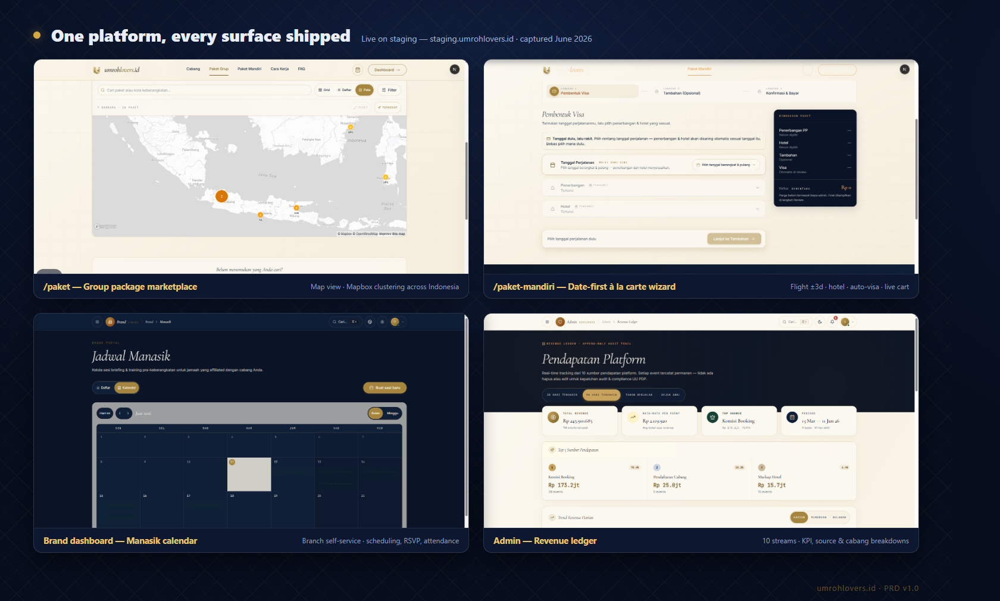
*Figure 3 — Product surface montage: (1) /paket Traveloka-style toolbar with grid/list/map, (2) Paket Mandiri stepper with auto-visa card, (3) brand-dashboard manasik calendar, (4) admin KYC Kanban. All live on staging.*

### 6.3 Paket Mandiri — the Date-First À La Carte Wizard (Unique)

No Indonesian competitor offers a guided self-assembly flow for umroh. Ours is shipped, and it encodes hard business rules that matter to regulators and to trust:

```
Step 1: FLIGHT (PP)      → anchor dates; round-trip ONLY (anti-overstay/TKI enforcement);
                           ±3-day flexible search around the chosen date
Step 2: HOTELS           → multi-city (Makkah and/or Madinah), cover carousels, live stock,
                           distance-to-Haram/Nabawi, per-hotel map
Step 3: ADD-ONS          → optional, vendor-attributed (vaccine, insurance, muthawwif,
                           catering, ihram kit, local transport)
Step 4: REVIEW           → VISA AUTO-MATCHED to the trip window (cheapest valid type),
                           manual override for power users; handling-branch geo-suggest;
                           itinerary summary; escrow payment (savings balance and/or VA)
```

Key properties:
- **Visa is auto-derived, never DIY** — visas are sold exclusively through the platform's SII Saudi channel and must envelope the flight window; this is both a compliance feature (no orphan visas) and the platform's highest-margin component.
- **Round-trip enforcement** — one-way tickets are not shown, by design: a structural answer to the "depart on umroh, stay as undocumented worker" problem that regulators care about.
- **Anti-anxiety UX** — the redesign followed direct stakeholder feedback ("klik klik klik — don't make them think"): date-first, defaults everywhere, one decision per screen.

### 6.4 Escrow & Milestone Model

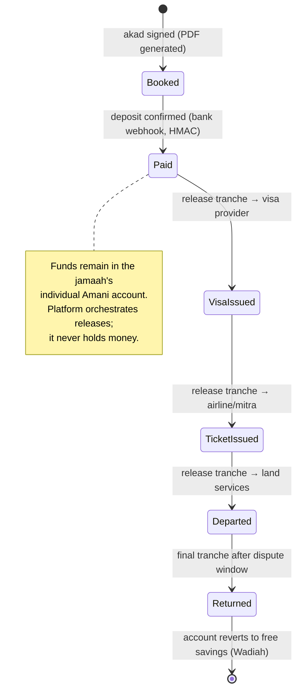

- The full lifecycle **works today** end-to-end on staging via the mock bank client + HMAC webhook receiver + admin transition tool, with every movement recorded in the escrow ledger and revenue ledger.
- Akad layers follow DSN-MUI fatwa structure (Wadiah Yad Dhamanah for savings → Mudharabah Muqayyadah for booked escrow → Ijarah for platform service fees), pending DPS (Shariah Supervisory Board) sign-off — disclosed as a launch dependency in §15.

### 6.5 Bank Integration — Honest Status Disclosure

> **Why this section exists.** "Escrow at an Islamic bank" is the heart of our pitch and the easiest claim to overstate. Here is the unvarnished status.

#### What is shipped today

| Component | Status | Evidence |
|---|---|---|
| `BankClient` adapter interface + full mock implementation | ✅ | Auto account-open on KYC approval, balance, top-up, lock, milestone release |
| Webhook receiver (deposit/release events) with HMAC verification + idempotency | ✅ | Drives the booking state machine end-to-end on staging |
| Escrow ledger (multi-payee per booking) + revenue ledger | ✅ | Every milestone release recorded and visible in /admin-finance |
| Bank-ops monitor dashboard (read-only by design) | ✅ | Mirrors the agreed "platform is monitor-only" principle |
| Savings UX (tabungan dashboard, target picker, payment-from-saldo at checkout) | ✅ | Fully functional against mock |

#### What is real on the business side

| Item | Status |
|---|---|
| Partnership proposal (doc 40) delivered to Amani Bank | ✅ Delivered, revised per investor feedback (June 2026) |
| Technical specification (doc 41) delivered | ✅ Delivered & accepted at working level |
| Directors' meeting / MoU | 🚧 In progress — lead investor track, June 2026 |
| Sandbox / production API access | 📋 Post-MoU (target: August 2026 sandbox, September integration sprint) |

#### What this means for the raise

- **No claim in this PRD assumes a live bank connection.** Every money-flow feature is real software running against a mock that mirrors the agreed API contract (generate account → callback → transfer → milestone release).
- **Swap cost is deliberately minimized** — the adapter-pattern interface means real integration is one implementation, not a rewrite; the September 2026 integration sprint is scoped at ~4 weeks.
- **A disclosed fallback exists**: the architecture is multi-bank ready (`bank_partner_code` field); if Amani slips (it is concurrently absorbing a Bank Muamalat acquisition), alternative Islamic banks are the documented plan B.
- **Bonus angle**: Amani's own digital readiness gap creates a second commercial track — the team has offered to build Amani's internal digitalization (ops dashboard, CS portal, compliance views) as part of the partnership, deepening the lock-in.

---

## 7. Business Model & Revenue Streams

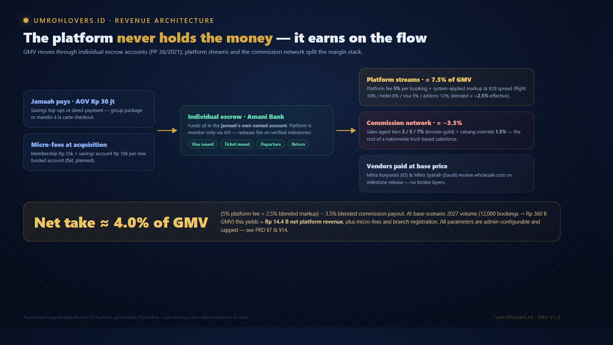
*Figure 4 — Money flow: jamaah funds stay in individual bank accounts; the platform earns fees and markup at orchestration points and distributes field commissions from its margin stack.*

### 7.1 Revenue Streams

All percentages below are **shipped as admin-configurable parameters** (defaults from the business-parameter working assumptions, doc 37) — final rates are a config change, not a code change.

| # | Stream | Mechanic | Default Parameter | Status |
|---|---|---|---|---|
| 1 | **Platform fee per booking** | % of booking value on every grup/mandiri transaction, recorded to the revenue ledger | **5%** (configurable) | ✅ Shipped (mock payments) |
| 2 | **Mandiri component markup** | System-applied markup on vendor base prices; vendors see clean prices; supersede history + audit | flight 10% · hotel 8% · **visa 5%** · addon 12% | ✅ Shipped |
| 3 | **Visa margin via SII Saudi channel** | Exclusive distribution of platform visas at base-price access; margin on top of wholesale | 10–15% or fixed fee (working assumption) | 📋 Pending Saudi contracting |
| 4 | **B2B wholesale spread** | Agent Travel buys components at B2B price (≈10% below retail); platform fee on the B2B transaction; agent markup capped at 20% | configurable | ✅ Engine shipped |
| 5 | **Branch (cabang) registration fee** | One-time fee for opening a kabupaten branch — confirmed as a revenue stream by the business owner | Rp 5–10 jt one-time (TBD final) | 📋 Commercial launch item |
| 6 | **Acquisition micro-fees** | Fixed commission on member signup (Rp 25k) and savings-account opening (Rp 10k) — funds the field salesforce flywheel | flat fees, configurable | ✅ Ledger support shipped |
| 7 | **Financial services (future)** | Referral/nisbah share on savings & deposito products with the partner bank; hajj khusus & multi-year savings plans | post-MoU | 📋 Planned |

> **Jamaah membership itself is free** (confirmed decision) — monetization is transactional, keeping the acquisition funnel friction-free. Koperasi membership cost equivalence is settled at first booking, when the legal cooperative relationship begins.

### 7.2 Commission Distribution (the cost side of the margin stack)

One transaction generates multiple ledger entries — this is the engine that pays a nationwide field network without the platform losing control of unit economics:

| Beneficiary | Default Rate | Trigger |
|---|---|---|
| Agent Sales (field) | bronze 3% / silver 5% / gold 7% by tier | Attributed bookings (referral link / recruitment) |
| Brand Cabang (handler) | 1.5% override | Every booking the branch handles (incl. direct bookings with no sales agent) |
| Agent Travel | own markup (≤20% cap) inside package price | Group packages they assemble |
| Platform | residual of streams 1–6 above | Every transaction |

Commissions are funded from the full margin stack (fee + markup + visa margin + B2B spread), not from the 5% fee alone. The ledger is shipped and tested (unit + 11/11 E2E).

### 7.3 Unit Economics (illustrative)

| Metric | Working Value | Basis |
|---|---|---|
| AOV — group package | Rp 30,000,000 | Market average Rp 25–35M |
| AOV — mandiri assembly | Rp 25,000,000 | Component sum from staging catalog examples |
| Gross platform take (fee + blended markup/margin) | ≈ 7–9% of GMV | Streams 1–4 stacked, before commissions |
| Commission payout (blended) | ≈ 3–4% of GMV | Assumes ~60–70% of bookings carry sales attribution |
| **Net platform take** | **≈ 4–5% of GMV** | Gross take − commissions |
| Net revenue per booking | ≈ Rp 1.2–1.5 million | At Rp 30M AOV |
| CAC through SII channel | Near-zero marginal (community/media-led) | Branch network + Salam Radio + Munas launch |

---

## 8. User Personas

### Persona 1 — Ibu Sari, the Savings-First Jamaah
> *"Saya nabung lima tahun untuk umroh. Saya tidak mau uangnya hilang seperti korban First Travel."*

- **Age:** 47 | **Location:** Bekasi | **Income:** Rp 6M/month household
- **Pain:** Has been saving informally; terrified of handing Rp 30M to a travel agency
- **Journey:** Signs up free (Member Umrohlovers) → Verifikasi Identitas → savings account auto-opens → sets target "Umroh Reguler Rp 32jt" → saves monthly via VA → books a group package paying from saldo → attends manasik at her nearest cabang
- **Value to platform:** Years of engaged savings relationship before the booking; membership conversion at booking

### Persona 2 — Pak Haji Deden, the Licensed Travel Agent (PPIU)
> *"Saya punya izin resmi dan 15 tahun pengalaman, tapi saya kalah bersaing dengan penipu yang jual paket Rp 14 juta."*

- **Company:** Mid-size PPIU, ~300 jamaah/year, West Java
- **Pain:** No base-price access; buys land services through brokers; spreadsheet operations
- **Journey:** Onboards (≈Rp 1M fee) → browses B2B catalog (SII-channel visas, direct-contract hotels) → assembles a group package with 12% markup → publishes; platform anonymizes his brand publicly (no price war) → manages manifest and milestone payouts in /agent-dashboard
- **Value to platform:** Supply quality + B2B transaction fees on every component

### Persona 3 — Ustadz Rahmat, the Cabang Coordinator
> *"Kami yang membina jamaah dari nol — manasik, silaturahmi — tapi selama ini kami tidak dapat apa-apa."*

- **Role:** Coordinator, KOPSIMARI branch, an East Java kabupaten
- **Journey:** Branch registers (one-time fee) → runs manasik schedule in /brand-dashboard with calendar + attendance → gets geo-suggested as handler for nearby bookings → earns 1.5% override on every handled booking, funding free manasik
- **Value to platform:** Trust distribution + last-mile jamaah care that no OTA can replicate

### Persona 4 — Mbak Lina, the Agent Sales
> *"Saya sudah jualan produk koperasi door-to-door. Sekarang saya bisa jualan umroh, keanggotaan, dan tabungan dengan link referral."*

- **Role:** Field marketer under a cabang, silver tier
- **Journey:** Shares referral link → tracks clicks and conversions in /sales-dashboard → earns 5% on attributed bookings + Rp 25k/member + Rp 10k/savings account
- **Value to platform:** Feet-on-the-ground acquisition across 500+ kabupaten at variable cost only

### Persona 5 — Abdullah, the Saudi Vendor (Mitra Syariah)
> *"My hotel in Madinah fills Indonesian rooms through three layers of brokers. I want a direct channel."*

- **Business:** 4-star hotel, 600m from Masjid Nabawi
- **Journey:** Onboards via /gabung-mitra (Arabic materials planned) → lists rooms with stock, photos, distance data → receives milestone settlement on check-in confirmation → sees demand analytics
- **Value to platform:** Direct-contract supply = structural cost advantage and the Phase-2 "kanan kiri diikat" (supply-side lock) strategy

---

## 9. User Flows

### 9.1 Jamaah Mandiri Journey (à la carte)

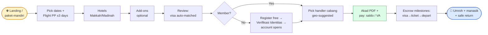

### 9.2 Group Package Flow (B2B → B2C)

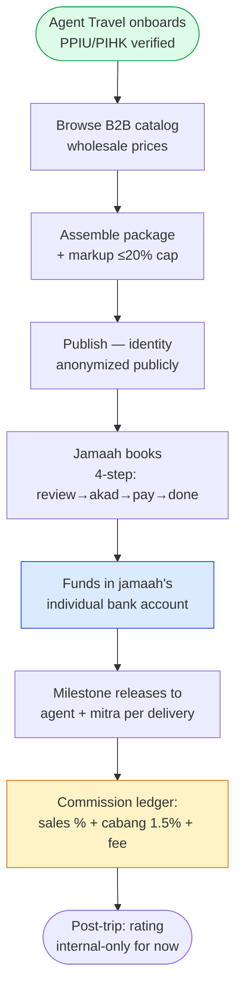

### 9.3 Money Flow (per PP 38/2021 model)

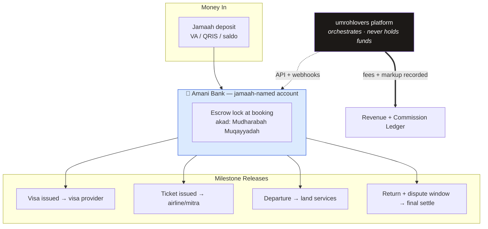

---

## 10. Technology Architecture

### 10.1 Stack Overview

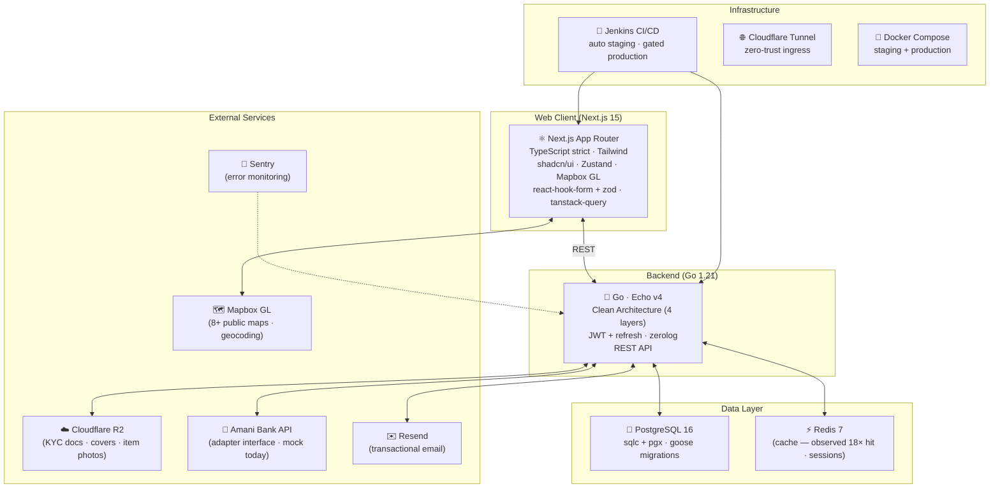

### 10.2 Why This Stack

| Choice | Rationale |
|---|---|
| **Go + Clean Architecture** | Financial orchestration demands auditability and testability: 4-layer separation (domain → usecase → repository → delivery) yields 94–100% usecase test coverage and makes the escrow state machine formally verifiable in tests |
| **sqlc + goose** | Compile-time-checked SQL and forward-only migrations — no ORM surprises in money-touching code paths |
| **Next.js 15 + TypeScript strict** | App-Router SSR for SEO-critical public catalogs; strict typing across an OpenAPI-generated API contract |
| **Adapter-pattern bank client** | The single most important architectural bet: the entire money flow runs against an interface, so mock → Amani (→ any backup bank) is an implementation swap, not a rewrite |
| **Jenkins gated deploys** | development → auto-staging; main → manual approval gate → production. Production discipline before production traffic |

### 10.3 Key Technical Differentiators (investor-relevant)

- **Dual booking engine** — two distinct booking domains (grup / mandiri) sharing one escrow, commission, and membership substrate; competitors typically hard-code one model.
- **Multi-level commission ledger** — one transaction fans out to N beneficiary entries (sales tier %, cabang override, agent markup, platform fee) with milestone-gated release status. This is MLM-grade distribution accounting with marketplace-grade auditability.
- **Milestone escrow state machine** — booking states driven by HMAC-verified bank webhooks with an admin transition tool and full escrow timeline; designed for PP 38/2021's milestone-release expectations.
- **System markup engine** — per-product-type markup applied at the API response layer with supersede history and audit logging; vendors see clean base prices (with vendor-agreement disclosure planned — see §15).
- **Compliance by construction** — AES-256-GCM at rest for NIK/passport, UU PDP audit + data-access logs, RTBF purge worker, retention policies. Audit score 92/100 with findings remediated.
- **Map-first discovery UX** — 8+ Mapbox surfaces (clustering, geolocation, Haram/Nabawi landmarks, Indonesia↔Saudi toggle) tuned for the ~70% mobile audience (44×44 tap targets, mobile-first reflow — audited and fixed).

### 10.4 Engineering Quality Snapshot

| Metric | Value |
|---|---|
| Backend test coverage (usecase layer) | 94–100% across 45 packages, 500+ tests |
| Frontend unit tests | 90 (vitest + testing-library) |
| Lighthouse (post-remediation averages) | Perf 92+ · A11y 96 · Best Practices 99 · SEO 100 |
| Load test | k6 @ 1,000 VUs — passed; DB pool bottleneck identified & sized for pilot (200–500 jamaah) |
| Caching | gzip + Redis, observed 18× cache-hit improvement on hot catalog endpoints |
| E2E flows verified | Auth, KYC, savings, grup booking, mandiri wizard (10/10), commission ledger (11/11), escrow lifecycle incl. webhook-driven transitions, RTBF purge |

---

## 11. Competitive Landscape

### 11.1 Competitor Matrix

| Alternative | Fund Protection | License Trust | À La Carte Mandiri | Community Layer (manasik) | Saudi Base-Price Access | Indonesia Coop Structure |
|---|---|---|---|---|---|---|
| **umrohlovers.id** 🕋 | ✅ Individual escrow (PP 38/2021)* | ✅ Verified PPIU + anonymized fair market | ✅ Shipped wizard, auto-visa | ✅ Native (cabang network) | ✅ SII channel (contracting) | ✅ KOPSIMARI / SII 1905 |
| Conventional travel agencies (offline) | ❌ Pay to agency account | Varies — self-claimed | ❌ | Own manasik (per agency) | ❌ Broker chains | ❌ |
| General OTAs entering umroh (Traveloka-class) | Partial (gateway escrow ≠ milestone escrow) | Listing-level only | Partial (flight+hotel, no visa logic) | ❌ | ❌ | ❌ |
| Existing digital umroh platforms / consortium apps | Mostly ❌ (booking funnels for agencies) | Partial | ❌ Package-only | ❌ | Varies | ❌ |
| Bank tabungan haji/umroh products | ✅ (savings only) | n/a | ❌ No journey product | ❌ | ❌ | ❌ |

*\* Escrow architecture shipped against mock bank; live with Amani integration (see §6.5).*

### 11.2 Moats

1. **Trust stack no one else can assemble** — 120-year institutional heritage + cooperative legal gate + individual bank escrow. An OTA can copy UX in a quarter; it cannot acquire Syarikat Islam's history or a cooperative member relationship.
2. **Supply-side lock ("kanan kiri diikat")** — the explicit Phase-2 strategy: finance side anchored by the partner bank, Saudi side anchored by direct hotel/visa contracts via the SII channel. Once both ends are bound, agents and vendors face real switching costs.
3. **Distribution at near-zero CAC** — branch network + field salesforce + Salam Radio + the November Munas SI national launch reach tens of millions inside an existing trust relationship.
4. **The mandiri wizard** — a genuinely differentiated product (date-first, PP-only flights, auto-matched platform visas) that OTAs structurally won't build because it requires owning the visa supply.
5. **Fair-market design for agents** — public anonymization prevents the race-to-the-bottom price war that makes agents hostile to other marketplaces; agents join *because* the platform protects them.
6. **Compliance head start** — UU PDP + PP 38/2021 alignment built in from day one, with audit scores and tooling to prove it.

---

## 12. Go-to-Market Strategy

### 12.1 Channel Strategy — Trust-Led, Not Ad-Led

| Pillar | Mechanic | Segment |
|---|---|---|
| **SII institutional network** | Branch-by-branch rollout (kabupaten cabang as franchise-like nodes), Munas SI Surabaya national launch (Nov 2026), Muharram roadshow | Jamaah + branches |
| **Field salesforce** | Agent Sales tiers (3/5/7%) selling four products: packages, membership, savings, vendor add-ons — paid on the shipped commission ledger | Mass-market jamaah |
| **Salam Radio & SI media** | Video promo, podcast series, WhatsApp distribution to branch leadership | Community awareness |
| **Direct B2B outreach** | Five-angle presentation program (jamaah / travel agents / Indonesian vendors / Saudi vendors / branches, Arabic versions for Saudi); Zoom critique sessions with major travel agents pre-launch | Supply side |
| **Direct supply contracting** | Jeddah hotel-onboarding event; direct airline meetings (Garuda, Lion, Saudia); deliberately skipping Trip.com/Traveloka integrations in year one to protect margin | Saudi + airline supply |

### 12.2 Launch Sequence (2026)

1. **June** — Amani directors' meeting; platform UX hardening from stakeholder feedback (shipped); agent-critique Zoom sessions.
2. **July** — Amani technical workshop + joint DPS akad design; Arabic materials; Muharram internal SI roadshow.
3. **August** — MoU signing target; Amani sandbox; Jeddah hotel contracting; airline meetings.
4. **September** — 4-week Amani integration sprint; **pilot wave 1: 50 jamaah, 1 branch**.
5. **October** — pilot expansion to **200 jamaah, 3 branches**; pre-Munas campaign; onboard major travel agents.
6. **November** — 🎯 **Full public launch at Munas SI Surabaya** (national leadership election year = maximum attention); target 1,000 jamaah in the first 8 weeks.

### 12.3 Acquisition Economics

| Channel | Cost Character | Note |
|---|---|---|
| Branch/community referral | Variable only (commission ledger) | Core engine; no paid media required for the SI base |
| Agent Travel onboarding | ~Rp 1M fee vs Rp 5–7M at incumbent schemes | Price-led B2B acquisition; non-exclusive in Phase 1 ("acquire first"), structural lock via supply in Phase 2 |
| Salam Radio / organic | Production cost only | Trust media inside the community |
| Paid digital | Deferred | Only post-pilot, once funnel conversion is measured |

---

## 13. Roadmap & Milestones

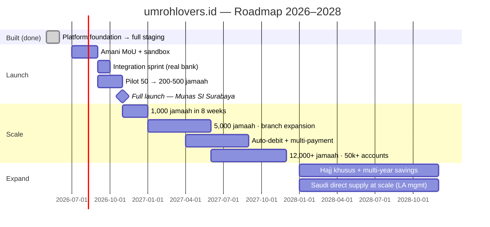

### Key Milestones

| Milestone | Target / Date | Status |
|---|---|---|
| Full platform on staging (dual engine, 9 dashboards, escrow mock E2E) | May–June 2026 | ✅ Done |
| Compliance layer (encryption, audit, RTBF, HMAC) — audit 92/100 | May–June 2026 | ✅ Done |
| Production domain & CI/CD (umrohlovers.id, gated deploys) | June 2026 | ✅ Infrastructure live |
| Amani Bank proposal + technical spec delivered | June 2026 | ✅ Done |
| Amani MoU signed | Target Aug 2026 | 🚧 In progress |
| Real bank integration live (swap mock) | Target Sep–Oct 2026 | 📋 Scoped (~4 weeks) |
| **First real transaction** (pilot wave 1, 50 jamaah) | Target Sep–Oct 2026 | 📋 The milestone this raise accelerates |
| Pilot 200–500 jamaah across 3 branches | Target Oct–Nov 2026 | 📋 |
| **Full public launch — Munas SI Surabaya** | November 2026 | 📋 |
| 1,000 booked jamaah | Jan 2027 (8 weeks post-launch) | 📋 |
| 20,000–50,000 savings accounts | EOY 2027 (Year 1 of operation) | 📋 Business target |
| 12,000+ booked jamaah / year run-rate | Q4 2027 | 📋 |
| 100,000–150,000 accounts · ~50,000 bookings/yr | 2028–2029 (Year 3) | 📋 ~10% market share target |
| Hajj khusus + multi-year savings products | 2028 | 📋 |

---

## 14. Financial Projections

> ⚠️ **Illustrative scenarios, not forecasts.** The platform is pre-revenue with zero transactions. Every figure below derives from explicit unit-economics assumptions (stated first) applied to the volume targets set by the business team. Currency: IDR primary; USD at ~Rp 16,000/USD for reference.

### 14.1 Assumptions

| Assumption | Value | Source |
|---|---|---|
| AOV per booking | Rp 30,000,000 | Market average Rp 25–35M |
| Platform fee | 5% of booking value | Shipped default (configurable) |
| Blended additional margin (markup + visa + B2B spread) | +2.5% of GMV effective | Streams 2–4, conservatively blended |
| Commission payout (sales + cabang override, blended) | −3.5% of GMV | 3–7% tiers + 1.5% override, ~65% attribution |
| **Net platform take** | **≈ 4.0% of GMV** | (5% + 2.5%) − 3.5% |
| Micro-fees (membership/savings acquisition) | Rp 35k per new funded account | Rp 25k + Rp 10k flat fees |
| Bookings as % of active savings accounts | ~25–30% per year | Working assumption — savers convert over multi-year horizons |

### 14.2 Scenario Table (booked jamaah → revenue)

| | 2026 (Nov–Dec launch) | 2027 | 2028 |
|---|---|---|---|
| **Savings accounts (cumulative)** | 2,000–5,000 | 20,000–50,000 | 100,000–150,000 |
| **Booked jamaah (conservative)** | 500 | 6,000 | 25,000 |
| **Booked jamaah (base — team targets)** | 1,000 | 12,000 | 50,000 |
| GMV — base | Rp 30 B (~$1.9M) | Rp 360 B (~$22.5M) | Rp 1.5 T (~$94M) |
| **Net platform revenue — conservative (4%)** | Rp 0.6 B (~$38K) | Rp 7.2 B (~$450K) | Rp 30 B (~$1.9M) |
| **Net platform revenue — base (4%)** | Rp 1.2 B (~$75K) | Rp 14.4 B (~$900K) | Rp 60 B (~$3.75M) |
| Micro-fee revenue (base) | ~Rp 0.1 B | ~Rp 1.2 B | ~Rp 2.6 B |
| Branch registration fees (base: 30 → 150 → 300 cabang @ Rp 7.5M) | Rp 0.2 B | Rp 0.9 B | Rp 1.1 B |
| **Total net revenue — base** | **≈ Rp 1.5 B (~$95K)** | **≈ Rp 16.5 B (~$1.0M)** | **≈ Rp 64 B (~$4.0M)** |

### 14.3 Cost Structure (estimates)

| Cost Category | 2026 (partial yr) | 2027 | 2028 |
|---|---|---|---|
| Engineering team (scale from solo CTO to 4–6) | Rp 0.8 B | Rp 3.5 B | Rp 6.0 B |
| Ops, support & finance ops | Rp 0.3 B | Rp 2.0 B | Rp 4.5 B |
| Sales & BD (field program, agent onboarding, Saudi contracting trips) | Rp 0.5 B | Rp 3.0 B | Rp 5.0 B |
| Marketing (launch, Munas, media production) | Rp 0.4 B | Rp 1.5 B | Rp 3.0 B |
| Infrastructure (VPS, Cloudflare, R2, monitoring) | Rp 0.05 B | Rp 0.3 B | Rp 0.8 B |
| Legal, DPS/Shariah, compliance | Rp 0.3 B | Rp 0.8 B | Rp 1.2 B |
| **Total OPEX** | **≈ Rp 2.35 B** | **≈ Rp 11.1 B** | **≈ Rp 20.5 B** |
| **Net (base scenario)** | ≈ −Rp 0.85 B | **≈ +Rp 5.4 B** | ≈ +Rp 43.5 B |

> Under base-scenario volumes, the model crosses **operational break-even during 2027**; under the conservative scenario, break-even shifts to late 2027/early 2028. Both depend on the two gating events — bank integration live and pilot conversion — which is precisely what this raise funds.

### 14.4 Why the volume targets are credible (and where they aren't)

- **For**: the lead investor's visa-trade benchmark (partners moving 40–71k visa units/year) anchors the 20–50k Year-1 account target; SI's 40M-person reach makes the distribution claim structural, not aspirational; Munas timing concentrates national attention.
- **Against (disclosed)**: zero conversion data exists today; savings-account → booking conversion is an assumption; the bank dependency is real. We model conservatively at 4% net take and present the conservative column for exactly this reason.

---

## 15. Risks & Mitigations

| Risk | Probability | Impact | Mitigation |
|---|---|---|---|
| **Pre-revenue; zero real transactions** | Current state | High | The platform is built and E2E-verified; the raise funds the two conversion events (bank go-live, pilot), not product development. Honest framing: we are pre-revenue, not pre-product |
| **Amani Bank dependency** — MoU slips; Amani's focus split by its Bank Muamalat acquisition; digital readiness gap on the bank side | High | High | Adapter-pattern architecture is multi-bank ready (documented plan B: alternative Islamic banks); the team has offered to build Amani's internal digitalization, converting their weakness into partnership leverage; mock contract mirrors the agreed API so integration is a 4-week sprint, not a rebuild |
| **BPS-BPIH / regulatory status** — partner bank's eligibility for hajj funds; Kemenag & OJK navigation | Medium | High | Explicit open item being confirmed at the directors' track; umroh (the launch product) carries lighter requirements than hajj funds; cooperative legal structure + DPS sign-off chain designed in; institutional network includes national-level legal and cooperative-policy figures |
| **Shariah sign-off (DPS) on akad products** | Medium | Medium | Akad layers mapped to existing DSN-MUI fatwas (Wadiah/Mudharabah/Ijarah); joint DPS design workshop scheduled with the bank in July; launch product can run on the simplest akad first |
| **Agent adoption / channel conflict** — agents fear marketplace cannibalization; non-exclusive agents cut undertable deals | Medium | Medium | Fair-market design (public anonymization = no price war) is already shipped; onboarding priced at ~⅕ of incumbent schemes; Phase-2 supply-side lock (visa/hotel base prices) makes the platform the cheapest place to assemble a package; audit logs deter off-platform leakage |
| **Umroh seasonality & external shocks** (Ramadan/hajj season peaks, Saudi policy changes, pandemic-class events) | Medium | Medium | Savings product smooths revenue across seasons (accounts accrue year-round); escrow milestone design means undelivered services keep funds with jamaah — the platform's trust position *strengthens* in a crisis |
| **Big-OTA competition** (Traveloka-class entering umroh) | Medium | Medium | OTAs cannot replicate the cooperative gate, the cabang/manasik layer, or platform-exclusive visa supply; our wedge is the trust + community + escrow stack, not inventory breadth |
| **Vendor markup transparency** — vendors discovering system-applied markup could dispute | Low | Low | Vendor agreements to carry an explicit "platform may apply pricing optimization" clause; markup engine keeps full supersede history + audit log |
| **Key-person concentration (solo CTO)** | Medium | Medium | Clean Architecture + 94–100% test coverage + complete documentation (44+ numbered docs) minimize bus factor; first use of funds includes 2–3 senior engineering hires around the proven foundation |
| **Fraud migrating onto the platform** (fake agents/vendors) | Low | High | License verification (SISKOPATUH ID), admin moderation Kanbans for every role, member-gating, and — decisively — no actor on the platform ever holds jamaah funds |

---

## 16. Investment Ask

### 16.1 Round Structure — TBD (placeholder)

The round size, instrument, and valuation are **under discussion within the founding consortium** (an internal lead-investor track is already active — see §2.1). This section presents the intended *structure of capital deployment* so prospective investors can evaluate fit; figures will be finalized in the term sheet.

| Item | Detail |
|------|--------|
| **Round Type** | Seed / strategic round *(structure TBD)* |
| **Funding Target** | *TBD — sized to an 18-month runway through full launch and 2027 scale-up* |
| **Lead** | Internal consortium lead active; external co-investors invited |
| **Use-of-funds horizon** | Through Munas launch (Nov 2026) + 12 months of scaling |

### 16.2 Use of Funds (allocation structure)

| Category | % | Purpose |
|----------|---|---------|
| **Bank Integration & Pilot Operations** | 25% | Amani integration sprint, pilot waves (50 → 500 jamaah), reconciliation ops, DPS/akad finalization |
| **Sales, BD & Supply Contracting** | 30% | Agent Travel acquisition, branch (cabang) activation program, Jeddah hotel onboarding event, airline direct contracts, Arabic materials |
| **Engineering Team** | 20% | 2–3 senior hires around the proven codebase (BE, FE, QA/SRE); mobile app track |
| **Marketing & Launch** | 15% | Munas SI Surabaya launch, Salam Radio production, five-angle deck program, post-launch campaigns |
| **Legal, Compliance & Governance** | 10% | MoU/contracts, DPS & DSN-MUI processes, Kemenag/OJK navigation, ® registration, UU PDP program |

> **Priority logic:** the product is built; capital converts it into transactions. The two largest allocations target the two binding constraints — live bank rails and supply/distribution activation.

### 16.3 What We're Looking For in an Investor

- **Islamic finance & banking network** — accelerating the bank track (or de-risking it with alternatives)
- **Travel & Saudi supply relationships** — hotels, airlines, visa ecosystem
- **Cooperative & government policy fluency** — Kemenag, OJK, Kemenkop ecosystems
- **Patient, mission-aligned capital** — this is infrastructure for a religious obligation, with a multi-year trust-compounding curve

### 16.4 Why Now?

1. **The platform is built and verifiable today** — staging is live with the full dual-engine marketplace, 9 dashboards, and a working (mock-banked) escrow lifecycle. We are raising to launch and scale, not to build.
2. **A dated, named launch window exists** — Munas SI Surabaya, November 2026: a once-in-years national gathering of the distribution network, with the pilot and bank integration sequenced to land just before it.
3. **The trust vacuum is unfilled** — post-fraud-era demand for protected umroh payments has no incumbent answer; the first credible heritage + escrow + tech player sets the standard.
4. **Supply-side lock is available now** — Saudi Vision 2030 capacity expansion means hotels and visa channels are actively seeking direct Indonesian demand; the Jeddah contracting window is open.
5. **Regulatory winds favor this exact design** — PP 38/2021 milestone protection, cooperative policy momentum (Koperasi Merah Putih, LPDB), and Kemenag tightening all reward the architecture we already shipped.

---

## Appendix

### A. Technology Stack Summary

| Layer | Technology |
|---|---|
| Frontend | Next.js 15 (App Router), TypeScript strict, Tailwind CSS, shadcn/ui, Zustand, react-hook-form + zod, tanstack-query, sonner |
| Maps | Mapbox GL JS — 8+ surfaces: clustering, geolocation, landmark spoke-lines, ID↔Saudi toggle |
| Backend | Go 1.21, Echo v4, Clean Architecture (domain/usecase/repository/delivery) |
| Database | PostgreSQL 16, sqlc + pgx (type-safe queries), goose migrations |
| Cache | Redis 7 (catalog cache — observed 18× hit; sessions) |
| Storage | Cloudflare R2 (KYC documents — presigned 10-min URLs, package covers, vendor item photos) |
| Bank integration | Adapter-pattern `BankClient` (mock live; Amani swap scoped ~4 weeks); HMAC webhooks + idempotency |
| Documents | gopdf akad (Shariah contract) generator with embedded fonts |
| Security & compliance | AES-256-GCM at-rest (NIK/passport), JWT + refresh, bcrypt, UU PDP audit + data-access logs, RTBF purge worker |
| Email | Resend (verification, reset, notifications) |
| Monitoring | Sentry (BE wired), structured zerolog JSON |
| CI/CD | Jenkins — development → auto-staging; main → approval gate → production; Docker Compose; Cloudflare Tunnel |
| Testing | testify (500+ BE tests, 94–100% usecase coverage), vitest (90 FE tests), k6 (1,000 VUs), curl-driven E2E suites |
| i18n | id live; en/ar scaffolded (Arabic prioritized for Saudi vendor surfaces) |

### B. Visualization Index

All figures referenced inline; assets to be exported from staging screenshots and chart templates.

| Visual | Section | Purpose |
|---|---|---|
| Market Opportunity rings (TAM/SAM/SOM) | §1, §5 | Rp 30–40T market funnel to Year-3 capture |
| Landing hero screenshot | §6 | Live staging proof, branding chain |
| Product montage (4-grid: /paket map · wizard · calendar · Kanban) | §6.2 | Breadth of shipped surface |
| Revenue flow diagram | §7 | Escrow-centric money flow with platform take points |
| Solution & architecture Mermaid diagrams | §4, §6.1, §9, §10 | Rendered inline (no image dependency) |
| Roadmap Gantt | §13 | Launch sequence to Munas + scale |

### C. Glossary

| Term | Definition |
|---|---|
| **Umroh (Umrah)** | The "minor pilgrimage" to Makkah, performable year-round — Indonesia's largest outbound religious travel category |
| **Hajj / Haji khusus** | The annual major pilgrimage; "khusus" = premium non-government-queue track |
| **Jamaah** | Pilgrim(s) — the platform's end customer |
| **Koperasi** | Indonesian legal cooperative (UU 25/1992); KOPSIMARI is the platform's parent cooperative |
| **Manasik** | Pilgrimage rites training, traditionally run by local communities — owned by cabang on the platform |
| **Cabang / Brand Cabang** | Kabupaten (regency)-level branch — manasik owner, jamaah care, commission override beneficiary |
| **PPIU / PIHK** | Government licenses for umroh (PPIU) and special hajj (PIHK) travel organizers |
| **SISKOPATUH** | Kemenag's monitoring system & registry for licensed umroh operators |
| **Muthawwif** | Pilgrimage guide accompanying jamaah in Saudi Arabia |
| **Mitra** | Vendor partner (Indonesian: handling/flights/vaccine/insurance · Saudi: visa/hotel/catering/muthawwif) |
| **Akad** | Shariah contract; layers used: Wadiah Yad Dhamanah (custodial savings), Mudharabah Muqayyadah (restricted escrow), Ijarah (service fee) |
| **DPS / DSN-MUI** | Shariah Supervisory Board / National Shariah Council — sign-off chain for akad products |
| **PP 38/2021** | Government regulation underpinning protected, milestone-released umroh funds |
| **UU PDP** | Indonesia's Personal Data Protection law — drives the platform's encryption/audit/RTBF design |
| **BPS-BPIH** | Designated Islamic banks eligible to hold hajj funds — open regulatory item for the bank partner |
| **Tabungan** | Savings — here, the jamaah's individual pilgrimage savings account at the partner bank |
| **Munas** | Musyawarah Nasional — Syarikat Islam's national congress (Surabaya, Nov 2026 = launch venue) |
| **Rumah Sinergi** | "House of Synergy" — the platform's multi-stakeholder collaboration vision |

### D. Delivered Phases (May → June 2026)

Concrete execution log — the entire platform below was designed, built, and E2E-verified in roughly five weeks by a one-engineer team:

| Phase | Delivered | Surface |
|---|---|---|
| Foundation | Auth (register/login/refresh/OAuth/email verify/reset), KYC upload + review, landing, package catalog | BE + FE |
| Sprint 1 | Brand (cabang) + Mitra modules: DB, BE, FE, admin | Full stack |
| Sprint 2 | À la carte catalog (flights, hotels, addons) | Full stack |
| Sprint 3 | Manasik sessions + RSVP + brand profile | Full stack |
| Sprint 4 | Compliance hardening: AES-256-GCM, webhook HMAC, idempotency | BE |
| Sprint 5 | Revenue ledger + admin revenue dashboard (10 sources) | Full stack |
| Sprints 6–8 | Brand-owner self-service portal, manasik full CRUD + calendar views, admin Kanban suite (KYC/agents/brands/2× mitra) + document preview with UU PDP access logging | Full stack |
| Maps program | 8+ Mapbox surfaces: admin + public maps, clustering, geolocation, landmarks, navigation pattern; mobile UX audit + fixes | FE + BE geocoding |
| Savings | Tabungan mechanism (doc 28) E2E with mock Amani: auto-open on KYC, top-up, target picker, history | Full stack (🟡 mock bank) |
| Role dashboards | agent / sales / bank-ops / mitra / admin-finance dashboards — 9 total | Full stack |
| Booking grup | 4-step flow + akad PDF + escrow ledger + bank webhook receiver + admin state-machine tool | Full stack (🟡 mock pay) |
| Paket Mandiri | Date-first stepper (Flight PP → Hotels → Addons → Review) with auto-visa matching, anti-TKI PP rule, handler geo-suggest, savings payment | Full stack |
| Commission ledger | Multi-level entries (sales tier / cabang override / agent markup / platform fee), configurable rates | Full stack |
| Markup engine | `pricing_markup_config` + response transformer + admin endpoints + audit (12 tests, 92% cov) | BE (FE admin UI follow-up) |
| Post-meeting UX batch (Jun) | Logo composition, travel-agent anonymization, travel_sales-only public maps, stepper redesign, membership-tier model | FE + BE |
| Quality program | 500+ BE tests (94–100% usecase cov), 90 FE tests, Lighthouse remediation, k6 1,000 VUs, gzip + Redis caching, UU PDP audit 92/100 | All |

---

*© 2026 umrohlovers.id — PT ARTASI · KOPSIMARI. All projections are forward-looking illustrations based on stated assumptions and comparable Indonesian travel-industry benchmarks; actual results may differ materially. The platform is pre-revenue; bank integration is pending MoU. For investor discussion purposes only.*

*Document version 1.0 · June 2026 · Prepared by the umrohlovers team — Aditira Jamhuri (Tech Lead/CTO), with Cokie "CKsan" and Lukman (Lead Investor/BD).*
