# MGS ERP System — Proposal & Feature Design
## *Enterprise Resource Planning untuk PT. Manata Gawi Sabumi*

> **Disiapkan oleh:** Tim Pengembang  
> **Tanggal:** April 2026  
> **Versi Dokumen:** 1.0  
> **Status:** Draft Proposal

---

## Daftar Isi

1. [Executive Summary](#1-executive-summary)
2. [Mengapa MGS Membutuhkan ERP?](#2-mengapa-mgs-membutuhkan-erp)
3. [Visi Sistem](#3-visi-sistem)
4. [Modul ERP — Overview](#4-modul-erp--overview)
5. [Detail Fitur per Modul](#5-detail-fitur-per-modul)
6. [Workflow & SOP — Alur Kerja Operasional](#6-workflow--sop--alur-kerja-operasional)
7. [System Architecture & Flow](#7-system-architecture--flow)
8. [Dashboard & Reporting](#8-dashboard--reporting)
9. [Database Design (ERD)](#9-database-design-erd)
10. [Roadmap Implementasi](#10-roadmap-implementasi)
11. [Next Steps & Data Collection](#11-next-steps--data-collection)

---

## 1. Executive Summary

PT. Manata Gawi Sabumi (PT. MGS) adalah perusahaan pengadaan barang & jasa skala nasional yang beroperasi di Kalimantan dan Jawa. Dengan portofolio proyek mencakup sektor ketenagalistrikan (PLTU), konstruksi elektrikal, rental alat berat, dan penyedia tenaga kerja — kebutuhan akan sistem yang **terintegrasi, real-time, dan akurat** menjadi keharusan untuk mendukung pertumbuhan bisnis.

Sistem **MGS ERP** dirancang khusus untuk menjawab tantangan operasional PT. MGS, mulai dari tracking proyek multi-lokasi, manajemen pengadaan, pengelolaan tenaga kerja, hingga pelaporan keuangan — semua dalam **satu platform terpadu**.

> **Tagline:** *"Satu Platform. Seluruh Operasi MGS. Real-time."*

---

## 2. Mengapa MGS Membutuhkan ERP?

### Pain Points yang Sering Terjadi

| # | Masalah | Dampak Bisnis |
|---|---|---|
| 1 | Tracking proyek dilakukan manual (WhatsApp/Excel) | Tidak ada visibilitas real-time untuk manajemen |
| 2 | Data karyawan yang ditempatkan di proyek tidak terkonsolidasi | Risiko double-placement, keterlambatan gaji |
| 3 | Pengadaan barang tanpa approval workflow digital | PO tercecer, tidak ada audit trail |
| 4 | Status alat berat & armada kendaraan tidak terpantau | Idle asset tidak terdeteksi, biaya meningkat |
| 5 | Laporan proyek ke klien dibuat manual, lambat | Kepercayaan klien menurun |
| 6 | Tagihan dan pembayaran dikelola terpisah | Cash flow sulit diprediksi |

### Nilai yang Diberikan ERP MGS

```
SEBELUM ERP                    SESUDAH ERP
─────────────────────────────────────────────────────────
Excel & WA group           →   Dashboard real-time
Laporan manual mingguan    →   Laporan otomatis harian
PO via email/verbal        →   Workflow approval digital
Data karyawan tersebar     →   HR terpusat & akurat
Alat berat tidak terlacak  →   Asset tracking real-time
Invoice dikejar manual     →   Notifikasi otomatis
```

---

## 3. Visi Sistem

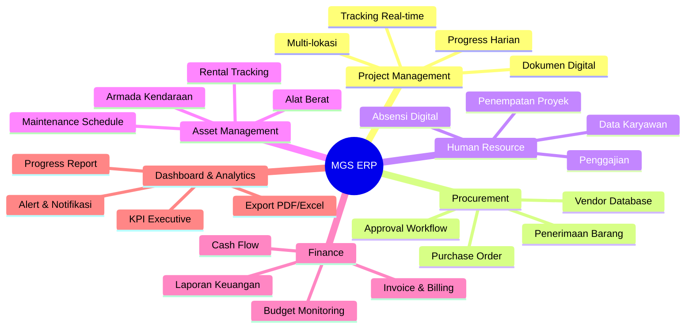

---

## 4. Modul ERP — Overview

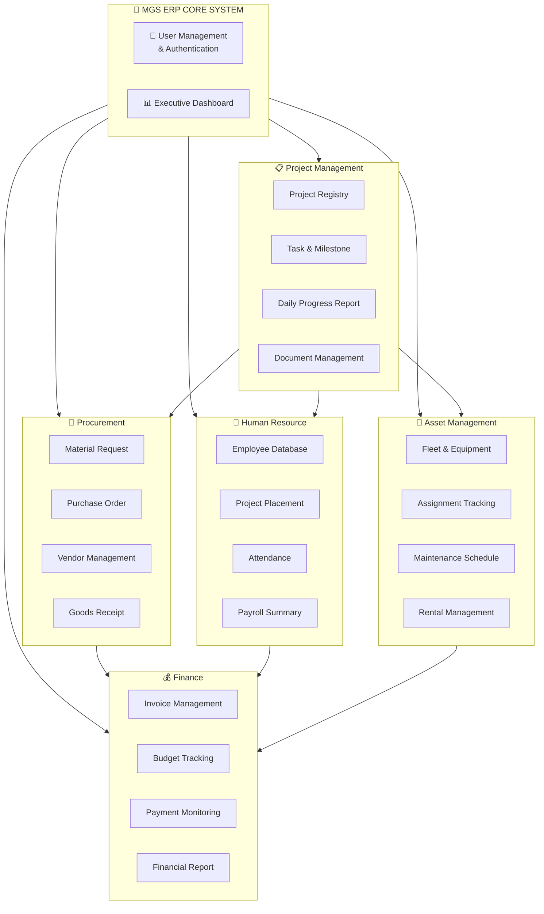

---

## 5. Detail Fitur per Modul

### 5.1 Project Management

Modul inti yang menjadi tulang punggung operasional MGS. Setiap proyek — baik pengadaan PLTU, maintenance generator, maupun konstruksi elektrikal — dikelola dalam satu sistem.

**Fitur Utama:**

| Fitur | Deskripsi |
|---|---|
| Project Registry | Database semua proyek aktif/historis dengan status, nilai kontrak, lokasi |
| Project Type Classification | Kategorisasi: Procurement / Maintenance / Construction / Labor Supply / Rental |
| Task & Milestone Management | Breakdown tugas per tahapan proyek dengan deadline & PIC |
| Daily Progress Report | Input progress harian dari lapangan, lengkap foto & kendala |
| Progress Dashboard | Visualisasi % completion per proyek secara real-time |
| Document Center | Upload SPK, kontrak, BAST, foto lapangan secara digital |
| Notifikasi Deadline | Alert otomatis untuk proyek yang mendekati deadline |
| Multi-lokasi Support | Proyek Banjarmasin & Surabaya dipantau dalam satu dashboard |

**Flow Proyek:**

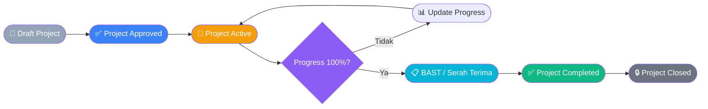

---

### 5.2 Procurement Management (Pengadaan Barang & Jasa)

Modul untuk mengelola seluruh proses pengadaan — dari request material di lapangan hingga penerimaan barang dan pembayaran vendor.

**Fitur Utama:**

| Fitur | Deskripsi |
|---|---|
| Material Request (MR) | Form permintaan material dari tim lapangan per proyek |
| Purchase Order (PO) | Pembuatan PO digital dengan nomor otomatis |
| Approval Workflow | Alur persetujuan: Field → PM → Finance → Direktur |
| Vendor Database | Daftar supplier terverifikasi dengan rating & riwayat |
| Goods Receipt | Konfirmasi penerimaan barang dengan checklist |
| PO Tracking | Status PO real-time: Draft → Submitted → Approved → Delivered |
| Budget Control | Peringatan otomatis jika PO melebihi budget proyek |

**Flow Pengadaan:**

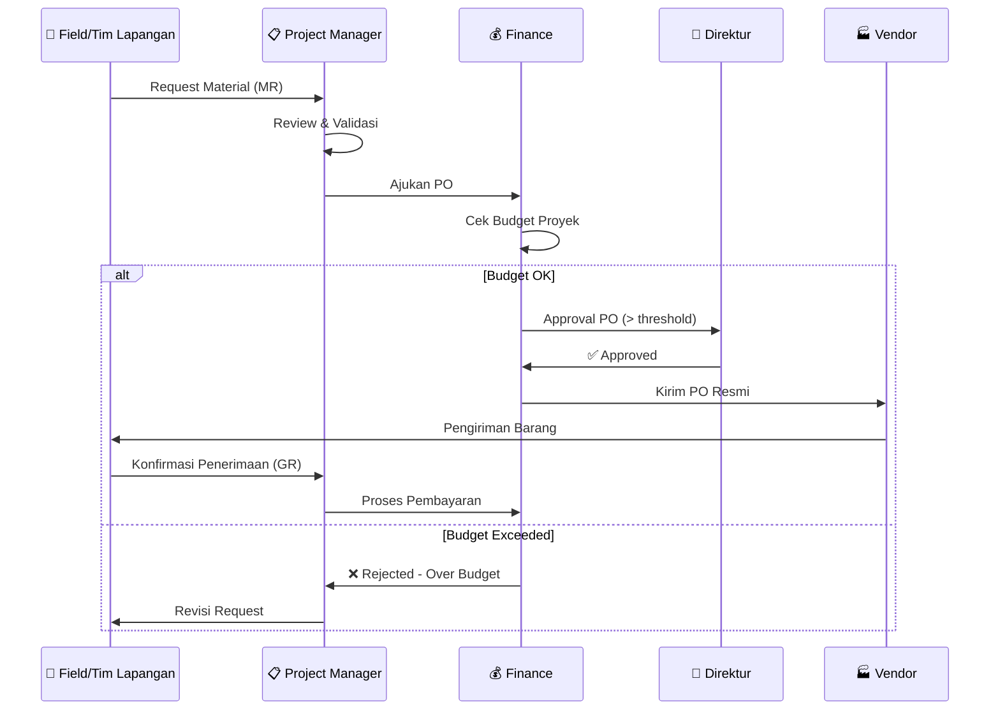

---

### 5.3 Human Resource & Employment Provider

Modul HR yang dirancang khusus untuk MGS yang juga berperan sebagai **penyedia tenaga kerja** ke klien industri.

**Fitur Utama:**

| Fitur | Deskripsi |
|---|---|
| Employee Database | Data lengkap karyawan internal + tenaga kerja yang disuplai |
| Employment Type | Kategorisasi: Karyawan Tetap / Kontrak / Outsource / Freelance |
| Project Placement | Tracking penempatan karyawan di proyek klien |
| Attendance Digital | Absensi harian per proyek (lokasi-aware) |
| Placement History | Riwayat penempatan karyawan per proyek |
| Document Employee | Upload KTP, KK, BPJS, kontrak kerja |
| Payroll Summary | Rekap gaji & tunjangan per periode |
| Headcount Report | Laporan jumlah tenaga kerja per proyek ke klien |

**Flow Penempatan Tenaga Kerja:**

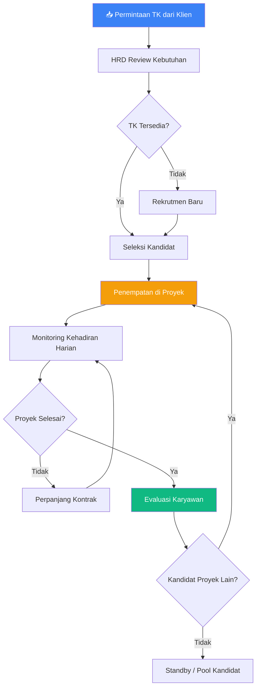

---

### 5.4 Asset & Equipment Management

Modul untuk mengelola seluruh aset MGS: **14+ unit kendaraan Toyota**, alat berat, dan peralatan teknis yang digunakan di berbagai proyek.

**Fitur Utama:**

| Fitur | Deskripsi |
|---|---|
| Asset Registry | Database semua aset dengan foto, spesifikasi, kondisi |
| Asset Category | Kendaraan / Alat Berat / Alat Teknis / Elektronik |
| Assignment Tracking | Aset ditugaskan ke proyek mana, oleh siapa, kapan |
| Maintenance Schedule | Jadwal servis & perawatan berkala dengan reminder |
| Rental Management | Tracking rental alat berat ke klien (tarif/hari, durasi) |
| Availability Calendar | Kalender ketersediaan aset per tanggal |
| Condition Report | Laporan kondisi aset sebelum & sesudah proyek |
| Depreciation Tracking | Perhitungan nilai penyusutan aset |

**Asset Status Flow:**

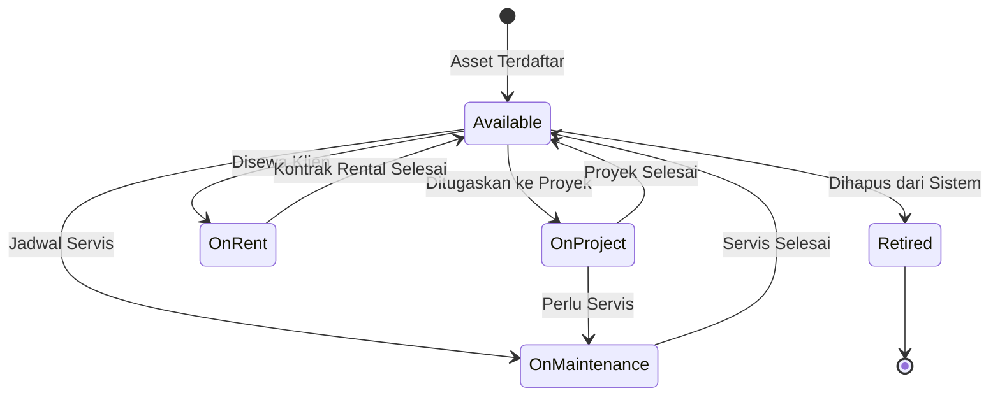

---

### 5.5 Finance & Billing

Modul keuangan yang menghubungkan seluruh transaksi dari proyek, pengadaan, dan HR menjadi laporan keuangan yang komprehensif.

**Fitur Utama:**

| Fitur | Deskripsi |
|---|---|
| Invoice Management | Pembuatan & tracking invoice ke klien |
| Payable Tracking | Monitor tagihan dari vendor yang belum dibayar |
| Budget per Project | Alokasi & monitoring budget per proyek |
| Payment Status | Status pembayaran: Draft / Sent / Partial / Paid / Overdue |
| Revenue Tracking | Rekap pendapatan per proyek / per periode |
| Cash Flow Report | Laporan arus kas masuk & keluar |
| Tax Management | Rekap pajak (PPh, PPN) per transaksi |
| Financial Dashboard | KPI keuangan untuk manajemen eksekutif |

---

### 5.6 Dashboard & Analytics (Executive View)

Dashboard eksekutif MGS ERP dirancang mengikuti standar desain modern **ORDO-style** — dark sidebar, teal accent, layout bersih dengan data yang actionable. Tersedia **7 tampilan** yang dapat diakses melalui sidebar navigasi.

> **Visual Mockup:** Click website [MGS ERP Dashboard Preview](https://ajarka.github.io/public-documentation/MGS/html/MGS_ERP_Dashboard_Preview.html) untuk tampilan interaktif lengkap yang dapat dibuka langsung di browser.

**Tampilan yang Tersedia:**

| View | Isi Utama |
|---|---|
| **Dashboard** | KPI overview, trend nilai proyek, distribusi status, top projects, pending actions |
| **Projects** | Daftar proyek dengan status, progress bar, filter & search |
| **Procurement** | Daftar PO & Material Request, status approval, total nilai |
| **HR & SDM** | Data karyawan, status penempatan, distribusi per departemen |
| **Asset** | Inventaris aset & kendaraan, status operasional, jadwal maintenance |
| **Finance** | Invoice masuk/keluar, payment status, rekap per proyek |
| **Reports** | Laporan eksekutif, export PDF/Excel, summary multi-period |

**Komponen Utama Dashboard (Overview):**

- **4 KPI Cards** — Total Proyek, PO Pending (badge merah), Total Nilai Kontrak, Projects Completed
- **4 Stat Boxes** — dengan sparkline chart: Proyek Aktif, Karyawan On-Project, Aset Tersedia, Revenue MTD
- **Trend Nilai Proyek** — SVG line chart dengan gradient fill, data 6 bulan terakhir
- **Status Distribusi** — SVG donut chart: Active / On Hold / Completed / Draft
- **Top Projects by Value** — ranked list dengan progress bar dan nilai kontrak
- **Pending Actions** — item mendesak dengan tombol Approve / Review
- **Quick Summary** — rekap keuangan singkat (Revenue, Expenses, Outstanding AR)

**Design System:**

```
Sidebar  : #1e2240 (dark navy)
Primary  : #14b8a6 (teal)
Background: #f0f2f7 (light gray)
Cards    : #ffffff dengan box-shadow halus
Success  : #22c55e | Warning: #f59e0b | Danger: #ef4444
Font     : Inter / system-ui, 14px base
```

---

## 6. Workflow & SOP — Alur Kerja Operasional

Sistem ERP MGS didesain mengikuti **alur kerja nyata** operasional PT. MGS — bukan workflow generik. Setiap modul memiliki tahapan (stage) yang mencerminkan SOP existing di lapangan.

> **Dokumen lengkap:** Lihat [`MGS_ERP_Workflow_SOP.md`](MGS_ERP_Workflow_SOP.md) untuk detail stage, evidence requirement, approval matrix, dan discovery questions per modul.

### 6.1 Project Execution — 8 Stage Workflow

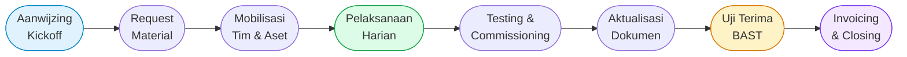

**Progress Tracking Real-Time per Stage:**

| Stage | Progress % | Evidence Wajib | PIC |
|---|---|---|---|
| Aanwijzing / Kickoff | 5% | BA Kickoff, foto survey | PM |
| Request Material | 10% | Dokumen MR | PM + Logistik |
| Mobilisasi | 15% | Surat Tugas, foto tim | HRD + Logistik |
| Pelaksanaan Harian | 20–85% | Laporan harian + min. 3 foto | Field Tech |
| Testing & Commissioning | 90% | BA Testing, measurement sheet | Field + Klien |
| Aktualisasi Dokumen | 95% | As-built, laporan final | PM |
| Uji Terima / BAST | 100% | **BAST ditandatangani** | PM + Direktur |
| Invoicing & Closing | — | Invoice terkirim | Finance |

### 6.2 Procurement Approval Flow

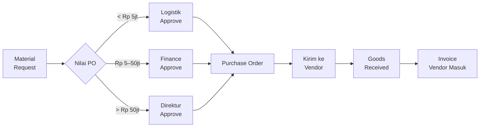

### 7.3 Finance Flow — Termin Invoice

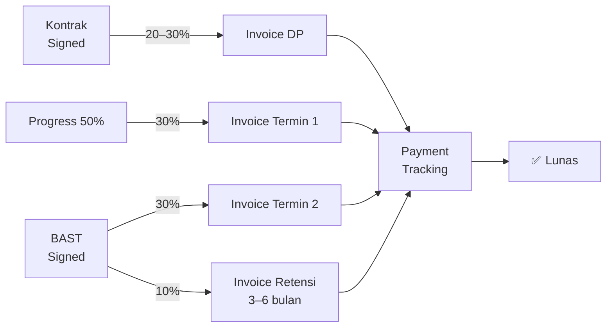

### 6.4 Perbedaan Flow per Tipe Proyek

| Stage | Procurement | Maintenance | Labor Supply | Rental |
|---|---|---|---|---|
| Kickoff | ✅ | ✅ | ✅ | ✅ |
| Request Material | ✅ Utama | ✅ Sebagian | ❌ | ❌ |
| Mobilisasi Tim | ✅ | ✅ | ✅ **Utama** | ❌ |
| Progress Harian | ✅ Pekerjaan | ✅ Pekerjaan | ✅ Attendance | ✅ Logbook |
| Testing | ✅ | ✅ | ❌ | ❌ |
| BAST | ✅ | ✅ | Per periode | Per periode |
| Invoice | Per milestone | Satu kali | **Bulanan** | **Bulanan** |

### 6.5 Gap — Informasi yang Perlu Dikonfirmasi MGS

Sebelum development dimulai, tim MGS perlu menjawab **27 pertanyaan discovery** yang tercantum di [`MGS_ERP_Workflow_SOP.md`](MGS_ERP_Workflow_SOP.md) — mencakup:
- Format & frekuensi laporan progress yang existing
- Threshold approval PO
- Sistem absensi SDM saat ini
- Mekanisme termin & pembayaran klien
- Prosedur pengelolaan kendaraan

---


---

## 7. System Architecture & Flow

### 7.1 Alur Sistem Keseluruhan

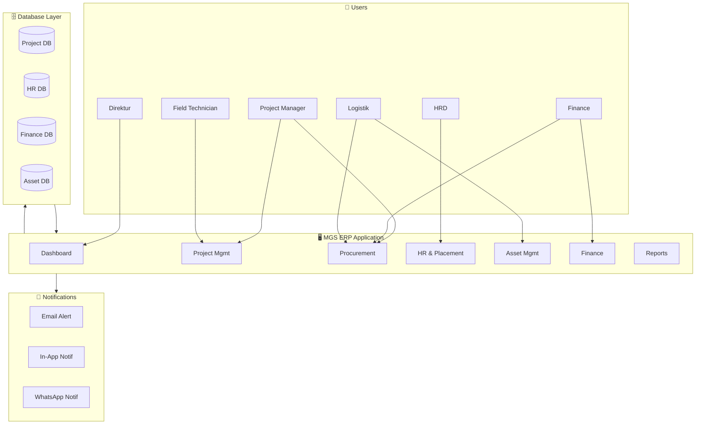

### 6.2 Alur Proyek End-to-End

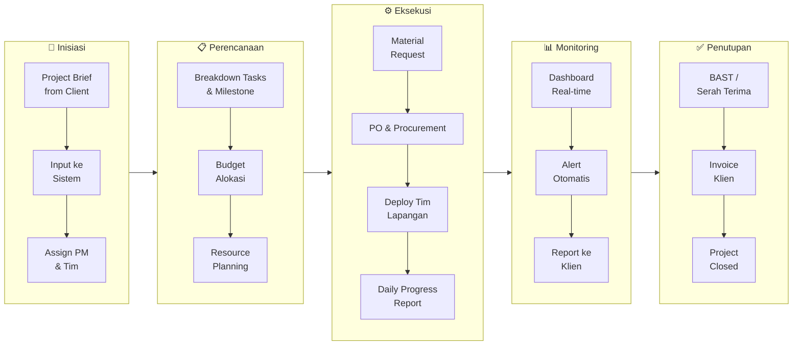

### 6.3 Hak Akses & Role

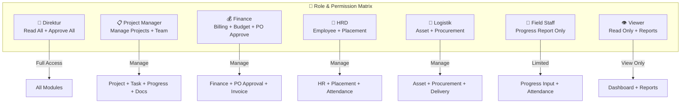

---


---

## 8. Dashboard & Reporting

### Laporan yang Tersedia

| Laporan | Frekuensi | Penerima |
|---|---|---|
| Daily Progress Report | Harian | PM, Klien |
| Project Status Summary | Mingguan | Direktur, PM |
| Procurement Report | Mingguan | Finance, Logistik |
| HR Headcount Report | Bulanan | HRD, Klien |
| Asset Utilization Report | Bulanan | Logistik, Finance |
| Financial P&L Summary | Bulanan | Direktur, Finance |
| Cash Flow Report | Bulanan | Direktur, Finance |
| Annual Project Portfolio | Tahunan | Direktur |

### Format Export
- PDF (untuk laporan ke klien)
- Excel/CSV (untuk analisis internal)
- Print-ready format

---

## 9. Database Design (ERD)

ERD MGS ERP telah dipublikasikan secara online dan dapat diakses oleh tim melalui tautan berikut:

| | |
|---|---|
| **Link** | [dbdocs.io/ajarkatech/MGS-ERP-Database-Design](https://dbdocs.io/ajarkatech/MGS-ERP-Database-Design?view=relationships) |
| **Password** | `dbmgs123` |
| **View** | Relationships (default) |
| **Source file** | `MGS_ERP_Database.dbdiagram` |

[](https://dbdocs.io/ajarkatech/MGS-ERP-Database-Design?view=relationships)

**Ringkasan Skema — 19 Tabel:**

| Modul | Tabel |
|---|---|
| User Management | `users` |
| Company / Client | `companies` |
| Project | `projects`, `project_tasks`, `project_progress`, `project_documents` |
| Vendor | `vendors` |
| Procurement | `material_requests`, `mr_items`, `purchase_orders`, `po_items` |
| HR | `employees`, `employee_placements`, `attendance` |
| Asset | `assets`, `asset_assignments`, `asset_maintenance` |
| Finance | `invoices`, `project_budgets` |

---

## 10. Roadmap Implementasi

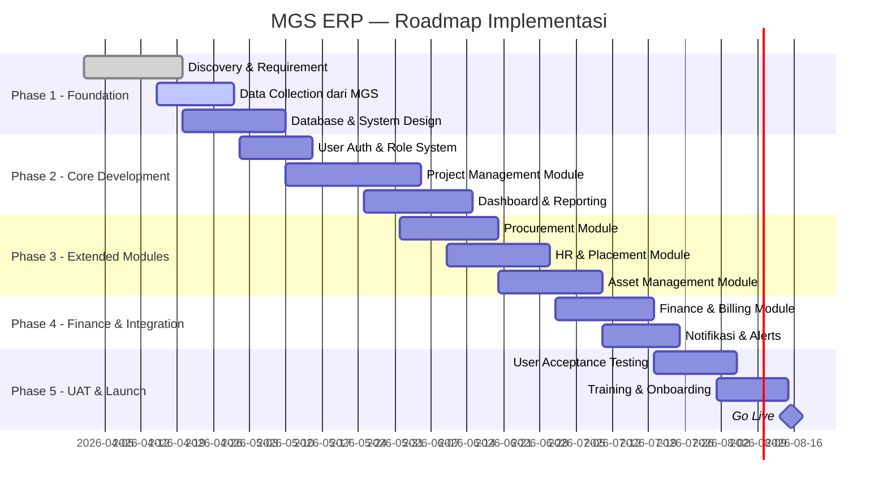

### Deliverables per Phase

| Phase | Durasi | Output Utama |
|---|---|---|
| **Phase 1** | 3 minggu | Design sistem, ERD final, FRS dokumen |
| **Phase 2** | 6 minggu | Core sistem berjalan: login, project, dashboard |
| **Phase 3** | 5 minggu | Modul Procurement, HR, Asset aktif |
| **Phase 4** | 4 minggu | Finance & notifikasi terintegrasi |
| **Phase 5** | 4 minggu | UAT, training, go-live |
| **Total** | **~22 minggu** | **Sistem ERP MGS fully operational** |

---

## 11. Next Steps & Data Collection

### Yang Perlu Disiapkan oleh PT. MGS

Untuk mempercepat proses implementasi, berikut data yang perlu diisi oleh tim MGS. Template Excel/CSV sudah kami siapkan beserta panduan pengisiannya.

> **Panduan Pengisian:** Lihat [`MGS_ERP_Data_Collection_Guide.md`](MGS_ERP_Data_Collection_Guide.md) untuk instruksi lengkap cara membuka, mengisi, dan mengirimkan setiap template data kepada tim pengembang.

| File Template | Data yang Diisi | Prioritas |
|---|---|---|
| `MGS_Data_Template_Projects.csv` | Daftar proyek aktif & historis | 🔴 Wajib |
| `MGS_Data_Template_Employees.csv` | Data karyawan & tenaga kerja | 🔴 Wajib |
| `MGS_Data_Template_Vendors.csv` | Daftar supplier & vendor | 🟡 Penting |
| `MGS_Data_Template_Assets.csv` | Daftar aset & kendaraan | 🟡 Penting |

### Sesi Discovery yang Dibutuhkan

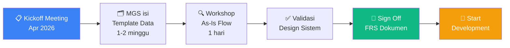

---

## Penutup

MGS ERP bukan sekadar software — ini adalah **transformasi digital operasional PT. Manata Gawi Sabumi** yang akan memberikan visibilitas penuh atas seluruh aktivitas bisnis: dari lapangan Kalimantan hingga kantor Surabaya, dari satu proyek PLTU hingga puluhan proyek bersamaan.

Dengan sistem ini, PT. MGS siap bertumbuh menjadi **perusahaan pengadaan & jasa industri kelas nasional** yang beroperasi dengan standar manajemen modern.

> *"Data yang akurat hari ini adalah keputusan yang tepat esok hari."*

---

**Kontak Tim Pengembang:**  
📧 Untuk pertanyaan & diskusi lebih lanjut, hubungi tim kami.

---
*Dokumen ini bersifat konfidensial dan ditujukan khusus untuk PT. Manata Gawi Sabumi.*
