# MGS ERP — Workflow & SOP Documentation
## *Alur Kerja Operasional PT. Manata Gawi Sabumi*

> **Disiapkan oleh:** Tim Pengembang ERP  
> **Tanggal:** April 2026  
> **Tujuan:** Mendokumentasikan alur kerja (SOP) existing MGS sebagai basis desain workflow engine pada sistem ERP

---

## Mengapa Dokumen Ini Penting?

Sistem ERP MGS bukan sekadar database — melainkan **mesin penggerak operasional** yang mengikuti cara kerja nyata tim di lapangan. Tanpa SOP yang terdokumentasi dengan baik, modul *progress tracking*, *approval flow*, dan *monitoring real-time* tidak akan mencerminkan kenyataan.

Dokumen ini mencakup:
- Alur kerja **yang sudah diketahui** (dari Smart WFM & informasi MGS)
- **Gap / pertanyaan** yang masih perlu dikonfirmasi oleh tim MGS
- **Usulan desain flow** dalam sistem ERP

---

## Daftar Isi

1. [Modul Project Management — SOP Eksekusi Proyek](#1-modul-project-management--sop-eksekusi-proyek)
2. [Modul Procurement — Alur Pengadaan Barang/Jasa](#2-modul-procurement--alur-pengadaan-barangjasa)
3. [Modul HR & Employment Provider — Alur Penempatan SDM](#3-modul-hr--employment-provider--alur-penempatan-sdm)
4. [Modul Asset Management — Alur Pengelolaan Aset](#4-modul-asset-management--alur-pengelolaan-aset)
5. [Modul Finance & Billing — Alur Keuangan & Invoice](#5-modul-finance--billing--alur-keuangan--invoice)
6. [Cross-Module Integration Flow](#6-cross-module-integration-flow)
7. [Discovery Questions untuk MGS](#7-discovery-questions-untuk-mgs)

---

## 1. Modul Project Management — SOP Eksekusi Proyek

### 1.1 Overview Tipe Proyek MGS

MGS mengerjakan 5 tipe proyek dengan karakteristik yang berbeda:

| Tipe | Deskripsi | Contoh |
|---|---|---|
| **Procurement** | Pengadaan barang/material untuk klien | UPS PLTU Asam-Asam |
| **Maintenance** | Perawatan & perbaikan sistem/aset klien | Overhaul Generator, Panel MV |
| **Construction** | Pekerjaan konstruksi/instalasi | Instalasi panel, kabel, sipil |
| **Labor Supply** | Penyediaan tenaga kerja ke klien | SDM Teknik untuk PLN |
| **Rental** | Penyewaan alat berat/kendaraan | Alat berat ke tambang Adaro |

> Setiap tipe proyek memiliki **stage/tahapan yang berbeda**. SOP di bawah ini adalah pendekatan umum yang perlu dikonfirmasi dan disesuaikan per tipe.

---

### 1.2 Alur Utama Proyek (General Flow)

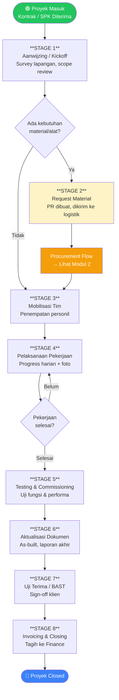

---

### 1.3 Detail Per Stage

#### STAGE 1 — Aanwijzing / Project Kickoff

**Tujuan:** Memastikan semua pihak memahami scope, timeline, dan persyaratan proyek.

| Item | Detail |
|---|---|
| **Trigger** | Kontrak/SPK ditandatangani oleh Direktur |
| **PIC** | Project Manager (Alexander Bobby / Boby / Lina) |
| **Aktivitas** | Survey lapangan, pertemuan kickoff dengan klien, review dokumen kontrak |
| **Output** | Berita Acara Kickoff, Jadwal Kerja, Daftar Kebutuhan Awal |
| **Evidence** | Foto survey lapangan, scan BA Kickoff |
| **Progress %** | 5% |

```
❓ GAP — Konfirmasi ke MGS:
- Apakah selalu ada survey lapangan sebelum mulai?
- Format Berita Acara Kickoff seperti apa yang digunakan?
- Siapa yang hadir dari sisi klien dan MGS?
```

---

#### STAGE 2 — Request Material / Material Planning

**Tujuan:** Mengidentifikasi dan mengajukan kebutuhan material/alat untuk proyek.

| Item | Detail |
|---|---|
| **Trigger** | PM membuat daftar kebutuhan setelah Kickoff |
| **PIC** | PM + Logistik |
| **Aktivitas** | Buat PR (Purchase Request), cek stok aset, tentukan vendor |
| **Output** | Material Request (MR) yang disetujui |
| **Evidence** | Dokumen PR, spesifikasi teknis |
| **Progress %** | 10% |

> **Catatan dari Smart WFM:** Stage ini disebut "Request Material" dan menjadi trigger proses procurement.

---

#### STAGE 3 — Mobilisasi Tim & Aset

**Tujuan:** Menempatkan personil dan aset ke lokasi proyek.

| Item | Detail |
|---|---|
| **Trigger** | Material/alat tersedia, PO sudah approved |
| **PIC** | HRD + Logistik |
| **Aktivitas** | Assign karyawan, dispatch kendaraan/alat, persiapan keberangkatan |
| **Output** | Surat Tugas, bukti keberangkatan |
| **Evidence** | Foto tim di lokasi, check-in GPS (jika ada) |
| **Progress %** | 15% |

```
❓ GAP — Konfirmasi ke MGS:
- Apakah ada Surat Tugas formal untuk setiap penugasan?
- Berapa rata-rata jumlah personil per proyek?
- Apakah kendaraan selalu ikut dikirim atau pakai transportasi lokal?
```

---

#### STAGE 4 — Pelaksanaan Pekerjaan (Daily Progress)

**Tujuan:** Eksekusi pekerjaan di lapangan dengan monitoring progress harian.

| Item | Detail |
|---|---|
| **Trigger** | Tim sudah di lokasi, material tersedia |
| **PIC** | Field Technician + PIC Lapangan |
| **Aktivitas** | Pekerjaan teknis harian, input laporan harian, upload foto |
| **Output** | Laporan Progress Harian, Foto Dokumentasi |
| **Evidence** | Foto before/during/after, laporan tertulis |
| **Progress %** | 20% → 85% (bertahap per hari) |

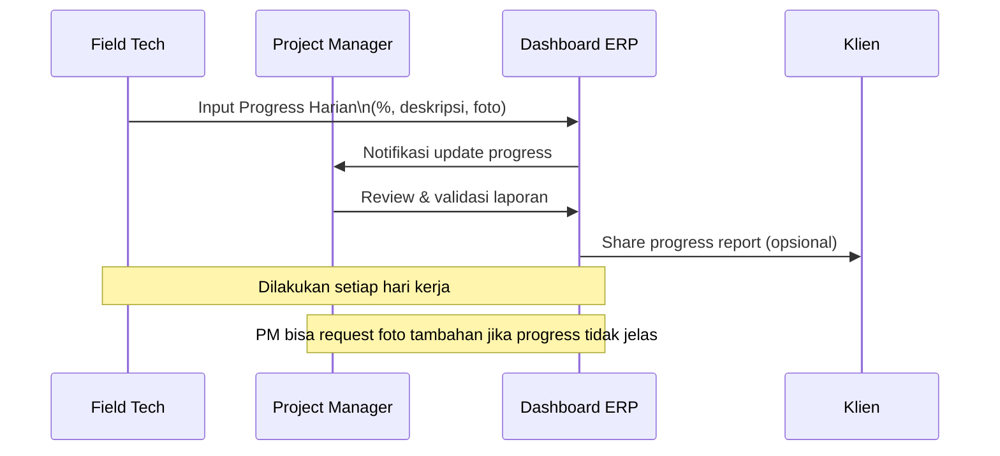

**Komponen Laporan Harian:**
- Tanggal & lokasi
- Deskripsi pekerjaan yang dilakukan
- Persentase progress (kumulatif)
- Kendala yang dihadapi
- Cuaca (untuk pekerjaan outdoor)
- Foto minimum 3 (area, detail pekerjaan, tim)
- Tanda tangan/paraf PIC

```
❓ GAP — Konfirmasi ke MGS:
- Laporan harian saat ini dalam format apa? (WA, Excel, kertas?)
- Siapa yang approve laporan harian — PM atau langsung klien?
- Apakah klien minta laporan mingguan atau bulanan juga?
- Berapa foto minimum yang biasa diupload per laporan?
- Apakah progress % dihitung per task atau per estimasi keseluruhan?
```

---

#### STAGE 5 — Testing & Commissioning

**Tujuan:** Uji fungsi sistem/instalasi sebelum diserahkan ke klien.

| Item | Detail |
|---|---|
| **Trigger** | Pekerjaan instalasi/konstruksi selesai 100% |
| **PIC** | Field Tech + Engineer + Perwakilan Klien |
| **Aktivitas** | Uji fungsi, uji beban, kalibrasi, trial run |
| **Output** | Berita Acara Testing, hasil measurement |
| **Evidence** | Foto hasil test, dokumen measurement sheet |
| **Progress %** | 90% |

> **Dari Smart WFM:** Disebut sebagai stage "Go Live"

---

#### STAGE 6 — Aktualisasi Dokumen

**Tujuan:** Melengkapi dokumentasi akhir proyek sesuai kondisi aktual.

| Item | Detail |
|---|---|
| **Trigger** | Testing berhasil |
| **PIC** | PM + Field Tech |
| **Aktivitas** | Buat as-built drawing, laporan akhir, inventory material sisa |
| **Output** | As-built dokumen, laporan final |
| **Evidence** | Scan dokumen, foto kondisi final |
| **Progress %** | 95% |

---

#### STAGE 7 — Uji Terima / BAST

**Tujuan:** Serah terima formal pekerjaan dari MGS ke klien.

| Item | Detail |
|---|---|
| **Trigger** | Semua dokumen lengkap, klien setuju |
| **PIC** | Direktur / PM + Perwakilan Klien |
| **Aktivitas** | Presentasi final, tanda tangan BAST |
| **Output** | **Berita Acara Serah Terima (BAST)** yang ditandatangani |
| **Evidence** | Scan BAST, foto serah terima |
| **Progress %** | 100% |

> **BAST adalah trigger penagihan invoice ke klien.**

```
❓ GAP — Konfirmasi ke MGS:
- BAST ditandatangani oleh siapa dari sisi MGS? Direktur atau PM?
- Berapa lama biasanya dari BAST sampai invoice dibayar klien?
- Apakah ada tahap retensi (pembayaran sebagian ditahan)?
```

---

#### STAGE 8 — Invoicing & Project Closing

**Tujuan:** Penagihan ke klien dan penutupan proyek secara sistem.

| Item | Detail |
|---|---|
| **Trigger** | BAST ditandatangani |
| **PIC** | Finance / Direktur |
| **Aktivitas** | Buat invoice, kirim ke klien, tracking pembayaran |
| **Output** | Invoice terkirim, konfirmasi pembayaran |
| **Progress %** | Project status → `completed` |

---

### 1.4 Progress Tracking Design

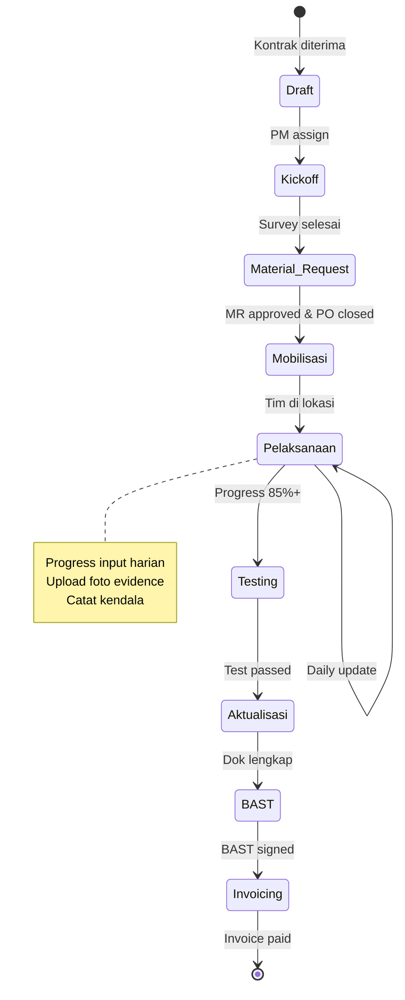

---

### 1.5 Perbedaan Flow per Tipe Proyek

| Stage | Procurement | Maintenance | Labor Supply | Rental |
|---|---|---|---|---|
| Aanwijzing | ✅ | ✅ | ✅ | ✅ |
| Request Material | ✅ Utama | ✅ Sebagian | ❌ | ❌ |
| Mobilisasi Tim | ✅ | ✅ | ✅ Utama | ❌ |
| Pelaksanaan Harian | ✅ | ✅ | ✅ Attendance | ✅ Logbook |
| Testing & Commissioning | ✅ | ✅ | ❌ | ❌ |
| Aktualisasi Dokumen | ✅ | ✅ | Laporan Bulanan | Laporan Sewa |
| BAST | ✅ | ✅ | Per periode | Per periode |
| Invoice | Per milestone | Satu kali | Bulanan | Bulanan |

---

## 2. Modul Procurement — Alur Pengadaan Barang/Jasa

### 2.1 Overview

Procurement di MGS dipicu oleh kebutuhan proyek — bukan pengadaan stok. Setiap PO harus terhubung ke proyek spesifik.

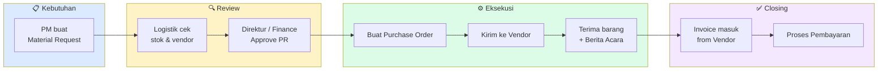

### 2.2 Status Flow Purchase Order

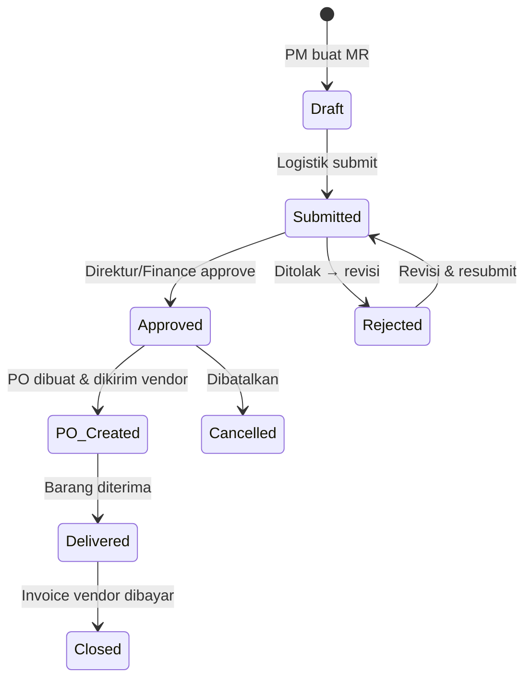

### 2.3 Detail Approval Matrix

| Nilai PO | Approver | SLA Approval |
|---|---|---|
| < Rp 5 juta | Logistik | 1 hari |
| Rp 5–50 juta | Finance Manager | 2 hari |
| > Rp 50 juta | Direktur | 3 hari |
| Sangat urgent | Direktur langsung | Same day |

```
❓ GAP — Konfirmasi ke MGS:
- Berapa threshold nilai PO yang butuh approve Direktur?
- Apakah PO harus selalu ada MR sebelumnya, atau bisa PO langsung?
- Siapa yang cek kualitas saat barang datang?
- Apakah ada vendor preferred / blacklist?
- Format PO yang saat ini digunakan seperti apa?
```

---

## 3. Modul HR & Employment Provider — Alur Penempatan SDM

### 3.1 Overview

MGS memiliki 2 tipe bisnis SDM:
1. **Internal HR** — karyawan tetap MGS yang mengerjakan proyek sendiri
2. **Employment Provider** — MGS menyuplai tenaga kerja ke klien (PLN, dll)

### 3.2 Alur Penempatan Karyawan ke Proyek

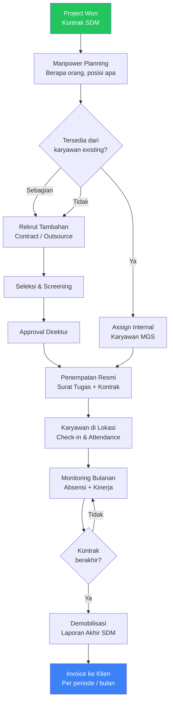

### 3.3 Attendance & Timesheet Flow

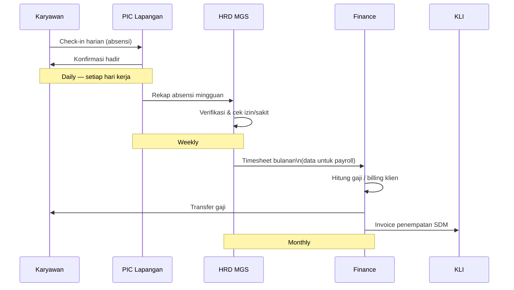

### 3.4 Data Karyawan yang Dimonitor per Proyek

| Data | Frekuensi Update | PIC |
|---|---|---|
| Status kehadiran (hadir/izin/sakit) | Harian | PIC Lapangan |
| Posisi / penugasan | Per perubahan | HRD |
| Jam kerja / lembur | Harian | PIC Lapangan |
| Incident / kecelakaan | Real-time | PIC Lapangan |
| Evaluasi kinerja | Bulanan | PM / Klien |
| Status kontrak | Per perubahan | HRD |

```
❓ GAP — Konfirmasi ke MGS:
- Absensi saat ini dicatat bagaimana? (kertas, WA, aplikasi?)
- Apakah klien minta laporan absensi bulanan SDM yang ditempatkan?
- Bagaimana sistem perhitungan lembur?
- Apakah ada BPJS TK/Kes yang perlu dilacak per karyawan?
- Format kontrak kerja karyawan outsource seperti apa?
- Apakah ada kategori keterlambatan atau pelanggaran yang dilacak?
```

---

## 4. Modul Asset Management — Alur Pengelolaan Aset

### 4.1 Siklus Hidup Aset MGS

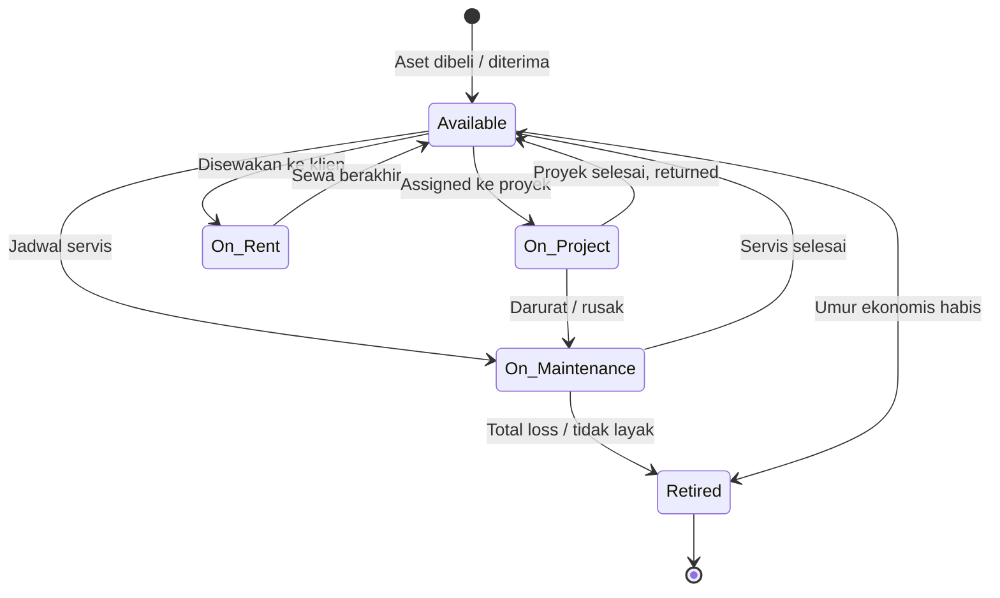

### 4.2 Alur Penugasan Aset ke Proyek

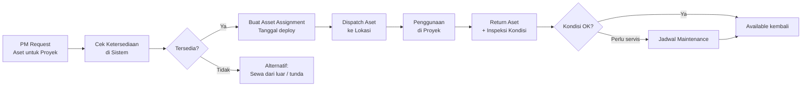

### 4.3 Monitoring Kendaraan Operasional

MGS memiliki **14 unit Toyota** (Veloz, Hiace, Hilux, Venturer) yang perlu dimonitor:

| Item Monitor | Frekuensi | Keterangan |
|---|---|---|
| Lokasi / penugasan | Per perubahan | Di proyek mana / siapa driver |
| KM / BBM | Per perjalanan | Logbook perjalanan |
| Servis berkala | Per 5.000 km / 3 bulan | Reminder otomatis |
| STNK / pajak | Tahunan | Alert 1 bulan sebelum jatuh tempo |
| Asuransi | Tahunan | Alert jatuh tempo |
| Kondisi fisik | Bulanan | Foto eksterior & interior |

```
❓ GAP — Konfirmasi ke MGS:
- Apakah ada logbook perjalanan kendaraan saat ini?
- Kendaraan diasuransikan dimana? Kapan jatuh tempo?
- Siapa yang bertanggung jawab atas kerusakan kendaraan di proyek?
- Apakah ada mekanisme booking kendaraan jika banyak proyek butuh bersamaan?
- Alat berat yang saat ini dimiliki MGS ada apa saja?
```

---

## 5. Modul Finance & Billing — Alur Keuangan & Invoice

### 5.1 Overview Alur Keuangan

MGS memiliki 2 arah cash flow:
- **Cash In (Piutang):** Invoice ke klien dari proyek
- **Cash Out (Hutang):** Bayar vendor/supplier dari PO

```mermaid
flowchart TB
    subgraph CASHIN["💰 Cash In — Piutang MGS"]
        direction LR
        BAST2[BAST\nditandatangani] --> INV_OUT[Buat Invoice\nke Klien]
        INV_OUT --> SEND[Kirim Invoice\n+ Dokumen Pendukung]
        SEND --> WAIT[Tunggu Pembayaran\n30-60 hari]
        WAIT --> REC[Payment\nDiterima]
        REC --> DONE_IN[✅ Lunas]
    end

    subgraph CASHOUT["💸 Cash Out — Hutang ke Vendor"]
        direction LR
        DEL2[Barang\nDiterima] --> INV_IN[Invoice\nmasuk dari Vendor]
        INV_IN --> VER[Verifikasi\n& Matching PO]
        VER --> PAY_APP[Approve\nPembayaran]
        PAY_APP --> TRF[Transfer ke\nRekening Vendor]
        TRF --> DONE_OUT[✅ Lunas]
    end

    style CASHIN fill:#dcfce7
    style CASHOUT fill:#fee2e2
```

### 5.2 Invoice Lifecycle — Cash In (Piutang)

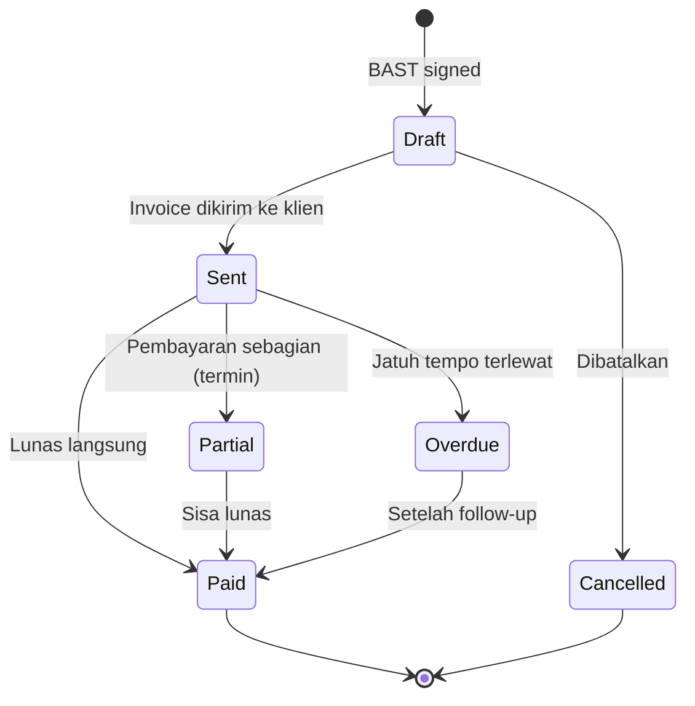

### 5.3 Termin Pembayaran

Banyak proyek MGS menggunakan sistem termin (bertahap). Contoh umum:

| Termin | % Bayar | Trigger |
|---|---|---|
| DP (Down Payment) | 20–30% | Kontrak ditandatangani |
| Termin 1 | 30% | Progress 50% |
| Termin 2 | 30% | BAST ditandatangani |
| Retensi | 10% | 3–6 bulan setelah selesai |

```
❓ GAP — Konfirmasi ke MGS:
- Apakah semua proyek pakai sistem termin atau ada yang satu kali bayar?
- Berapa persen DP yang biasa diminta MGS?
- Apakah ada proyek dengan retensi (pembayaran ditahan)?
- Berapa lama payment term yang biasa disepakati? (30, 60, 90 hari?)
- Dokumen apa yang harus dilampirkan saat kirim invoice ke PLN/klien besar?
- Apakah MGS menggunakan faktur pajak (PPN)?
```

### 5.4 Budget vs Actual Tracking

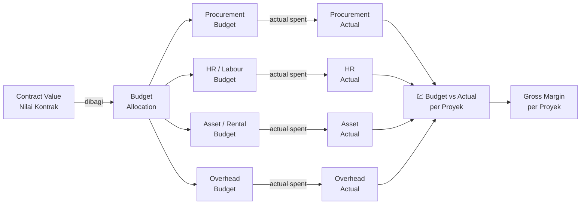

---

## 6. Cross-Module Integration Flow

### 6.1 Bagaimana Semua Modul Terhubung

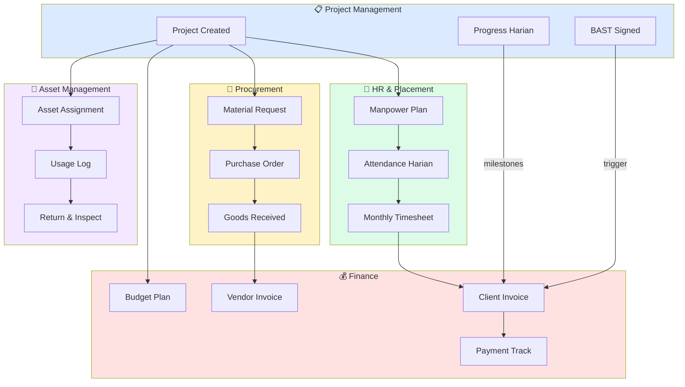

### 6.2 Notifikasi & Alert Otomatis

| Event | Notifikasi Ke | Channel |
|---|---|---|
| PO submitted | Finance / Direktur | In-app + Email |
| Progress < target | PM | In-app |
| Invoice jatuh tempo | Finance | In-app + Email |
| Aset harus servis | Logistik | In-app |
| STNK hampir expired | Logistik | In-app + Email |
| Kontrak karyawan habis | HRD | In-app + Email |
| Project deadline approaching | PM | In-app |
| Pembayaran masuk | Finance, Direktur | In-app |

---

## 7. Discovery Questions untuk MGS

> Pertanyaan-pertanyaan berikut perlu dijawab oleh tim MGS sebelum pengembangan dimulai. Jawaban akan menentukan konfigurasi workflow engine pada ERP.

### 7.1 Project Management

- [ ] Tahapan proyek (stages) apa saja yang berlaku di MGS? Apakah sama untuk semua tipe proyek?
- [ ] Laporan progress harian saat ini dalam format apa dan dikirim ke siapa?
- [ ] Berapa foto minimum yang diupload per laporan harian?
- [ ] Siapa yang berhak mengubah status/stage proyek?
- [ ] Apakah ada SLA (target waktu penyelesaian) per stage?
- [ ] Bagaimana cara menghitung persentase progress? (per task, per waktu, manual estimasi?)

### 7.2 Procurement

- [ ] Siapa yang berhak membuat Material Request?
- [ ] Siapa yang approve PR sebelum jadi PO?
- [ ] Berapa nilai PO yang butuh tanda tangan Direktur?
- [ ] Apakah selalu ada 3 penawaran (3 vendor) untuk PO di atas nilai tertentu?
- [ ] Format PO yang ada sekarang seperti apa? Bisa dibagikan contohnya?

### 7.3 HR & Employment Provider

- [ ] Absensi karyawan saat ini dicatat bagaimana?
- [ ] Apakah klien minta laporan kehadiran SDM yang ditempatkan?
- [ ] Berapa hari kerja dalam seminggu untuk proyek lapangan?
- [ ] Apakah ada shift kerja? Jam kerja standar?
- [ ] Bagaimana cara menghitung lembur?
- [ ] Apakah ada uang makan / transport harian yang perlu dicatat?

### 7.4 Asset Management

- [ ] Siapa yang boleh menggunakan/dispatch kendaraan MGS?
- [ ] Apakah ada logbook perjalanan kendaraan yang diisi?
- [ ] Kendaraan diasuransikan? Oleh siapa? Jatuh temponya?
- [ ] Alat berat apa yang dimiliki MGS saat ini (merek, tahun, kapasitas)?
- [ ] Bagaimana prosedur jika kendaraan rusak saat di proyek?

### 7.5 Finance & Billing

- [ ] Apakah semua proyek pakai sistem termin atau ada yang lump sum?
- [ ] Dokumen apa saja yang harus dilampirkan saat penagihan ke PLN?
- [ ] MGS sudah PKP (Pengusaha Kena Pajak)? Apakah terbitkan faktur pajak?
- [ ] Siapa yang tanda tangan invoice keluar?
- [ ] Bagaimana MGS tracking apakah invoice sudah dibayar klien?
- [ ] Apakah ada proyek dengan pembayaran retensi?

---

## Lampiran — Mapping Stage ke Database Field

| Stage Proyek | `projects.status` | `project_tasks.status` | Trigger Notif |
|---|---|---|---|
| Kickoff | `active` | `in_progress` | PM assigned |
| Request Material | `active` | `in_progress` | MR created |
| Mobilisasi | `active` | `in_progress` | Asset assigned |
| Pelaksanaan | `active` | `in_progress` | Daily progress > 0% |
| Testing | `active` | `review` | Progress = 85%+ |
| Aktualisasi | `active` | `review` | Test passed |
| BAST | `active` | `done` | BAST uploaded |
| Invoicing | `active` | `done` | Invoice created |
| Closed | `completed` | `done` | Invoice paid |

---

*Dokumen ini akan terus diperbarui seiring proses discovery bersama tim PT. Manata Gawi Sabumi.*
