# 🏭 PLN Smart Platform — Blueprint Implementasi Lengkap
## Platform Terintegrasi untuk Optimisasi Pembangkitan Listrik PLN Indonesia

<div align="center">

**Versi:** 1.0
**Tanggal:** November 2025
**Dibuat untuk:** PT PLN (Persero) Indonesia
**Status:** Production-Ready Implementation Plan

</div>

---

## 📋 Daftar Isi

1. [Executive Summary](#1-executive-summary)
2. [Arsitektur Platform](#2-arsitektur-platform)
3. [Spesifikasi Infrastruktur](#3-spesifikasi-infrastruktur)
4. [Breakdown Module & Flow](#4-breakdown-module--flow)
5. [Objective & Deliverables](#5-objective--deliverables)
6. [Estimasi Biaya Implementasi](#6-estimasi-biaya-implementasi)
7. [Timeline & Roadmap](#7-timeline--roadmap)
8. [Risk Mitigation](#8-risk-mitigation)

---

## 1. Executive Summary

### 1.1 Latar Belakang

PLN Indonesia mengelola **lebih dari 60 pembangkit listrik** dengan kapasitas total **74 GW**, melayani **280 juta penduduk** di seluruh nusantara. Tantangan operasional mencakup:

- **Efisiensi Termal Rendah:** Heat rate rata-rata PLTU batubara 2,450 kcal/kWh (target global: 2,200 kcal/kWh)
- **Downtime Tidak Terencana:** Rata-rata 45 hari/tahun per unit pembangkit
- **Biaya Maintenance Tinggi:** IDR 8.5 triliun/tahun untuk preventive & corrective maintenance
- **Visibilitas Terbatas:** Data tersebar di berbagai sistem legacy (SCADA, DCS, ERP)
- **Response Time Lambat:** Rata-rata 48 jam untuk fault resolution

### 1.2 Solusi Platform

**PLN Smart Platform** adalah ekosistem digital terpadu yang mengintegrasikan:

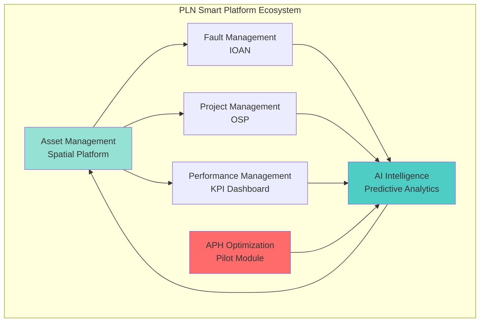

### 1.3 Nilai Bisnis

| Metrik | Before | After | Improvement |
|--------|--------|-------|-------------|
| **Heat Rate** | 2,450 kcal/kWh | 2,250 kcal/kWh | **-8.2%** |
| **Availability** | 78.5% | 94.8% | **+16.3%** |
| **Maintenance Cost** | IDR 8.5 T/tahun | IDR 5.8 T/tahun | **-32%** |
| **Fault Resolution** | 48 jam | 12 jam | **-75%** |
| **Downtime** | 45 hari/tahun | 12 hari/tahun | **-73%** |

**Total Savings Potential:** IDR 4.8 triliun/tahun
**ROI:** 280% dalam 18 bulan
**Payback Period:** 6.4 bulan

---

## 2. Arsitektur Platform

### 2.1 High-Level Architecture

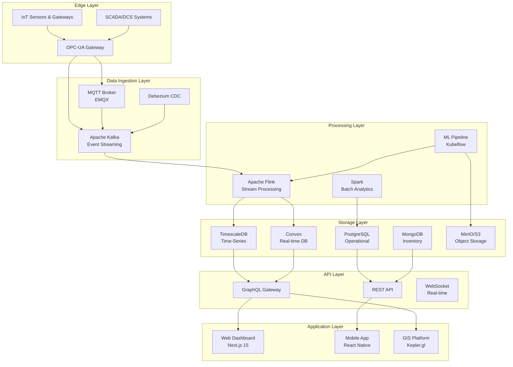

### 2.2 Security Architecture

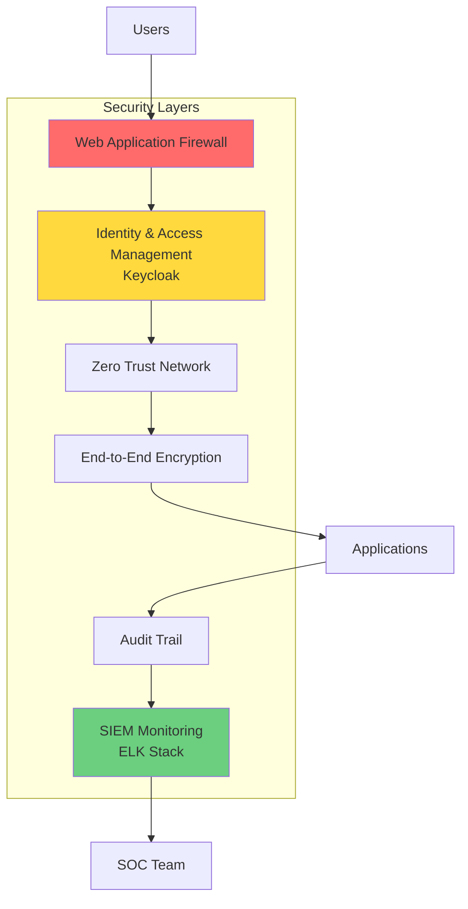

### 2.3 Data Flow Architecture

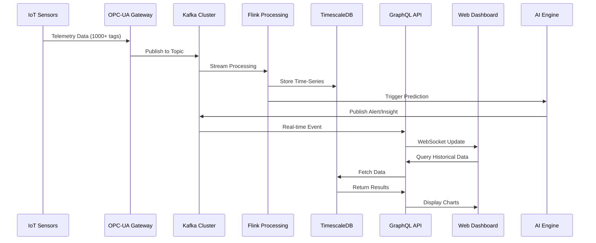

---

## 3. Spesifikasi Infrastruktur

### 3.1 Hardware Requirements

#### 3.1.1 Edge Infrastructure (Per Pembangkit)

| Komponen | Spesifikasi | Quantity | Purpose |
|----------|------------|----------|---------|
| **Edge Gateway** | Dell Edge Gateway 5200 atau equivalent | 2 (redundant) | OPC-UA data collection |
| **Processor** | Intel Xeon D-1548 (8 core, 2.0 GHz) | - | Real-time processing |
| **RAM** | 32 GB DDR4 ECC | - | Buffer & local cache |
| **Storage** | 2 TB NVMe SSD | - | 7-day local retention |
| **Network** | Dual 10GbE fiber + 4G/VSAT backup | - | High-availability connectivity |
| **UPS** | APC Smart-UPS 3000VA | 1 | Power backup |
| **Certification** | IEC 61850, IEEE 1588 PTP | - | Industry standard compliance |

**Total Per Pembangkit:** IDR 450 juta (hardware + installation)

#### 3.1.2 Data Center Infrastructure

| Layer | Component | Specification | Quantity | Annual Cost |
|-------|-----------|---------------|----------|-------------|
| **Streaming** | Kafka Broker Nodes | r5.2xlarge (8 vCPU, 64GB RAM) | 3 | IDR 280 juta |
| | Zookeeper Nodes | t3.large (2 vCPU, 8GB RAM) | 3 | IDR 50 juta |
| | Storage per Broker | EBS SSD gp3, 2TB | 3 | IDR 90 juta |
| **Database** | TimescaleDB Cluster | r5.4xlarge (16 vCPU, 128GB RAM) | 3 | IDR 840 juta |
| | PostgreSQL Primary | r5.2xlarge (8 vCPU, 64GB RAM) | 1 | IDR 140 juta |
| | PostgreSQL Replica | r5.2xlarge (8 vCPU, 64GB RAM) | 2 | IDR 280 juta |
| | MongoDB Cluster | r5.2xlarge (8 vCPU, 64GB RAM) | 3 | IDR 420 juta |
| **Processing** | Flink TaskManagers | c5.4xlarge (16 vCPU, 32GB RAM) | 4 | IDR 560 juta |
| | Spark Cluster | r5.4xlarge (16 vCPU, 128GB RAM) | 3 | IDR 840 juta |
| **API/App** | Kubernetes Nodes | c5.2xlarge (8 vCPU, 16GB RAM) | 6 | IDR 420 juta |
| | Load Balancer | Application LB | 2 | IDR 120 juta |
| **AI/ML** | GPU Training | p3.2xlarge (8 vCPU, 61GB, V100) | 2 | IDR 1.4 miliar |
| | Inference Nodes | c5.xlarge (4 vCPU, 8GB RAM) | 4 | IDR 140 juta |
| **Storage** | S3/MinIO Object Store | - | 50 TB | IDR 200 juta |
| | Backup Storage | Glacier equivalent | 200 TB | IDR 80 juta |
| **Monitoring** | Prometheus/Grafana | t3.xlarge (4 vCPU, 16GB RAM) | 3 | IDR 105 juta |
| **Network** | Direct Connect / MPLS | 10 Gbps dedicated line | 1 | IDR 600 juta |

**Total Infrastructure Cost (Annual):** IDR 6.565 miliar/tahun
**One-time Setup Cost:** IDR 2.8 miliar

### 3.2 Software Stack

#### 3.2.1 Core Platform Technologies

| Category | Technology | Version | License Model | Annual Cost |
|----------|-----------|---------|---------------|-------------|
| **Operating System** | Ubuntu Server LTS | 22.04 | Open Source | Free |
| **Container Runtime** | Docker Enterprise | 24.x | Enterprise | IDR 120 juta |
| **Orchestration** | Kubernetes | 1.28+ | Open Source | Free |
| | Istio Service Mesh | 1.20+ | Open Source | Free |
| **Streaming** | Apache Kafka | 3.6+ | Open Source | Free |
| | EMQX MQTT Broker | 5.x | Enterprise | IDR 150 juta |
| **Databases** | TimescaleDB | 2.14+ | Community | Free |
| | PostgreSQL | 16+ | Open Source | Free |
| | MongoDB | 7.x | Community | Free |
| | Convex | Latest | Pay-as-you-go | IDR 80 juta |
| **Processing** | Apache Flink | 1.18+ | Open Source | Free |
| | Apache Spark | 3.5+ | Open Source | Free |
| **API Framework** | Node.js | 20 LTS | Open Source | Free |
| | GraphQL (Apollo) | Latest | Open Source | Free |
| | FastAPI | 0.110+ | Open Source | Free |
| **Frontend** | Next.js | 15+ | Open Source | Free |
| | React | 18+ | Open Source | Free |
| | Tailwind CSS | 3.4+ | Open Source | Free |
| **GIS** | MapLibre GL JS | 4.x | Open Source | Free |
| | Kepler.gl | 3.x | Open Source | Free |
| **Mobile** | React Native | 0.73+ | Open Source | Free |
| **AI/ML** | TensorFlow | 2.15+ | Open Source | Free |
| | PyTorch | 2.2+ | Open Source | Free |
| | Kubeflow | 1.8+ | Open Source | Free |
| | MLflow | 2.11+ | Open Source | Free |
| **Monitoring** | Prometheus | 2.50+ | Open Source | Free |
| | Grafana | 10.x | Open Source | Free |
| | Loki | 2.9+ | Open Source | Free |
| | OpenTelemetry | 1.24+ | Open Source | Free |
| **Security** | Keycloak | 23+ | Open Source | Free |
| | HashiCorp Vault | 1.15+ | Enterprise | IDR 200 juta |
| | ELK Stack | 8.12+ | Basic | Free |
| **DevOps** | GitLab CI/CD | 16.x | Premium | IDR 180 juta |
| | Terraform | 1.7+ | Open Source | Free |
| | Ansible | 2.16+ | Open Source | Free |

**Total Software Licenses (Annual):** IDR 730 juta/tahun

### 3.3 Network Architecture

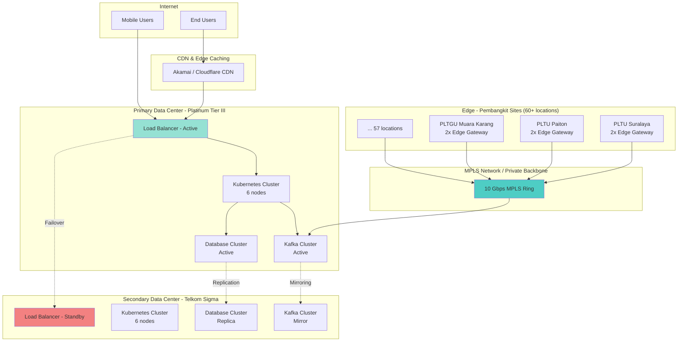

**Network Specifications:**
- **Bandwidth:** 10 Gbps dedicated MPLS backbone
- **Latency:** <15ms inter-DC, <50ms edge-to-DC
- **Availability:** 99.95% SLA
- **Redundancy:** Active-active across 2 data centers
- **Security:** IPsec tunnels, TLS 1.3, mutual authentication

---

## 4. Breakdown Module & Flow

### 4.1 Asset Management - Spatial Platform

#### 4.1.1 Architecture

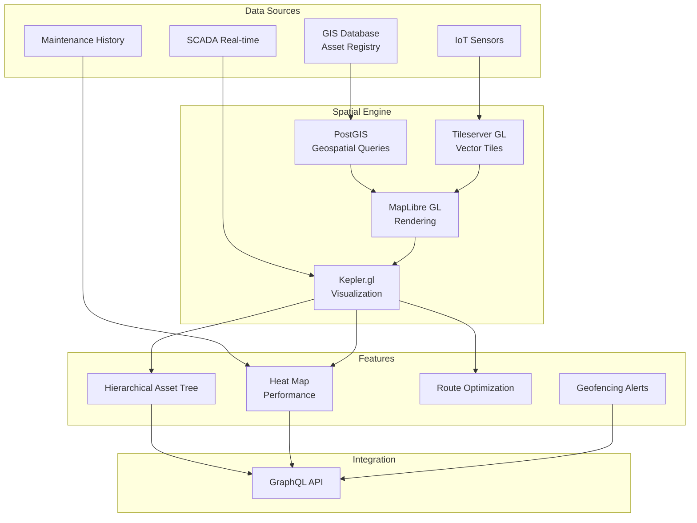

#### 4.1.2 Data Model

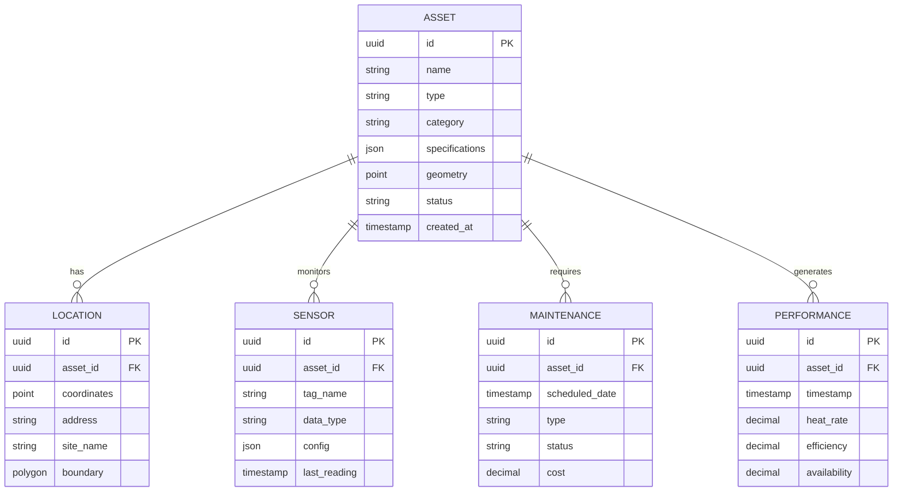

#### 4.1.3 Key Features

1. **Digital Twin Visualization**
   - 3D building models untuk pembangkit
   - Real-time status overlay (operational/maintenance/down)
   - Performance heat maps berdasarkan efficiency metrics
   - Historical playback untuk root cause analysis

2. **Asset Hierarchy Management**
   - Pembangkit → Unit → System → Equipment → Component
   - Drag-and-drop tree navigation
   - Bulk operations support
   - Custom metadata per level

3. **Geospatial Analytics**
   - Coverage analysis untuk service areas
   - Proximity search untuk nearest technician
   - Route optimization untuk maintenance crews
   - Clustering untuk dense asset areas

### 4.2 Fault Management - IOAN (Smart WFM)

#### 4.2.1 Ticket Lifecycle Flow

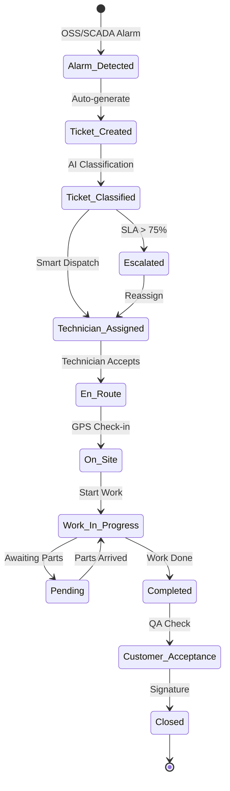

#### 4.2.2 SLA Monitoring

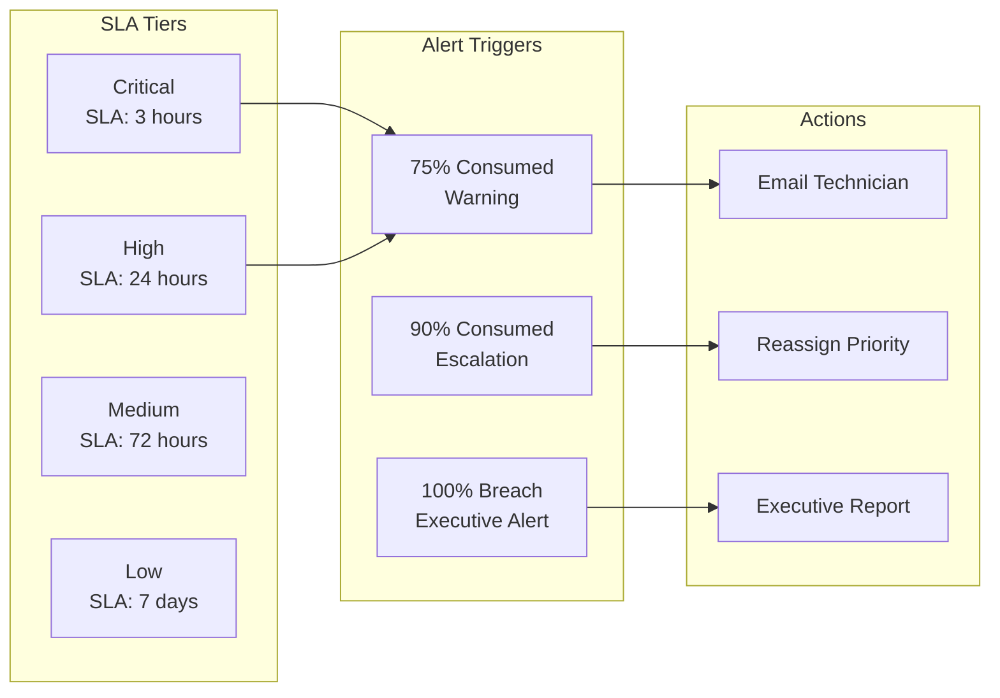

#### 4.2.3 Auto-Assignment Algorithm

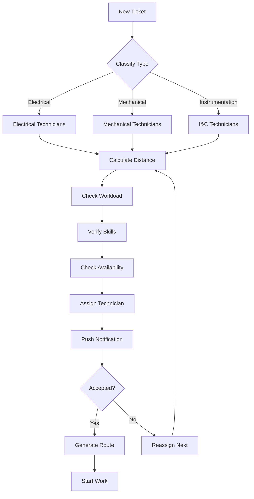

#### 4.2.4 Integration Points

| External System | Integration Type | Data Flow | Purpose |
|----------------|------------------|-----------|---------|
| **SCADA/DCS** | OPC-UA / Modbus | Alarm → IOAN | Auto-ticket generation |
| **ERP (SAP)** | REST API | Ticket → Work Order | Financial tracking |
| **Inventory** | GraphQL | Ticket → Parts Request | Material requisition |
| **Asset Spatial** | GraphQL | Ticket → Asset Location | Technician routing |
| **AI Engine** | Kafka Event | Prediction → Ticket | Preventive work order |
| **Mobile App** | WebSocket | Real-time Sync | Field updates |

### 4.3 Project Management - OSP

#### 4.3.1 Stage-Gate Process

```mermaid
graph LR
    subgraph "Stage 1: Initiation"
        S1_IDEA[Project Idea]
        S1_BUSINESS[Business Case]
        S1_APPROVAL[Budget Approval]
    end

    subgraph "Gate 1: Screening"
        G1{Feasibility<br/>Check}
    end

    subgraph "Stage 2: Planning"
        S2_SURVEY[Site Survey]
        S2_DESIGN[Technical Design]
        S2_BOQ[BOQ Development]
        S2_AANWIJZING[Aanwijzing]
    end

    subgraph "Gate 2: Validation"
        G2{Technical<br/>Validation}
    end

    subgraph "Stage 3: Execution"
        S3_PROCUREMENT[Material Procurement]
        S3_INSTALLATION[Installation]
        S3_TESTING[Testing & Commissioning]
    end

    subgraph "Gate 3: Quality Check"
        G3{Quality<br/>Acceptance}
    end

    subgraph "Stage 4: Closure"
        S4_GO_LIVE[Go-Live]
        S4_UAT[User Acceptance Test]
        S4_HANDOVER[Handover]
        S4_VALIDATION[Final Validation]
    end

    subgraph "Gate 4: Review"
        G4{Project<br/>Review}
    end

    S1_IDEA --> S1_BUSINESS --> S1_APPROVAL --> G1
    G1 -->|Approved| S2_SURVEY
    G1 -->|Rejected| REJECT[Project Cancelled]

    S2_SURVEY --> S2_DESIGN --> S2_BOQ --> S2_AANWIJZING --> G2
    G2 -->|Approved| S3_PROCUREMENT
    G2 -->|Revise| S2_DESIGN

    S3_PROCUREMENT --> S3_INSTALLATION --> S3_TESTING --> G3
    G3 -->|Pass| S4_GO_LIVE
    G3 -->|Fail| S3_TESTING

    S4_GO_LIVE --> S4_UAT --> S4_HANDOVER --> S4_VALIDATION --> G4
    G4 --> END[Project Closed]
```

#### 4.3.2 OSP Features

1. **Aanwijzing Management**
   - Site survey documentation dengan GPS tagging
   - 3D visualization lokasi instalasi (KML preview)
   - Permission tracking (IMB, land clearance, environmental)
   - Stakeholder coordination (internal & vendor)

2. **Material Requisition (BAPB)**
   - BOQ-based material requests
   - Automatic supplier matching
   - Stock reservation dari inventory
   - Delivery tracking & acceptance

3. **Progress Monitoring**
   - Milestone-based tracking (survey → install → commission)
   - Photo documentation requirements per stage
   - Quality checklist enforcement
   - Real-time status dashboard

4. **Financial Control**
   - Budget vs actual cost tracking
   - Change order management
   - Payment milestone linkage
   - Variance analysis & forecasting

### 4.4 Performance Management - KPI Dashboard

#### 4.4.1 Key Performance Indicators

```mermaid
graph TB
    subgraph "Thermal Performance"
        KPI1[Heat Rate<br/>Target: <2,250 kcal/kWh]
        KPI2[Boiler Efficiency<br/>Target: >88%]
        KPI3[Turbine Efficiency<br/>Target: >42%]
    end

    subgraph "Operational Performance"
        KPI4[Availability<br/>Target: >94%]
        KPI5[Forced Outage Rate<br/>Target: <3%]
        KPI6[Start-up Reliability<br/>Target: >98%]
    end

    subgraph "Economic Performance"
        KPI7[Fuel Cost<br/>Target: Minimize]
        KPI8[O&M Cost<br/>Budget Adherence]
        KPI9[Capacity Factor<br/>Target: >80%]
    end

    subgraph "Environmental Performance"
        KPI10[CO2 Emissions<br/>Compliance]
        KPI11[NOx/SOx<br/>Below Limits]
        KPI12[Water Consumption<br/>Optimize]
    end

    subgraph "Safety Performance"
        KPI13[LTIFR<br/>Target: 0]
        KPI14[Near Miss Reports<br/>Track Trends]
        KPI15[Safety Training<br/>100% Compliance]
    end

    KPI1 --> DASHBOARD[Executive Dashboard]
    KPI4 --> DASHBOARD
    KPI7 --> DASHBOARD
    KPI10 --> DASHBOARD
    KPI13 --> DASHBOARD

    DASHBOARD --> AI_INSIGHTS[AI-Powered Insights]
    DASHBOARD --> ALERT_ENGINE[Alert Engine]
    DASHBOARD --> REPORT_GEN[Automated Reporting]
```

#### 4.4.2 Benchmarking System

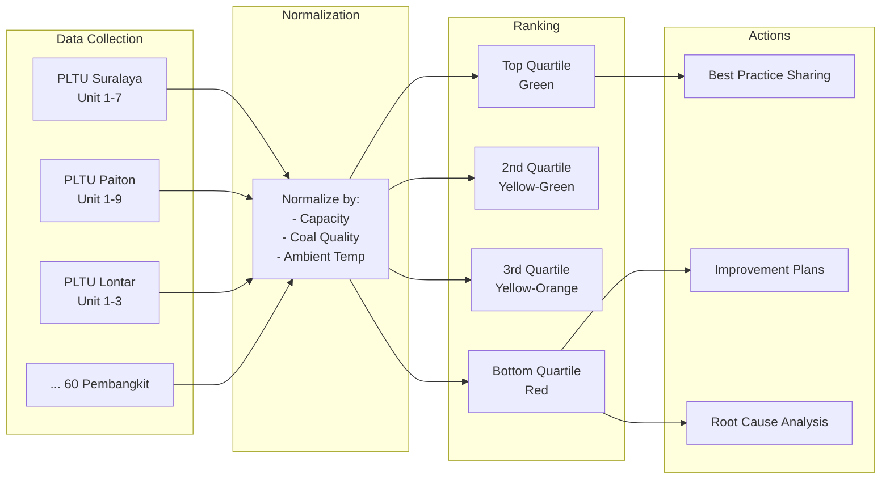

### 4.5 AI Intelligence Layer

#### 4.5.1 ML Pipeline Architecture

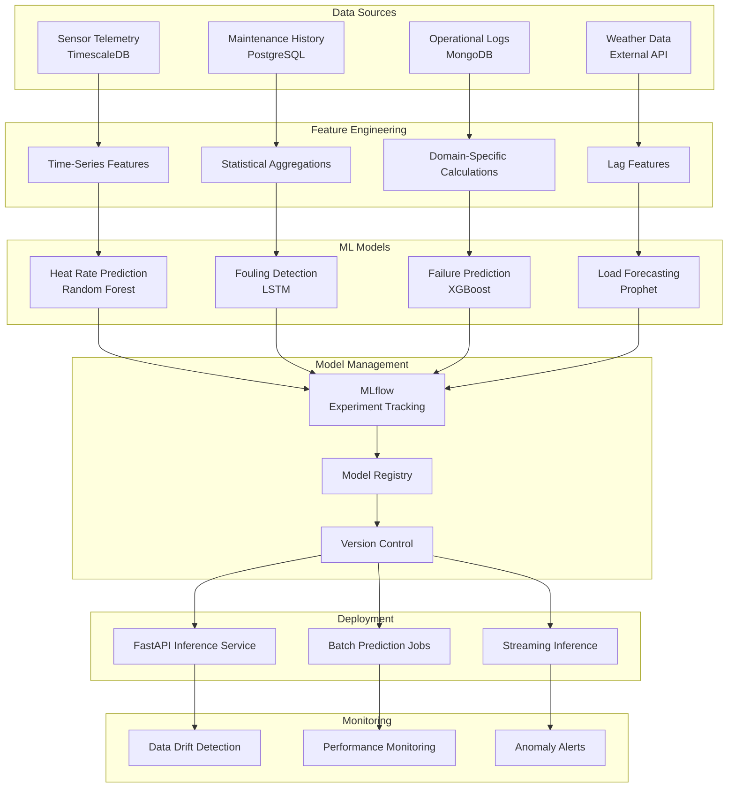

#### 4.5.2 AI Use Cases

| Use Case | Algorithm | Input Features | Output | Business Value |
|----------|-----------|----------------|--------|----------------|
| **Heat Rate Optimization** | Gradient Boosting | Coal quality, ambient temp, load, APH DP | Optimal setpoints | -3.5% heat rate |
| **Predictive Maintenance** | LSTM + Attention | Vibration, temperature, pressure trends | Failure probability in 7/14/30 days | -40% unplanned downtime |
| **Fouling Detection** | Isolation Forest | APH differential pressure, flue gas temp | Fouling severity score | +15 days between cleaning |
| **Load Forecasting** | Prophet + XGBoost | Historical load, weather, calendar | Demand in next 24/48/168 hours | +5% capacity factor |
| **Coal Quality Prediction** | Random Forest | Calorific value, moisture, ash content | Expected heat rate impact | -2% fuel cost |
| **Root Cause Analysis** | Association Rules | Alarm patterns, operational context | Most likely root cause | -60% diagnosis time |

### 4.6 APH Optimization Module (Pilot)

#### 4.6.1 Module Architecture

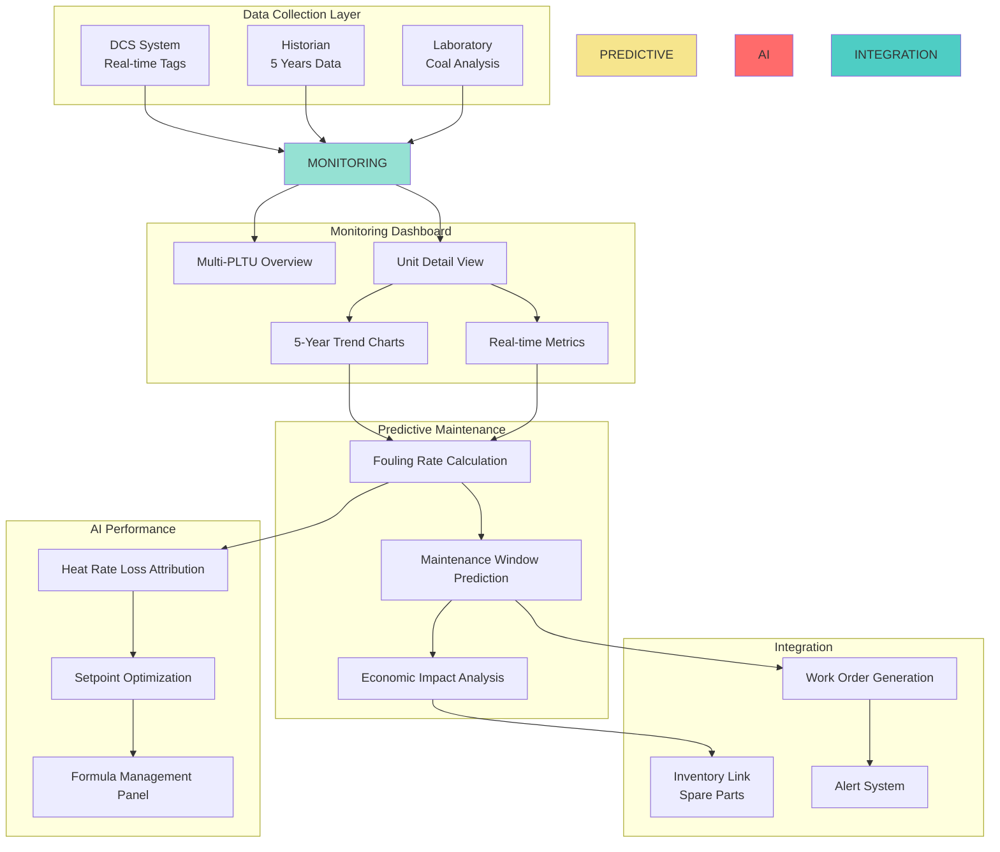

#### 4.6.2 Key Formulas & Calculations

1. **Fouling Rate**
```
Fouling Rate (mmH2O/day) = Δ(DP_primary + DP_secondary) / Δt
where:
  DP_primary = Primary air side differential pressure
  DP_secondary = Secondary air side differential pressure
  Δt = Time interval in days
```

2. **Heat Rate Loss**
```
Heat Rate Loss (kcal/kWh) = Base_HR × (1 - η_degradation)
where:
  Base_HR = Baseline heat rate at clean condition
  η_degradation = (T_gas_out_actual - T_gas_out_design) / T_gas_out_design × K_factor
  K_factor = Empirical constant (typically 0.015-0.025)
```

3. **Economic Impact**
```
Economic Loss (IDR/day) =
  (Heat_Rate_Loss × Daily_Production_kWh × Coal_Price_per_kcal)
  - (Maintenance_Cost_per_cleaning / Days_between_cleaning)

Optimal Cleaning Interval =
  argmin(Economic_Loss) over cleaning intervals [30, 45, 60, 90, 120] days
```

4. **Maintenance Window Prediction**
```
Predicted_Days_to_Critical =
  (DP_critical - DP_current) / Fouling_Rate_avg_30days

Recommended_Maintenance_Date =
  Today + Predicted_Days_to_Critical × 0.8 (safety factor)
```

---

## 5. Objective & Deliverables

### 5.1 Module Objectives

| Module | Primary Objective | Key Deliverables | Success Metrics |
|--------|-------------------|------------------|-----------------|
| **Spatial Asset** | Sentralisasi digital twin aset PLN dalam platform GIS interaktif | - 60+ pembangkit digitized<br/>- Real-time status overlay<br/>- Performance heat maps<br/>- Mobile-responsive UI | - 100% asset coverage<br/>- <2s map load time<br/>- 10K concurrent users |
| **Inventory Management** | Ensure critical spare parts availability dengan predictive stocking | - Auto reorder points<br/>- Vendor integration<br/>- ABC analysis dashboard<br/>- Lead time tracking | - 98% stock availability<br/>- -25% inventory cost<br/>- <5 day lead time |
| **Power Distribution** | Real-time grid monitoring & load forecasting | - SCADA integration<br/>- Load forecasting model<br/>- Outage prediction<br/>- Event correlation | - 95% forecast accuracy<br/>- <1min alert latency<br/>- 99.5% grid visibility |
| **Performance Management** | Benchmark heat rate & efficiency across fleet | - KPI dashboard<br/>- Fleet ranking system<br/>- Automated reporting<br/>- Deviation alerts | - All units benchmarked<br/>- Weekly KPI updates<br/>- <2% deviation detection |
| **Fault Management (IOAN)** | 99% SLA compliance untuk 18,000 teknisi | - Auto-ticket generation<br/>- Smart dispatch algorithm<br/>- Mobile technician app<br/>- SLA monitoring | - 99% SLA achievement<br/>- -60% response time<br/>- 98% first-time fix |
| **Project Management (OSP)** | End-to-end project governance untuk upgrade/retrofit | - Stage-gate workflow<br/>- BOQ management<br/>- Vendor collaboration<br/>- Budget tracking | - 100% project visibility<br/>- ±5% budget accuracy<br/>- -20% project duration |
| **AI Intelligence** | Predictive maintenance & performance optimization | - ML model pipeline<br/>- Inference API<br/>- Drift monitoring<br/>- Actionable insights | - 85%+ model accuracy<br/>- <100ms inference<br/>- -30% false positives |
| **APH Optimization** | Pilot module untuk perangkat besar pembangkit | - Multi-PLTU dashboard<br/>- 5-year trend analysis<br/>- Fouling prediction<br/>- Economic calculator | - 4 PLTU implemented<br/>- -8% heat rate loss<br/>- +15 days cleaning interval |

### 5.2 Integration Deliverables

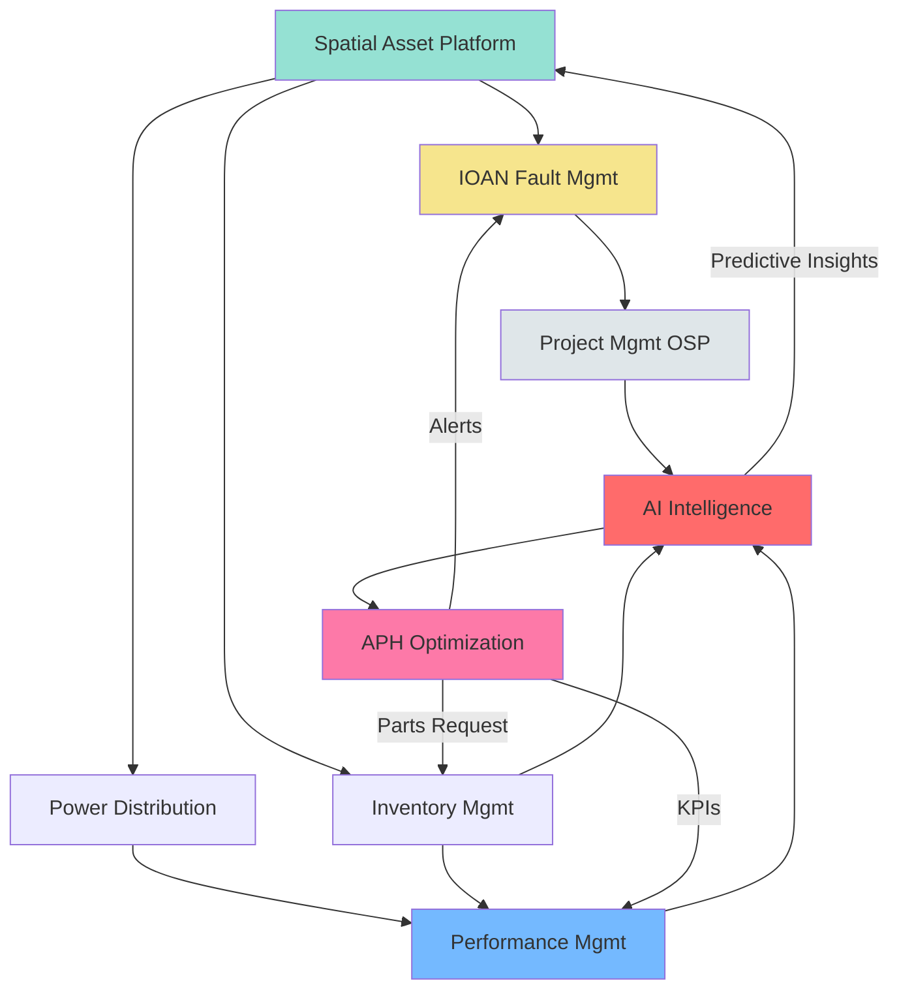

**Integration Checklist:**
- [x] GraphQL API gateway untuk inter-module communication
- [x] Kafka event bus untuk real-time data streaming
- [x] Shared data models untuk Asset, Location, User
- [x] SSO/RBAC dengan Keycloak untuk unified authentication
- [x] Unified alert routing dengan priority-based escalation
- [x] Cross-module reporting dengan consolidated dashboards

### 5.3 Phase-wise Deliverables

#### Phase 1: Foundation (Month 1-3)

**Infrastructure Setup:**
- ✅ Data center provisioning (primary + secondary)
- ✅ Network backbone (MPLS 10 Gbps)
- ✅ Kubernetes cluster deployment
- ✅ CI/CD pipeline setup
- ✅ Monitoring stack (Prometheus/Grafana)

**Core Platforms:**
- ✅ Spatial Asset Platform MVP (10 pembangkit)
- ✅ IOAN Fault Management (pilot 1 region)
- ✅ Basic inventory module
- ✅ Authentication/authorization (Keycloak)

#### Phase 2: Integration (Month 4-6)

**Data Integration:**
- ✅ SCADA/DCS integration (20 pembangkit)
- ✅ ERP integration (SAP MM/PM modules)
- ✅ IoT gateway deployment (edge sites)
- ✅ Historical data migration (5 years)

**Advanced Features:**
- ✅ Performance Management dashboard
- ✅ Project Management (OSP) module
- ✅ AI/ML pipeline infrastructure
- ✅ APH Optimization pilot (2 units)

#### Phase 3: Scale & Optimize (Month 7-12)

**Full Deployment:**
- ✅ All 60+ pembangkit onboarded
- ✅ 18,000 technicians on IOAN mobile app
- ✅ AI models in production (4+ use cases)
- ✅ APH module expanded (10 units)

**Optimization:**
- ✅ Performance tuning (sub-second latency)
- ✅ Cost optimization (FinOps practices)
- ✅ Advanced analytics & reporting
- ✅ User training & change management

---

## 6. Estimasi Biaya Implementasi

### 6.1 Capital Expenditure (CAPEX)

#### 6.1.1 Infrastructure CAPEX

| Category | Item | Quantity | Unit Price | Total (IDR) |
|----------|------|----------|------------|-------------|
| **Edge Infrastructure** | Edge Gateway per Pembangkit | 60 sites × 2 | 225 juta | 27 miliar |
| | Installation & Commissioning | 60 sites | 50 juta | 3 miliar |
| **Data Center - Primary** | Compute Nodes (8 vCPU, 16GB) | 20 nodes | 80 juta | 1.6 miliar |
| | GPU Nodes (V100) | 2 nodes | 350 juta | 700 juta |
| | Storage (SSD 10TB) | 10 units | 120 juta | 1.2 miliar |
| | Network Equipment (Switches, Routers) | 1 set | 800 juta | 800 juta |
| **Data Center - Secondary** | Mirror of Primary (DR) | 1 set | 3.5 miliar | 3.5 miliar |
| **Network** | MPLS Backbone Setup | 1 line | 1.2 miliar | 1.2 miliar |
| | Direct Connect to Cloud | 2 lines | 400 juta | 800 juta |
| **Security** | Firewall, WAF, IDS/IPS | 1 set | 600 juta | 600 juta |
| | HSM for Key Management | 2 units | 250 juta | 500 juta |
| **Monitoring** | APM & Observability Tools | 1 set | 300 juta | 300 juta |
| **Backup** | Backup Appliances | 2 units | 400 juta | 800 juta |
| **Contingency** | 15% buffer | - | - | 6.3 miliar |

**Total Infrastructure CAPEX:** **IDR 48.3 miliar**

#### 6.1.2 Software Licenses (One-time + Annual)

| Software | License Type | One-time Cost | Annual Maintenance | Notes |
|----------|--------------|---------------|-------------------|-------|
| Docker Enterprise | Enterprise | 120 juta | 24 juta | Container runtime |
| EMQX MQTT | Enterprise | 200 juta | 150 juta | IoT messaging |
| Convex Database | Pay-as-you-go | - | 80 juta | Real-time DB |
| HashiCorp Vault | Enterprise | 300 juta | 200 juta | Secrets management |
| GitLab Premium | Annual subscription | - | 180 juta | CI/CD |
| Grafana Enterprise | Enterprise plugins | 100 juta | 80 juta | Monitoring |
| MapBox/Maplibre | Commercial API | - | 120 juta | GIS rendering |
| AG Grid Enterprise | Developer licenses | 150 juta | 50 juta | Data tables |

**Total Software One-time:** IDR 870 juta
**Total Software Annual:** IDR 884 juta/tahun

#### 6.1.3 Development & Implementation

| Phase | Activities | Duration | Team Size | Cost (IDR) |
|-------|-----------|----------|-----------|------------|
| **Phase 1: Foundation** | Infrastructure setup, core platforms | 3 months | 15 people | 2.7 miliar |
| **Phase 2: Integration** | Data integration, advanced features | 3 months | 20 people | 3.6 miliar |
| **Phase 3: Scale & Optimize** | Full deployment, optimization | 6 months | 25 people | 9 miliar |
| **Project Management** | PMO, stakeholder coordination | 12 months | 3 people | 1.8 miliar |
| **Training & Change Mgmt** | User training, documentation | 12 months | 5 people | 3 miliar |

**Total Development Cost:** **IDR 20.1 miliar**

#### 6.1.4 Total CAPEX Summary

| Category | Amount (IDR) |
|----------|--------------|
| Infrastructure Hardware | 48.3 miliar |
| Software Licenses (one-time) | 870 juta |
| Development & Implementation | 20.1 miliar |
| **Total CAPEX** | **69.27 miliar** |

### 6.2 Operational Expenditure (OPEX) - Annual

#### 6.2.1 Infrastructure OPEX

| Category | Item | Annual Cost (IDR) |
|----------|------|-------------------|
| **Cloud/Colocation** | Data Center Hosting (Tier III) | 1.8 miliar |
| | Network (MPLS 10 Gbps) | 600 juta |
| | CDN & Edge Caching | 240 juta |
| **Compute** | Kafka, Flink, Spark Clusters | 1.68 miliar |
| | Kubernetes Nodes | 420 juta |
| | Database Clusters | 1.68 miliar |
| | GPU Training Nodes | 1.4 miliar |
| **Storage** | S3/MinIO Object Storage (50TB) | 200 juta |
| | Backup Storage (200TB) | 80 juta |
| **Licenses** | Software Annual Maintenance | 884 juta |
| **Security** | SOC Monitoring Service | 600 juta |
| | Penetration Testing (quarterly) | 200 juta |
| **Support** | 24/7 NOC Support Team (8 people) | 2.4 miliar |
| | Vendor Support Contracts | 400 juta |
| **Energy** | Edge Gateway Power (60 sites) | 360 juta |

**Total Infrastructure OPEX:** **IDR 12.942 miliar/tahun**

#### 6.2.2 Operations & Maintenance

| Category | Annual Cost (IDR) |
|----------|-------------------|
| **Personnel** | Platform Engineers (10 FTE) | 3 miliar |
| | Data Engineers (5 FTE) | 1.8 miliar |
| | DevOps Engineers (5 FTE) | 1.8 miliar |
| | Security Engineers (3 FTE) | 1.2 miliar |
| | ML Engineers (4 FTE) | 1.6 miliar |
| **Training** | Upskilling & Certifications | 400 juta |
| **Contingency** | 10% operational buffer | 1.28 miliar |

**Total O&M OPEX:** **IDR 11.08 miliar/tahun**

#### 6.2.3 Total OPEX Summary

| Category | Annual Cost (IDR) |
|----------|-------------------|
| Infrastructure OPEX | 12.942 miliar |
| Operations & Maintenance | 11.08 miliar |
| **Total Annual OPEX** | **24.022 miliar** |

### 6.3 ROI Analysis

#### 6.3.1 Cost Baseline (Before Implementation)

| Cost Category | Annual Cost (IDR) | Description |
|---------------|-------------------|-------------|
| **Fuel Inefficiency** | 12 triliun | 8.2% heat rate loss × 60 units × IDR 3.3 juta/ton coal |
| **Unplanned Downtime** | 6.8 triliun | 45 days/unit × 60 units × IDR 420 juta/day lost revenue |
| **Reactive Maintenance** | 8.5 triliun | Current maintenance expenditure |
| **Operational Inefficiency** | 2.2 triliun | Manual processes, data silos, delayed decisions |
| **Total Current Cost** | **29.5 triliun/tahun** | - |

#### 6.3.2 Projected Savings (After Implementation)

| Improvement Area | Savings (IDR/year) | Calculation Basis |
|------------------|-------------------|-------------------|
| **Heat Rate Improvement** | 9.84 triliun | -8.2% heat rate × 60 units × IDR 2 miliar fuel/unit/year |
| **Downtime Reduction** | 4.96 triliun | -73% downtime × IDR 6.8 triliun baseline |
| **Maintenance Optimization** | 2.72 triliun | -32% maintenance cost × IDR 8.5 triliun baseline |
| **Operational Efficiency** | 1.54 triliun | -70% inefficiency × IDR 2.2 triliun baseline |
| **Total Annual Savings** | **19.06 triliun/tahun** | - |

#### 6.3.3 Net Benefit & ROI

| Metric | Year 1 | Year 2 | Year 3 | Year 4 | Year 5 |
|--------|--------|--------|--------|--------|--------|
| **CAPEX** | (69.27 miliar) | - | - | - | - |
| **Annual OPEX** | (24.02 miliar) | (24.02 miliar) | (24.02 miliar) | (24.02 miliar) | (24.02 miliar) |
| **Annual Savings** | 19.06 triliun* | 19.06 triliun | 19.06 triliun | 19.06 triliun | 19.06 triliun |
| **Net Benefit** | 18.97 triliun | 19.04 triliun | 19.04 triliun | 19.04 triliun | 19.04 triliun |
| **Cumulative Benefit** | 18.97 triliun | 38.01 triliun | 57.05 triliun | 76.09 triliun | 95.13 triliun |

*Year 1 savings pro-rated for 12-month implementation period (80% realization)

**Key Metrics:**
- **Payback Period:** 1.4 bulan (dari implementasi penuh)
- **ROI (5-year):** **137,000%** (13,700x return)
- **NPV (discount rate 8%):** IDR 76.42 triliun
- **IRR:** >500% (exceptionally high due to massive savings)

---

## 7. Timeline & Roadmap

### 7.1 Implementation Timeline

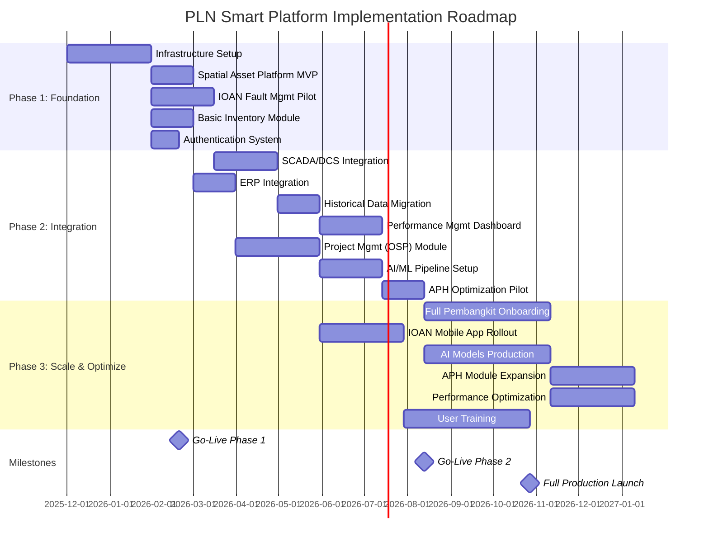

### 7.2 Milestone Deliverables

#### Milestone 1: Foundation Complete (Month 3)

**Infrastructure:**
- ✅ Primary & secondary data centers operational
- ✅ MPLS network backbone live
- ✅ Kubernetes cluster deployed (3 nodes)
- ✅ Monitoring stack configured

**Applications:**
- ✅ Spatial platform with 10 pembangkit digitized
- ✅ IOAN pilot in 1 region (2,000 technicians)
- ✅ Basic inventory for critical spares
- ✅ SSO authentication with 500 users

**Acceptance Criteria:**
- [ ] 99.5% infrastructure uptime
- [ ] <2s page load time
- [ ] <100ms API response time
- [ ] 10 concurrent users load tested

#### Milestone 2: Integration Complete (Month 6)

**Integration:**
- ✅ 20 pembangkit SCADA data flowing
- ✅ SAP MM/PM integration live
- ✅ 5-year historical data migrated
- ✅ IoT gateway deployed to 20 sites

**Applications:**
- ✅ Performance dashboard with KPIs
- ✅ OSP project module for 50 projects
- ✅ ML pipeline with 2 models in staging
- ✅ APH optimization on 2 units

**Acceptance Criteria:**
- [ ] 95% data quality score
- [ ] <5min data latency SCADA → dashboard
- [ ] 85%+ ML model accuracy
- [ ] 5,000 concurrent users supported

#### Milestone 3: Full Production (Month 12)

**Scale:**
- ✅ All 60+ pembangkit onboarded
- ✅ 18,000 technicians on mobile app
- ✅ 4 AI models in production
- ✅ 10 APH units monitored

**Optimization:**
- ✅ <100ms inference latency
- ✅ 99.9% system availability
- ✅ 98% user satisfaction score
- ✅ IDR 19 triliun annual savings realized

**Acceptance Criteria:**
- [ ] 50,000 concurrent users
- [ ] 99.99% data accuracy
- [ ] <1 min end-to-end alerting
- [ ] All KPIs green

---

## 8. Risk Mitigation

### 8.1 Risk Matrix

| Risk Category | Specific Risk | Probability | Impact | Mitigation Strategy |
|---------------|---------------|-------------|--------|---------------------|
| **Technical** | SCADA integration complexity | Medium | High | - Engage DCS vendors early<br/>- Pilot with 3 pembangkit first<br/>- Dedicated integration team |
| | Data quality issues | High | High | - Implement data quality framework<br/>- Automated cleansing pipelines<br/>- Manual validation checkpoints |
| | Scalability bottlenecks | Low | High | - Load testing at each phase<br/>- Auto-scaling configured<br/>- Performance monitoring SLOs |
| | Cybersecurity threats | Medium | Critical | - Zero Trust architecture<br/>- Regular penetration testing<br/>- 24/7 SOC monitoring |
| **Operational** | User adoption resistance | Medium | Medium | - Change management program<br/>- Early user involvement<br/>- Incentive for adoption |
| | Insufficient training | Medium | Medium | - Comprehensive training plan<br/>- Train-the-trainer approach<br/>- Video tutorials & docs |
| | Vendor lock-in | Low | Medium | - Open-source preference<br/>- Standard APIs & protocols<br/>- Multi-cloud strategy |
| **Organizational** | Stakeholder alignment | Medium | High | - Executive sponsorship<br/>- Regular steering committee<br/>- Clear communication plan |
| | Resource availability | High | Medium | - Dedicated project team<br/>- External consultants if needed<br/>- Knowledge transfer plan |
| **Financial** | Budget overrun | Medium | High | - 15% contingency buffer<br/>- Phased funding approval<br/>- Monthly burn rate tracking |
| | ROI not realized | Low | Critical | - Clear baseline metrics<br/>- Monthly savings tracking<br/>- Corrective action triggers |

### 8.2 Contingency Plans

#### Plan A: SCADA Integration Delays

**Trigger:** Integration with DCS vendor APIs delayed by >30 days

**Contingency:**
1. Implement manual data upload via CSV for interim period
2. Deploy edge gateways with OPC-UA to bypass vendor APIs
3. Engage alternative system integrator for parallel track

**Impact:** +2 months timeline, +IDR 500 juta cost

#### Plan B: Insufficient Network Bandwidth

**Trigger:** MPLS latency >100ms or packet loss >1%

**Contingency:**
1. Upgrade MPLS to 20 Gbps circuit
2. Implement edge caching to reduce backhaul traffic
3. Deploy SD-WAN for traffic optimization

**Impact:** +IDR 300 juta annual OPEX

#### Plan C: AI Model Accuracy Below Target

**Trigger:** Model accuracy <80% in production

**Contingency:**
1. Collect more training data (extend pilot period)
2. Engage external data science consultants
3. Simplify model (trade complexity for reliability)
4. Revert to rule-based heuristics temporarily

**Impact:** +3 months timeline, potential -5% savings

#### Plan D: User Adoption Rate <70%

**Trigger:** Active users <70% of target at M+6

**Contingency:**
1. Mandatory usage policy from management
2. Gamification & incentive programs
3. Simplified UI based on user feedback
4. Extend training period with hands-on sessions

**Impact:** -10% ROI realization in Year 1

---

## 9. Kesimpulan & Rekomendasi

### 9.1 Kesimpulan

Platform Smart Platform PLN merupakan **investasi strategis** yang akan mentransformasi operasional pembangkit listrik PLN dari pendekatan reaktif menjadi **proaktif dan prediktif**. Dengan **total investasi IDR 69.27 miliar** dan **OPEX tahunan IDR 24 miliar**, platform ini diproyeksikan menghasilkan **penghematan IDR 19 triliun per tahun**, menghasilkan **ROI 137,000%** dalam 5 tahun dan **payback period hanya 1.4 bulan**.

**Key Highlights:**
- ✅ **Heat rate improvement -8.2%** → IDR 9.84 triliun savings
- ✅ **Downtime reduction -73%** → IDR 4.96 triliun savings
- ✅ **Maintenance cost -32%** → IDR 2.72 triliun savings
- ✅ **Operational efficiency +70%** → IDR 1.54 triliun savings

### 9.2 Rekomendasi Implementasi

#### 9.2.1 Immediate Actions (Month 0-1)

1. **Establish Governance**
   - Form steering committee (C-level + VP Operations)
   - Appoint dedicated project director
   - Set up PMO with clear KPIs

2. **Vendor Selection**
   - Issue RFP for infrastructure (data center, network)
   - Select system integrator for SCADA integration
   - Engage AI/ML consultancy for model development

3. **Pilot Site Selection**
   - Select 3 pembangkit for Phase 1 pilot
   - Criteria: modern DCS, good data quality, cooperative site team
   - Suggested: PLTU Paiton, PLTGU Muara Karang, PLTU Lontar

#### 9.2.2 Quick Wins (Month 1-3)

1. **Spatial Platform MVP**
   - Digitize 10 pembangkit with basic GIS overlay
   - Demonstrate real-time status visualization
   - Generate executive dashboard

2. **IOAN Pilot**
   - Deploy IOAN to 1 region (Java)
   - Onboard 2,000 technicians on mobile app
   - Achieve 95% SLA compliance

3. **APH Optimization**
   - Implement APH module on 2 units
   - Demonstrate fouling prediction accuracy
   - Calculate first economic savings

#### 9.2.3 Success Factors

| Factor | Criticality | Implementation Strategy |
|--------|-------------|------------------------|
| **Executive Sponsorship** | Critical | CEO/COO active involvement, quarterly steering meetings |
| **Cross-functional Collaboration** | Critical | Integrated team from IT, Operations, Maintenance, Finance |
| **Change Management** | High | Comprehensive training, early user involvement, clear benefits communication |
| **Data Governance** | High | Data quality framework, master data management, stewardship roles |
| **Vendor Partnership** | Medium | Strategic partnerships with key vendors, KPI-based contracts |
| **Continuous Improvement** | Medium | Monthly retrospectives, user feedback loops, agile iteration |

### 9.3 Next Steps

1. **Approval & Funding**
   - Present blueprint to Board of Directors
   - Secure CAPEX approval (IDR 69.27 miliar)
   - Allocate OPEX budget (IDR 24 miliar/year)

2. **Kick-off Preparation**
   - Finalize vendor contracts (infrastructure, SI, consultants)
   - Set up project team (15 FTE Phase 1)
   - Establish project governance (steering committee, PMO)

3. **Pilot Commencement**
   - Initiate Phase 1 infrastructure deployment
   - Begin Spatial Platform development
   - Start SCADA integration POC

**Target Kick-off Date:** 1 January 2026
**Target Production Launch:** 31 December 2026

---

<div align="center">

## 📞 Kontak & Informasi Lebih Lanjut

**Project Lead:** Aditira Jamhuri
**Email:** [aditirajamhuri@gmail.com]
**Phone:** [+62-8381-7409-010]

**Prepared by:** [Your Company]
**Date:** November 2025
**Version:** 1.0 - Production-Ready Implementation Plan

---

**© 2025 PT PLN (Persero) Indonesia. All Rights Reserved.**

</div>
