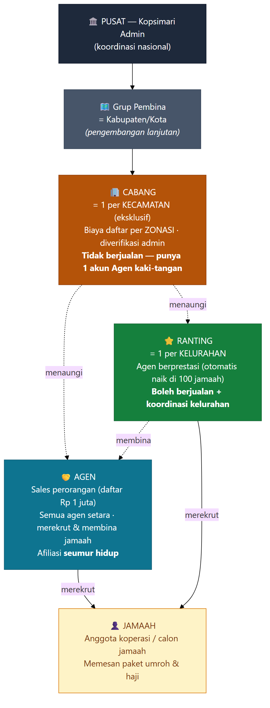
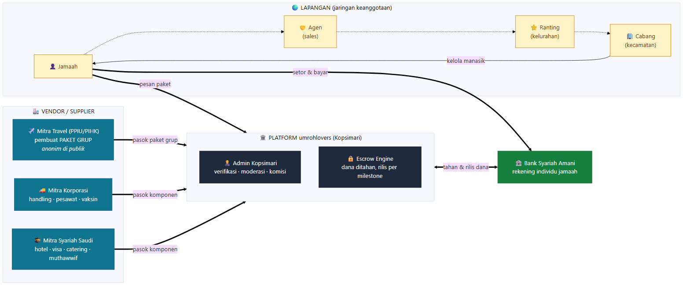
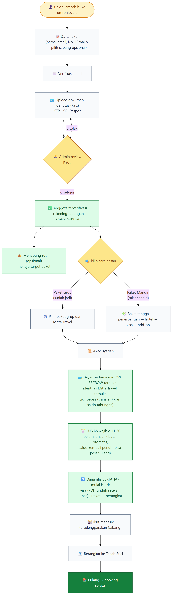
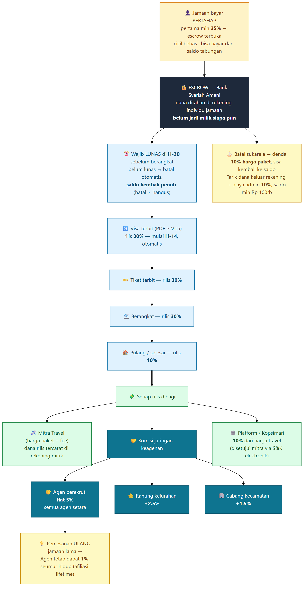

# Arsitektur & Alur Kerja UmrohLovers — Penjelasan Visual

**Untuk:** Stakeholder
**Tujuan:** memahami **bagaimana UmrohLovers bekerja** secara menyeluruh — siapa berperan apa, bagaimana jamaah dilayani, dan ke mana uang mengalir — dalam gambar yang mudah dibaca.
**Sifat:** ringkas tapi presisi. Setiap angka & alur di sini **sesuai dengan yang sudah dibangun** di platform (bukan rencana di atas kertas).
**Versi:** 2.0 — Juli 2026. Diperbarui setelah keputusan final meeting stakeholder 1 Juli 2026: fee platform **10%**, pelunasan **H-30**, rilis dana travel **H-14**, denda batal **10%**, biaya tarik dana **10%**, Agen **auto-aktif** setelah bayar, tarif Cabang **per zona** (data BPS).

---

## Ringkasan satu paragraf

UmrohLovers adalah **marketplace haji & umroh** milik Koperasi Syarikat Islam Mandiri (Kopsimari). Jamaah memilih paket — bisa **paket grup** dari travel berizin (PPIU), atau **rakit sendiri** (paket mandiri) dari komponen vendor. Pembayaran tidak langsung ke travel, melainkan **ditahan di rekening pribadi jamaah di Bank Syariah Amani (escrow)** dan dirilis **bertahap** seiring keberangkatan. Di sisi penjualan, ada **jaringan keagenan berjenjang** (Jamaah → Agen → Ranting → Cabang) yang mendapat komisi dari setiap booking. Inilah empat sudut pandang yang menjelaskan keseluruhannya.

---

## 1. Hierarki Keanggotaan — *Siapa di bawah siapa*

Model keanggotaan UmrohLovers berjenjang mengikuti **wilayah administratif Indonesia**. Semakin tinggi posisi, semakin luas wilayah yang dikoordinir.

**Cara membacanya:**

| Tingkat | Wilayah | Boleh jualan? | Catatan kunci |
|---|---|---|---|
| **Jamaah** | — | (membeli) | Anggota koperasi / calon jamaah. |
| **Agen** | bebas | ✅ Ya | Siapa saja bisa jadi Agen. Biaya daftar **Rp 1 juta**, dan begitu data (KTP + No. HP) lengkap & dibayar, akun **langsung aktif otomatis** — tanpa antre persetujuan admin. Dari Rp 1 juta itu: **Rp 500rb kit agen** (starter kit), sisanya profit platform — dibagi **70:30 dengan Syarikat Islam** bila daftar lewat jalur SI. Semua agen **setara**; yang berprestasi tampil di **Rapot Agen** (peringkat bulanan) untuk reward berkala. Jamaah yang ia bawa **menempel seumur hidup** ke Agen itu. |
| **Ranting** | 1 / Kelurahan | ✅ Ya | Agen berprestasi yang **otomatis naik** setelah membawa **100 jamaah**. Mendapat tambahan komisi teritori + koordinasi kelurahan. |
| **Cabang** | 1 / Kecamatan | ❌ **Tidak** | Koordinator wilayah. Biaya daftar **per ZONA** — dihitung dari **rasio penduduk Muslim kecamatan** (data BPS): Zona 1 (mayoritas terbesar) termahal s.d. Zona 4 termurah. Saat klaim, calon Cabang **melampirkan foto tempat + titik koordinat** untuk diverifikasi admin (lihat di peta). Klaim permanen — bila pemilik wafat, bisa **diwariskan** lewat admin (ganti pemilik tercatat). Mengelola manasik & komunitas. **Tidak berjualan langsung** — tapi mendapat **1 akun Agen gratis** (nama berbeda) sebagai kaki-tangannya. |
| **Pusat** | Nasional | — | Kopsimari Admin: verifikasi, moderasi, atur parameter komisi. |

> 🔑 **Eksklusif:** Satu kecamatan **hanya boleh punya satu Cabang**, satu kelurahan **hanya satu Ranting**. Sistem mengunci otomatis — tidak ada rebutan wilayah.

---

## 2. Peta Peran & Ekosistem — *Siapa berperan apa*

Selain jaringan keagenan, ada pihak-pihak lain yang membuat ekosistem ini berjalan: penyuplai paket, vendor pendukung, bank, dan tim Kopsimari sendiri.

**Tiga kelompok besar:**

- **Lapangan** — jaringan orang yang menjual & membina (Jamaah, Agen, Ranting, Cabang). Ini "kaki-tangan" di masyarakat.
- **Platform (Kopsimari)** — pusat yang memverifikasi anggota, memoderasi mitra & paket, mengatur komisi, dan menjalankan **escrow** (mesin penahan dana).
- **Vendor** — yang benar-benar menyediakan layanan:
  - **Mitra Travel (PPIU/PIHK)** = perusahaan travel berizin yang **membuat paket grup**. UmrohLovers hanya **memasarkan** paket mereka — namanya **sengaja disembunyikan** dari jamaah agar tidak terjadi banting harga.
  - **Mitra Korporasi** (Indonesia) & **Mitra Syariah** (Saudi) = penyuplai **komponen** (hotel, visa, penerbangan, handling, catering) untuk paket mandiri.

> 💡 **Penting:** Yang menyusun paket (pesawat, hotel, jumlah hari) adalah **Travel**, bukan Agen. Agen hanya **memasarkan**. UmrohLovers tidak membuat paket sendiri — ia menyalurkan paket dari travel + komponen dari mitra.

---

## 3. Perjalanan Jamaah — *Dari daftar sampai pulang*

Inilah pengalaman seorang jamaah dari awal hingga selesai berhaji/berumroh.

**Langkah-langkah:**
1. **Daftar** (No. HP wajib & unik) → **verifikasi email** → **upload dokumen identitas (KYC)**.
2. Admin **menyetujui KYC** → jamaah resmi & **rekening tabungan Amani otomatis terbuka**.
3. Jamaah bisa **menabung rutin** menuju target, lalu **memilih paket**: grup (sudah jadi) atau mandiri (rakit sendiri).
4. **Akad syariah** → **bayar pertama minimal 25%** → **escrow terbuka** & identitas Mitra Travel tampil. Sisanya **dicicil bebas** — lewat transfer atau **langsung dari saldo tabungan**. Rekening menampilkan **saldo bebas vs terkunci di escrow**.
5. **Wajib LUNAS di H-30** sebelum berangkat. Belum lunas → booking **batal otomatis**, dan **saldo kembali penuh** ke rekening (batal ≠ hangus — bisa dipakai pesan ulang). Batal sukarela dikenai **denda 10% harga paket**.
6. Dana **dirilis bertahap mulai H-14**: visa terbit (**PDF e-Visa** — bisa diunduh jamaah setelah lunas) → tiket → berangkat → pulang.
7. **Manasik** (diselenggarakan Cabang) → **berangkat** → **pulang** → booking selesai.

---

## 4. Alur Uang & Komisi — *Ke mana uang mengalir*

Ini bagian paling penting untuk dipahami: **dana jamaah aman, dan komisi hanya dibayar dari transaksi nyata** (bukan dari merekrut orang — ini yang membedakannya dari skema piramida).

**Cara membacanya:**
- Jamaah membayar **bertahap** (pertama minimal 25%) → uang **ditahan di escrow** (rekening pribadi jamaah di Bank Amani). **Belum jadi milik siapa pun.**
- Wajib **lunas di H-30**; belum lunas → batal otomatis dan **saldo kembali penuh** (batal ≠ hangus).
- Uang **baru dirilis mulai H-14**, bertahap per milestone (visa 30% → tiket 30% → berangkat 30% → pulang 10%) — jadi kalau gagal berangkat, dana jamaah terlindungi. Setiap rilis juga **tercatat di rekening Mitra Travel** sehingga travel melihat dananya masuk.
- Saat dirilis, dibagi ke: **harga paket (dikurangi fee) → Mitra Travel**, **fee platform 10% → Kopsimari** (disetujui mitra lewat **S&K elektronik** saat mendaftar — tanggal & persentase tercatat), dan **komisi → jaringan keagenan.**
- Travel yang butuh dana lebih awal dari H-14 bisa mengajukan **kasbon/talangan ke Bank Amani** (margin 2-3%/bulan, maksimal ±30% nilai paket) — urusan travel dengan bank, di luar platform.

**Besaran komisi jaringan** (semua bisa diubah admin tanpa ganti aplikasi):

| Penerima | Komisi | Keterangan |
|---|---|---|
| **Agen** perekrut | **flat 5%** | Semua agen **rate sama** (tanpa tingkatan). Agen berprestasi tampil di **Rapot Agen** (peringkat bulanan) untuk reward berkala dari anggaran marketing. |
| **Ranting** | **+2,5%** | Override teritori kelurahan tempat jamaah berada. |
| **Cabang** | **+1,5%** | Override teritori kecamatan. |
| **Platform** | **10%** | Fee Kopsimari dari harga travel (final — meeting 1 Juli 2026). |
| **Pemesanan ulang** | **1%** | Jamaah lama pesan lagi → Agen-nya tetap dapat **1% seumur hidup** (afiliasi lifetime). |

**Aturan dana keluar** (final — meeting 1 Juli 2026): **tarik dana** dari rekening kena **biaya admin 10%** + saldo minimal Rp 100rb harus tersisa; **batal sukarela** kena **denda 10% dari harga paket**, sisanya kembali ke saldo. Selama dana tidak ditarik keluar, tidak ada potongan.

> 🛡️ **Kenapa ini bukan piramida:** komisi **selalu** terikat ke **booking nyata** (ada jamaah benar-benar berangkat), biaya daftar Agen (Rp 1 juta) bersifat **komitmen administratif** (bukan beli posisi/slot), dan Agen **tidak pernah memegang dana** jamaah. Struktur ini tetap perlu **review legal & Dewan Pengawas Syariah** sebelum go-live — sudah masuk daftar prioritas kami.

---

## Catatan penutup

Diagram di atas menggambarkan platform **sebagaimana sudah dibangun & bisa dicoba** di staging (lihat panduan uji coba, dokumen 53). Beberapa bagian yang menyangkut uang sungguhan — pembayaran, setoran, escrow Bank Amani — saat ini masih **simulasi**, menunggu integrasi resmi dengan Bank Amani & penyedia pembayaran. **Alur, peran, dan mekanismenya sudah final dan berjalan**; tinggal "ditukar" dengan koneksi bank/pembayaran asli saat kerja sama itu rampung.

**Yang sudah FINAL** (meeting stakeholder 1 Juli 2026 — sudah terpasang di platform): fee platform **10%**; komisi Agen **flat 5%**; pelunasan **H-30** (batal otomatis + saldo kembali); rilis dana travel **H-14**; denda batal sukarela **10% harga paket**; biaya tarik dana **10%** (saldo min Rp 100rb); Agen **auto-aktif** setelah data lengkap + bayar Rp 1 juta (split kit Rp 500rb + profit 70:30 dengan SI); tarif Cabang **per zona BPS**; Cabang **tidak berjualan langsung**; Agen pendamping muncul **setelah** escrow terbentuk (anti-fraud, dipilih berdasar beban kerja teradil); haji **ditunda** ("Segera Hadir") — fokus pilot umroh.

**Yang masih menunggu konfirmasi Pak Lukman** (daftar lengkap + usulan default di dokumen 66): penyamaan denda batal-diam-diam vs batal-sukarela, basis split SI (gross vs profit), angka final kit agen, saldo minimal tarik dana, biaya admin pendaftaran member Rp 100rb, dan perlunya langkah verifikasi visa formal. Semua sudah berjalan dengan angka default yang bisa diubah admin tanpa update aplikasi.