# Panduan Uji Coba Sendiri — Platform UmrohLovers (Staging)

**Untuk:** Stakeholder
**Tanggal:** Juli 2026
**Versi:** 1.4 — pembaruan besar setelah keputusan final meeting 1 Juli 2026 (dokumen 64/65), semuanya sudah live di staging: **tarik dana** dari rekening (biaya admin 10%), tampilan **saldo bebas vs terkunci di escrow**, **bayar cicilan langsung dari saldo**, **batalkan booking** (denda 10% harga paket, sisa kembali ke saldo), **pelunasan wajib H-30** (belum lunas → batal otomatis, saldo kembali penuh), **rilis dana travel mulai H-14**, **fee platform 10%** tampil transparan di checkout, **jadi Agen langsung aktif** setelah isi data + bayar (tanpa antre admin), **Rapot Agen** (peringkat bulanan), **tarif Cabang per zona** + peta sebaran penduduk Muslim, klaim Cabang dengan **foto tempat + koordinat**, **pewarisan Cabang** (admin ganti pemilik), formulir **Gabung Mitra 2 langkah** dengan **persetujuan S&K fee** untuk Mitra Travel, kartu **Kasbon Amani** di portal mitra, dan **paket Haji ditunda** ("Segera Hadir" — fokus pilot umroh). Fitur versi 1.3 sebelumnya (pembayaran bertahap, reveal Mitra Travel, promosi paket, etalase marketing, preferensi promosi, visa PDF) tetap berlaku — dokumen meeting 60–63.

---

## 1. Pengantar

Selamat datang! Dokumen ini adalah panduan langkah demi langkah agar Bapak bisa **mencoba sendiri** seluruh platform UmrohLovers, dari sisi calon jamaah sampai sisi admin, lalu memberi masukan langsung dari pengalaman Bapak.

**Apa itu "staging"?**
Staging adalah versi platform yang sudah jalan di internet, tapi khusus untuk **latihan dan uji coba** — bukan versi yang dipakai jamaah asli. Bapak boleh klik apa saja, daftar, isi data, bahkan "membayar" tanpa khawatir merusak apa pun atau mengeluarkan uang sungguhan. Semua data di sini bisa kami reset kapan saja.

**Tujuan uji coba ini:**
Kami ingin mendengar dari Bapak: **mana yang sudah enak dipakai, mana yang masih kurang, dan mana yang belum ada.** Masukan Bapak akan menentukan prioritas pengembangan berikutnya.

### Cara memberi masukan

Di setiap fitur dalam panduan ini ada kolom kecil seperti ini:

> **Masukan Bapak:** [ ✅ Oke / ⚠️ Perlu Revisi / ❌ Belum Ada ]
> Catatan: _________________________________________

Cukup centang salah satu dan tulis catatan singkat. Bapak bisa mengisi langsung di dokumen ini (cetak, atau ketik di samping), atau sampaikan lisan saat kita review bersama. Tidak perlu pakai istilah teknis — tulis apa adanya, seperti "tombolnya susah dicari" atau "bahasanya membingungkan".

---

## 2. Cara Mulai

### Buka platformnya

Buka salah satu alamat berikut di browser (Chrome/Safari di HP atau laptop):

- **Utama:** https://staging.umrohlovers.id
- **Alternatif (kalau yang atas bermasalah):** https://kopsimari-haji.ajarka.com

> 💡 **Tips:** Sebagian fitur lebih enak dilihat di HP (karena ~70% jamaah pakai HP), tapi sisi admin lebih nyaman di laptop. Coba keduanya kalau sempat.

### Cara login

1. Klik tombol **Masuk** di pojok kanan atas.
2. Masukkan **Email** dan **Password** dari tabel di bawah.
3. Klik **Masuk** — sistem otomatis membawa Bapak ke halaman yang sesuai dengan peran akun tersebut.

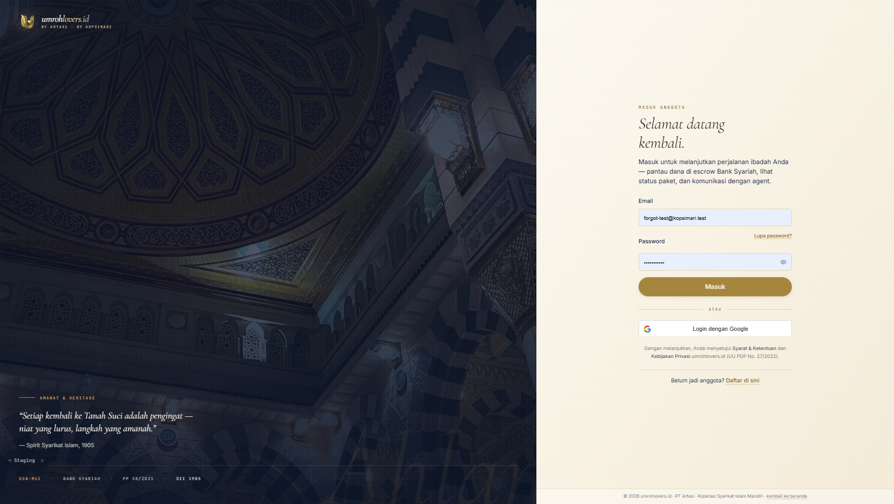

**Password semua akun di bawah sama:** `TestQA2026!`

### Daftar 15 akun uji coba

Setiap akun mewakili satu "peran" berbeda di platform. Login bergantian dengan akun-akun ini untuk merasakan platform dari berbagai sudut pandang.

| Email akun | Peran (istilah kita) | Untuk mencoba apa |
|---|---|---|
| `jamaah-test@kopsimari.test` | **Jamaah** (calon jamaah biasa) | Daftar, verifikasi, tabungan, pesan paket, jadi Agen |
| `sales-test@kopsimari.test` | **Agen** (sales perekrut jamaah) | Dashboard Agen, link referral, komisi |
| `ranting-agent-test@kopsimari.test` | **Ranting** (Agen prestasi, 1 per kelurahan) | Agen yang sudah naik jadi Ranting |
| `g2-agen-ringan@kopsimari.test` | **Agen** (dapat jamaah & komisi) | Notifikasi pendamping & komisi |
| `agent-test@kopsimari.test` | **Mitra Travel** (penyedia paket grup, berizin PPIU) | Buat & kelola paket grup |
| `agent-staff-test@kopsimari.test` | **Staf Mitra Travel** | Bantu kelola operasional Mitra Travel |
| `brand-owner-test@kopsimari.test` | **Cabang** (koordinator kecamatan) | Dashboard Cabang, manasik, jamaah binaan |
| `cabang-claim-test-1782405517@kopsimari.test` | **Cabang** (hasil klaim kecamatan — KSM Bandung) | Cabang yang baru klaim wilayah |
| `brand-staff-test@kopsimari.test` | **Staf Cabang** | Bantu operasional Cabang |
| `super-admin-test@kopsimari.test` | **Super Admin** | Akses penuh: semua moderasi & persetujuan |
| `admin-koperasi-test@kopsimari.test` | **Admin Koperasi** | Setujui KYC, paket, mitra |
| `finance-test@kopsimari.test` | **Admin Keuangan** | Lihat pendapatan & komisi |
| `bank-ops-test@kopsimari.test` | **Petugas Bank** (mitra Amani) | Sisi operasi bank/escrow |
| `korporasi-test@kopsimari.test` | **Mitra Korporasi** (vendor Indonesia) | Item à la carte: penerbangan, handling, vaksin |
| `syariah-test@kopsimari.test` | **Mitra Syariah** (vendor Saudi) | Item à la carte: hotel, visa, catering, muthawwif |

> ⚠️ **Penting soal istilah** — supaya tidak tertukar:
> - **Agen** = sales perorangan yang merekrut & membina jamaah (program keagenan, model lifetime). **Bukan** Mitra Travel.
> - **Ranting** = Agen berprestasi yang ditunjuk jadi koordinator 1 kelurahan.
> - **Cabang** = koordinator wilayah 1 kecamatan (biaya pendaftaran **per zona** — dihitung dari sebaran penduduk Muslim kecamatan, data BPS).
> - **Mitra Travel** = perusahaan travel berizin (PPIU) yang menyuplai paket grup. Namanya **sengaja disembunyikan** dari jamaah di halaman publik.
> - **Mitra Korporasi / Mitra Syariah** = vendor pendukung (hotel, penerbangan, visa, dll) yang namanya **boleh tampil** terbuka.

---

## 3. Legenda Status

Di sepanjang panduan, setiap fitur diberi tanda status. Artinya:

| Tanda | Arti |
|---|---|
| ✅ **Berfungsi penuh** | Sudah jalan sungguhan, siap dipakai. |
| 🟡 **Demo / Simulasi** | Alurnya jalan dan bisa dicoba, **tapi belum nyata** — terutama soal **pembayaran & bank**. Tombol bayar hanya simulasi (tertulis "Mock"), tidak ada uang sungguhan berpindah. |
| ⚙️ **Sebagian** | Ada, tapi belum lengkap (sebagian fungsi belum aktif). |
| ⛔ **Belum ada** | Direncanakan tapi belum dibuat / masih "Segera Hadir". |

### Kenapa ada yang masih simulasi (🟡)?

Hal yang menyangkut **uang sungguhan** — pembayaran paket, setor & tarik tabungan, biaya pendaftaran Agen/Cabang, escrow (dana ditahan di rekening jamaah) — **semuanya masih simulasi** karena kita **menunggu integrasi resmi dengan Bank Amani Syariah dan penyedia pembayaran (payment gateway).** Begitu kerja sama bank & pembayaran final, simulasi ini tinggal "ditukar" dengan yang asli — alur dan tampilannya sudah siap.

Jadi kalau Bapak lihat tombol bertuliskan **"(Mock)"** atau **"Demo"**, itu **wajar dan disengaja** — bukan kerusakan. Tujuannya supaya Bapak bisa melihat **bagaimana mekanismenya nanti bekerja**, tanpa harus menunggu bank.

---

## 4. Skenario Uji Coba per Peran

> Saran: ikuti urutan A → H. Setiap skenario berdiri sendiri, tapi urutan ini mengikuti perjalanan paling alami (dari pengunjung biasa sampai admin).

---

### A. Sebagai Calon Jamaah (tanpa login) — Jelajah Etalase

**Akun:** _tidak perlu login._
**Tujuan:** merasakan kesan pertama pengunjung yang baru menemukan UmrohLovers.

#### A.1 — Beranda (halaman depan)
1. Buka https://staging.umrohlovers.id tanpa login.
2. Perhatikan tampilan pembuka: video/foto Tanah Suci, logo **UmrohLovers** besar (logo Kopsimari kecil di pojok), dan kalimat *"Setiap langkah di Tanah Suci, diawali dari sini."*
3. Gulir ke bawah lewati bagian: **Tentang → Destinasi → Kenapa Kami → Paket Unggulan → Cara Kerja → Kemitraan → FAQ → Ajakan Daftar.**
4. Di bagian **Kemitraan**, perhatikan ada 2 kartu ajakan: **"Jadi Agen UmrohLovers"** dan **"Buka Cabang di kecamatan Anda."**
5. Di menu atas, perhatikan pilihan: **Cabang, Paket Grup, Paket Mandiri, Cara Kerja, FAQ,** plus tombol **Masuk/Daftar** dan ikon **keranjang.**

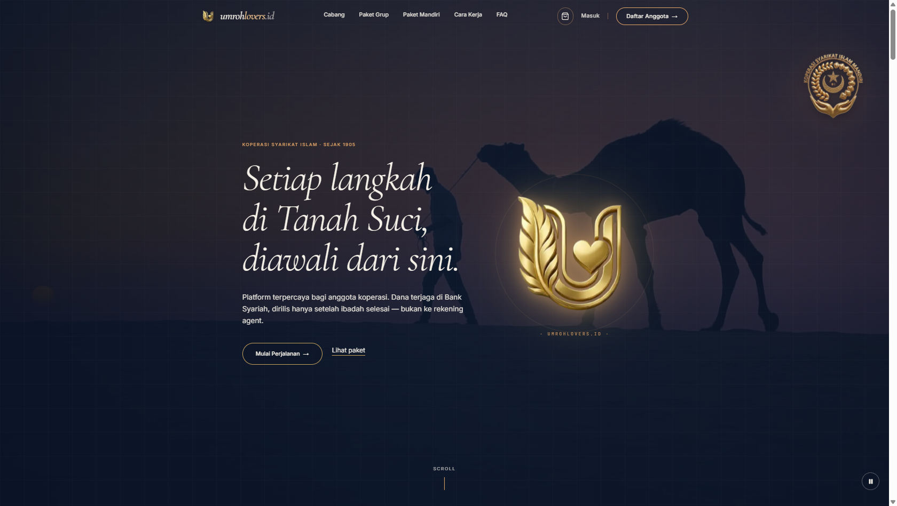

Bagian **Kemitraan** dengan 2 kartu ajakan (Jadi Agen + Buka Cabang):

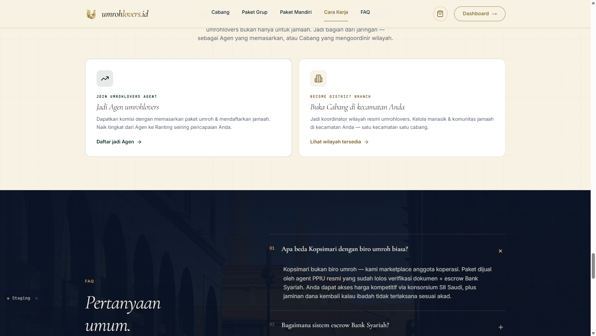

> 📌 Catatan jujur: kalau video pembuka tidak jalan (koneksi lambat), foto tetap muncul — itu normal. Popup login Google kecil mungkin muncul di pojok kanan; abaikan saja kalau tidak mau login.
> ✅ **Status: Berfungsi penuh.**
>
> **Masukan Bapak:** [ ✅ / ⚠️ / ❌ ] — Catatan: ___________________________

#### A.2 — Bursa Paket Grup
1. Klik menu **Paket Grup** di atas.
2. Lihat daftar kartu paket: foto, judul, harga, tanggal berangkat, dan sisa kuota (badge warna). **Data ini nyata.**
3. Ketik di kotak pencarian (misal nama kota berangkat) → hasil langsung tersaring.
4. Klik tombol **Filter** → coba saring berdasar: jenis paket (Umroh Reguler/Plus/Haji Khusus), kota berangkat, periode keberangkatan, dan urutan (harga/tanggal/kuota).
5. Coba ganti tampilan: **Grid** (kartu) → **Daftar** (baris) → **Peta**. Di mode Peta, ada marker per bandara, tombol **Reset** dan **Terdekat** (cari bandara terdekat dari lokasi Bapak), serta pilihan gaya peta.

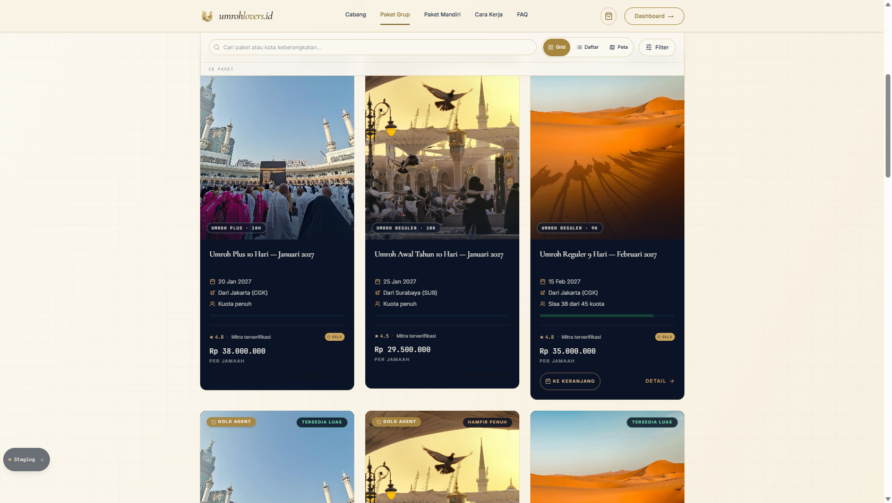

> 📌 Perhatikan: **nama Mitra Travel/perusahaan travel tidak ditampilkan** — hanya label **"Mitra terverifikasi."** Ini disengaja (menjaga anonimitas mitra).
> ✅ **Status: Berfungsi penuh.**
>
> **Masukan Bapak:** [ ✅ / ⚠️ / ❌ ] — Catatan: ___________________________

#### A.3 — Detail Paket & "Booking Sekarang"
1. Klik salah satu kartu paket → halaman detailnya.
2. Lihat: rencana perjalanan harian (itinerary), fasilitas, info hotel, peta lokasi (dengan penanda Masjidil Haram/Nabawi), sisa kuota.
3. **BARU — "Tentang Penyelenggara":** di halaman detail ada bagian etalase Mitra Travel yang tampil **tanpa nama** (anti banting-harga antar travel): galeri foto, slogan, keunggulan (mis. "Hotel bintang 5", "Muthawwif berpengalaman"), badge "Terverifikasi Kopsimari", lisensi PPIU/PIHK, tahun aktif, rating. Ada catatan jelas: *"Nama & kontak travel akan tampil setelah pemesanan & pembayaran (escrow)."*
4. **BARU — penanda promosi:** paket yang sedang dipromosikan mitra punya badge **Platinum / Gold / Silver** dan tampil di urutan atas (lihat juga G.1).
5. Klik **Booking Sekarang** → paket otomatis masuk **keranjang**, lalu Bapak diarahkan ke halaman keranjang.

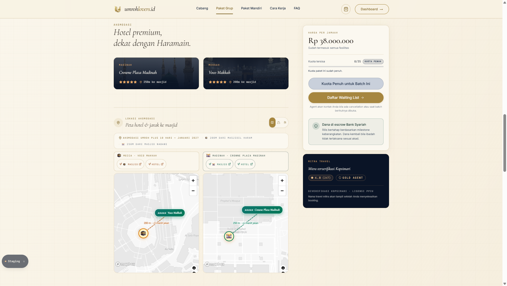

**"Tentang Penyelenggara" — etalase Mitra Travel tampil tanpa nama:**
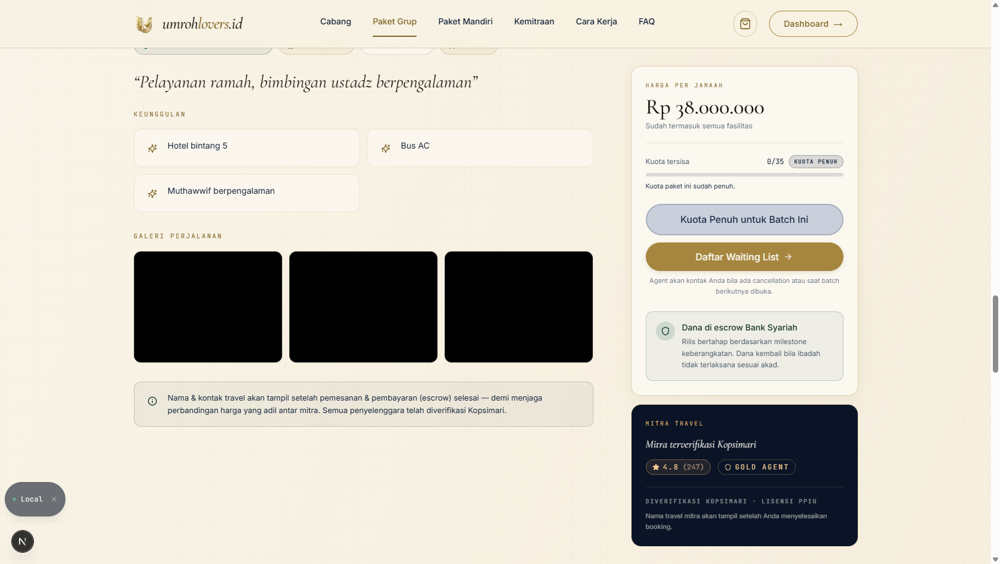

> 📌 Di tahap ini **belum diminta login atau verifikasi identitas** — itu baru diminta saat bayar. (Keputusan desain bersama, 24 Juni 2026.)
> 📌 **Kenapa nama travel disembunyikan?** Supaya sesama travel tidak saling intip harga (persaingan tidak sehat). Identitas penuh dibuka begitu jamaah mulai membayar (escrow terbuka) — keputusan Pak Lukman & Pak Cokie.
> ✅ **Status: Berfungsi penuh** (etalase penyelenggara anonim + badge promosi + masuk keranjang).
>
> **Masukan Bapak:** [ ✅ / ⚠️ / ❌ ] — Catatan: ___________________________

#### A.4 — Susun Paket Mandiri (à la carte)
1. Klik menu **Paket Mandiri.**
2. **Langkah 1:** pilih rentang **tanggal** perjalanan → pilih **penerbangan** → pilih minimal 1 **hotel** yang cocok dengan tanggal. **Visa dipilih otomatis** mengikuti tanggal.
3. **Langkah 2:** pilih layanan tambahan (add-on) bila mau.
4. **Langkah 3 (Review):** lihat ringkasan, pilih Cabang handler (opsional), lalu klik **Konfirmasi.**
5. Saat konfirmasi: kalau belum login Bapak diminta login dulu; kalau sudah login, muncul layar **Akad → Bayar → Selesai.**

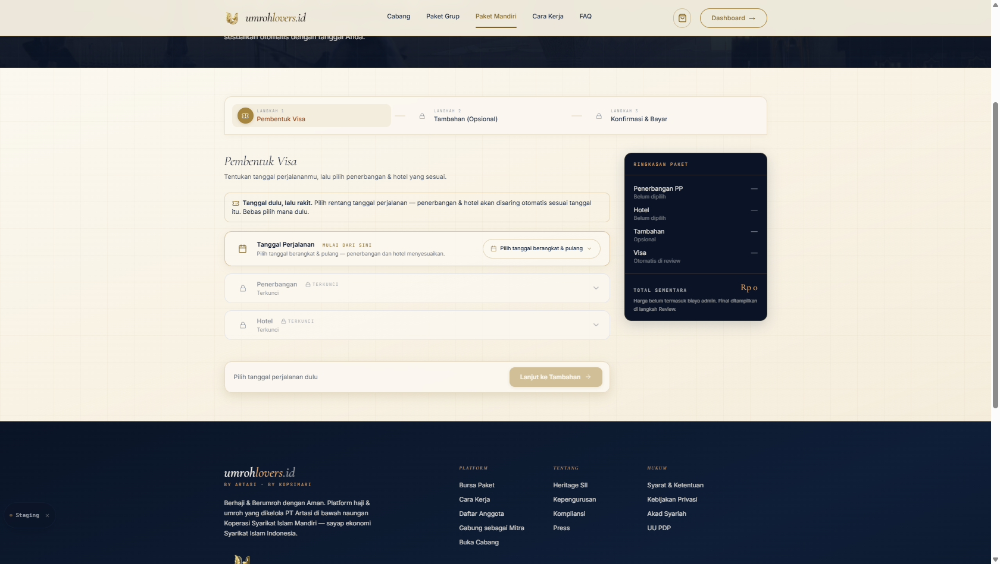

> 🟡 **Status: Demo / Simulasi.** Menyusun item-nya jalan, **tapi pembayaran akhir hanya simulasi** dan item katalognya masih **data contoh** (belum dari mitra Saudi/korporasi asli). Booking hanya bisa diselesaikan oleh **anggota koperasi**.
> ❓ **Pertanyaan untuk Pak Lukman (1):** Aturan **visa otomatis berdasar tanggal** — apakah logikanya sudah sesuai kenyataan supplier Saudi?
>
> **Masukan Bapak:** [ ✅ / ⚠️ / ❌ ] — Catatan: ___________________________

#### A.5 — Jelajah Cabang di Peta
1. Klik menu **Cabang.**
2. Saring dengan pencarian nama atau pilih wilayah/provinsi. Ganti tampilan **Grid / Daftar / Peta.**
3. Di mode **Peta** (peta Indonesia): klik kartu cabang → marker tersorot (dan sebaliknya). Coba tombol **Cabang Terdekat** (pakai lokasi Bapak) dan tombol **arah ke Google Maps.**
4. Klik **Lihat profil** sebuah cabang → halaman profil: statistik, kalender kegiatan/manasik, paket unggulan, lokasi, kontak.

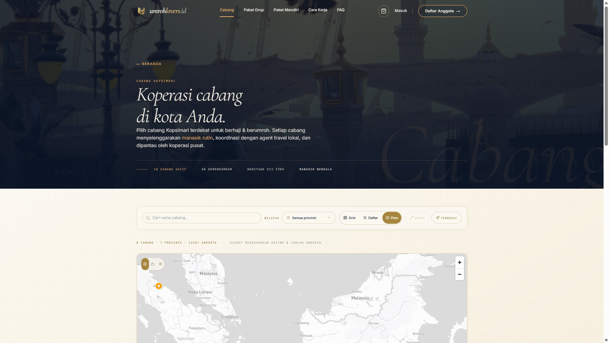

> 📌 Catatan kecil: di bagian bawah halaman Cabang ada ajakan "buka cabang" yang **masih pakai jalur lama (email).** Ini berbeda dari ajakan di beranda yang sudah modern. **Perlu kita samakan** (lihat juga skenario F).
> ✅ **Status: Berfungsi penuh.**
>
> **Masukan Bapak:** [ ✅ / ⚠️ / ❌ ] — Catatan: ___________________________

> 💡 **Catatan tambahan:** Ada juga halaman **Mitra** (vendor Korporasi & Syariah dengan peta) yang bisa dibuka langsung di `…/mitra`, tapi **sengaja tidak dipasang di menu** supaya tidak membingungkan jamaah. Layak ditunjukkan saat presentasi internal. Sebaliknya, halaman **Agen** (`…/agent`) masih **"Segera Hadir"** dan sengaja disembunyikan — jangan dianggap fitur jadi.

---

### B. Sebagai Jamaah — Daftar sampai Pesan Paket

**Akun:** untuk uji ulang dari nol, daftar dengan **email baru**. Untuk lompat ke fitur yang butuh akun jadi, pakai `jamaah-test@kopsimari.test` / `TestQA2026!`.

#### B.1 — Daftar Akun (wizard 2 langkah)
1. Klik **Daftar.** Muncul badge **"1 dari 2".**
2. **Langkah 1 (Data Akun):** isi Nama Lengkap, Email, **No. HP/WhatsApp (wajib)**, Password (min 8 karakter), dan Konfirmasi Password. Klik **Lanjut: Pilih Cabang.**
3. **Langkah 2 (Pilih Cabang):** muncul daftar cabang dengan kotak pencarian. Ada tulisan jelas *"Ini preferensi, bukan ikatan"* dan opsi **"Lewati untuk sekarang."**
4. Pilih satu cabang **atau** lewati → klik tombol daftar.
5. Sistem otomatis mendaftar **dan langsung login** → Bapak masuk ke dashboard jamaah.
6. Di login pertama, muncul **panduan sambutan singkat** ("Empat langkah menuju Tanah Suci") yang menjelaskan fitur utama: verifikasi → tabungan/escrow → pilih paket → jadi agen. Tombol **"Lihat Paket Umroh"** membawa ke etalase paket. Panduan ini hanya muncul **sekali** (login berikutnya langsung ke dashboard).

**Langkah 1 — Data Akun:**
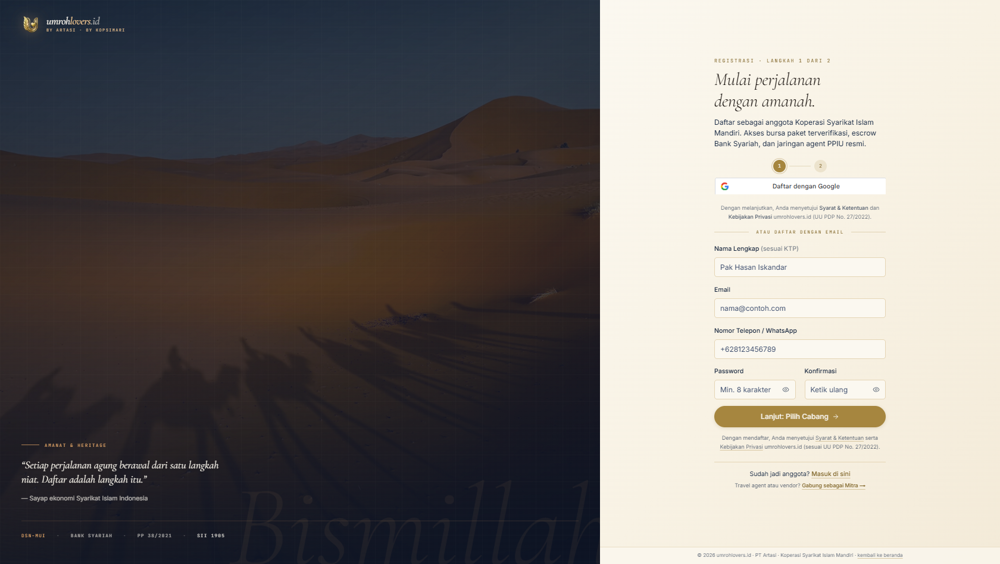

**Langkah 2 — Pilih Cabang (opsional):**
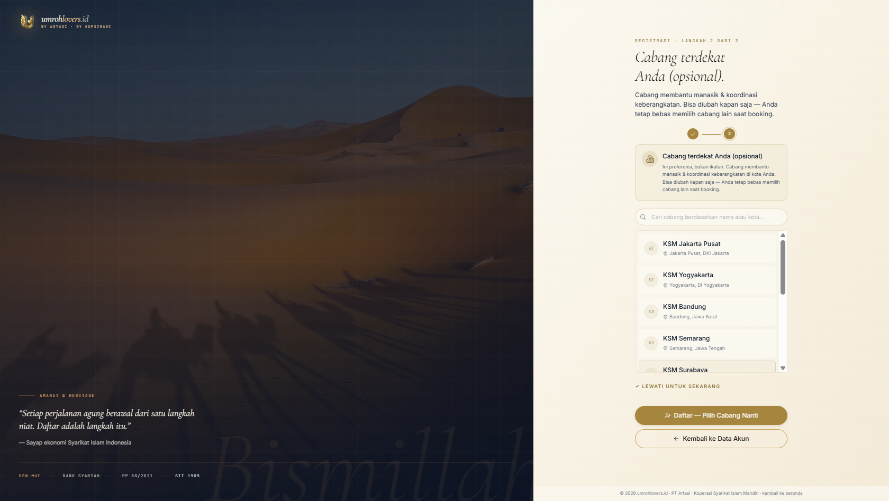

**Setelah daftar — langsung masuk dashboard jamaah:**
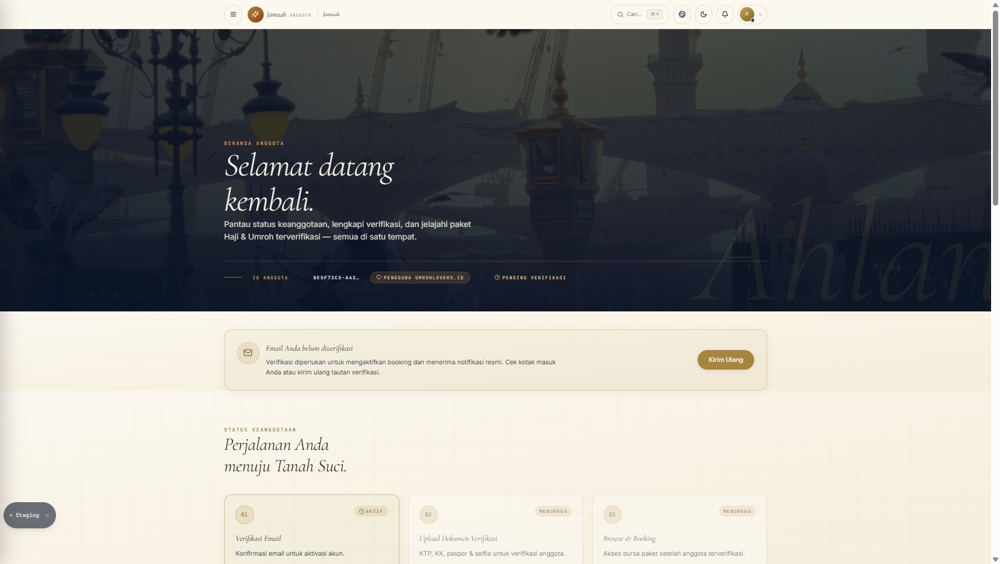

**Panduan sambutan singkat (muncul sekali di login pertama):**
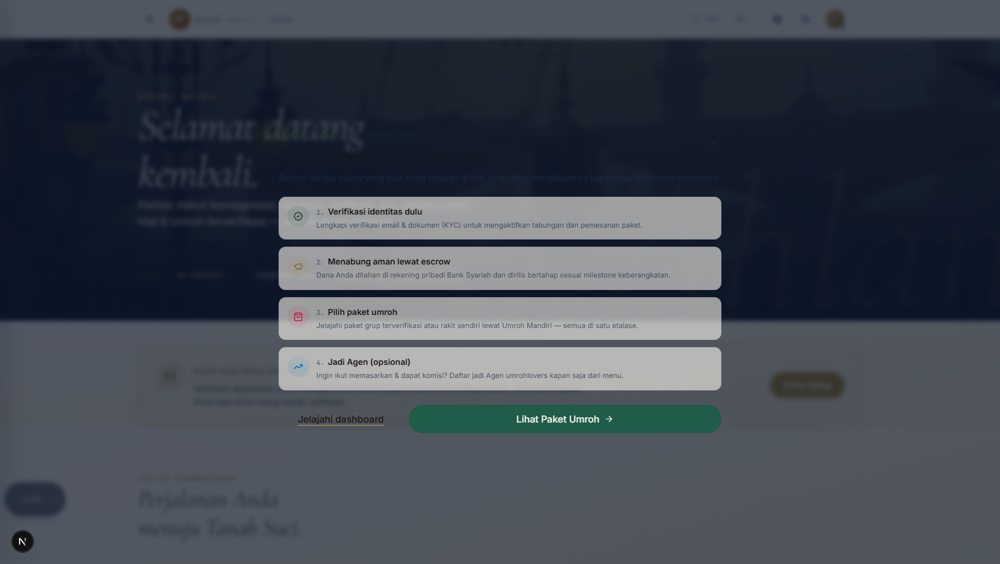

> 📌 No. HP wajib (bagian dari model keagenan baru) **dan harus unik** — kalau No. HP sudah dipakai akun lain, sistem menolak dengan pesan "email atau phone number sudah terdaftar". Pilih Cabang **opsional** — hanya preferensi, bisa diubah kapan saja.
> ✅ **Status: Berfungsi penuh.**
>
> **Masukan Bapak:** [ ✅ / ⚠️ / ❌ ] — Catatan: ___________________________

#### B.2 — Verifikasi Email
1. Di dashboard, ada langkah **"01 Verifikasi Email"** dengan tombol **Kirim Ulang.** Klik tombol itu.
2. Di staging, **token verifikasi langsung muncul di notifikasi pojok kanan atas layar** (kotak hijau "Email verifikasi terkirim (dev mode)" + tokennya). Tidak perlu cek email.

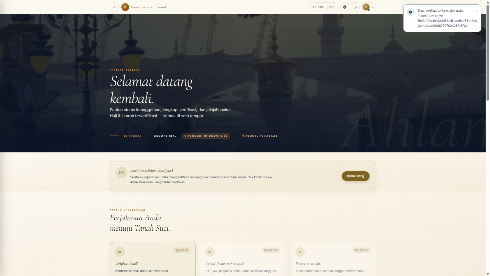

> ✅ **Status: Berfungsi penuh.** Khusus staging, kami sudah set agar **token verifikasi tampil langsung di layar** (mode "console") supaya Bapak tidak perlu menunggu email — jadi tidak ada lagi kendala token "tidak muncul" atau email masuk spam. Di versi produksi nanti, email asli yang dikirim ke kotak masuk jamaah.
>
> **Masukan Bapak:** [ ✅ / ⚠️ / ❌ ] — Catatan: ___________________________

#### B.3 — Upload Dokumen Identitas (KYC)
1. Dari sidebar dashboard, klik **Verifikasi Identitas.**
2. Ada 4 kartu dokumen: **KTP (wajib), Kartu Keluarga (wajib), Paspor (opsional), Selfie+KTP (opsional).**
3. Pada satu kartu klik **Pilih file** (JPG/PNG/PDF, maks 5MB) → klik **Upload** → muncul progress bar → status berubah jadi **"Menunggu Review."**
4. Di atas ada kartu **"Cabang Pilihan Anda"** yang bisa diubah kapan saja.

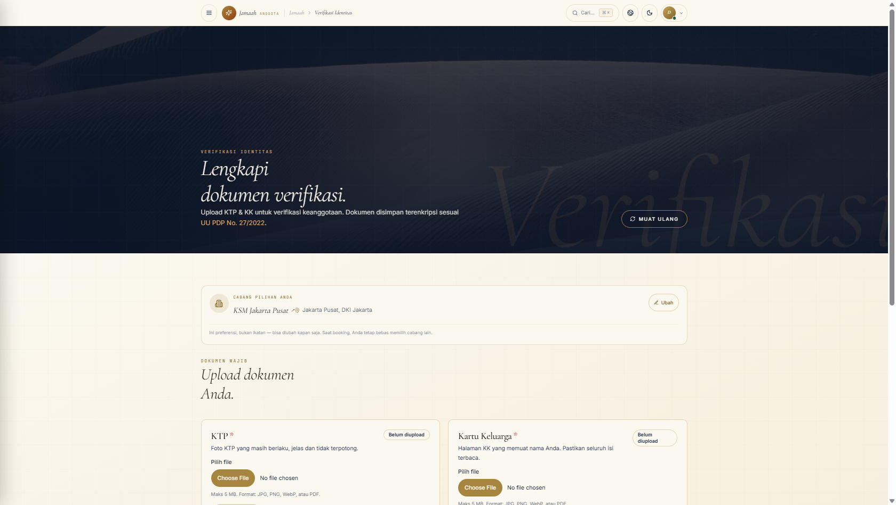

> 📌 **Penting:** status menjadi **"Disetujui" butuh admin meninjau dulu** (lihat skenario H). Jadi kalau Bapak uji sendiri, dokumen akan berhenti di "Menunggu Review" sampai ada admin yang menyetujui.
> ✅ **Status: Berfungsi penuh** (upload). Persetujuan = manual oleh admin.
>
> **Masukan Bapak:** [ ✅ / ⚠️ / ❌ ] — Catatan: ___________________________

#### B.4 — Tabungan Amani (setor, tarik dana & saldo terkunci) — DIPERBARUI
1. Klik menu **Tabungan.** Kalau rekening belum terbuka, ada tombol menuju verifikasi identitas (rekening otomatis terbuka setelah verifikasi).
2. Bila rekening sudah ada: lihat nomor rekening, akad (Wadiah/Mudharabah), saldo, dan progress menuju target.
3. **BARU — dua keping saldo:** di bawah "Saldo Saat Ini" ada dua penanda: **"Saldo bebas"** (hijau — bisa dipakai/ditarik) dan **"Terkunci di escrow"** (kuning, ikon gembok — dana booking aktif yang tidak bisa ditarik). Begitu Bapak memilih paket & membayar, dananya pindah ke "terkunci" — inilah wujud aturan **dana ter-lock saat pilih keberangkatan** (keputusan 1 Juli).
4. Klik **Setor Sekarang** → pilih nominal (500rb/1jt/2,5jt/5jt atau custom) → saldo bertambah & riwayat muncul.
5. **BARU — Tarik Dana:** klik tombol **Tarik Dana** → masukkan nominal → sistem menghitung langsung: **biaya administrasi 10%** dan jumlah yang Bapak terima. Ada catatan **saldo minimal Rp 100.000 harus tersisa**. Konfirmasi → saldo berkurang & riwayat mencatat "Penarikan Dana" lengkap dengan rincian biayanya.
6. Klik **Atur Target** → pilih jenis paket → progress bar menyesuaikan.
7. Perhatikan **riwayat transaksi** kini punya label lengkap: Setoran, **Penarikan Dana**, **Pembayaran Booking** (bila bayar cicilan dari saldo), dan **Refund Booking** (bila ada pembatalan).

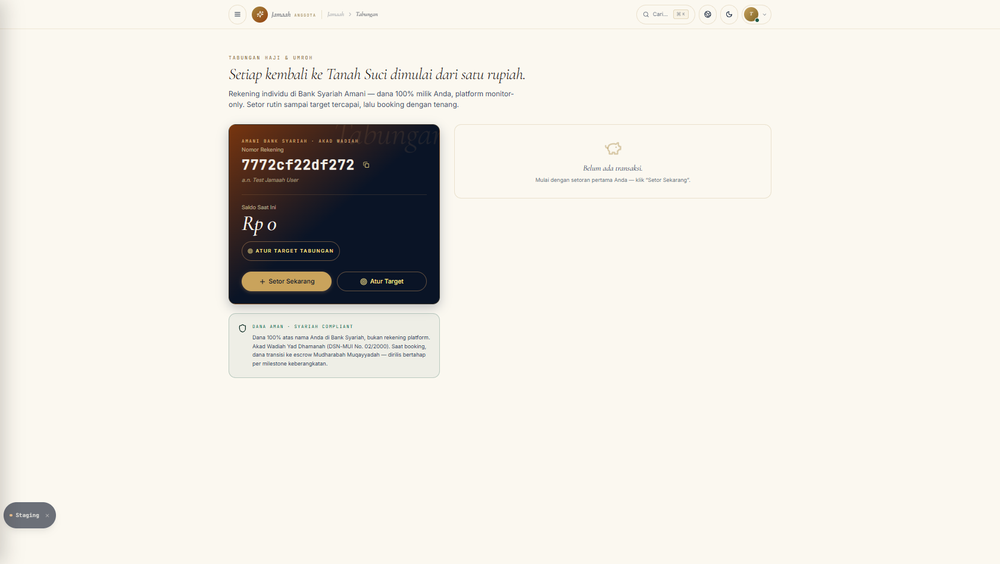

**BARU — saldo bebas vs terkunci + tombol Tarik Dana + riwayat lengkap:**
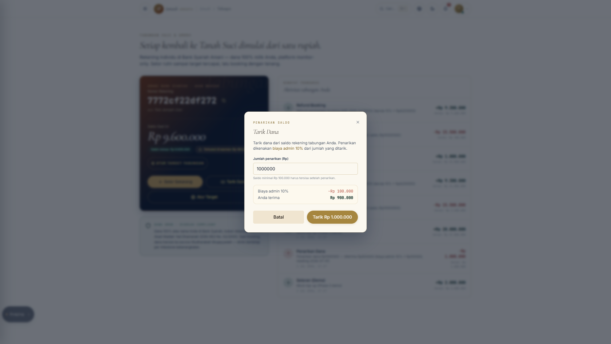

> 📌 Untuk akun baru yang belum lolos KYC, halaman ini menampilkan "Rekening Belum Dibuka — selesaikan verifikasi dulu". Tampilan di atas adalah akun yang rekeningnya sudah aktif.
> 📌 **Inti keputusan (1 Juli):** selama dana **tidak ditarik keluar**, tidak ada potongan apa pun. Tarik keluar = biaya admin **10%**. Dana yang sudah dialokasikan ke booking **terkunci** sampai booking selesai/batal.
> 🟡 **Status: Demo / Simulasi (uang), mekanisme berfungsi penuh.** Setoran/penarikan **bukan transfer sungguhan** (tidak ada VA/QRIS) — Bank Amani belum terhubung. Tapi hitungan biaya, saldo terkunci, dan pencatatan riwayat **sudah bekerja sungguhan**.
>
> **Masukan Bapak:** [ ✅ / ⚠️ / ❌ ] — Catatan: ___________________________

#### B.5 — Pesan Paket Grup + Pembayaran Bertahap (DIPERBARUI)
1. Buka kembali sebuah **Paket Grup** → **Booking Sekarang** → masuk **Keranjang.**
2. Di keranjang: atur jumlah jamaah, tambah catatan, lihat ringkasan total + tulisan *"dana aman di rekening pribadi (escrow)."*
3. Klik **Lanjut Checkout** → masuk layar booking grup: **Review → Akad → Bayar → Selesai.**
4. **BARU — rincian biaya transparan:** di panel Ringkasan Pesanan kini tampil terbuka: **Biaya platform (10%)** dan **Payout ke travel**, plus catatan komisi agen/pelayanan sudah tercakup — **tidak ada biaya tambahan** untuk jamaah. Angka 10% ini yang final (keputusan 1 Juli), diambil langsung dari pengaturan admin (bukan tulisan mati).
5. **Pembayaran Pertama (DP):** di langkah Bayar, sistem minta **pembayaran pertama minimal 25%** dari harga paket (bisa diatur admin). Bapak bisa pilih **bayar minimal**, **bayar lunas sekaligus**, atau **nominal lain**.
6. **BARU — pilih sumber dana:** ada dua **metode pembayaran**: **Transfer (mock)** atau **Bayar dari Saldo** — memakai saldo tabungan Amani Bapak langsung (saldo bebas berkurang, dana pindah ke escrow). Kalau saldo kurang, sistem menolak dengan pesan jelas berapa kurangnya.
7. Klik **Bayar** → **escrow terbuka.** Di layar **Selesai**: progress pembayaran, sisa tagihan, dan — **karena escrow sudah terbuka — nama Mitra Travel muncul** (mis. "PT Multazam Travel Nusantara"). Status booking: **DP Dibayar.**
8. **Lanjut cicilan:** di menu **Booking Saya**, tiap booking yang belum lunas punya bar pembayaran + tombol **Bayar Cicilan** (bisa "lunasi sisa"). Setelah lunas → badge **LUNAS.**

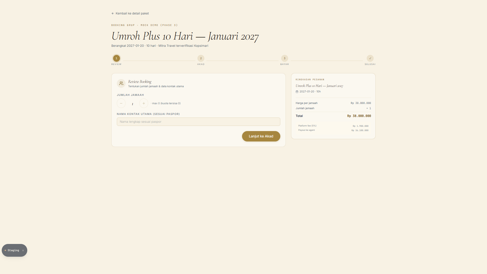

**Langkah Bayar — pilihan nominal + metode Transfer (mock) / Bayar dari Saldo:**
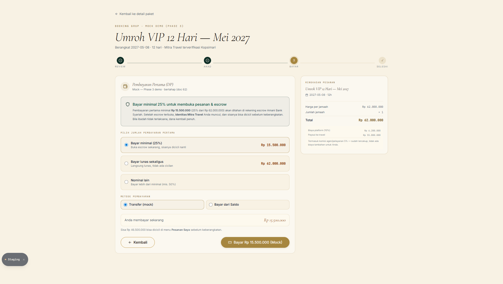

**Setelah bayar — escrow terbuka & nama Mitra Travel muncul:**
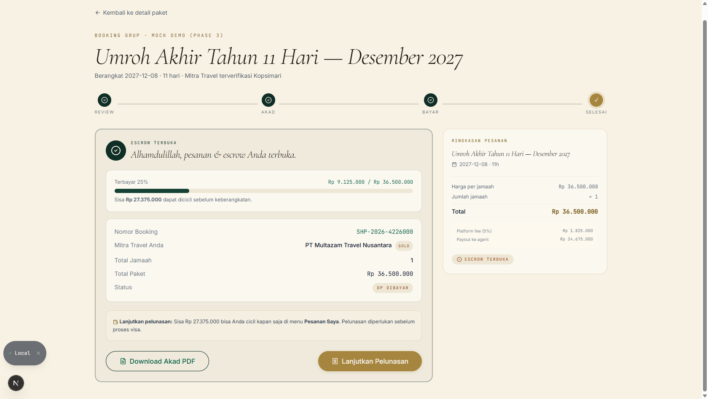

> 📌 **Tenggat pelunasan — FINAL (1 Juli):** pelunasan wajib selesai di **H-30 sebelum keberangkatan**. Kalau sampai H-30 belum lunas, booking **batal otomatis** dan **seluruh dana yang sudah dibayar kembali ke saldo rekening** Bapak (batal ≠ hangus) — bisa langsung dipakai pesan keberangkatan berikutnya. Sistem mengirim pengingat bertahap sebelum tenggat. Dana ke travel baru **dirilis mulai H-14**.
> 🟡 **Status: Berfungsi (pembayaran masih simulasi).** Alur bertahap, rincian fee, bayar-dari-saldo, escrow, reveal travel, cicilan, dan tenggat H-30 **sudah jalan penuh**. Yang masih "Mock" hanya transfer uang asli (menunggu Bank Amani). Akad PDF dokumen contoh. Catatan: **paket Haji Khusus untuk sementara tidak bisa dipesan** — kartunya berbadge **"Booking Segera Hadir"** (fokus pilot = umroh, keputusan 1 Juli).
>
> **Masukan Bapak:** [ ✅ / ⚠️ / ❌ ] — Catatan: ___________________________

#### B.5b — Membatalkan Booking (BARU)
1. Buka **Booking Saya.** Pada booking yang masih tahap awal (belum diproses visa penuh), ada tombol **Batalkan.**
2. Klik → muncul dialog konfirmasi yang menjelaskan konsekuensinya: **denda pembatalan 10% dari harga paket**, sisa dana **kembali ke saldo rekening**, dan pembatalan **tidak dapat diurungkan.**
3. Konfirmasi → status booking berubah **DIBATALKAN**, dan di halaman Tabungan muncul transaksi **"Refund Booking"** dengan rincian dendanya.

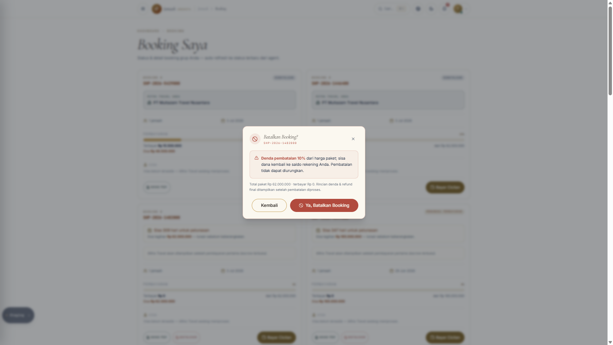

> 📌 **Inti keputusan (1 Juli):** begitu jamaah memilih keberangkatan, dananya **terkunci** — membatalkan secara sukarela kena **denda 10% dari harga paket** (bukan dari yang terbayar). Beda dengan **batal otomatis H-30** (tidak lunas) yang **tanpa denda**. Tombol Batalkan hanya muncul selama booking belum masuk tahap akhir (sudah visa terbit dst. tidak bisa dibatalkan dari sini).
> ✅ **Status: Berfungsi penuh** (dengan uang simulasi).
>
> **Masukan Bapak:** [ ✅ / ⚠️ / ❌ ] — Catatan: ___________________________

#### B.6 — Lihat Jadwal Manasik
1. Klik menu **Manasik.** Saring **Mendatang** / **Semua.**
2. Lihat kartu sesi: cabang penyelenggara, judul, jadwal, lokasi, pembimbing (ustadz), status.

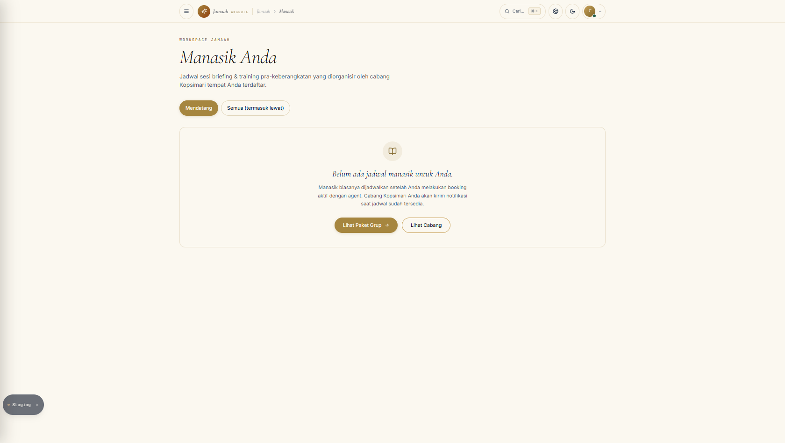

> ⚙️ **Status: Sebagian.** Halaman ini **hanya menampilkan** sesi yang jamaah sudah terdaftar. **Belum ada tombol "Daftar/RSVP"** bagi jamaah untuk mendaftar manasik sendiri. Saat ini pendaftaran terjadi dari sisi Cabang / lewat booking.
> ❓ **Pertanyaan:** Apakah jamaah sebaiknya bisa **mendaftar manasik sendiri**, atau cukup **didaftarkan oleh Cabang**?
>
> **Masukan Bapak:** [ ✅ / ⚠️ / ❌ ] — Catatan: ___________________________

#### B.7 — Profil Saya + Preferensi Promosi (BARU)
1. Klik menu **Profil.** Lihat: avatar inisial, peran, tier keanggotaan, ID pengguna, status email & dokumen.
2. **BARU — "Preferensi Notifikasi & Promosi":** ada 2 tombol geser (toggle): **Notifikasi promo dalam aplikasi** dan **Email promosi.** Ada catatan kepatuhan UU PDP: *"Persetujuan promosi bersifat sukarela dan dapat dicabut kapan saja."* Coba nyalakan/matikan — tersimpan otomatis.
3. **BARU — Lonceng notifikasi** (ikon di pojok kanan atas): menampilkan notifikasi, termasuk **promosi paket** (Platinum/Gold/Silver) yang dikirim mitra. Klik notifikasi promo → langsung ke halaman paketnya.

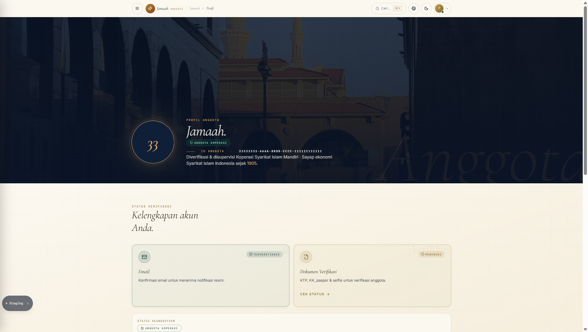

**Preferensi Notifikasi & Promosi (opt-in, catatan UU PDP):**
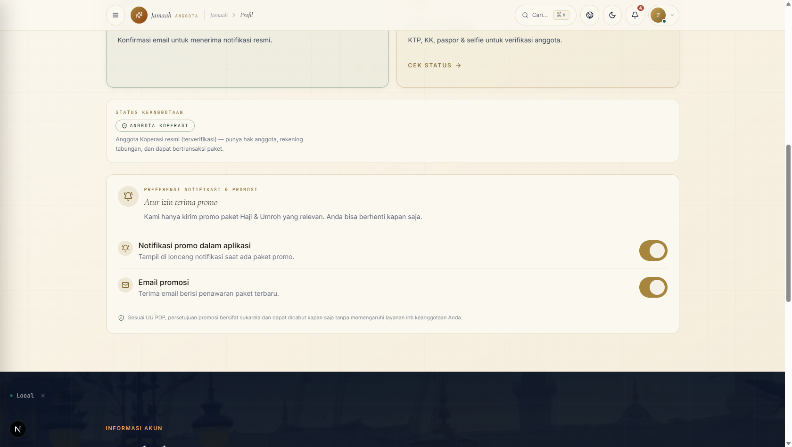

**Lonceng notifikasi — promosi paket masuk ke sini:**
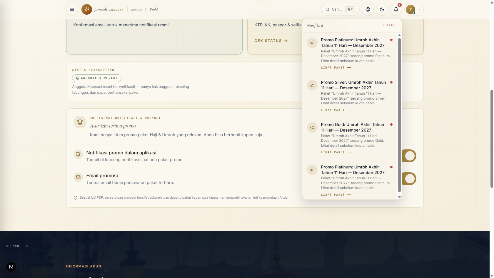

> ✅ **Status: Berfungsi** (preferensi promosi + lonceng notifikasi). Promosi hanya dikirim ke jamaah yang **setuju** (opt-in), lewat **dalam-aplikasi + email** (bukan WhatsApp massal — sesuai kesepakatan untuk hindari spam/pelanggaran data).
> ⚙️ Edit data profil (nama/alamat/telepon) masih **baca-saja** ("Segera Hadir"), menunggu finalisasi struktur data anggota.
>
> **Masukan Bapak:** [ ✅ / ⚠️ / ❌ ] — Catatan: ___________________________

#### B.8 — Unduh Visa (BARU)
1. Setelah Mitra Travel mengunggah visa (lihat G.1), jamaah mendapat **notifikasi "Visa Anda Siap"** di lonceng.
2. Buka menu **Booking Saya** → pada booking terkait, di bagian **Visa**:
   - Kalau booking **sudah lunas** → tombol **Unduh Visa** aktif (visa berupa **dokumen PDF**, e-Visa Saudi).
   - Kalau **belum lunas** → tertulis **"Lunasi untuk unduh"** + tombol **Bayar sekarang** (visa ditahan sampai pelunasan).
   - Kalau mitra belum unggah → "Visa belum tersedia — Mitra Travel sedang memproses."

**Unduh Visa — aktif kalau lunas, terkunci "Lunasi untuk unduh" kalau belum:**
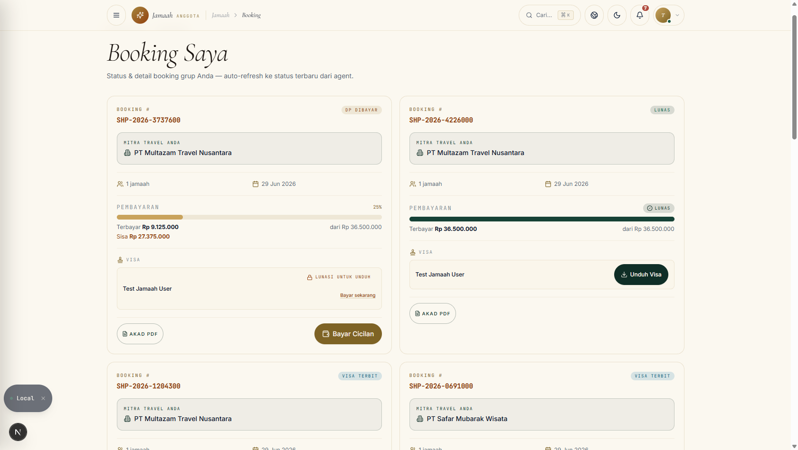

> 🟡 **Status: Berfungsi (alur visa nyata, pembayaran simulasi).** Unggah PDF oleh mitra, notifikasi, dan **penguncian unduh sampai lunas** sudah jalan. Setiap akses visa dicatat untuk kepatuhan UU PDP.
> 📌 **Inti keputusan (Pak Lukman/Cokie):** visa = dokumen PDF (bukan tempel paspor). **Wajib lunas dulu** baru bisa unduh. Beberapa hal masih dibahas Pak Lukman: batas waktu pelunasan setelah "visa siap", dan mekanisme bila visa gagal.
> ❓ **Pertanyaan:** Apakah jamaah cukup mengunduh sendiri dari platform, atau tetap perlu dikirim via WhatsApp juga?
>
> **Masukan Bapak:** [ ✅ / ⚠️ / ❌ ] — Catatan: ___________________________

---

### C. Sebagai Jamaah yang Ingin Jadi Agen

**Akun:** daftar jamaah baru, atau pakai akun jamaah yang belum jadi agen / `TestQA2026!`

1. Dari dashboard jamaah (atau dari beranda → kartu **"Jadi Agen UmrohLovers"**), buka halaman **Jadi Agen.**
2. Lihat badge **"Biaya pendaftaran Rp 1.000.000."**
3. **BARU — isi data diri dulu:** formulir meminta **No. KTP (16 digit)** dan **No. HP**, plus pilihan *"Saya mendaftar lewat jalur Syarikat Islam"* (menentukan pembagian hasil ke SI). Data ini nanti dipakai bank untuk verifikasi (KYC Amani).
4. Klik **Ajukan jadi Agen** → status jadi **"Selesaikan pembayaran Rp 1.000.000"** dengan tombol **Bayar.**
5. Klik **Bayar Rp 1.000.000 (mock)** → **langsung AKTIF!** Status berubah jadi **"Anda sudah jadi Agen!"** + tombol **Buka Portal Agen** — **tanpa menunggu persetujuan admin** (keputusan 1 Juli: data lengkap + bayar = aktif otomatis; admin hanya memantau, dan bisa menindak kalau ada kecurangan).
6. Rekening bank mock Agen juga **otomatis terbuka** saat aktif (semua peran punya rekening — keputusan 1 Juli).

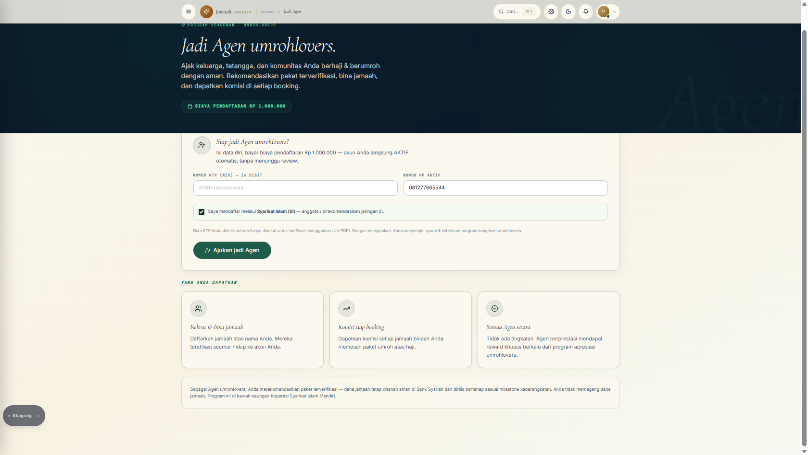

> 📌 Biaya Rp 1.000.000 itu terbagi: **Rp 500rb kit agen** (starter kit), sisanya profit platform — **dibagi 70:30 dengan Syarikat Islam** bila daftar lewat jalur SI. Semua tercatat otomatis di buku pendapatan platform (lihat H.4). "Agen" = sales perorangan, **bukan** Mitra Travel. Upgrade mempertahankan akun lama (riwayat tidak hilang).
> 🟡 **Status: Berfungsi penuh — pembayaran masih simulasi** ("mock"). Alur isi data → bayar → langsung aktif + rekening terbuka sudah jalan end-to-end.
>
> **Masukan Bapak:** [ ✅ / ⚠️ / ❌ ] — Catatan: ___________________________

---

### D. Sebagai Agen (sales perekrut jamaah)

**Akun:** `sales-test@kopsimari.test` (Agen) dan `g2-agen-ringan@kopsimari.test` (Agen yang dapat jamaah & komisi) / `TestQA2026!`

1. Login sebagai Agen → otomatis masuk **Portal Agen.**
2. Lihat kartu **"Komisi Anda"** — **5% flat** per booking, sama untuk semua Agen — + link **referral** (untuk merekrut jamaah), jumlah klik, dan **riwayat komisi.**
3. **BARU — Rapot Agen:** di bawah statistik ada bagian **"Rapot Agen"** — peringkat **10 besar Agen bulan berjalan** (nama, kode, jumlah booking, total komisi), dengan baris Bapak sendiri tersorot + tulisan **"Peringkat Anda: #X dari Y agen."** Inilah dasar pemberian **reward top performer** berkala (analogi "rapot driver" — arahan Pak Lukman).
4. Coba salin **link referral** dan bayangkan membagikannya ke calon jamaah.
5. Login dengan `g2-agen-ringan@…` untuk melihat sisi Agen yang **sudah menerima jamaah** (notifikasi agen pendamping) dan **komisi**-nya.

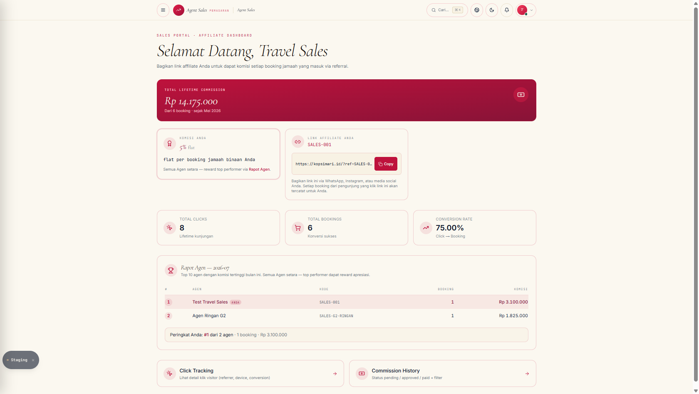

**BARU — Rapot Agen (peringkat bulanan, dasar reward):**

> 📌 Komisi Agen **flat 5% — semua Agen setara**, tanpa tingkatan Bronze/Silver/Gold. Agen berprestasi (terlihat dari Rapot) mendapat **reward khusus berkala** di luar komisi. Persentase bisa diatur admin kapan saja.
> 📌 **Anti-fraud:** untuk jamaah yang mendaftar langsung (tanpa diajak Agen), sistem menetapkan **Agen pendamping otomatis SETELAH dana masuk rekening escrow** — bukan di awal — supaya tidak ada transaksi liar di luar platform.
> ✅ **Status: Berfungsi penuh** (komisi flat + rapot + referral + pendamping otomatis).
>
> **Masukan Bapak:** [ ✅ / ⚠️ / ❌ ] — Catatan: ___________________________

---

### E. Sebagai Ranting (Agen prestasi, koordinator kelurahan)

**Akun:** `ranting-agent-test@kopsimari.test` / `TestQA2026!`

1. Login → masuk Portal Agen (Ranting menggunakan portal yang sama dengan Agen, dengan jenjang lebih tinggi).
2. Perhatikan posisi **Ranting** = Agen berprestasi yang ditunjuk sebagai koordinator **1 kelurahan**.
3. Cek apakah informasi teritori (kelurahan binaan) dan jenjang komisinya tampil sesuai harapan.

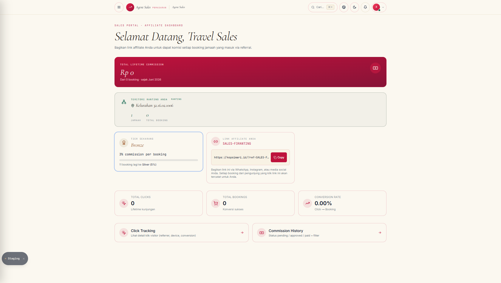

> ⚙️ **Status: Sebagian.** Konsep Ranting (1 per kelurahan) baru dalam tahap awal penataan. **Mohon perhatian khusus Pak Lukman:** apakah pembagian teritori & wewenang Ranting sudah sesuai rencana keagenan?
>
> **Masukan Bapak:** [ ✅ / ⚠️ / ❌ ] — Catatan: ___________________________

---

### F. Sebagai Cabang (koordinator kecamatan)

**Akun:** `brand-owner-test@kopsimari.test` (Cabang aktif) dan `cabang-claim-test-1782405517@kopsimari.test` (hasil klaim) / `TestQA2026!`

#### F.1 — Klaim Kecamatan (Buka Cabang) — DIPERBARUI BESAR
1. Tanpa login dulu, buka beranda → kartu **"Buka Cabang di kecamatan Anda"** → halaman **Daftar Cabang.**
2. **BARU — tarif per ZONA (bukan lagi flat Rp 10 juta):** biaya pendaftaran kini mengikuti **zona kecamatan**, dihitung dari **rasio penduduk Muslim** per kecamatan (data BPS — 94% lebih kecamatan Indonesia sudah terpetakan, termasuk pemekaran Papua). Zona 1 (mayoritas Muslim terbesar = pasar terbesar) termahal, turun bertahap sampai Zona 4. Angka tiap zona bisa diatur admin.
3. **BARU — peta sebaran Muslim:** pilih **Provinsi → Kabupaten/Kota** → peta menampilkan **warna sebaran penduduk Muslim per kecamatan** (choropleth) — calon koordinator bisa menimbang pasar sebelum memilih wilayah. Arahkan kursor ke kecamatan → muncul **tarif zonanya**. Ada juga tombol **layar penuh (fullscreen)** dengan panel kecamatan tetap bisa dipilih.
4. Daftar **kecamatan** menampilkan badge hijau **"Tersedia"** atau abu **"Sudah Terisi"** + **badge zona & tarifnya.**
5. Klik **Klaim** pada kecamatan tersedia → diminta login → dialog konfirmasi menampilkan **tarif sesuai zona** kecamatan itu.
6. **BARU — verifikasi kelayakan:** di dialog klaim ada panel opsional **"Verifikasi Kelayakan"**: unggah **foto tempat** (rumah/kantor calon cabang) dan klik **"Gunakan Lokasi Saya"** untuk melampirkan **titik koordinat**. Ini membantu admin menilai kelayakan tempat (syarat 1 Juli: cukup tempat layak + spanduk — tidak wajib ruko).
7. Konfirmasi → **"Menunggu Pembayaran"** → klik **Bayar (Mock)** → status jadi **"Menunggu review admin."**

**Halaman Daftar Cabang (pilih wilayah):**
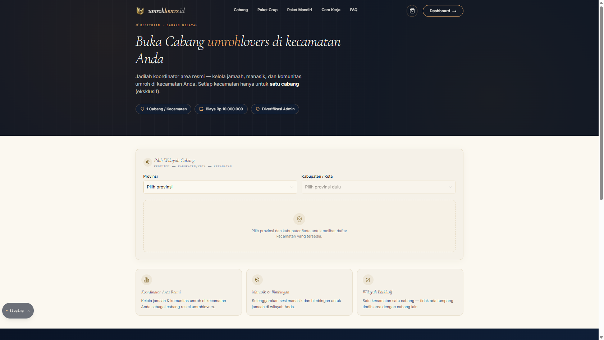

**BARU — peta sebaran penduduk Muslim + tarif per zona:**
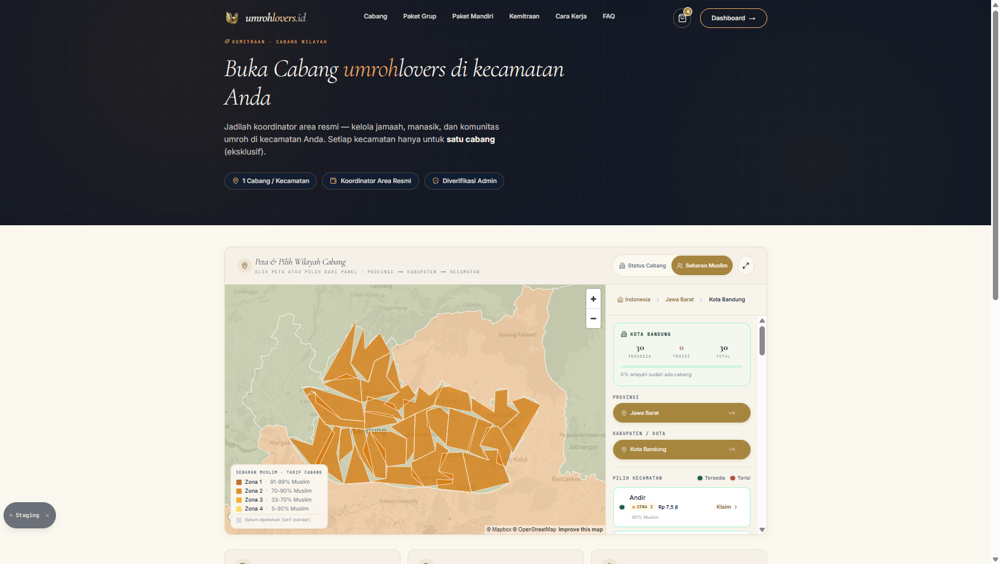

**BARU — dialog klaim: foto tempat + koordinat (verifikasi kelayakan):**
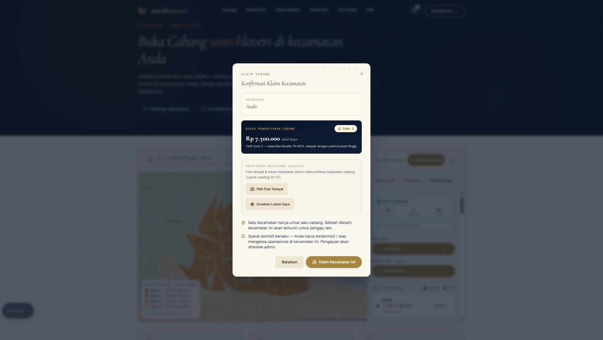

> 🟡 **Status: Berfungsi penuh — pembayaran simulasi.** Zonasi tarif, peta sebaran, klaim, foto+koordinat semuanya jalan sungguhan; hanya uang yang "Mock". Aktivasi final tetap lewat persetujuan admin (beda dengan Agen yang auto-aktif — Cabang **tetap direview manusia** karena menyangkut kelayakan tempat, keputusan 1 Juli).
> 📌 **Pewarisan:** klaim Cabang **permanen & tidak diperjualbelikan** — tapi bila pemilik wafat, admin bisa **memindahkan kepemilikan ke ahli waris** (tercatat di log audit). Lihat H.2.
>
> **Masukan Bapak:** [ ✅ / ⚠️ / ❌ ] — Catatan: ___________________________

#### F.2 — Dashboard Cabang
1. Login sebagai `brand-owner-test@…` → masuk **Dashboard Cabang.**
2. Telusuri: profil cabang, jamaah binaan, paket unggulan, dan **kelola jadwal Manasik** (buat / batalkan / jadwalkan ulang / tandai kehadiran).
3. Coba buat satu sesi manasik dan lihat hasilnya di kalender.
4. Buka menu **Teritori Saya** → lihat ringkasan agen di bawah naungan cabang + jamaah di teritori + total komisi.

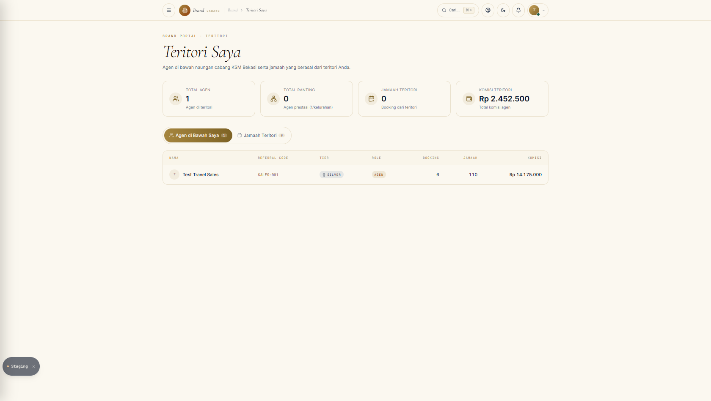

> ✅ **Status: Berfungsi penuh** (manasik full kelola dari sisi Cabang + lihat teritori).
> ❓ **Pertanyaan untuk Pak Lukman (1 — penting):** **Apakah Cabang boleh berjualan paket sendiri, atau hanya koordinasi?** Saat ini kami set **koordinasi-saja** (default), karena khawatir benturan kepentingan dengan Agen di bawah Cabang. Mohon konfirmasi arah yang diinginkan.
>
> **Masukan Bapak:** [ ✅ / ⚠️ / ❌ ] — Catatan: ___________________________

---

### G. Sebagai Mitra Travel, Mitra Korporasi & Mitra Syariah

#### G.0 — Mendaftar jadi Mitra (formulir publik Gabung Mitra) — BARU
**Akun:** _tidak perlu login — pakai email baru._
1. Buka **https://staging.umrohlovers.id/gabung-mitra** (atau dari bagian Kemitraan di beranda).
2. Pilih tipe: **Agent Travel (PPIU/PIHK)**, **Mitra Korporasi**, atau **Mitra Syariah.**
3. Formulir kini berupa **2 langkah** (tidak lagi satu halaman panjang): **Langkah 1 — Data Perusahaan** (nama, ID SISKOPATUH untuk travel, kota, alamat, telepon) → **Langkah 2 — Akun & Persetujuan** (nama PIC, email, password).
4. **BARU — persetujuan S&K fee (khusus Mitra Travel):** sebelum tombol kirim ada kotak centang: *"Saya menyetujui Syarat & Ketentuan Kemitraan, termasuk fee platform 10% dari harga paket… Kami bebas menentukan harga tayang paket kami sendiri."* **Wajib dicentang** — tanpa ini pengajuan ditolak. Persetujuan **tercatat elektronik** (tanggal + persentase saat itu) sebagai bukti perjanjian — kalau nanti fee global berubah, angka yang disepakati mitra lama tidak ikut bergeser.
5. Kirim → **"Pengajuan diterima"** → admin memverifikasi 1-3 hari kerja → akun mitra aktif.

**Formulir Gabung Mitra 2 langkah + persetujuan S&K fee platform:**
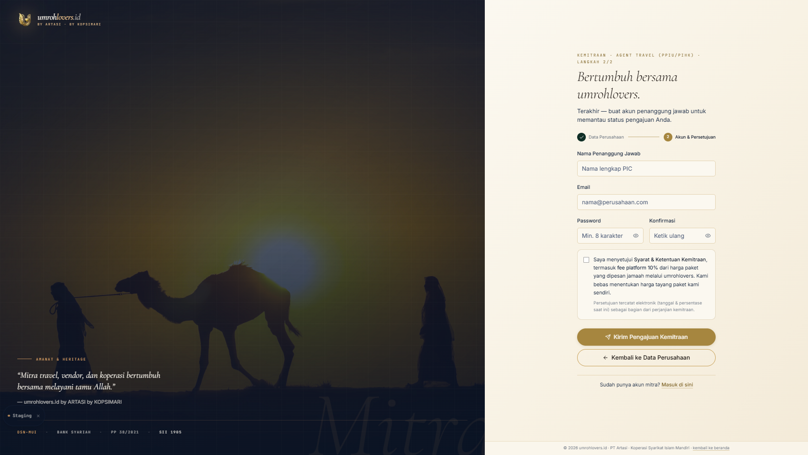

> ✅ **Status: Berfungsi penuh.** Ini jalur resmi masuknya travel/vendor baru — pengajuan → review admin → aktif. Bukti persetujuan fee tampil juga di panel admin (tanggal + % yang disetujui).
>
> **Masukan Bapak:** [ ✅ / ⚠️ / ❌ ] — Catatan: ___________________________

#### G.1 — Mitra Travel (penyedia paket grup, PPIU)
**Akun:** `agent-test@kopsimari.test` / `TestQA2026!`
1. Login → **Portal Mitra Travel.**
2. Lihat profil mitra, daftar paket grup yang disuplai, dan indikator kinerja (KPI). Di publik, **nama mitra disembunyikan** (hanya "Mitra terverifikasi" + ID).
3. **BARU — Profil lengkap (Etalase Marketing):** di menu **Profil Travel**:
   - **Nomor Akun Mitra** (mis. `MT-2026-0001`) — ID resmi pengganti nama di platform. Terbit setelah admin menyetujui.
   - **Rekening perusahaan** (untuk pencairan dari escrow) — disimpan **terenkripsi**, hanya digit terakhir yang tampil.
   - **PIC / narahubung** + **kantor cabang** (alamat tambahan).
   - **Etalase Marketing:** isi **slogan**, **keunggulan** (daftar poin), dan **galeri foto** (maks. 8). Inilah yang muncul **anonim** di "Tentang Penyelenggara" pada detail paket (lihat A.3) — diingatkan agar **tidak menyebut nama travel** di teksnya.
4. **BARU — Booking Masuk:** menu **Booking Masuk** menampilkan jamaah yang memesan paket mitra. Data identitas jamaah (nama, NIK, paspor, kontak) **baru terbuka setelah escrow dibuka** (jamaah sudah bayar pertama) — sebelum itu terkunci (anti-fraud). Ada banner kerahasiaan UU PDP.
5. **BARU — Promosikan Paket:** di daftar paket, tombol **Promosikan** pada paket yang sudah tayang → pilih tier: **Platinum Rp 15jt** (tampil di halaman depan, urutan teratas), **Gold Rp 10jt** (setelah Platinum), **Silver Rp 5jt** (badge khusus). Begitu dibeli, paket naik ke urutan atas **dan** jamaah yang setuju promo otomatis dapat notifikasi. Harga bisa diatur admin. (Pembayaran promo masih simulasi.)
6. **BARU — Unggah Visa:** di **Booking Masuk → detail booking** (untuk jamaah yang datanya sudah terbuka), tombol **Unggah Visa PDF** per jamaah → status jadi **"Visa Siap"**, dan jamaah otomatis dapat notifikasi. Jamaah baru bisa **mengunduh** visanya setelah **lunas** (lihat B.8).

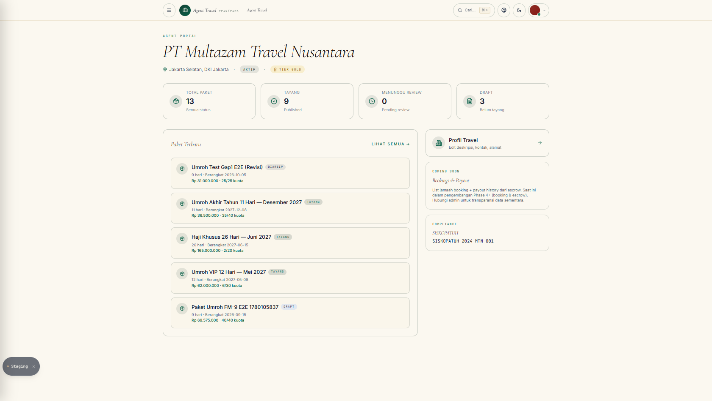

**Promosikan paket — pilih tier Platinum / Gold / Silver:**
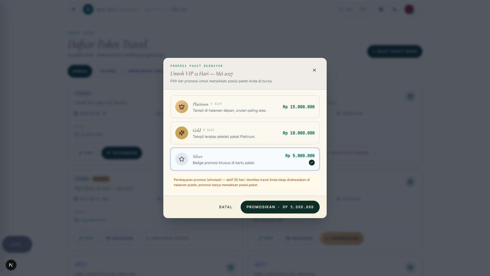

**Unggah Visa PDF per jamaah (di detail Booking Masuk):**
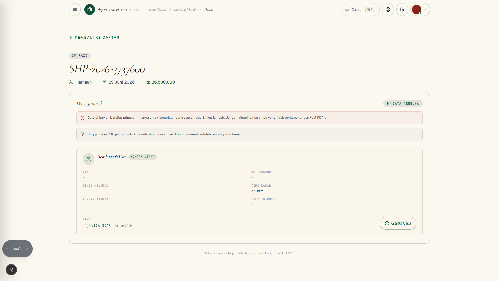

7. **BARU — dana rilis tercatat di rekening mitra:** setiap kali escrow dirilis per milestone (visa/tiket/berangkat/pulang, mulai **H-14**), jumlahnya otomatis **dikredit ke rekening mock mitra** — mitra bisa melihat dananya masuk, bukan hanya angka di buku escrow.
8. **BARU — Kasbon Amani (talangan):** di dashboard ada kartu **"Kasbon Amani (Bridging)"** — untuk travel yang butuh dana lebih awal dari H-14, bisa mengajukan talangan ke Bank Amani (margin 2-3%/bulan, hingga ±30% nilai paket; **urusan travel dengan bank, di luar platform**). Tombolnya masih nonaktif berbadge **"Segera — menunggu Amani live."**

**BARU — kartu Kasbon Amani di dashboard mitra:**
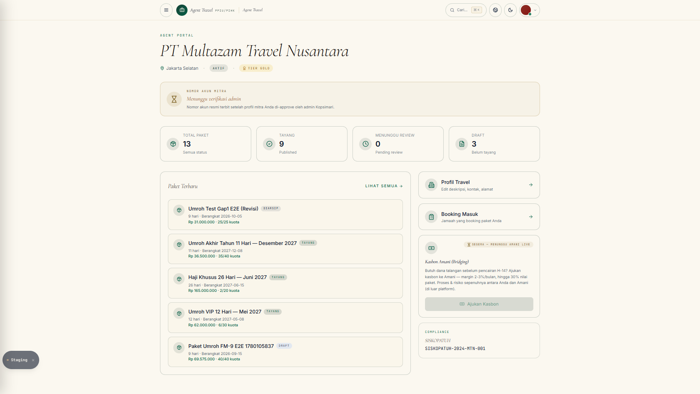

> ✅ **Status: Berfungsi** — kelola paket & profil, etalase marketing, lihat booking + data jamaah (escrow-gated), promosi berbayar, unggah visa, dana rilis masuk rekening mock. Yang masih simulasi: **pembayaran promo**, **pencairan uang asli**, dan **kasbon** (menunggu Bank Amani).
> 📌 Pendapatan promosi **100% untuk platform** (tidak dibagi ke cabang/agen) — keputusan Pak Lukman. Fee platform **10%** disetujui mitra lewat S&K elektronik saat mendaftar (lihat G.0).
>
> **Masukan Bapak:** [ ✅ / ⚠️ / ❌ ] — Catatan: ___________________________

#### G.2 — Mitra Korporasi (vendor Indonesia)
**Akun:** `korporasi-test@kopsimari.test` / `TestQA2026!`
1. Login → **Portal Mitra Korporasi** (vendor pendukung: handling, penerbangan, vaksin, asuransi).
2. Lihat profil vendor: rating, kontak, alamat, deskripsi, dan tombol **Edit Profil.**

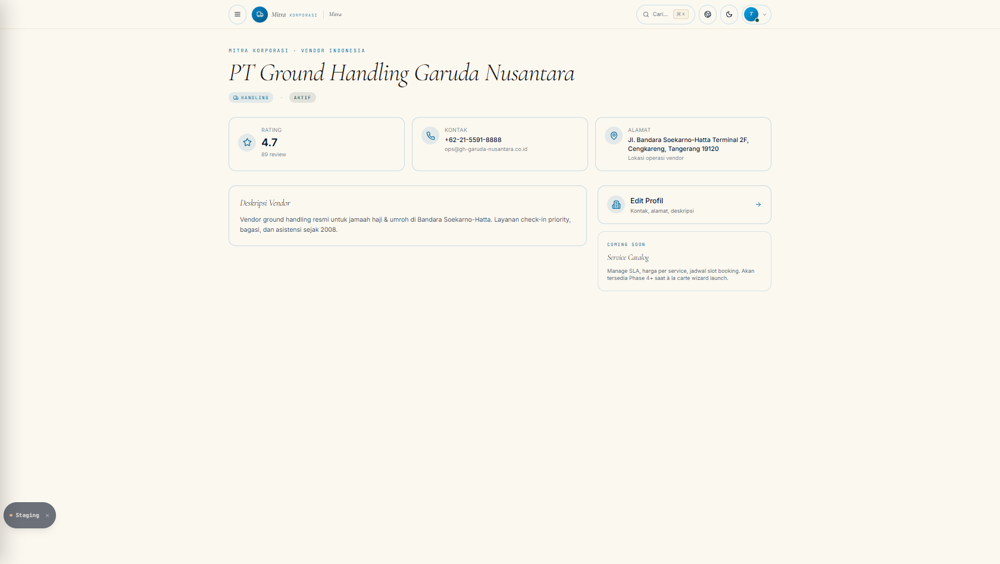

> 🟡 **Status: Demo.** Profil vendor sudah jalan. **"Service Catalog"** (kelola item layanan yang muncul di Paket Mandiri: SLA, harga per service, jadwal slot) masih bertanda **"Coming Soon — Phase 4+"** menunggu pengembangan à la carte wizard.
> 📌 Mitra Syariah (vendor Saudi) memakai portal serupa dengan peta Saudi — login `syariah-test@kopsimari.test`.
>
> **Masukan Bapak:** [ ✅ / ⚠️ / ❌ ] — Catatan: ___________________________

#### G.3 — Mitra Syariah (vendor Saudi)
**Akun:** `syariah-test@kopsimari.test` / `TestQA2026!`
1. Login → **Portal Mitra Syariah** (hotel Mekkah/Madinah, visa, catering, transport, muthawwif).
2. Lihat/kelola item layanan untuk Paket Mandiri; perhatikan tampilan peta Saudi dengan landmark.

> 🟡 **Status: Demo.** Sama seperti di atas — item masih data contoh.
>
> **Masukan Bapak:** [ ✅ / ⚠️ / ❌ ] — Catatan: ___________________________

---

### H. Sebagai Admin — Persetujuan & Moderasi

**Akun:** `super-admin-test@kopsimari.test` (akses penuh), `admin-koperasi-test@kopsimari.test` (moderasi), `finance-test@kopsimari.test` (keuangan) / `TestQA2026!`

> 💡 Skenario ini melengkapi B–G: di sinilah Bapak **menyetujui** apa yang tadi diajukan jamaah/agen/cabang, sehingga uji coba jadi lengkap dari ujung ke ujung.

#### H.1 — Setujui Dokumen KYC
1. Login admin → buka panel **KYC.**
2. Lihat papan **Kanban** (kolom: Menunggu / Perlu Upload Ulang / Disetujui / Ditolak). Bisa **klik nama file** untuk melihat dokumennya.
3. **Setujui** dokumen jamaah yang tadi Bapak upload (di skenario B.3). Lalu login lagi sebagai jamaah → status berubah jadi **"Disetujui."**

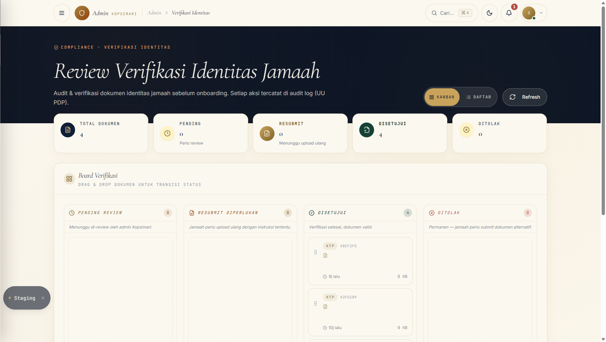

> ✅ **Status: Berfungsi penuh.**
>
> **Masukan Bapak:** [ ✅ / ⚠️ / ❌ ] — Catatan: ___________________________

#### H.2 — Pantau Agen & Setujui "Buka Cabang" — DIPERBARUI
1. **Agen kini AKTIF OTOMATIS** (keputusan 1 Juli) — panel **Persetujuan Peran / Role Upgrades** berubah fungsi jadi **pemantauan**: admin melihat siapa saja yang mendaftar + status bayarnya, tanpa perlu klik setujui satu-satu. Kecurangan ditindak lewat penangguhan akun.
2. Buka panel **Pengajuan Cabang** → setiap kartu kini menampilkan **foto tempat** (klik untuk memperbesar) + tautan **"Lihat di Google Maps"** (dari koordinat yang dikirim pemohon) + **tarif zona** yang dibayar → nilai kelayakan → **Setujui/Tolak.** Kalau tempat tidak layak, tolak dengan catatan (calon bisa disarankan jadi Agen saja).
3. **BARU — Transfer Pemilik (Waris):** pada pengajuan berstatus **Disetujui** ada tombol **"Transfer Pemilik (Waris)"** — untuk memindahkan kepemilikan Cabang (mis. pemilik wafat → ahli waris). Isi email pemilik baru + alasan → kepemilikan pindah, peran akun ahli waris naik otomatis, dan semuanya **tercatat di log audit.** Satu orang hanya boleh memegang **satu Cabang** — sistem menolak transfer ke orang yang sudah punya Cabang lain.

**Pemantauan pendaftaran Agen (auto-aktif):**
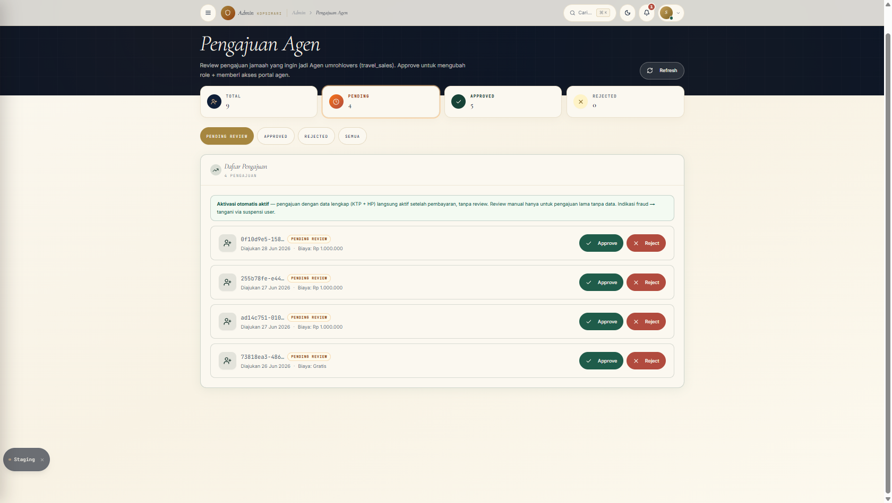

**Pengajuan Cabang — foto tempat + Google Maps + tarif zona:**
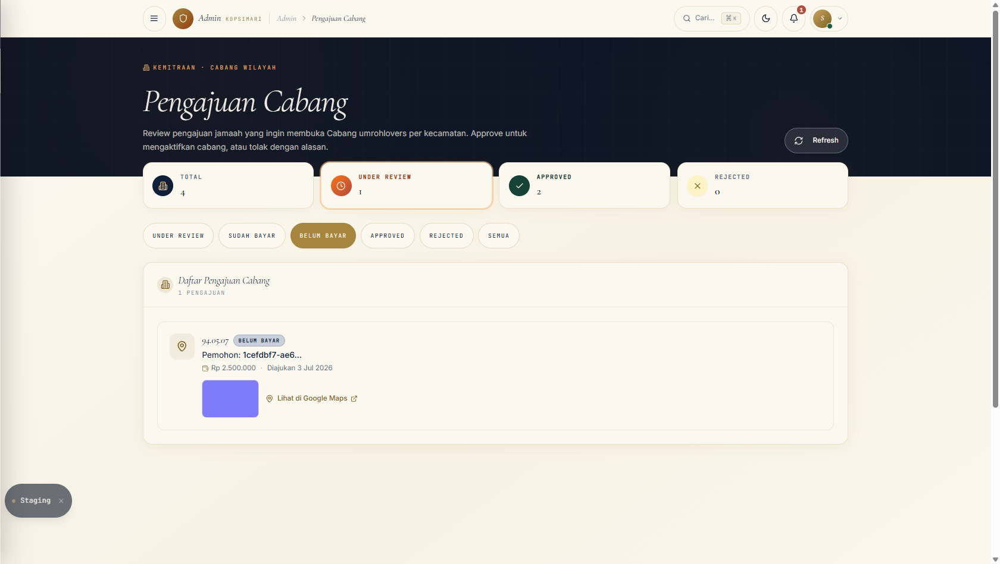

**BARU — dialog Transfer Pemilik (Waris):**
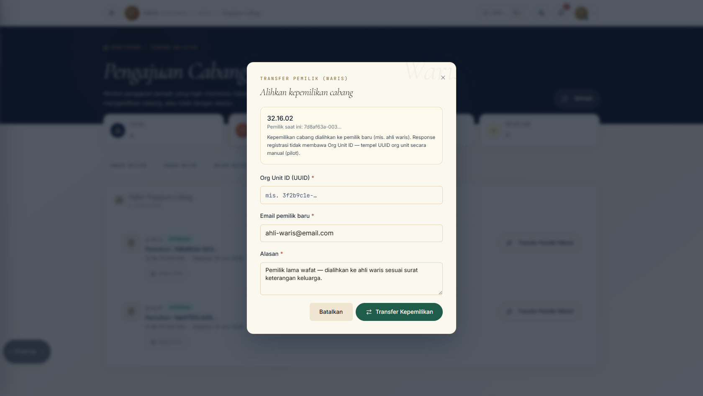

> ✅ **Status: Berfungsi penuh.** Catatan: biaya yang "dibayar" masih simulasi.
>
> **Masukan Bapak:** [ ✅ / ⚠️ / ❌ ] — Catatan: ___________________________

#### H.3 — Moderasi Paket, Mitra, Brand
1. Telusuri panel-panel moderasi: **Paket, Mitra Travel, Cabang, Mitra Korporasi, Mitra Syariah** (semua memakai tampilan papan Kanban yang seragam: Menunggu / Disetujui / Ditolak / Suspend).
2. Coba lihat detail satu entri dan tombol setujui/tolak/suspend.

> ✅ **Status: Berfungsi penuh.**
>
> **Masukan Bapak:** [ ✅ / ⚠️ / ❌ ] — Catatan: ___________________________

#### H.4 — Pendapatan & Komisi (Admin Keuangan) — DIPERBARUI
1. Login `finance-test@…` → buka panel **Pendapatan.**
2. Lihat ringkasan KPI, rincian per sumber pendapatan, dan toggle **harian/mingguan** dengan grafik.
3. Sumber pendapatan yang tercatat otomatis kini lengkap: **fee platform 10%** per booking, **biaya daftar Agen** (dengan pemisahan **kit agen** + **bagian Syarikat Islam 70:30** — total utang ke SI bisa dijumlah dari buku ini), **biaya daftar Cabang per zona**, **promosi paket** (Platinum/Gold/Silver — 100% platform), **biaya admin tarik dana 10%**, dan **denda pembatalan booking.**
4. Semua parameter uang bisa diubah tanpa update aplikasi di **/admin/settings**: fee platform, komisi agen/ranting/cabang, minimal escrow 25%, tenggat pelunasan H-30, penahanan rilis H-14, biaya & saldo minimal tarik dana, denda batal, harga kit agen, porsi SI, tarif zona cabang, harga promo, dan tombol buka/tutup booking haji.

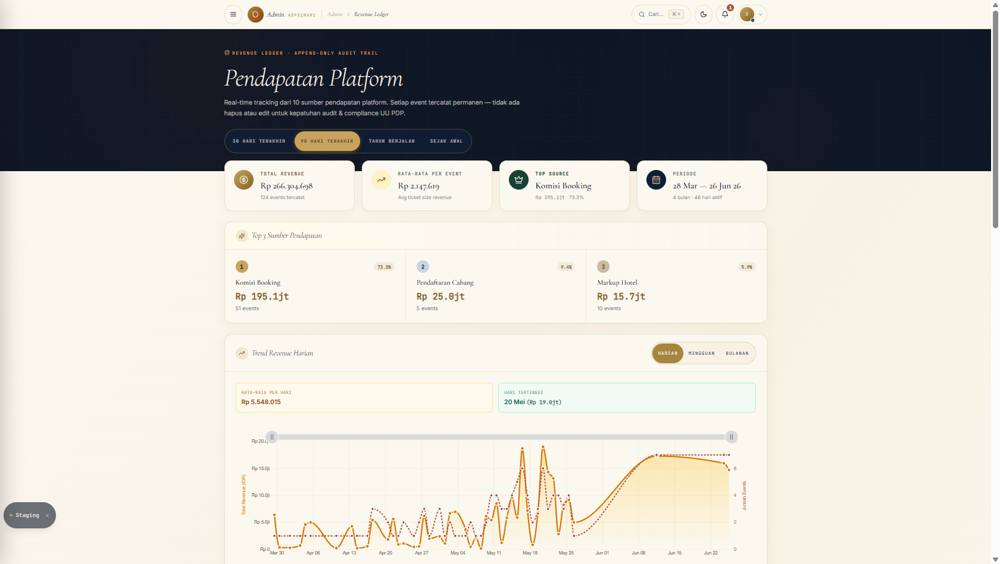

> 🟡 **Status: Demo.** Angka di sini berasal dari **transaksi simulasi** (karena pembayaran belum nyata). Struktur pencatatannya sudah siap & teruji; angkanya akan nyata setelah pembayaran/bank terhubung.
>
> **Masukan Bapak:** [ ✅ / ⚠️ / ❌ ] — Catatan: ___________________________

---

## 5. Status Keputusan (Rangkuman untuk Pak Lukman & Pak Cokie)

**Sudah FINAL — dikunci di meeting 1 Juli 2026 dan sudah terpasang di platform** (semua angka tetap bisa diubah admin tanpa update aplikasi):

| Keputusan | Nilai final |
|---|---|
| Fee platform (dari harga travel) | **10%** — disetujui mitra via S&K elektronik saat mendaftar |
| Komisi Agen | **Flat 5%** — semua setara; prestasi terlihat di **Rapot Agen** untuk reward berkala |
| Tenggat pelunasan | **H-30** — belum lunas → batal otomatis, **saldo kembali penuh (batal ≠ hangus)** |
| Rilis dana ke travel | Mulai **H-14**, otomatis saat visa siap + lunas (milestone 30/30/30/10) |
| Batal sukarela | Denda **10% dari harga paket**, sisa kembali ke saldo |
| Tarik dana dari rekening | Biaya admin **10%** + saldo minimal Rp 100rb tersisa |
| Pendaftaran Agen | Rp 1 juta, **aktif otomatis** setelah data (KTP+HP) + bayar; kit Rp 500rb; profit dibagi **70:30 dengan SI** (jalur SI) |
| Pendaftaran Cabang | Tarif **per zona** (rasio Muslim BPS per kecamatan); syarat cukup **tempat layak + foto + koordinat**; review admin; bisa **diwariskan** |
| Haji | **Ditunda** ("Segera Hadir") — fokus pilot umroh |
| Kasbon travel | Talangan dari **Amani** (margin 2-3%/bln, ≤30% paket) — urusan travel↔bank, platform hanya menampilkan |
| Visa | PDF e-Visa; unduh **setelah lunas**; provider Saudi pakai deposit (tidak ada dana hangus bila gagal) |

**Masih menunggu konfirmasi** (rincian + usulan default di **dokumen 66** — jawaban singkat per nomor sudah cukup):
1. Batal-diam-diam (lewat H-30) gratis vs batal-sukarela kena 10% — disamakan atau biarkan?
2. Basis bagi hasil SI 70:30 — dari gross Rp 1 juta atau dari profit setelah kit?
3. Angka final kit agen (Rp 300–500rb)?
4. Saldo minimal tarik dana (default Rp 100rb)?
5. Biaya administrasi pendaftaran member Rp 100rb — jadi diberlakukan?
6. Perlu langkah admin "verifikasi visa" formal sebelum rilis otomatis, atau cukup seperti sekarang?

> Tambahan lama yang masih terbuka: mekanisme detail **pembayaran haji** (saat dibuka lagi), kebijakan **1 akun pesan >1 orang** (teknis sudah mendukung), harga **promo per wilayah/musim**, dan **aturan visa otomatis** di Paket Mandiri (konfirmasi realita supplier Saudi).

---

## 6. Ringkasan Jujur: Sudah Oke vs Masih Simulasi vs Belum Ada

| Fitur | Status | Keterangan singkat |
|---|---|---|
| Beranda & etalase (landing) | ✅ Berfungsi | Lengkap & rapi, ada 2 ajakan: Jadi Agen + Buka Cabang. |
| Bursa Paket Grup (filter, peta) | ✅ Berfungsi | Data nyata; nama Mitra Travel disembunyikan. |
| Detail paket → keranjang | ✅ Berfungsi | "Booking Sekarang" masuk keranjang, belum minta login. |
| Jelajah Cabang + peta | ✅ Berfungsi | Profil cabang lengkap (kalender manasik, paket). |
| Daftar akun + login (sesuai peran) | ✅ Berfungsi | Setiap peran otomatis ke dashboard masing-masing. |
| Upload dokumen KYC | ✅ Berfungsi | Upload nyata; persetujuan oleh admin. |
| Jadi Agen (auto-aktif + komisi flat) | ✅ Berfungsi | Isi data + bayar → langsung aktif (tanpa antre admin); komisi flat 5%. Bayarnya masih simulasi. |
| Panduan sambutan login pertama | ✅ Berfungsi | Muncul sekali, arahkan ke fitur utama + etalase paket. |
| Agen pendamping (anti-fraud) | ✅ Berfungsi | Di-assign setelah escrow; komisi ikut Agen; wilayah tanpa Agen tidak macet. |
| Dashboard Cabang + kelola manasik | ✅ Berfungsi | Buat/batalkan/jadwalkan ulang/absensi. |
| Panel admin (KYC, mitra, cabang, paket, komisi/setting) | ✅ Berfungsi | Moderasi seragam (Kanban) + atur parameter komisi/fee/harga promo di /admin/settings. |
| **Pembayaran bertahap (DP → cicil → lunas)** | ✅ Berfungsi | Alur DP, escrow terbuka, cicilan, badge LUNAS jalan penuh. Hanya uangnya simulasi. |
| **Rincian fee 10% transparan di checkout** | ✅ Berfungsi | Biaya platform + payout travel tampil terbuka, angka dari pengaturan admin. |
| **Bayar cicilan dari saldo tabungan** | ✅ Berfungsi | Metode "Bayar dari Saldo" — saldo bebas pindah ke escrow; tolakan jelas bila kurang. |
| **Tarik dana (biaya 10% + saldo min)** | ✅ Berfungsi | Hitungan biaya & saldo minimal jalan; uangnya simulasi. |
| **Saldo bebas vs terkunci escrow** | ✅ Berfungsi | Dana booking aktif terkunci otomatis, tampil di halaman Tabungan. |
| **Batalkan booking (denda 10% harga paket)** | ✅ Berfungsi | Dialog konfirmasi → status DIBATALKAN → sisa dana kembali ke saldo. |
| **Pelunasan H-30 + rilis H-14 otomatis** | ✅ Berfungsi | Pekerja otomatis membatalkan yang belum lunas di H-30 (saldo kembali) & merilis dana saat syarat terpenuhi. |
| **Identitas Mitra Travel terbuka setelah escrow** | ✅ Berfungsi | Anonim saat pilih; nama terbuka begitu jamaah bayar pertama. |
| **Jadi Agen auto-aktif + Rapot Agen** | ✅ Berfungsi | Data + bayar → langsung aktif; peringkat bulanan tampil di portal Agen. |
| **Tarif Cabang per zona + peta sebaran Muslim** | ✅ Berfungsi | Choropleth BPS per kecamatan + tarif zona + fullscreen; klaim dengan foto & koordinat. |
| **Pewarisan Cabang (admin ganti pemilik)** | ✅ Berfungsi | Transfer tercatat audit; 1 orang = 1 cabang. |
| **Gabung Mitra 2 langkah + S&K fee elektronik** | ✅ Berfungsi | Mitra Travel wajib setuju fee 10% — tanggal & persentase tercatat. |
| **Dana rilis tercatat di rekening mitra** | ✅ Berfungsi | Tiap rilis milestone otomatis dikredit ke rekening mock mitra. |
| **Promosi paket berbayar (Platinum/Gold/Silver)** | ✅ Berfungsi | Mitra beli promo → paket naik urutan + notifikasi ke jamaah opt-in. Bayar promo simulasi. |
| **Etalase marketing Mitra Travel (anonim)** | ✅ Berfungsi | Galeri/slogan/keunggulan tampil di detail paket tanpa nama travel. |
| **Preferensi promosi + lonceng notifikasi (jamaah)** | ✅ Berfungsi | Opt-in dalam-aplikasi + email; bukan WA massal (UU PDP). |
| **Unggah & unduh Visa PDF** | ✅ Berfungsi | Mitra unggah PDF → notif jamaah → unduh setelah lunas. Akses tercatat (UU PDP). |
| **Mitra lihat booking + data jamaah** | ✅ Berfungsi | Data jamaah terbuka ke mitra setelah escrow (untuk urus visa/tiket). |
| **Pembayaran transaksi (uang nyata)** | 🟡 Simulasi | Semua "Bayar" masih Mock — menunggu Bank Amani + payment gateway. |
| **Biaya daftar Agen Rp 1 juta** | 🟡 Simulasi | Isi data + Bayar → langsung aktif; transaksi masih "Mock". Split kit/SI tercatat. |
| **Paket Mandiri (checkout)** | 🟡 Simulasi | Susun item jalan; bayar penuh saat checkout (cicilan mandiri menyusul — fokus pilot di paket grup). |
| **Tabungan Amani (setor/tarik)** | 🟡 Simulasi | Bank Amani belum terhubung; mekanisme & hitungan sudah jalan. |
| **Biaya Buka Cabang (per zona)** | 🟡 Simulasi | Klaim + zonasi + foto/koordinat nyata; bayar masih "Mock". |
| **Kasbon Amani (talangan travel)** | ⛔ Belum ada | Kartu informasi sudah tampil; pengajuan menunggu Amani live. |
| **Paket Haji (booking)** | ⛔ Ditunda | Badge "Booking Segera Hadir" — keputusan 1 Juli, fokus pilot umroh. |
| **Escrow / akad (dokumen)** | 🟡 Simulasi | Escrow logikanya jalan (deposit bertahap); uang & tanda tangan akad menunggu bank. |
| Item Mitra Korporasi/Syariah | 🟡 Simulasi | Data contoh, belum inventory mitra asli. |
| Verifikasi email | ✅ Berfungsi | Khusus staging, token tampil langsung di layar (mode console). |
| Edit profil jamaah | ⚙️ Sebagian | Data diri masih baca-saja; preferensi promosi sudah bisa diubah. |
| RSVP manasik oleh jamaah | ⚙️ Sebagian | Jamaah baru bisa melihat, belum mendaftar sendiri. |
| Konsep Ranting (1/kelurahan) | ⚙️ Sebagian | Tahap awal penataan, perlu arahan Pak Lukman. |
| Halaman Agen publik (`/agent`) | ⛔ Belum ada | "Segera Hadir", sengaja disembunyikan. |
| Checkout banyak paket sekaligus | ⛔ Belum ada | Sementara diproses satu per satu. |
| Mekanisme pembayaran haji | ⛔ Ditunda | Haji "Segera Hadir" — dibahas lagi setelah pilot umroh. (Visa gagal: provider Saudi pakai sistem deposit — tidak ada dana hangus, keputusan 1 Juli.) |

---

## 7. Catatan Penutup

Yang Bapak lihat di staging ini adalah **demo fungsional**: alur, tampilan, dan pengalaman pengguna sudah **terbangun penuh dari ujung ke ujung** — dari jamaah mendaftar, memilih paket, sampai admin menyetujui.

Hal yang masih **simulasi (🟡)** — pembayaran, setoran tabungan, biaya Cabang, escrow, dan akad — **bukan kekurangan**, melainkan **tahap yang wajar sebelum integrasi resmi**. Bagian-bagian itu sengaja kami buat sebagai simulasi karena masih menunggu:

- **Integrasi Bank Amani Syariah** (rekening individu & escrow),
- **Penyedia pembayaran (payment gateway)** untuk transaksi nyata,
- **Akses harga dasar Saudi** dan inventory mitra asli (hotel, visa, penerbangan).

Begitu tiga hal di atas final, simulasi tinggal "ditukar" dengan yang asli — kerangkanya sudah siap menampung.

**Mohon kirimkan masukan Bapak** (centang ✅/⚠️/❌ + catatan di setiap fitur). Masukan itu akan langsung kami pakai untuk menyusun prioritas pengembangan berikutnya.

> _Semua data di staging boleh dieksplorasi bebas — tidak ada transaksi nyata dan tidak ada yang bisa rusak permanen._
